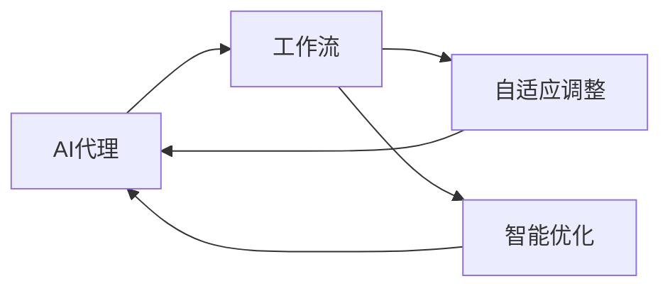

# 自适应与智能调整：AI代理工作流的动态管理

关键词：AI代理、工作流、自适应、智能调整、动态管理

## 1. 背景介绍
### 1.1 问题的由来
随着人工智能技术的快速发展,AI代理在各行各业中的应用日益广泛。然而,在实际应用中,AI代理的工作流程往往面临着动态变化的挑战。如何实现AI代理工作流的自适应和智能调整,成为了一个亟待解决的问题。
### 1.2 研究现状
目前,国内外学者对AI代理工作流的研究主要集中在工作流建模、优化和执行等方面。但在面对动态变化的环境时,现有的工作流管理方法仍存在一定的局限性。因此,如何实现AI代理工作流的自适应和智能调整,成为了当前研究的热点和难点。
### 1.3 研究意义 
研究AI代理工作流的自适应和智能调整,对于提高AI代理的工作效率和质量具有重要意义。通过动态调整工作流,可以使AI代理更好地适应不同的任务需求和环境变化,从而提高其智能化水平和实用价值。同时,该研究也为工作流管理领域提供了新的思路和方法。
### 1.4 本文结构
本文将从以下几个方面对AI代理工作流的自适应和智能调整进行探讨：首先,介绍相关的核心概念和理论基础；然后,详细阐述自适应和智能调整的核心算法原理和实现步骤；接着,给出算法的数学模型和案例分析；最后,讨论算法在实际项目中的应用和未来的发展方向。

## 2. 核心概念与联系
在探讨AI代理工作流的自适应和智能调整之前,首先需要明确以下几个核心概念：

- AI代理：能够感知环境并根据设定目标自主行动的智能实体,如聊天机器人、自动驾驶汽车等。
- 工作流：由一系列任务及其之间的依赖关系组成的任务执行流程。工作流管理就是对工作流的定义、执行和监控等。
- 自适应：系统能够根据内外部环境的变化,自主调整自身行为和结构以适应新的需求。
- 智能调整：根据任务和环境的特点,利用智能优化算法对工作流进行动态调整,以提高执行效率和质量。

这几个概念之间存在着紧密的联系。AI代理作为工作流的执行主体,需要根据工作流的定义来执行任务。而工作流管理系统则需要根据AI代理的特点和任务需求,对工作流进行自适应和智能调整。下图展示了它们之间的关系：



## 3. 核心算法原理 & 具体操作步骤
### 3.1 算法原理概述
本文提出的自适应与智能调整算法,基于强化学习和启发式优化的思想。其核心思路是：将工作流调整问题建模为一个马尔可夫决策过程(MDP),通过不断与环境交互,学习工作流调整策略,并利用启发式规则引导搜索方向,最终得到最优的工作流。
### 3.2 算法步骤详解
算法主要分为以下几个步骤：

1. 定义状态空间和动作空间。状态空间包括工作流的拓扑结构、任务属性等信息；动作空间则是对工作流进行调整的一系列操作,如增删任务、修改依赖关系等。 
2. 初始化工作流调整策略。可以随机生成一个初始策略,也可以利用先验知识设置一个较好的起点。
3. 在给定策略下,AI代理开始执行工作流,并记录执行过程中的状态转移和反馈信息。
4. 根据反馈信息,利用价值函数或策略梯度等方法,对工作流调整策略进行更新。
5. 结合领域知识,利用启发式规则对策略搜索进行引导,加速收敛过程。可以引入deadline、cost等约束条件。
6. 重复步骤3-5,直到策略收敛或满足终止条件,输出最优工作流。

### 3.3 算法优缺点
该算法的优点在于：

1. 能够自适应地根据环境变化调整工作流,具有较强的鲁棒性。
2. 引入智能优化技术,可以学习到更加高效和可靠的工作流。
3. 利用领域知识引导搜索,一定程度上缓解了策略学习的难度。

但同时也存在一些不足：

1. 马尔可夫决策过程建模的难度较大,需要专家知识的参与。
2. 策略学习需要大量的训练数据和时间,实时性有待提高。
3. 鲁棒性虽有提升,但面对复杂多变的环境仍有进一步优化的空间。

### 3.4 算法应用领域
该算法可应用于多个领域,包括但不限于：

- 智能制造中的生产调度优化
- 电商系统中的订单处理流程优化
- 交通运输中的物流配送路径规划
- 医疗领域的诊断和治疗方案优化

总的来说,凡是涉及复杂工作流程的行业,都可以应用该算法进行自适应和智能调整,提升工作效率和质量。

## 4. 数学模型和公式 & 详细讲解 & 举例说明
### 4.1 数学模型构建
我们可以将工作流调整问题形式化地定义为一个马尔可夫决策过程(MDP)$M=<S,A,P,R,\gamma>$,其中：

- $S$表示状态空间,包括工作流的拓扑结构、任务属性等信息。
- $A$表示动作空间,即对工作流进行调整的操作,如增删任务、修改依赖关系等。
- $P$表示状态转移概率矩阵,$P(s'|s,a)$表示在状态$s$下执行动作$a$后转移到状态$s'$的概率。
- $R$表示反馈函数,$R(s,a)$表示在状态$s$下执行动作$a$获得的即时反馈。
- $\gamma$表示折扣因子,用于平衡即时和长期反馈。

在此基础上,我们的目标就是寻找一个最优策略$\pi^*:S \rightarrow A$,使得累积期望反馈最大化：

$$\pi^* = \arg \max_{\pi} E[\sum_{t=0}^{\infty} \gamma^t R(s_t,\pi(s_t))]$$

### 4.2 公式推导过程
为了求解最优策略,我们引入价值函数$V^\pi(s)$和动作价值函数$Q^\pi(s,a)$：

$$V^\pi(s) = E[\sum_{t=0}^{\infty} \gamma^t R(s_t,\pi(s_t))|s_0=s]$$
$$Q^\pi(s,a) = E[\sum_{t=0}^{\infty} \gamma^t R(s_t,\pi(s_t))|s_0=s,a_0=a]$$

它们分别表示状态$s$和状态-动作对$(s,a)$在策略$\pi$下的长期累积期望反馈。根据贝尔曼方程,我们可以得到最优价值函数$V^*(s)$和最优动作价值函数$Q^*(s,a)$的递推式：

$$V^*(s) = \max_a Q^*(s,a)$$
$$Q^*(s,a) = R(s,a) + \gamma \sum_{s' \in S} P(s'|s,a) V^*(s')$$

有了最优动作价值函数,我们就可以得到最优策略：

$$\pi^*(s) = \arg \max_a Q^*(s,a)$$

但在实际中,状态和动作空间往往很大,无法直接求解上述方程。因此,我们通常使用基于采样的方法,如Q-learning或SARSA,通过不断与环境交互,迭代更新价值函数的估计值,最终收敛到最优策略。以Q-learning为例,其更新公式为：

$$Q(s_t,a_t) \leftarrow Q(s_t,a_t) + \alpha [R(s_t,a_t) + \gamma \max_a Q(s_{t+1},a) - Q(s_t,a_t)]$$

其中$\alpha$为学习率。在策略评估的同时,我们还可以使用$\epsilon-greedy$等策略选择方法,在探索和利用之间进行权衡。

### 4.3 案例分析与讲解
下面我们以一个简单的例子来说明该算法的执行过程。假设一个工作流包含3个任务$T_1,T_2,T_3$,其依赖关系为$T_1 \rightarrow T_2 \rightarrow T_3$。每个任务有两种执行模式：标准模式(S)和加速模式(A),分别对应不同的执行时间和成本。我们的目标是在满足deadline的前提下,最小化总成本。

首先,我们定义状态空间和动作空间。状态可以表示为$(t_1,t_2,t_3,mode_1,mode_2,mode_3)$,其中$t_i$表示任务$T_i$的开始时间,$mode_i$表示其执行模式。动作则是选择每个任务的执行模式,可以表示为$(mode_1,mode_2,mode_3)$。

然后,我们初始化一个随机策略,并开始与环境交互。在每个episode中,我们根据当前策略执行工作流,并记录下每个状态-动作对的即时反馈(成本)和下一状态。根据Q-learning的更新公式,我们不断更新Q值表,并根据$\epsilon-greedy$策略选择下一步动作。

在更新过程中,我们还可以引入一些启发式规则,例如：如果某个任务的结束时间超过了deadline,则给予一个大的惩罚；如果某个任务的执行模式与其前驱任务不匹配,也给予一定的惩罚。这些规则可以帮助我们更快地收敛到最优策略。

经过足够多的训练之后,我们最终可以得到一个最优工作流,在满足deadline的同时最小化了总成本。

### 4.4 常见问题解答
1. Q：状态空间和动作空间过大时,如何处理？
A：可以考虑使用函数逼近的方法,用神经网络等模型来拟合价值函数,而不是直接存储Q值表。这样可以大大减少存储空间,并提高泛化能力。

2. Q：如何设置奖励函数,才能更好地引导算法学习？
A：奖励函数的设置需要结合具体问题,需要权衡不同目标之间的重要性。一般来说,可以将任务完成情况、约束满足情况、资源消耗情况等作为奖励的依据。在设置奖励时,既要考虑即时反馈,也要考虑长期影响。

3. Q：面对动态变化的环境,如何保证算法的适应性？
A：一方面,可以在训练过程中引入噪声和随机扰动,增强算法的鲁棒性；另一方面,可以考虑使用元学习的思想,学习一种快速适应的能力,而不是针对特定环境学习策略。在应用过程中,也要持续监控环境变化,根据反馈及时调整策略。

## 5. 项目实践：代码实例和详细解释说明
### 5.1 开发环境搭建
本项目使用Python语言进行开发,需要安装以下依赖库：

- numpy：科学计算库,用于数据处理和运算。
- pandas：数据分析库,用于数据读取和预处理。
- matplotlib：可视化库,用于绘制图表和结果展示。
- tensorflow（或pytorch）：深度学习框架,用于构建和训练神经网络模型。

可以使用pip命令进行安装：

```
pip install numpy pandas matplotlib tensorflow
```

### 5.2 源代码详细实现
下面给出了一个简单的Q-learning算法实现,用于求解工作流调度问题：

```python
import numpy as np

class QLearning:
    def __init__(self, state_dim, action_dim, learning_rate=0.01, gamma=0.9, epsilon=0.1):
        self.state_dim = state_dim
        self.action_dim = action_dim
        self.lr = learning_rate
        self.gamma = gamma
        self.epsilon = epsilon
        self.Q = np.zeros((state_dim, action_dim))

    def choose_action(self, state):
        if np.random.uniform() < self