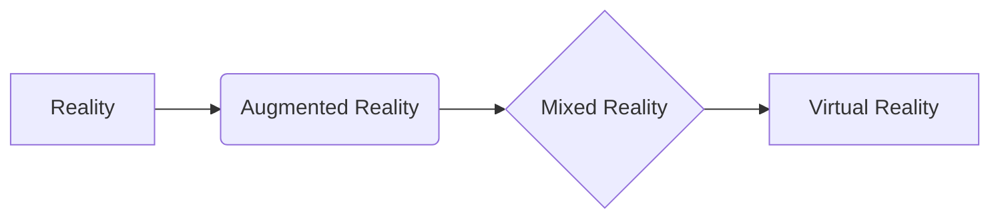

# 虚拟现实 (Virtual Reality)

关键词：虚拟现实、沉浸式体验、VR设备、3D建模、实时渲染、头部跟踪、手部跟踪、触觉反馈

## 1. 背景介绍
### 1.1 问题的由来
虚拟现实(Virtual Reality, VR)技术起源于20世纪60年代,美国计算机图形学之父伊凡·苏泽兰(Ivan Sutherland)发明了第一台头戴式显示器(Head-mounted Display, HMD),开启了VR技术的发展历程。随着计算机图形学、人机交互、传感器等技术的不断进步,VR技术逐渐走向成熟。近年来,随着Oculus Rift、HTC Vive等消费级VR设备的问世,VR开始进入大众视野,引发了新一轮的技术热潮和产业变革。

### 1.2 研究现状 
目前VR技术主要应用于游戏娱乐、影视动漫、工业仿真、医疗、教育培训等领域。各大科技巨头如谷歌、Facebook、索尼、微软等纷纷布局VR,推出了一系列软硬件产品。学术界对VR的研究也持续升温,涉及计算机图形学、人机交互、心理学等多个学科。但现有VR系统在真实感、交互性、便携性等方面仍存在局限,亟需在显示、渲染、跟踪定位、触觉反馈等关键技术上取得突破。

### 1.3 研究意义
VR作为下一代人机交互平台,有望在工业制造、医疗健康、文化教育等领域催生出众多创新应用,极大提升生产效率和生活品质。深入VR技术原理,攻克其中的关键科学问题,对于推动VR产业发展、抢占未来人机交互制高点具有重要意义。

### 1.4 本文结构
本文将系统阐述VR的核心概念、关键技术、应用场景及未来趋势。第2节介绍VR的定义、特征及其与增强现实(AR)、混合现实(MR)的联系。第3节重点剖析VR的显示、渲染、交互、传感等关键技术原理。第4节建立VR系统的数学模型,推导相关物理公式。第5节通过代码实例,讲解VR引擎的开发流程。第6节展望VR在各行业的应用前景。第7节推荐VR学习资源和开发工具。第8节总结全文,展望VR的未来发展方向和挑战。

## 2. 核心概念与联系
虚拟现实(VR)是利用计算机生成逼真的3D虚拟环境,让用户沉浸其中并与之实时交互的技术。VR的核心特征包括:
- 沉浸感(Immersion):用户感觉完全处于虚拟世界,与现实隔绝。
- 交互性(Interactivity):用户可以实时操控虚拟物体,系统对用户行为做出响应。 
- 构想性(Imagination):打破时空限制,创造出超越现实的奇妙体验。

与VR相关的概念还有增强现实(AR)和混合现实(MR)。AR是在真实环境中叠加虚拟信息,代表产品如Google Glass。MR是AR与VR的结合,现实与虚拟可以实时互动,代表产品如Microsoft Hololens。AR/MR与VR的区别在于:AR/MR没有完全虚构的环境,需要借助现实世界。



## 3. 核心算法原理 & 具体操作步骤
### 3.1 算法原理概述
VR的实现涉及计算机图形学、人机交互、传感器等多个技术领域。其核心算法包括:
- 三维建模(3D Modeling):构建虚拟场景的几何模型。
- 实时渲染(Real-time Rendering):将3D模型转化为2D图像,并达到交互式帧率。
- 头部跟踪(Head Tracking):实时获取用户头部位姿,调整虚拟相机视角。
- 手部跟踪(Hand Tracking):捕捉用户手势动作,实现自然交互。
- 物理模拟(Physics Simulation):模拟虚拟物体的物理特性,提高真实感。

### 3.2 算法步骤详解
以VR场景渲染为例,其基本步骤如下:
1. 空间变换:将虚拟物体的局部坐标变换到世界坐标和相机坐标系。
2. 顶点处理:对模型顶点执行投影变换,进行裁剪、光照等操作。
3. 光栅化:将3D图元转换为2D像素,写入帧缓冲区。
4. 着色:根据材质、纹理、光照条件等计算像素颜色。
5. 显示:将渲染结果提交到VR显示设备如头显。
6. 同步:等待垂直同步信号,以固定帧率刷新画面。

### 3.3 算法优缺点
基于光栅化管线的实时渲染是VR的主流算法,优点是效率高、实时性好,能在低端硬件上流畅运行;缺点是渲染真实感有限,难以处理大规模复杂场景。近年来,光线追踪、AI渲染等新算法不断涌现,有望进一步提升VR的视觉质量。

### 3.4 算法应用领域  
VR渲染算法广泛应用于游戏、电影、工业仿真等领域。在游戏领域,优化渲染流程以提高帧率是研究重点;在电影领域,离线渲染算法用于制作高质量VR影视内容;在工业领域,物理准确的渲染算法用于虚拟装配、虚拟维修等仿真应用。

## 4. 数学模型和公式 & 详细讲解 & 举例说明
### 4.1 数学模型构建
VR中的三维图形变换可以用4x4齐次坐标变换矩阵表示:

$$
\begin{bmatrix} 
x' \\ y' \\ z' \\ 1
\end{bmatrix} = 
\begin{bmatrix}
a_{11} & a_{12} & a_{13} & t_x \\ 
a_{21} & a_{22} & a_{23} & t_y \\
a_{31} & a_{32} & a_{33} & t_z \\
0 & 0 & 0 & 1
\end{bmatrix}
\begin{bmatrix}
x \\ y \\ z \\ 1
\end{bmatrix}
$$

其中,$\begin{bmatrix} x & y & z & 1\end{bmatrix}^T$表示顶点的齐次坐标,$\begin{bmatrix} x' & y' & z' & 1\end{bmatrix}^T$为变换后的坐标。$a_{ij}$表示旋转缩放部分,$t_x,t_y,t_z$表示平移部分。

VR中常见的变换包括:
- 平移(Translation):物体在空间中移动。
- 旋转(Rotation):物体绕坐标轴转动,分为绕x轴、y轴、z轴旋转。
- 缩放(Scaling):物体在各个方向上的缩放。

### 4.2 公式推导过程
以绕y轴旋转$\theta$角为例,其变换矩阵为:

$$
R_y(\theta) = 
\begin{bmatrix}
\cos\theta & 0 & \sin\theta & 0 \\
0 & 1 & 0 & 0 \\
-\sin\theta & 0 & \cos\theta & 0 \\
0 & 0 & 0 & 1
\end{bmatrix}
$$

推导过程:
1. 绕y轴旋转,y坐标保持不变。
2. x坐标变为原来的$x\cos\theta-z\sin\theta$。
3. z坐标变为原来的$x\sin\theta+z\cos\theta$。

旋转矩阵是正交矩阵,满足$R^{-1}=R^T$,即转置等于逆矩阵。

### 4.3 案例分析与讲解
假设一个立方体中心在原点$(0,0,0)$,边长为2。现在需要将其绕y轴旋转45°,再沿x轴平移1个单位。

步骤:
1. 构造y轴旋转45°的变换矩阵:

$$
R_y(45^\circ)=
\begin{bmatrix} 
\cos45^\circ & 0 & \sin45^\circ & 0 \\
0 & 1 & 0 & 0\\
-\sin45^\circ & 0 & \cos45^\circ & 0 \\
0 & 0 & 0 & 1
\end{bmatrix}
=\begin{bmatrix}
\frac{\sqrt2}{2} & 0 & \frac{\sqrt2}{2} & 0 \\
0 & 1 & 0 & 0\\
-\frac{\sqrt2}{2} & 0 & \frac{\sqrt2}{2} & 0 \\
0 & 0 & 0 & 1
\end{bmatrix}
$$

2. 构造x轴平移1个单位的变换矩阵:

$$
T_x(1) = 
\begin{bmatrix}
1 & 0 & 0 & 1 \\
0 & 1 & 0 & 0 \\
0 & 0 & 1 & 0 \\
0 & 0 & 0 & 1
\end{bmatrix}
$$

3. 两个变换矩阵相乘,得到复合变换矩阵:

$$
M = T_x(1) \cdot R_y(45^\circ)=
\begin{bmatrix}
\frac{\sqrt2}{2} & 0 & \frac{\sqrt2}{2} & 1\\
0 & 1 & 0 & 0\\
-\frac{\sqrt2}{2} & 0 & \frac{\sqrt2}{2} & 0\\
0 & 0 & 0 & 1
\end{bmatrix}
$$

4. 将立方体的8个顶点坐标依次乘以复合变换矩阵M,得到变换后的顶点坐标,重新渲染立方体。

### 4.4 常见问题解答
Q:为什么要用4x4矩阵,而不是3x3?
A:4x4矩阵采用齐次坐标,能将平移变换统一到矩阵乘法中,简化计算并易于级联。3x3矩阵只能表示旋转和缩放。

Q:左手坐标系和右手坐标系有何区别?
A:两者的x轴、y轴方向相同,z轴方向相反。DirectX等图形API常用左手系,OpenGL常用右手系。Unity、Unreal等游戏引擎可配置。

Q:万向节死锁(Gimbal Lock)是什么?
A:对三个欧拉角顺序旋转时,可能导致一个自由度的丢失。比如先绕x轴转90度,再绕y轴转90度,此时z轴与原来y轴重合,绕z轴的转动等于绕y轴,丢失了一个自由度。避免万向节死锁的方法是用四元数(Quaternion)取代欧拉角。

## 5. 项目实践：代码实例和详细解释说明
### 5.1 开发环境搭建
本节以Unity引擎为例,演示VR项目开发流程。开发环境:
- Unity 2019.4 LTS
- Visual Studio 2019
- Oculus Integration SDK
- Unity XR Management Package

搭建步骤:
1. 安装Unity Hub,下载Unity 2019.4 LTS,勾选Android Build Support。
2. 安装Visual Studio 2019,勾选Unity和Mobile开发组件。
3. 在Unity中新建3D项目,并在Package Manager中安装Oculus Integration和XR Management。
4. 在Project Settings中,将XR Plugin Management设为Oculus,并勾选V2 Signing。

### 5.2 源代码详细实现
创建一个简单的VR场景:
1. 新建场景,命名为VRScene。
2. 在层级面板右击,选择XR>XR Rig,自动生成Main Camera和左右手柄。
3. 新建Cube,将Transform设为(0,1,3),Scale设为(1,1,1)。
4. 为Cube添加Box Collider组件,勾选Is Trigger。
5. 创建GrabObject脚本,实现手柄抓取物体的功能:

```csharp
using UnityEngine;
using UnityEngine.XR;

public class GrabObject : MonoBehaviour
{
    public XRNode handNode = XRNode.LeftHand;
    private Transform grabObject;
    
    void Update()
    {
        InputDevice hand = InputDevices.GetDeviceAtXRNode(handNode);
        hand.TryGetFeatureValue(CommonUsages.triggerButton, out bool triggerDown);

        if (triggerDown && grabObject != null)
        {
            grabObject.Set