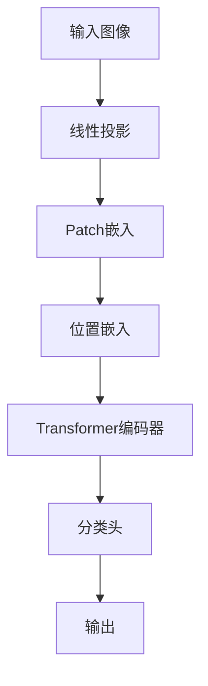

以下是《视觉Transformer原理与代码实例讲解》的正文内容:

# 视觉Transformer原理与代码实例讲解

## 1. 背景介绍

### 1.1 问题的由来

在计算机视觉领域,卷积神经网络(CNN)长期以来一直是主导的模型架构。CNN在图像分类、目标检测和语义分割等任务上表现出色,取得了巨大的成功。然而,CNN在处理高分辨率图像和长距离依赖关系时存在一些局限性。

CNN主要依赖于局部邻域信息,通过卷积核在图像上滑动获取局部特征。这种本地化的操作使得CNN难以捕捉全局上下文信息和长距离依赖关系,尤其是在高分辨率图像中。此外,CNN的计算复杂度随着图像分辨率的增加而线性增长,导致在处理高分辨率图像时计算效率低下。

为了解决这些问题,研究人员开始探索基于注意力机制的新型架构,其中视觉Transformer就是一种极具前景的方法。

### 1.2 研究现状

Transformer最初是在自然语言处理(NLP)领域提出的,用于机器翻译任务。它通过自注意力机制捕捉序列中任意两个元素之间的依赖关系,从而有效地建模长距离依赖。由于其优异的性能,Transformer很快在NLP领域获得了广泛的应用。

受Transformer在NLP领域的启发,研究人员将其思想引入计算机视觉领域,提出了视觉Transformer(Vision Transformer,ViT)。与CNN不同,ViT直接对图像进行线性投影,将其拆分为一系列patch(图像块),并将这些patch序列化输入Transformer编码器。通过自注意力机制,ViT能够捕捉图像中任意两个patch之间的长距离依赖关系,从而获取全局上下文信息。

### 1.3 研究意义

视觉Transformer的出现为计算机视觉领域带来了新的发展方向和机遇。与CNN相比,ViT具有以下几个主要优势:

1. **长距离依赖建模能力强**:自注意力机制使ViT能够有效捕捉图像中任意两个patch之间的长距离依赖关系,从而获取全局上下文信息。这对于处理高分辨率图像和复杂场景至关重要。

2. **计算效率高**:ViT的计算复杂度与图像分辨率无关,因此在处理高分辨率图像时具有更高的计算效率。

3. **模型通用性强**:与专门设计的CNN不同,ViT是一种通用的序列建模架构,可以应用于不同的视觉任务,如图像分类、目标检测和语义分割等。

4. **与NLP模型统一**:ViT与NLP中的Transformer模型架构高度一致,为两个领域的模型统一和知识迁移提供了可能。

视觉Transformer的出现为计算机视觉领域带来了新的发展机遇,有望推动该领域的进一步突破。

### 1.4 本文结构

本文将全面介绍视觉Transformer的原理和实现细节。主要内容包括:

1. 视觉Transformer的核心概念和基本架构。
2. 视觉Transformer的关键算法原理,包括自注意力机制、位置编码和视觉编码器等。
3. 视觉Transformer的数学模型和公式推导。
4. 基于PyTorch的视觉Transformer代码实现和详细解释。
5. 视觉Transformer在图像分类等任务中的实际应用场景。
6. 视觉Transformer的发展趋势、挑战和未来展望。

通过本文的学习,读者将全面掌握视觉Transformer的核心理论和实践技能,为进一步研究和应用奠定坚实基础。

## 2. 核心概念与联系

视觉Transformer(ViT)是一种新型的计算机视觉模型,它借鉴了自然语言处理(NLP)领域中Transformer的设计思路,将自注意力机制引入图像建模任务中。ViT的核心思想是将图像视为一系列patch(图像块)的序列,并使用Transformer编码器对这些patch序列进行建模,捕捉patch之间的长距离依赖关系。

ViT的基本架构如下所示:

1. **线性投影**:将输入图像拆分为一系列固定大小的patch(图像块),并将每个patch映射为一个向量。这相当于对图像进行了一种特殊的线性投影操作。

2. **Patch嵌入**:将所有patch向量拼接成一个序列,作为Transformer编码器的输入。

3. **位置嵌入**:为每个patch添加位置信息,以保留patch在原始图像中的位置关系。

4. **Transformer编码器**:使用标准的Transformer编码器对patch序列进行编码,捕捉patch之间的长距离依赖关系。

5. **分类头**:将Transformer编码器的输出通过一个分类头(如全连接层)进行分类或其他下游任务。

ViT的核心在于利用Transformer编码器对patch序列进行建模,从而捕捉图像中任意两个patch之间的长距离依赖关系。这种全局建模能力使ViT能够有效地处理高分辨率图像和复杂场景。

与传统的CNN不同,ViT没有手工设计的卷积核和池化操作,而是完全依赖于自注意力机制和位置编码来捕捉图像的空间信息和上下文关系。这种全新的建模方式为计算机视觉领域带来了新的发展机遇和挑战。

## 3. 核心算法原理与具体操作步骤

### 3.1 算法原理概述

视觉Transformer(ViT)的核心算法原理主要包括以下几个方面:

1. **自注意力机制(Self-Attention)**:自注意力机制是Transformer的核心组件,它允许模型捕捉输入序列中任意两个元素之间的依赖关系。在ViT中,自注意力机制用于捕捉图像patch序列中任意两个patch之间的长距离依赖关系。

2. **位置编码(Positional Encoding)**:由于Transformer没有显式的卷积或池化操作,因此需要通过位置编码来为每个patch提供位置信息,以保留patch在原始图像中的空间位置关系。

3. **视觉编码器(Vision Encoder)**:ViT使用标准的Transformer编码器对patch序列进行编码。编码器由多个编码器层组成,每个编码器层包含一个多头自注意力子层和一个前馈网络子层。

4. **预训练和微调(Pre-training and Fine-tuning)**:与NLP领域类似,ViT也可以在大规模数据集上进行预训练,然后在下游任务上进行微调,以提高模型的性能和泛化能力。

下面将详细介绍ViT的核心算法原理和具体操作步骤。

### 3.2 算法步骤详解

#### 3.2.1 线性投影和Patch嵌入

ViT的第一步是将输入图像拆分为一系列固定大小的patch(图像块),并将每个patch映射为一个向量。具体操作步骤如下:

1. 将输入图像 $I \in \mathbb{R}^{H \times W \times C}$ 拆分为一系列 $N$ 个patch,每个patch的大小为 $P \times P$ 像素,其中 $N = \frac{HW}{P^2}$。

2. 将每个patch展平为一个向量 $x_p \in \mathbb{R}^{P^2 \cdot C}$。

3. 对每个patch向量 $x_p$ 进行线性投影,得到patch嵌入向量 $z_p \in \mathbb{R}^D$:

   $$z_p = x_pE + e_\text{pos}$$

   其中 $E \in \mathbb{R}^{(P^2 \cdot C) \times D}$ 是一个可学习的线性投影矩阵, $e_\text{pos} \in \mathbb{R}^D$ 是patch的位置嵌入向量(后面会详细介绍)。

4. 将所有patch嵌入向量 $z_p$ 拼接成一个序列 $Z = [z_1, z_2, \dots, z_N] \in \mathbb{R}^{N \times D}$,作为Transformer编码器的输入。

通过这种线性投影和patch嵌入操作,ViT将输入图像转换为一个patch序列,为后续的Transformer编码器提供输入。

#### 3.2.2 位置编码

由于Transformer没有显式的卷积或池化操作,因此需要通过位置编码来为每个patch提供位置信息,以保留patch在原始图像中的空间位置关系。ViT使用了类似于NLP中的位置编码方式,具体步骤如下:

1. 为每个patch生成一个位置嵌入向量 $e_\text{pos} \in \mathbb{R}^D$,其中 $D$ 是patch嵌入的维度。

2. 位置嵌入向量可以通过预定义的函数或可学习的嵌入表来获得。常用的预定义函数包括正弦/余弦函数:

   $$e_\text{pos}(i, 2j) = \sin(i / 10000^{2j/D})$$
   $$e_\text{pos}(i, 2j+1) = \cos(i / 10000^{2j/D})$$

   其中 $i$ 是patch的位置索引,  $j$ 是维度索引。

3. 将位置嵌入向量 $e_\text{pos}$ 添加到对应的patch嵌入向量 $z_p$ 中,以获得包含位置信息的patch表示:

   $$z_p = x_pE + e_\text{pos}$$

通过位置编码,ViT能够为每个patch提供位置信息,从而保留patch在原始图像中的空间位置关系。这对于模型捕捉图像的空间结构和上下文信息至关重要。

#### 3.2.3 Transformer编码器

经过线性投影、patch嵌入和位置编码后,ViT将输入图像转换为一个包含位置信息的patch序列 $Z$。接下来,ViT使用标准的Transformer编码器对这个序列进行编码,捕捉patch之间的长距离依赖关系。

Transformer编码器由多个相同的编码器层组成,每个编码器层包含两个主要子层:多头自注意力子层和前馈网络子层。编码器层的具体操作步骤如下:

1. **多头自注意力子层**:

   - 将输入序列 $Z$ 投影到查询(Query)、键(Key)和值(Value)向量空间:
     $$Q = ZW_Q, K = ZW_K, V = ZW_V$$
     其中 $W_Q, W_K, W_V$ 是可学习的线性投影矩阵。

   - 计算查询和键之间的点积注意力权重:
     $$\text{Attention}(Q, K, V) = \text{softmax}(\frac{QK^T}{\sqrt{d_k}})V$$
     其中 $d_k$ 是缩放因子,用于防止点积值过大导致梯度消失或爆炸。

   - 使用多头注意力机制,将多个注意力头的输出拼接在一起:
     $$\text{MultiHead}(Q, K, V) = \text{Concat}(\text{head}_1, \dots, \text{head}_h)W^O$$
     其中 $\text{head}_i = \text{Attention}(QW_i^Q, KW_i^K, VW_i^V)$, $W_i^Q, W_i^K, W_i^V$ 是每个注意力头的线性投影矩阵, $W^O$ 是最终的线性投影矩阵。

   - 将多头自注意力的输出与输入序列相加,得到自注意力子层的输出。

2. **前馈网络子层**:

   - 将自注意力子层的输出通过一个前馈网络进行处理,前馈网络包含两个全连接层和一个非线性激活函数(如ReLU):
     $$\text{FFN}(x) = \max(0, xW_1 + b_1)W_2 + b_2$$

   - 将前馈网络的输出与自注意力子层的输出相加,得到当前编码器层的输出。

3. 在每个子层之后,还会应用层归一化(Layer Normalization)和残差连接(Residual Connection),以帮助模型训练和提高性能。

通过堆叠多个编