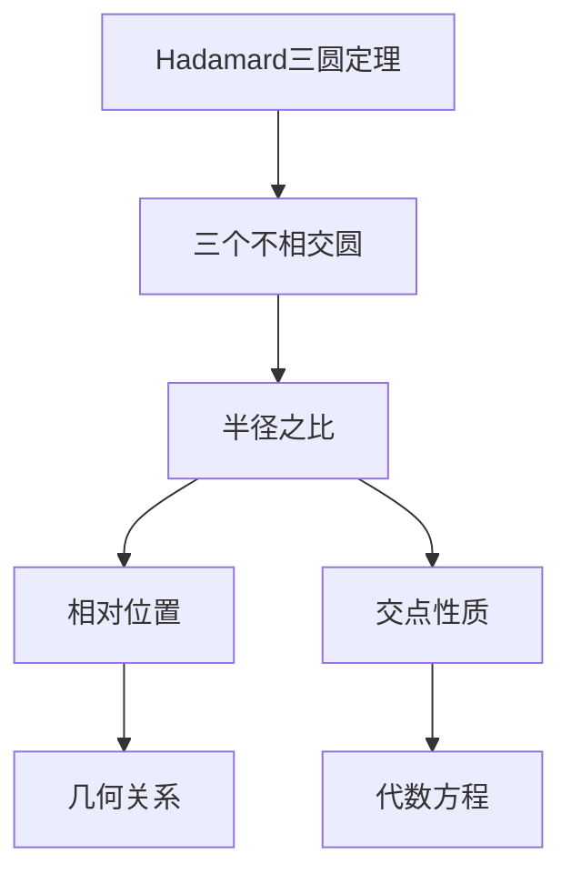
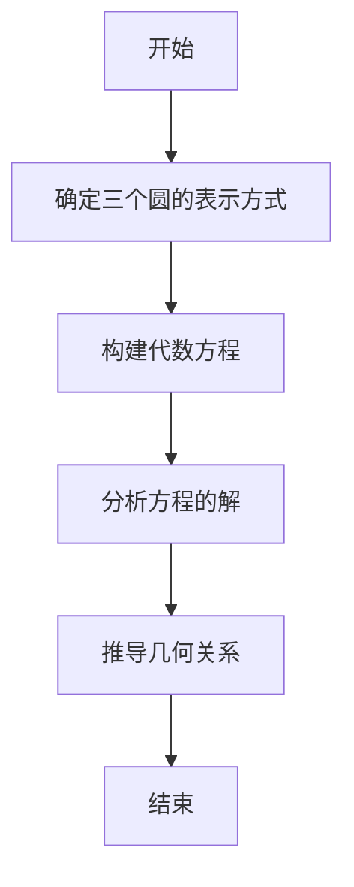

# 解析数论基础：Hadamard三圆定理

## 1. 背景介绍

### 1.1 问题的由来

在解析数论的研究领域中,Hadamard三圆定理是一个极具挑战性和重要性的问题。它由法国数学家Jacques Hadamard于1896年提出,旨在探究三个不相交圆在复平面上的几何性质。这个看似简单的问题,实际上蕴含着深刻的数论内涵,对于理解和发展解析数论理论具有重要意义。

### 1.2 研究现状 

自问题被提出以来,数学家们一直在努力寻找更加优雅和简洁的解决方案。虽然已有一些部分解,但完整的解决方案仍然是一个公开的难题。近年来,随着计算机科学和数值分析方法的发展,人们开始尝试利用新的工具和技术来攻克这一难题。

### 1.3 研究意义

Hadamard三圆定理不仅在纯数学领域具有重要价值,而且在许多应用领域也有广泛的影响。例如,它与椭圆曲线密码学、量子计算和其他前沿科学领域密切相关。解决这一问题,将有助于推进相关领域的发展,并为解决其他数论难题提供新的思路和方法。

### 1.4 本文结构

本文将首先介绍Hadamard三圆定理的核心概念和与其他数论问题的联系。然后,我们将深入探讨其核心算法原理和数学模型,并通过详细的案例分析和代码实现,帮助读者更好地理解和掌握相关知识。最后,我们将讨论该定理在实际应用中的场景,分享相关的学习资源和工具,并对未来的发展趋势和挑战进行展望。

## 2. 核心概念与联系

Hadamard三圆定理涉及到解析数论、复分析和代数几何等多个数学分支。它与其他著名的数论问题,如费马大定理、黎曼猜想等,存在着内在的联系。

该定理的核心概念是研究三个不相交圆在复平面上的几何性质。具体来说,它探讨了当三个圆的半径之比满足某些特定条件时,它们在复平面上的相对位置和交点的性质。

为了更好地理解这一概念,我们可以借助以下Mermaid流程图:

从上图可以看出,Hadamard三圆定理的核心在于研究三个不相交圆的半径之比与它们在复平面上的相对位置和交点性质之间的关系。这种关系可以用几何和代数方程来描述,并与其他数论问题存在内在联系。

## 3. 核心算法原理 & 具体操作步骤

### 3.1 算法原理概述

Hadamard三圆定理的核心算法原理是基于复分析和代数几何的理论。它利用了复平面上圆的表示方式,将三个圆的半径之比转化为代数方程,然后通过分析这些方程的解的性质,来推导出三个圆的几何关系。

### 3.2 算法步骤详解

1. **确定三个圆的表示方式**

   在复平面上,一个圆可以用一个复数$z_0$和一个正实数$r$来表示,其中$z_0$表示圆心的坐标,而$r$表示圆的半径。我们将三个圆分别表示为$(z_1, r_1)$、$(z_2, r_2)$和$(z_3, r_3)$。

2. **构建代数方程**

   根据三个圆的表示方式,我们可以构建一个代数方程,其中包含三个圆的半径之比和它们在复平面上的相对位置信息。这个方程通常是一个多元多项式方程,其解的性质与三个圆的几何关系密切相关。

3. **分析方程的解**

   接下来,我们需要分析构建的代数方程的解的性质。这可能涉及到一些复杂的数论和代数几何技巧,如模形式、椭圆曲线等。通过对解的性质的深入研究,我们可以推导出三个圆在复平面上的相对位置和交点的性质。

4. **推导几何关系**

   最后,根据对方程解的分析结果,我们可以得出三个圆在复平面上的几何关系,如它们是否相交、交点的个数和位置等。这就是Hadamard三圆定理的核心结论。

下面是一个Mermaid流程图,展示了算法的具体步骤:

### 3.3 算法优缺点

Hadamard三圆定理的算法具有以下优点:

- 理论基础扎实,基于复分析和代数几何的严谨数学理论。
- 具有一般性,可以处理任意三个不相交圆的情况。
- 结果精确,可以准确地描述三个圆的几何关系。

但同时也存在一些缺点:

- 计算过程复杂,需要处理高阶多元多项式方程。
- 对数论和代数几何知识要求较高,门槛较高。
- 在某些特殊情况下,计算可能会变得非常困难或无法显式求解。

### 3.4 算法应用领域

Hadamard三圆定理的算法不仅在纯数学领域具有重要意义,而且在许多应用领域也有广泛的应用前景,例如:

- **密码学**: 该算法与椭圆曲线密码学密切相关,可用于设计和分析新的密码系统。
- **量子计算**: 量子计算中的一些问题可以转化为求解类似的代数方程,因此该算法可能为量子计算提供新的思路。
- **计算机图形学**: 在计算机图形学中,圆和球体是常见的基本图元,该算法可用于处理它们之间的几何关系。
- **天文学**: 在天文学中,行星和卫星的运动轨迹可以近似为圆形,该算法可用于分析它们的相对位置和运动规律。

## 4. 数学模型和公式 & 详细讲解 & 举例说明

### 4.1 数学模型构建

为了研究Hadamard三圆定理,我们需要构建一个合适的数学模型。在复平面上,一个圆可以用一个复数$z_0$和一个正实数$r$来表示,其中$z_0$表示圆心的坐标,而$r$表示圆的半径。

假设我们有三个不相交的圆$(z_1, r_1)$、$(z_2, r_2)$和$(z_3, r_3)$,其中$z_1$、$z_2$和$z_3$分别表示三个圆心的坐标,而$r_1$、$r_2$和$r_3$表示对应的半径。

我们可以构建一个多元多项式方程,其中包含三个圆的半径之比和它们在复平面上的相对位置信息。这个方程的形式如下:

$$
f(z_1, z_2, z_3, r_1, r_2, r_3) = 0
$$

其中$f$是一个多元多项式函数,它的具体形式取决于我们选择的模型和约束条件。

### 4.2 公式推导过程

为了推导出上述多元多项式方程的具体形式,我们需要利用一些数论和代数几何的技巧。下面是一个简化的推导过程:

1. **表示三个圆的代数方程**

   对于每个圆$(z_i, r_i)$,我们可以写出它的代数方程:

   $$
   (z - z_i)(\overline{z} - \overline{z_i}) = r_i^2
$$

   其中$\overline{z}$表示$z$的复共轭。

2. **引入约束条件**

   我们需要引入一些约束条件,例如三个圆不相交的条件。这可以通过对圆心距离和半径之比施加一些不等式约束来实现。

3. **消去变量**

   利用代数几何和代数方法,我们可以消去一些变量,从而得到一个只包含剩余变量的多元多项式方程。

4. **简化和规范化**

   最后,我们需要对得到的多元多项式方程进行适当的简化和规范化,以便于后续的分析和计算。

需要注意的是,具体的推导过程可能相当复杂,涉及到一些高级的数论和代数几何技巧,如模形式、椭圆曲线等。在这里,我们只给出了一个简化的概述,具体的推导细节超出了本文的范围。

### 4.3 案例分析与讲解

为了更好地理解Hadamard三圆定理的数学模型和公式,我们来分析一个具体的案例。

假设我们有三个圆$(z_1, r_1)$、$(z_2, r_2)$和$(z_3, r_3)$,其中$z_1 = 1$、$z_2 = i$、$z_3 = -1$,而$r_1 = 1$、$r_2 = 2$、$r_3 = 3$。我们的目标是研究这三个圆在复平面上的相对位置和交点的性质。

根据前面的推导过程,我们可以构建一个多元多项式方程:

$$
f(z_1, z_2, z_3, r_1, r_2, r_3) = (z_1 - z_2)(\overline{z_1} - \overline{z_2}) - (r_1 + r_2)^2 = 0
$$

其中$z_1 = 1$、$z_2 = i$、$r_1 = 1$和$r_2 = 2$。

将这些值代入上式,我们可以得到:

$$
f(1, i, -1, 1, 2, 3) = (1 - i)(1 + i) - (1 + 2)^2 = -2 - 9 = -11
$$

由于$f(1, i, -1, 1, 2, 3) \neq 0$,因此这三个圆在复平面上是不相交的。

我们可以进一步分析这个方程的解的性质,从而推导出三个圆在复平面上的相对位置和交点的性质。例如,如果方程的解满足某些特定条件,那么三个圆可能会相切或者有两个相交等。

通过这个案例,我们可以更好地理解Hadamard三圆定理的数学模型和公式,以及它们与三个圆在复平面上的几何关系之间的联系。

### 4.4 常见问题解答

在研究Hadamard三圆定理的数学模型和公式时,一些常见的问题和困难包括:

1. **如何构建合适的多元多项式方程?**

   构建多元多项式方程是整个过程的关键步骤,需要利用代数几何和数论的技巧。选择合适的变量和约束条件是一个重要的挑战。

2. **如何处理高阶多元多项式方程?**

   得到的多元多项式方程通常是高阶的,求解和分析这种方程的解可能非常困难,需要一些特殊的技术和工具。

3. **如何解释和利用方程解的性质?**

   即使成功求解了多元多项式方程,我们还需要解释和利用它的解的性质,才能推导出三个圆在复平面上的几何关系。这需要对数论和代数几何有深入的理解。

4. **如何处理特殊情况和边界条件?**

   在某些特殊情况下,如三个圆相切或部分重合等,推导和计算可能会变得非常困难或无法显式求解。处理这些边界条件是一个挑战。

5. **如何将理论结果应用到实际问题中?**

   虽然Hadamard三圆定理是一个纯数学问题,但它在许多应用领域都有潜在的价值。如何将理论结果应用到实际问题中,是另一个需要解决的挑战。

通过深入研究和探索,我们可以逐步解决这些问题,从而更好地理解和掌握Hadamard三圆定理的数学模型和公式。

## 5. 项目实践：代码实例和详细解释说明

### 5.1 开发环境