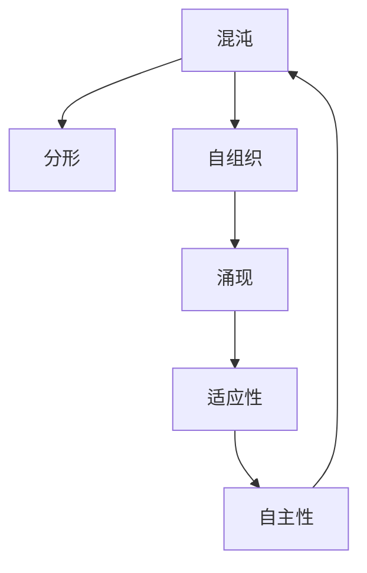

# 计算：第四部分 计算的极限 第 11 章 复杂性计算 反馈与控制

关键词：复杂性计算、反馈控制、混沌理论、分形、自组织、涌现、适应性、自主性

## 1. 背景介绍
### 1.1  问题的由来
在计算机科学和人工智能领域,我们一直在探索计算的极限。随着计算机硬件和算法的不断发展,我们能够处理越来越复杂的问题。然而,当我们进入复杂性计算的领域时,传统的计算方法开始显得力不从心。复杂性计算涉及大量相互作用的实体,展现出非线性、涌现性、自组织等特点,对计算提出了新的挑战。

### 1.2  研究现状
目前,复杂性计算已经成为计算机科学、人工智能、控制论等领域的前沿研究方向。研究者们利用混沌理论、分形几何、自组织映射等工具,探索复杂系统的行为模式和涌现规律。一些新兴的计算范式如进化计算、群体智能、深度学习等,也为解决复杂性问题提供了新的思路。但总的来说,复杂性计算仍处于起步阶段,许多基本问题尚未得到很好的解决。

### 1.3  研究意义 
深入研究复杂性计算,对于理解大脑认知、生物进化、社会组织等复杂系统具有重要意义。它可以帮助我们发展新一代智能计算系统,具备自主学习、涌现进化、自适应控制等能力。同时,复杂性计算也为传统计算机科学注入了新的活力,催生出一系列新的研究方向和应用领域。

### 1.4  本文结构
本文将围绕复杂性计算中的反馈与控制这一核心问题展开讨论。第2部分介绍复杂性计算的核心概念及其内在联系。第3部分重点阐述反馈控制的基本原理和算法步骤。第4部分给出反馈控制相关的数学模型和公式推导。第5部分通过代码实例演示反馈控制的具体实现。第6部分讨论反馈控制在实际复杂系统中的应用场景。第7部分推荐相关工具和学习资源。第8部分总结全文,展望复杂性计算的未来发展趋势和挑战。

## 2. 核心概念与联系
复杂性计算涉及一系列核心概念,它们相互交织,构成了这一领域的理论基础。下面我们对其中几个关键概念进行简要说明：

- 混沌(Chaos):混沌是复杂系统的一个基本特征,指系统对初始条件极为敏感,微小的扰动可能带来完全不同的结果。混沌系统虽然看似随机,但其内部往往蕴藏着某种隐秘的规律性。
- 分形(Fractal):分形是一类具有自相似性的复杂几何结构,在不同尺度上展现出相似的形态。许多自然界的复杂系统,如雪花、树木、山脉等,都呈现出分形特征。分形为刻画复杂系统的形态结构提供了有力工具。
- 自组织(Self-organization):自组织是指系统在没有外界控制的情况下,自发地形成有序结构或模式。自组织现象普遍存在于物理、化学、生物等领域,如激光、化学钟、蚁群等。自组织是复杂系统涌现出宏观有序行为的重要机制。
- 涌现(Emergence):涌现指系统整体展现出一些单个组分所不具备的新颖属性。涌现现象的产生往往源于组分之间的相互作用和反馈。涌现是复杂系统的一个本质特征,许多高级智能行为都是通过底层简单规则的涌现而产生的。
- 适应性(Adaptability):适应性是指系统能够根据环境的变化而调整自身行为,以维持稳定或提高性能。适应性系统通常依赖反馈回路,通过感知环境信息并据此修正行为,不断与环境协同演化。
- 自主性(Autonomy):自主性指系统能够独立地感知、决策和行动,不依赖外界的控制。自主系统往往具有一定程度的目标导向性,能够主动地优化自身行为。自主性是智能系统的一个重要特征。

这些概念并非孤立存在,而是相互交织,共同构建起复杂性计算的理论大厦。例如,混沌现象往往与分形结构相伴而生；自组织过程通常伴随着涌现现象的出现；适应性系统又需要一定的自主性作为基础。理解这些概念之间的内在联系,对于把握复杂性计算的本质具有重要意义。



## 3. 核心算法原理 & 具体操作步骤
### 3.1  算法原理概述
反馈控制是复杂性计算的一个核心问题。它指系统根据对环境的感知信息,动态调整自身行为,以实现特定的控制目标。反馈控制赋予系统适应性和自主性,使其能够在复杂多变的环境中维持稳定和优化性能。下面我们以PID控制为例,介绍反馈控制的基本原理。

PID控制是一种常见的反馈控制方法,被广泛应用于工业控制、机器人、自适应系统等领域。PID指比例(Proportional)、积分(Integral)、微分(Derivative)三种控制方式的组合。其基本思想是根据系统的误差信号,计算出一个控制量,施加到被控对象上,使误差信号尽快减小到零。

### 3.2  算法步骤详解
PID控制的具体步骤如下:
1. 测量系统的实际输出值 y(t),计算与目标值 r(t) 的误差 e(t)=r(t)-y(t)。
2. 计算比例项、积分项和微分项。
   - 比例项 P 与误差 e(t) 成正比,可以快速响应误差的变化。
   - 积分项 I 随时间对误差 e(t) 进行积累,可以消除静差。
   - 微分项 D 与误差 e(t) 的变化率成正比,可以预测误差的未来趋势。
3. 将三项加权求和,得到控制量 u(t)。
$$u(t) = K_p e(t) + K_i \int_0^t e(\tau) d\tau + K_d \frac{de(t)}{dt}$$
其中 $K_p$、$K_i$、$K_d$ 分别为比例、积分、微分系数。
4. 将控制量 u(t) 作用于被控对象,修正其行为。
5. 重复步骤1-4,直到误差 e(t) 满足要求。

### 3.3  算法优缺点
PID控制具有结构简单、性能稳定的优点,适用于大多数线性控制场合。但对于非线性、强耦合、时变的复杂系统,其控制效果可能难以保证。针对这些问题,人们发展了一些改进的控制方法,如自适应控制、最优控制、智能控制等。

### 3.4  算法应用领域
PID控制在许多实际系统中得到了成功应用,如:
- 工业控制:如温度控制、压力控制、液位控制等。
- 机器人控制:如轨迹跟踪控制、力控制等。
- 汽车控制:如巡航控制、ABS控制等。
- 过程控制:如化工生产过程控制、电力系统控制等。

## 4. 数学模型和公式 & 详细讲解 & 举例说明
### 4.1  数学模型构建
为了对反馈控制过程进行定量分析,我们需要建立系统的数学模型。一般地,可以将系统抽象为一个微分方程:

$$\frac{dy(t)}{dt} = f(y(t), u(t), t)$$

其中 $y(t)$ 为系统状态,$u(t)$ 为控制输入,$f$ 为系统动力学方程。求解该方程,就可以得到系统在控制作用下的运动轨迹。

### 4.2  公式推导过程
以一阶线性系统为例,其动力学方程为:

$$\frac{dy(t)}{dt} = ay(t) + bu(t)$$

其中 $a$, $b$ 为系统参数。假设系统期望输出为常值 $r$,引入误差变量 $e(t)=r-y(t)$,则误差动力学方程为:

$$\frac{de(t)}{dt} = ae(t) - bu(t)$$

选取如下形式的PID控制律:

$$u(t) = K_p e(t) + K_i \int_0^t e(\tau) d\tau + K_d \frac{de(t)}{dt}$$

将其代入误差动力学方程,整理得:

$$\frac{de(t)}{dt} = (a-bK_p) e(t) - bK_i \int_0^t e(\tau) d\tau - bK_d \frac{de(t)}{dt}$$

这是一个二阶线性微分方程,求解可得闭环系统的误差响应。

### 4.3  案例分析与讲解
考虑一个温度控制系统,其动力学方程为:

$$\frac{dT(t)}{dt} = -0.1 T(t) + u(t)$$

其中 $T(t)$ 为温度,$u(t)$ 为加热功率。假设期望温度为 $100^\circ C$,引入误差变量 $e(t)=100-T(t)$,设计PID控制律:

$$u(t) = K_p e(t) + K_i \int_0^t e(\tau) d\tau + K_d \frac{de(t)}{dt}$$

取 $K_p=10$, $K_i=2$, $K_d=1$,仿真得到温度响应曲线如下:

```python
import numpy as np
import matplotlib.pyplot as plt

a = -0.1
b = 1
Kp = 10
Ki = 2 
Kd = 1

T = np.arange(0, 100, 0.1)
e = np.zeros(len(T))
e[0] = 100

for i in range(len(T)-1):
    inte = np.trapz(e[:i+1], T[:i+1])
    u = Kp*e[i] + Ki*inte + Kd*(e[i]-e[i-1])/0.1
    e[i+1] = e[i] + (a*e[i]-b*u)*0.1

plt.plot(T, 100-e)    
plt.xlabel('Time (s)')
plt.ylabel('Temperature ($^\circ C$)')
plt.show()
```

可以看到,在PID控制下,系统温度迅速收敛到期望值 $100^\circ C$ 附近。通过调节PID参数,可以获得满意的控制性能。

### 4.4  常见问题解答
Q: 如何选取PID参数?
A: 可以采用整定方法,如Ziegler-Nichols方法,在线整定出一组满意的PID参数。也可采用优化方法,如最小二乘法,离线拟合出最优参数。

Q: PID控制是否适用于所有系统?
A: 理论上只要系统是可控的,PID控制就是适用的。但对于一些强非线性、强耦合、时变的系统,PID控制的效果可能不尽如人意,需要采用其他控制方法。

Q: 除了PID控制,还有哪些常见的反馈控制方法?
A: 常见的反馈控制方法还包括自适应控制、最优控制、鲁棒控制、智能控制等。它们在一定程度上克服了PID控制的局限性,能够处理更加复杂的系统。

## 5. 项目实践：代码实例和详细解释说明
### 5.1  开发环境搭建
本项目采用Python语言,需要安装以下库:
- NumPy:数值计算库
- Matplotlib:绘图库
- SciPy:科学计算库

可以使用pip命令安装:

```bash
pip install numpy matplotlib scipy
```

### 5.2  源代码详细实现
下面给出一个温度控制系统的PID控制仿真代码:

```python
import numpy as np
import matplotlib.pyplot as plt
from scipy.integrate import odeint

def pid_control(e, t, Kp, Ki, Kd):
    """PID控制器"""
    inte = np.trapz(e, t)
    der = np.gradient(e, t)
    return Kp*e[-1] + Ki*inte + Kd*der[-1]