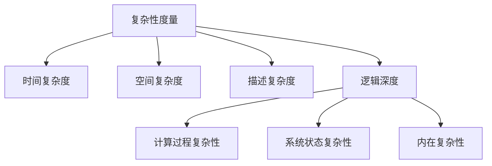

# 计算：第四部分 计算的极限 第 11 章 复杂性计算 逻辑深度

## 1. 背景介绍

### 1.1 问题的由来

在计算机科学中，复杂性理论是一个研究计算问题的本质难度和可计算性的重要分支。随着计算机系统和算法的日益复杂,对于算法的时间和空间复杂度的分析变得越来越重要。逻辑深度(Logical Depth)是复杂性理论中一个具有重要意义的概念,它提供了一种新颖的视角来衡量和理解计算的复杂性。

### 1.2 研究现状

传统的复杂性度量,如时间复杂度和空间复杂度,主要关注算法执行所需的步骤数和存储空间。然而,这些度量并没有充分考虑到计算过程中所蕴含的"深度"或"内在复杂性"。逻辑深度的概念由计算机科学家查尔斯·H·贝内特(Charles H. Bennett)在20世纪80年代提出,旨在量化一个物理系统演化到其当前状态所需的最短计算时间。

### 1.3 研究意义

逻辑深度为我们提供了一种新的视角来理解和评估计算的复杂性。它不仅考虑了时间和空间复杂度,还融入了计算过程中的"深度"因素。通过研究逻辑深度,我们可以更好地理解复杂系统的演化过程,并为设计高效、可靠的算法提供新的思路。此外,逻辑深度在量子计算、人工智能、密码学等领域也有着广泛的应用前景。

### 1.4 本文结构

本文将全面探讨逻辑深度的概念、原理和应用。我们将首先介绍逻辑深度的核心概念及其与其他复杂性度量的关系。接下来,将详细阐述逻辑深度的计算算法原理和数学模型。然后,我们将通过实际案例和代码实现,深入探讨逻辑深度的实践应用。最后,我们将总结逻辑深度的发展趋势和面临的挑战,并提供相关资源以供进一步学习和研究。

## 2. 核心概念与联系

逻辑深度(Logical Depth)是一个衡量计算复杂性的新颖度量,它描述了一个物理系统演化到当前状态所需的最短计算时间。与传统的时间复杂度和空间复杂度不同,逻辑深度不仅考虑了计算过程的步骤数和存储空间,还融入了计算过程中所蕴含的"深度"或"内在复杂性"。

逻辑深度的核心思想是,一个复杂的系统状态通常需要经过大量的计算步骤才能达到,而不是简单地从一个随机状态演化而来。因此,逻辑深度可以用来区分"深度"复杂的状态和"浅层"随机状态。

在形式化定义中,一个系统状态的逻辑深度被定义为:从最简单的初始状态出发,通过最短的计算过程达到该状态所需的计算步骤数。换言之,逻辑深度量化了产生一个特定状态所需的最小计算努力。

逻辑深度与其他复杂性度量存在着密切的联系,但同时也有着独特的特点:

- 时间复杂度(Time Complexity)关注算法执行所需的步骤数,而逻辑深度则关注达到特定状态所需的最短计算时间。
- 空间复杂度(Space Complexity)衡量算法所需的存储空间,而逻辑深度则侧重于系统状态的内在复杂性。
- 描述复杂度(Descriptional Complexity)衡量描述一个对象所需的最短程序长度,而逻辑深度则关注实际计算过程的复杂性。
- 计算复杂度理论(Computational Complexity Theory)研究问题的本质难度和可计算性,而逻辑深度为我们提供了一种新的视角来理解和评估计算的复杂性。

通过将逻辑深度与其他复杂性度量相结合,我们可以获得更全面、更深入的复杂性分析,从而为设计高效、可靠的算法提供新的思路和方向。

## 3. 核心算法原理 & 具体操作步骤

### 3.1 算法原理概述

计算逻辑深度的核心算法原理基于一种称为"逻辑深度测量"(Logical Depth Measurement)的过程。该过程旨在找到一个最短的计算过程,使得从一个简单的初始状态出发,通过该计算过程可以达到目标状态。

算法的基本思路是:首先定义一个简单的初始状态,通常是一个高度有序或高度无序的状态。然后,我们尝试找到一个最短的计算过程,使得通过该计算过程可以从初始状态演化到目标状态。这个最短计算过程的步骤数就被定义为目标状态的逻辑深度。

在实现过程中,我们通常需要构建一个计算模型,该模型定义了允许执行的基本操作和状态转移规则。常见的计算模型包括图灵机、cellular automata(细胞自动机)等。根据不同的计算模型,我们可以设计不同的搜索算法来寻找最短计算过程。

### 3.2 算法步骤详解

以下是计算逻辑深度的一般算法步骤:

1. **定义初始状态和目标状态**:首先,我们需要定义一个简单的初始状态,通常是一个高度有序或高度无序的状态。同时,我们也需要确定目标状态,即我们希望计算其逻辑深度的状态。

2. **构建计算模型**:接下来,我们需要构建一个计算模型,该模型定义了允许执行的基本操作和状态转移规则。常见的计算模型包括图灵机、cellular automata(细胞自动机)等。

3. **设计搜索算法**:根据选择的计算模型,我们需要设计一种搜索算法,用于寻找从初始状态到目标状态的最短计算过程。常见的搜索算法包括广度优先搜索(BFS)、A*搜索等。

4. **执行搜索过程**:使用设计的搜索算法,从初始状态开始,探索所有可能的计算过程,直到找到一个可以达到目标状态的最短计算过程。

5. **计算逻辑深度**:找到最短计算过程后,我们可以计算该过程的步骤数,这个步骤数就是目标状态的逻辑深度。

6. **优化和加速**:由于逻辑深度计算过程通常是计算密集型的,因此我们需要采取各种优化和加速技术,如并行计算、启发式搜索等,以提高计算效率。

需要注意的是,逻辑深度计算过程的复杂性取决于所选择的计算模型和搜索算法。在某些情况下,计算逻辑深度可能是一个NP难问题,需要采用近似算法或启发式方法。

### 3.3 算法优缺点

计算逻辑深度的算法具有以下优点:

- 提供了一种新颖的视角来衡量和理解计算的复杂性,补充了传统的时间复杂度和空间复杂度。
- 能够区分"深度"复杂的状态和"浅层"随机状态,有助于我们更好地理解复杂系统的演化过程。
- 在量子计算、人工智能、密码学等领域具有广泛的应用前景。

然而,该算法也存在一些缺点和挑战:

- 计算逻辑深度通常是一个计算密集型的过程,需要采取各种优化和加速技术以提高效率。
- 逻辑深度的计算结果可能会受到所选择的计算模型和搜索算法的影响,需要谨慎选择合适的模型和算法。
- 在某些情况下,计算逻辑深度可能是一个NP难问题,需要采用近似算法或启发式方法。

### 3.4 算法应用领域

逻辑深度的概念及其计算算法在多个领域都有着广泛的应用前景:

1. **量子计算**:逻辑深度可以用于衡量量子计算的复杂性,并为设计高效的量子算法提供新的思路。

2. **人工智能**:逻辑深度可以用于评估人工智能系统的复杂性和智能水平,并为设计更加智能和鲁棒的AI系统提供理论基础。

3. **密码学**:逻辑深度可以用于设计和分析密码系统的安全性,特别是在量子密码学领域。

4. **复杂系统建模**:逻辑深度可以用于建模和分析复杂系统的演化过程,如物理系统、生物系统等。

5. **数据压缩**:逻辑深度可以用于设计新的数据压缩算法,利用数据的内在复杂性来提高压缩效率。

6. **图像处理**:逻辑深度可以用于衡量图像的复杂性,并为图像压缩、图像识别等任务提供新的思路。

总的来说,逻辑深度为我们提供了一种新的视角来理解和评估计算的复杂性,其应用前景广阔,值得我们进一步深入研究和探索。

## 4. 数学模型和公式 & 详细讲解 & 举例说明

### 4.1 数学模型构建

为了形式化地定义和计算逻辑深度,我们需要构建一个合适的数学模型。在这个模型中,我们将系统的状态表示为一个字符串,并定义一组基本操作来转移状态。

让我们定义一个计算模型 $M = (Q, \Sigma, \delta, q_0, F)$,其中:

- $Q$ 是一个有限状态集合
- $\Sigma$ 是一个有限输入字母表
- $\delta: Q \times \Sigma \rightarrow Q$ 是一个状态转移函数
- $q_0 \in Q$ 是初始状态
- $F \subseteq Q$ 是一组终止状态

在这个模型中,我们将系统的状态表示为一个字符串 $s \in \Sigma^*$,其中 $\Sigma^*$ 表示所有可能的字符串集合。我们定义一个计算过程 $C$ 为一系列的状态转移,即 $C = (q_0, s_0), (q_1, s_1), \ldots, (q_n, s_n)$,其中 $q_i \in Q, s_i \in \Sigma^*$,并且对于每个 $i \in \{0, 1, \ldots, n-1\}$,都有 $\delta(q_i, s_i) = q_{i+1}$。

我们将初始状态定义为一个特殊的字符串 $s_0 \in \Sigma^*$,例如全 0 字符串或全 1 字符串。目标状态则是我们希望计算其逻辑深度的字符串 $s_n \in \Sigma^*$。

### 4.2 公式推导过程

现在,我们可以正式定义一个字符串 $s$ 的逻辑深度 $\mathrm{LD}(s)$ 为:

$$\mathrm{LD}(s) = \min\{n \mid \exists C = (q_0, s_0), \ldots, (q_n, s_n), \text{ s.t. } s_n = s\}$$

换言之,逻辑深度 $\mathrm{LD}(s)$ 是从初始状态 $s_0$ 到达目标状态 $s$ 所需的最短计算过程的长度。

我们可以进一步将逻辑深度与其他复杂性度量进行比较和联系。例如,对于一个字符串 $s$,其描述复杂度 $\mathrm{DC}(s)$ 可以定义为:

$$\mathrm{DC}(s) = \min\{|p| \mid U(p) = s\}$$

其中 $U$ 是一个通用图灵机,而 $|p|$ 表示程序 $p$ 的长度。

我们可以证明,对于任意字符串 $s$,都有:

$$\mathrm{LD}(s) \leq \mathrm{DC}(s) + O(1)