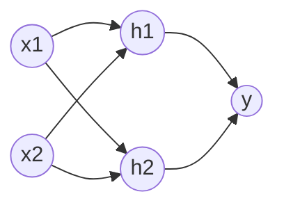

# 计算：第四部分 计算的极限 第 12 章 机器能思考吗 模拟大脑的结构

关键词：大脑仿真、神经网络、认知计算、图灵测试、强人工智能、意识

## 1. 背景介绍 
### 1.1 问题的由来
自从计算机诞生以来,人们就一直在思考一个问题:机器能否像人类一样进行思考?艾伦·图灵在其开创性论文《计算机器与智能》中提出了著名的"图灵测试",试图回答这个问题。随着人工智能技术的飞速发展,我们离制造出真正能"思考"的机器似乎越来越近了。

### 1.2 研究现状
目前,人工智能领域的研究主要集中在以下几个方面:
- 机器学习和深度学习:通过大量数据训练,让机器具备自主学习和优化的能力。
- 认知计算:模拟人类认知过程,赋予机器感知、理解、推理等能力。  
- 神经网络:借鉴生物神经系统结构,构建类脑计算模型。
- 脑机接口:通过脑电信号实现人脑与机器的直接交互。

尽管取得了长足进步,但离真正意义上的"会思考"的机器,还有相当长的路要走。

### 1.3 研究意义
揭开人类意识和智能的奥秘,创造出智能机器,将是人类文明发展的一个里程碑。它不仅具有重大的科学意义,更将深刻影响人类社会的方方面面。智能机器或将成为我们最得力的助手,甚至是进化的伴侣。

### 1.4 本文结构
本文将从以下几个方面展开探讨:
- 介绍大脑结构及其信息处理机制 
- 分析当前主流的类脑计算模型
- 讨论实现通用人工智能(AGI)的技术路线
- 思考机器意识的可能性及其哲学内涵
- 展望未来人工智能的发展趋势与挑战

## 2. 核心概念与联系
要探讨机器能否模拟大脑进行思考,首先需要厘清几个核心概念:
- 思考:对信息进行获取、表征、存储、推理、决策等一系列认知加工的过程。
- 意识:对自身存在和思维活动的主观体验。
- 智能:运用知识和经验,通过分析、推理、判断等,解决问题的综合能力。
- 类脑计算:借鉴生物神经系统结构,构建新型计算架构,实现类似大脑的感知、学习、记忆等功能。

这几个概念相互交织,共同构成了人工智能研究的核心问题域。类脑计算作为实现机器智能的一种重要途径,其目标就是最大限度地模拟人脑的结构和功能,从而使机器表现出类似人类的思维能力。而意识作为人类思维的高级形式,是智能的集中体现,也是当前人工智能的一大挑战。

## 3. 核心算法原理 & 具体操作步骤
### 3.1 算法原理概述
类脑计算的核心是人工神经网络(ANN)。它从生物神经元的结构和工作机制中获得启发,通过大量简单的处理单元(即人工神经元)的相互连接,构建起多层次的网络结构,并通过调整神经元之间的连接权重,使网络能够对输入信息进行分类、回归等处理。

### 3.2 算法步骤详解
以最经典的前馈神经网络为例,其训练过程通常包括以下几个步骤:

1. 网络初始化:根据具体任务确定网络的层数、每层神经元数量等参数,并随机初始化各连接权重。

2. 前向传播:将训练样本输入网络,逐层进行加权求和和非线性变换,得到网络的输出。计算公式如下:
$$
a_j^{(l)}=\sigma\left(\sum_i w_{ij}^{(l)} a_i^{(l-1)}+b_j^{(l)}\right)
$$
其中,$a_j^{(l)}$为第$l$层第$j$个神经元的输出,$w_{ij}^{(l)}$为第$l-1$层第$i$个神经元到第$l$层第$j$个神经元的连接权重,$b_j^{(l)}$为第$l$层第$j$个神经元的偏置项,$\sigma$为激活函数。

3. 误差计算:将网络输出与期望输出进行比较,根据预先定义的损失函数计算误差。常用的损失函数如均方误差(MSE):
$$
E=\frac{1}{2}\sum_k (y_k-\hat{y}_k)^2
$$
其中,$y_k$为期望输出,$\hat{y}_k$为实际输出。

4. 误差反向传播:从输出层开始,将误差逐层反向传播至输入层,并计算各层权重和偏置的梯度。对于第$l$层第$j$个神经元,其误差项为:
$$
\delta_j^{(l)}=\begin{cases} 
\sigma'\left(z_j^{(L)}\right) (y_j-a_j^{(L)}),  & \text{if }l=L \\
\sigma'\left(z_j^{(l)}\right) \sum_k \delta_k^{(l+1)} w_{kj}^{(l+1)}, & \text{if }l<L
\end{cases}
$$
其中,$z_j^{(l)}$为第$l$层第$j$个神经元的加权输入,$L$为网络的总层数。

5. 权重更新:根据梯度下降法,更新各层权重和偏置,使网络朝着误差最小化的方向优化。权重的更新公式为:
$$
w_{ij}^{(l)}:=w_{ij}^{(l)}-\eta \frac{\partial E}{\partial w_{ij}^{(l)}}=w_{ij}^{(l)}-\eta \delta_j^{(l)} a_i^{(l-1)} 
$$
其中,$\eta$为学习率。

6. 重复步骤2-5,直至网络收敛或达到预设的训练轮数。

### 3.3 算法优缺点
人工神经网络的优点在于:
- 具有很强的非线性拟合能力,可以逼近任意复杂的函数。
- 通过学习自动调整参数,不需要人工设计特征。
- 容错性强,对数据缺失和噪声有较强的鲁棒性。

但它也存在一些局限:
- 需要大量标注数据进行训练,获取成本高。
- 参数众多,训练时间长,调参难度大。
- 泛化能力有限,容易过拟合。
- 可解释性差,难以理解网络的决策依据。

### 3.4 算法应用领域 
人工神经网络已在多个领域取得了瞩目成就,如:
- 计算机视觉:图像分类、目标检测、语义分割等。
- 自然语言处理:机器翻译、情感分析、问答系统等。
- 语音识别:语音转文本、说话人识别等。
- 推荐系统:个性化推荐、广告投放等。

此外,在自动驾驶、医疗诊断、金融预测等领域也有广泛应用。

## 4. 数学模型和公式 & 详细讲解 & 举例说明
### 4.1 数学模型构建
为刻画神经元的工作机制,McCulloch和Pitts在1943年提出了第一个数学模型(MP模型):
$$
y=\sigma\left(\sum_{i=1}^n w_i x_i-\theta\right)
$$
其中,$y$为神经元的输出,$x_i$为第$i$个输入信号,$w_i$为对应的权重,$\theta$为阈值,$\sigma$为阶跃函数:
$$
\sigma(x)=\begin{cases}
1, & x\geq 0 \\
0, & x<0
\end{cases}
$$

这一简单的模型为后来的人工神经网络奠定了基础。此后,Rosenblatt在此基础上提出了感知机模型,引入了学习机制,使得神经网络具备了自适应能力。

### 4.2 公式推导过程
以单层感知机为例,假设训练集为$\{(\mathbf{x}_1,y_1),(\mathbf{x}_2,y_2),\cdots,(\mathbf{x}_N,y_N)\}$,其中$\mathbf{x}_i\in \mathbb{R}^n$为第$i$个样本的特征向量,$y_i\in\{0,1\}$为其标签。感知机试图学习一个超平面$\mathbf{w}^T\mathbf{x}+b=0$将正负样本分开。对于第$i$个样本,定义其预测值为:
$$
\hat{y}_i=\sigma(\mathbf{w}^T\mathbf{x}_i+b)
$$

引入损失函数:
$$
L(\mathbf{w},b)=\sum_{i=1}^N (\hat{y}_i-y_i)^2
$$

根据梯度下降法,权重$\mathbf{w}$的更新公式为:
$$
\mathbf{w}:=\mathbf{w}-\eta \frac{\partial L}{\partial \mathbf{w}}=\mathbf{w}+2\eta \sum_{i=1}^N (\hat{y}_i-y_i)\mathbf{x}_i
$$

偏置$b$的更新公式为:
$$
b:=b-\eta \frac{\partial L}{\partial b}=b+2\eta \sum_{i=1}^N (\hat{y}_i-y_i)
$$

不断迭代上述过程,直至损失函数收敛。

### 4.3 案例分析与讲解
下面以异或(XOR)问题为例,说明单层感知机的局限性。异或问题的真值表如下:

| $x_1$ | $x_2$ | $y$ |
|:-----:|:-----:|:---:|
|   0   |   0   |  0  |
|   0   |   1   |  1  |
|   1   |   0   |  1  |
|   1   |   1   |  0  |

可以看出,异或问题是一个非线性分类问题,无法用一条直线将正负样本分开。因此,单层感知机无法对其进行正确分类。

为解决这一问题,人们提出了多层感知机(MLP),通过引入隐藏层和非线性激活函数,增强了网络的表达能力。例如,一个具有一个隐藏层(包含两个神经元)的MLP可以实现异或功能:

其中,隐藏层神经元的激活函数为sigmoid函数:
$$
\sigma(x)=\frac{1}{1+e^{-x}}
$$

输出层神经元的激活函数为恒等函数。

通过训练,可以得到一组合适的权重和偏置,使得网络能够正确分类异或问题。这体现了多层神经网络强大的非线性拟合能力。

### 4.4 常见问题解答
Q: 神经网络容易过拟合的原因是什么?有哪些防止过拟合的方法?
A: 过拟合主要是由于网络复杂度过高,参数过多,对训练数据学习过于精确导致的。主要的应对方法有:
- 增大训练集,提供更多样本。
- 降低网络复杂度,减少层数和神经元数量。
- 加入正则化项,限制权重大小。
- 使用Dropout,随机屏蔽部分神经元。
- 进行数据增强,扩充训练集。
- 引入早停机制,在验证集误差上升时停止训练。

Q: 梯度消失和梯度爆炸问题的原因和解决方案是什么?
A: 梯度消失和爆炸都是由于网络层数过深,反向传播过程中误差梯度不断累乘导致的。前者会使得前层网络难以训练,后者会使得训练不稳定。解决方案主要有:
- 合理设计网络结构,控制网络深度。
- 使用ReLU等梯度较稳定的激活函数。 
- 采用Batch Normalization加快收敛。
- 使用残差连接,构建ResNet等模型。
- 调整学习率,使用自适