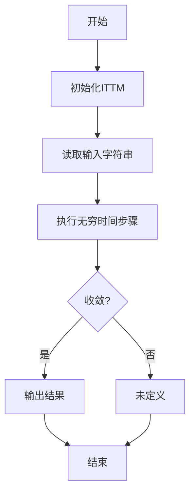

# 计算：第四部分 计算的极限 第13章 自然哲学的计算原理 无穷时间的计算

## 1. 背景介绍

### 1.1 问题的由来

在探索计算的极限时,我们不可避免地会遇到一个古老而令人费解的问题:无穷的概念。无穷不仅在数学和物理学中扮演着重要角色,而且在计算理论中也是一个核心概念。从有限的计算资源中,我们如何模拟和理解无穷这个看似矛盾的概念?这就引出了一个更深层次的问题:在有限的物理宇宙中,无穷计算是否可能?

### 1.2 研究现状  

无穷计算机的想法可以追溯到图灵机和递归函数论的早期发展时期。已经提出了许多旨在捕捉无穷计算概念的数学模型,例如无穷时间图灵机、无限时态逻辑和无穷贝叶斯机等。然而,这些模型通常是高度理论化和抽象化的,与物理现实存在明显脱节。

### 1.3 研究意义

探索无穷计算不仅是一个有趣的思维实验,而且对于理解计算的本质和局限性至关重要。它挑战了我们对可计算性边界的认知,并为创新计算模型和新兴计算范式提供了启发。无穷计算还可能为解决一些长期困扰计算理论的难题提供新的见解,例如P与NP问题。

### 1.4 本文结构

本文将首先介绍无穷计算的核心概念及其与其他计算模型的联系。接下来,我们将深入探讨无穷时间图灵机的算法原理、数学模型和具体实现。最后,我们将讨论无穷计算的实际应用场景、发展趋势和面临的挑战。

## 2. 核心概念与联系

无穷计算的核心思想是允许计算在无穷长的时间内进行,而不受有限资源的限制。这与经典计算模型形成鲜明对比,后者通常假设计算在有限时间和有限空间内完成。

无穷计算与其他计算模型存在内在联系:

- **经典计算模型**: 无穷计算可被视为经典有限计算模型(如图灵机)的自然扩展,通过放松有限时间和空间的限制来增强其计算能力。
- **量子计算**: 无穷计算与量子计算理论有一些相似之处,因为它们都试图超越经典计算的局限性。然而,无穷计算更侧重于时间维度,而量子计算则利用量子力学原理来提高计算效率。
- **模拟计算**: 无穷计算与模拟计算有一些联系,因为它们都试图模拟物理系统的行为。然而,无穷计算更关注时间无限制的情况,而模拟计算则侧重于有限时间内对物理系统的精确模拟。
- **超级图灵计算**: 无穷计算有时被认为是超级图灵计算的一种形式,因为它能够解决一些经典图灵机无法解决的问题。然而,无穷计算的计算能力边界仍有待进一步探讨。

## 3. 核心算法原理 & 具体操作步骤

### 3.1 算法原理概述

无穷时间图灵机(Infinite Time Turing Machine, ITTM)是无穷计算的一种主要数学模型。它是经典图灵机的扩展版本,允许计算在无穷长的时间步骤内进行。ITTM的工作原理可以概括为以下几个关键点:

1. **无穷时间步骤**: ITTM可以执行无穷多个时间步骤,而不受时间限制。这使得它能够模拟一些在有限时间内无法完成的计算过程。
2. **输入-输出行为**: ITTM的输入-输出行为类似于经典图灵机。它从初始状态和输入字符串开始,并在无穷时间步骤后产生输出。
3. **收敛与发散**: ITTM的计算过程可能会收敛到一个最终状态(停机),也可能会发散(无限循环)。收敛的计算被视为可接受的,而发散的计算则被视为未定义。
4. **计算能力**: ITTM的计算能力超越了经典图灵机。它能够解决一些经典图灵机无法解决的问题,例如判断一个给定的图灵机在任意输入上是否会停机(停机问题)。

### 3.2 算法步骤详解

ITTM的具体算法步骤可以描述如下:

1. **初始化ITTM**: 设置ITTM的初始状态,包括头部位置、磁带内容和当前状态。
2. **读取输入字符串**: 将输入字符串加载到ITTM的磁带上。
3. **执行无穷时间步骤**: ITTM开始执行无穷多个时间步骤,根据其转移函数更新磁带内容、头部位置和当前状态。
4. **收敛检查**: 检查ITTM是否收敛到一个最终状态(停机状态)。如果收敛,则进入下一步;否则,计算被视为未定义。
5. **输出结果**: 如果ITTM收敛,则根据磁带内容和最终状态生成输出。
6. **结束计算**: 计算过程完成。

### 3.3 算法优缺点

无穷时间图灵机作为无穷计算的一种数学模型,具有以下优缺点:

**优点**:

- 增强计算能力: ITTM能够解决一些经典图灵机无法解决的问题,如停机问题。
- 理论意义重大: ITTM为探索计算的极限和可计算性边界提供了新的视角。
- 启发新计算模型: ITTM的思想为发展新兴计算范式(如量子计算和模拟计算)提供了启发。

**缺点**:

- 物理实现困难: 在有限的物理宇宙中,实现真正的无穷时间计算面临巨大挑战。
- 收敛性问题: 判断ITTM是否收敛到一个最终状态本身就是一个无法解决的问题。
- 计算能力边界模糊: ITTM的确切计算能力边界仍有待进一步探讨和证明。

### 3.4 算法应用领域

尽管无穷时间图灵机主要是一种理论模型,但它的思想和原理在以下领域具有潜在应用:

- **计算理论**: ITTM为探索计算的极限和可计算性边界提供了新的视角,有助于推进计算理论的发展。
- **量子计算**: ITTM的思想为发展新兴计算范式(如量子计算)提供了启发,有助于探索超越经典计算的新计算模型。
- **模拟计算**: ITTM的无穷时间概念为模拟复杂物理系统的长时间行为提供了理论基础。
- **人工智能**: ITTM的思想可能为发展具有无限学习能力的人工智能系统提供启发。

## 4. 数学模型和公式 & 详细讲解 & 举例说明

### 4.1 数学模型构建

为了形式化描述无穷时间图灵机(ITTM),我们需要构建一个严格的数学模型。ITTM可以被定义为一个七元组:

$$\text{ITTM} = (Q, \Gamma, \Sigma, \delta, q_0, q_a, q_r)$$

其中:

- $Q$ 是有限的状态集合
- $\Gamma$ 是磁带字母表,包括输入字母和特殊空白符号 $\square$
- $\Sigma \subseteq \Gamma$ 是输入字母表
- $\delta: Q \times \Gamma \rightarrow Q \times \Gamma \times \{L, R\}$ 是转移函数
- $q_0 \in Q$ 是初始状态
- $q_a \in Q$ 是接受状态
- $q_r \in Q$ 是拒绝状态

与经典图灵机不同,ITTM的转移函数 $\delta$ 定义了在每个时间步骤中,给定当前状态和磁带符号,ITTM将转移到哪个新状态、写入哪个新符号以及头部将向左还是向右移动。

### 4.2 公式推导过程

ITTM的计算过程可以用一系列公式来描述。假设 ITTM 在时间步骤 $t$ 处于状态 $q_t$,磁带内容为 $x_t$,头部位置为 $i_t$,则在下一个时间步骤 $t+1$ 时,ITTM 的状态、磁带内容和头部位置由以下公式确定:

$$q_{t+1} = Q(q_t, x_t[i_t])$$
$$x_{t+1}[j] = \begin{cases}
y & \text{if } j = i_t \\
x_t[j] & \text{otherwise}
\end{cases}$$
$$i_{t+1} = \begin{cases}
i_t + 1 & \text{if } D(q_t, x_t[i_t]) = R \\
i_t - 1 & \text{if } D(q_t, x_t[i_t]) = L
\end{cases}$$

其中 $Q$ 和 $D$ 分别表示 ITTM 的状态转移函数和头部移动方向函数,它们由转移函数 $\delta$ 确定。

通过迭代应用这些公式,我们可以描述 ITTM 在无穷时间步骤内的计算过程。如果存在某个时间步骤 $t$,使得 $q_t = q_a$,则 ITTM 被认为接受输入;如果存在某个时间步骤 $t$,使得 $q_t = q_r$,则 ITTM 被认为拒绝输入;否则,ITTM 的计算将永远继续下去。

### 4.3 案例分析与讲解

为了更好地理解 ITTM 的工作原理,让我们通过一个具体案例进行分析和讲解。

**案例**: 判断给定的图灵机 $M$ 在输入字符串 $w$ 上是否会停机。

我们可以构建一个 ITTM $M'$,它模拟 $M$ 在输入 $w$ 上的计算过程。$M'$ 的工作方式如下:

1. 在磁带上写入输入字符串 $w$。
2. 模拟 $M$ 在输入 $w$ 上的每一个时间步骤,更新 $M$ 的状态、磁带内容和头部位置。
3. 如果 $M$ 进入接受状态或拒绝状态,则 $M'$ 也进入相应的状态并停止计算。
4. 如果 $M$ 的计算永远不停止,则 $M'$ 将永远继续模拟下去。

由于 $M'$ 是一个 ITTM,它能够在无穷时间内模拟 $M$ 的计算过程。因此,如果 $M'$ 进入接受状态,则意味着 $M$ 在输入 $w$ 上会停机;如果 $M'$ 永远不停止计算,则意味着 $M$ 在输入 $w$ 上不会停机。

通过这个案例,我们可以看到 ITTM 如何利用无穷时间来解决经典图灵机无法解决的停机问题。然而,这种方法也存在一个缺陷:如果 $M$ 在输入 $w$ 上不会停机,则 $M'$ 将永远计算下去,无法给出确定的答复。

### 4.4 常见问题解答

**Q1: ITTM 是否能够解决所有可计算问题?**

A1: 不能。尽管 ITTM 的计算能力超越了经典图灵机,但它仍然受到一些限制。例如,ITTM 无法解决一些已知的不可计算问题,如停机问题的补集(判断给定的图灵机在任意输入上是否不会停机)。ITTM 的计算能力边界仍有待进一步探讨和证明。

**Q2: 如何判断 ITTM 是否收敛到一个最终状态?**

A2: 判断 ITTM 是否收敛本身就是一个无法解决的问题。在一般情况下,我们无法确定 ITTM 的计