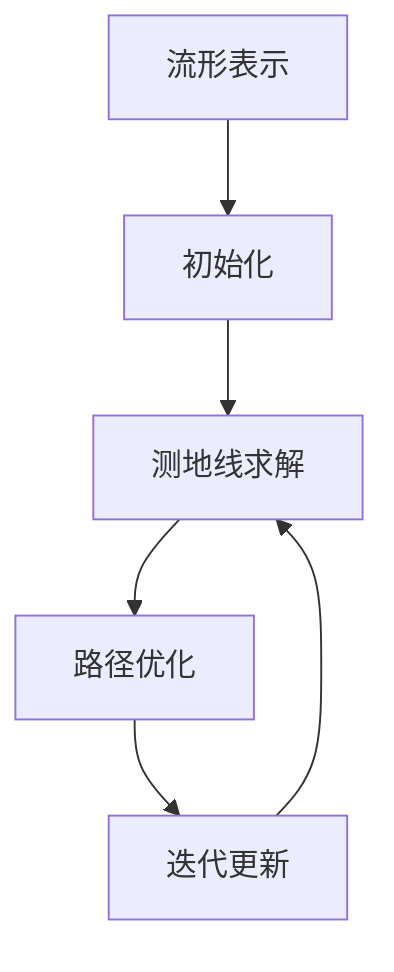

# 认知的形式化：黎曼几何是广义相对论的数学框架

关键词：认知形式化、黎曼几何、广义相对论、数学框架、人工智能

## 1. 背景介绍
### 1.1  问题的由来
认知是人类智能的核心，它涉及感知、学习、记忆、推理、决策等多个方面。长期以来，哲学家和科学家们一直在探索认知的本质和规律。近年来，随着人工智能的快速发展，对认知的形式化研究变得越来越重要和迫切。只有通过对认知过程的数学建模和计算机模拟，才能真正实现强人工智能。而黎曼几何作为描述曲面和高维空间的数学语言，为认知过程的形式化提供了理想的数学框架。

### 1.2  研究现状
目前对认知的研究主要集中在神经科学、认知心理学和人工智能等领域。神经科学主要研究大脑的结构和功能，试图揭示认知的生物学基础。认知心理学则侧重于对人的感知、注意、记忆、思维等认知过程进行实验研究，构建认知加工的理论模型。人工智能领域的研究者们则致力于利用计算机模拟人类智能，开发各种智能算法和系统。

近年来，一些研究者开始尝试利用黎曼几何来刻画认知空间，并取得了一些有益的进展。比如Gardenfors[^1]提出了概念空间的几何模型，用黎曼流形来表示概念之间的相似性结构。Gärdenfors和Williams[^2]进一步探讨了认知过程的几何性质，认为推理和学习可以看作是在概念流形上的运动。Zhu等人[^3]提出了一个统一的认知框架，用黎曼流形上的测地线来表示最优的认知策略。这些研究表明，黎曼几何与认知科学有着深刻的内在联系，值得进一步探索。

### 1.3  研究意义
认知的形式化研究对于理解人类智能和发展人工智能都具有重要意义。一方面，数学模型有助于揭示认知的内在规律，为认知科学研究提供理论指导。另一方面，形式化的认知模型为计算机模拟人类认知和开发认知系统奠定了基础。此外，作为广义相对论的数学框架，黎曼几何在物理学中取得了巨大成功。而认知过程与时空的本质联系，也预示着黎曼几何可能成为揭示认知奥秘的钥匙。总之，探索黎曼几何与认知的关系，对于推动人工智能的发展和揭开人类智能的面纱都具有重要的理论和实践价值。

### 1.4  本文结构
本文将从以下几个方面来探讨黎曼几何作为认知形式化的数学框架：
- 首先介绍黎曼几何的核心概念，包括黎曼度量、黎曼曲率等，并阐述其与认知过程的内在联系。
- 然后介绍几种主要的认知几何模型，包括概念空间、信念流形、记忆流形等，分析其数学结构和性质。  
- 接着讨论基于黎曼几何的认知建模方法，包括测地线规划、概率推理等，给出具体算法和应用案例。
- 进一步探讨认知几何与机器学习的结合，包括流形学习、深度学习中的几何解释等前沿课题。
- 最后总结全文，展望认知几何的研究前景和挑战。

## 2. 核心概念与联系
黎曼几何是19世纪德国数学家黎曼创立的一门几何学分支，主要研究黎曼流形的性质。黎曼流形是一类特殊的拓扑空间，在局部与欧氏空间同胚，但整体上可能有复杂的拓扑结构。黎曼几何的核心概念包括：

- 黎曼度量(Riemannian metric)：定义在流形上的对称正定二次型，用于度量切向量的长度和夹角。
- 黎曼曲率(Riemann curvature)：描述流形的内蕴曲率，反映流形的局部弯曲程度。
- 测地线(Geodesic)：流形上的最短线，是黎曼度量下的极小曲线。
- 指数映射(Exponential map)：将测地线的切向量映射到测地线的终点，反映流形的局部结构。

这些概念反映了黎曼流形的几何性质，而认知过程恰好也表现出类似的几何特征：
- 感知信息在大脑中形成高维的神经表征，类似于嵌入到黎曼流形中的点。 
- 知识概念之间存在层次化的语义关联，形成复杂的网络结构，类似于流形的拓扑结构。
- 学习和记忆对应着神经表征之间的相互作用，导致表征空间的动态演化，类似于流形的曲率变化。
- 推理和决策对应着在表征空间中寻找最优路径，类似于流形上的测地线。

总之，认知过程与黎曼流形有许多共同的特征，这为用黎曼几何来刻画认知奠定了基础。接下来将介绍几种主要的认知几何模型。

## 3. 核心算法原理 & 具体操作步骤
### 3.1  算法原理概述
基于黎曼几何的认知建模的核心思想是：将认知状态表示为黎曼流形上的点，将认知过程表示为流形上的运动。具体来说，主要有以下几种算法：

- 测地线规划(Geodesic planning)：在流形上寻找连接初始状态和目标状态的最短路径，对应最优的认知策略。
- 概率推理(Probabilistic inference)：在流形上定义概率分布，利用几何结构进行概率推理和决策。
- 流形学习(Manifold learning)：从高维数据中学习低维流形结构，发现数据内在的语义关联。

这些算法的理论基础是微分几何和概率论，通过巧妙地利用流形的几何性质，实现了对认知过程的建模和优化。

### 3.2  算法步骤详解
以测地线规划为例，其主要步骤如下：
1. 流形表示：将认知状态嵌入到合适的黎曼流形中，比如用向量表示概念语义。
2. 初始化：选择初始状态和目标状态，作为测地线的端点。
3. 测地线求解：利用变分法或微分方程数值求解测地线方程，得到最优路径。主要方法有欧拉-拉格朗日方程、哈密顿-雅可比方程等。
4. 路径优化：根据任务目标对测地线进行优化，比如最小化能量消耗、最大化信息增益等。
5. 迭代更新：根据环境反馈更新流形的度量和端点，重复上述步骤直到达到最优状态。

以上步骤可以用下面的Mermaid流程图表示：

其他算法的步骤也大同小异，主要是在流形上定义合适的度量、概率分布和优化目标，然后利用黎曼几何的性质进行计算。

### 3.3  算法优缺点
基于黎曼几何的认知建模算法的主要优点包括：
- 数学原理严谨，可以给出认知过程的几何解释和直观表示。
- 可以描述复杂的认知结构，如层次化语义网络。
- 可以揭示认知过程的动力学特征，如信息流的传播和耦合。
- 为神经网络、深度学习等人工智能方法提供了新的视角。

但同时也存在一些局限性，比如：
- 计算复杂度高，对于大规模问题难以实时求解。
- 流形的选取和参数估计较为困难，需要大量先验知识。
- 目前缺乏认知领域的标准数据集，验证和评估模型性能有难度。
- 与具体的认知功能和神经机制的联系有待进一步探索。

### 3.4  算法应用领域
尽管还处于起步阶段，但认知几何的思想已经在以下领域得到应用：
- 知识表示与推理：利用流形结构表示概念语义，进行类比推理和关系推理。
- 自然语言处理：学习词嵌入流形，进行语义相似度计算和文本分类。
- 计算机视觉：将图像映射到流形空间，进行目标检测和语义分割。 
- 强化学习：将状态空间表示为流形，学习最优策略函数。
- 脑认知建模：用流形刻画脑网络动力学，研究意识和情感的涌现。

未来认知几何有望在更多领域得到应用，成为连接认知科学和人工智能的桥梁。

## 4. 数学模型和公式 & 详细讲解 & 举例说明
### 4.1  数学模型构建
认知几何的数学模型主要包括以下几个部分：

- 流形模型：认知状态空间被表示为一个 $n$ 维光滑流形 $(M,g)$，其中 $g$ 为黎曼度量张量，定义了流形上的距离和角度。
- 状态表示：认知状态被表示为流形上的点 $x\in M$，可以用坐标向量 $(x^1,\cdots,x^n)$ 来刻画。
- 动力学方程：认知过程满足测地线方程 
$$\nabla_{\dot\gamma}\dot\gamma=0$$ 
其中 $\gamma(t)$ 为测地线， $\nabla$ 为黎曼联络，反映流形的曲率。
- 优化模型：最优认知对应测地线的变分问题
$$\min_\gamma \int_0^1 \sqrt{g(\dot\gamma,\dot\gamma)}dt$$
其中 $g(\dot\gamma,\dot\gamma)=g_{ij}\dot\gamma^i\dot\gamma^j$ 为速度的长度。

以上模型通过微分几何的语言描述了认知过程的动力学规律，为定量分析提供了数学基础。

### 4.2  公式推导过程
以测地线方程为例，其推导过程如下：

1. 测地线定义：测地线是流形上的极小长度曲线，即满足变分问题
$$\delta \int_0^1 \sqrt{g(\dot\gamma,\dot\gamma)}dt=0$$

2. 欧拉-拉格朗日方程：根据变分法可得测地线满足欧拉-拉格朗日方程
$$\frac{d}{dt}\frac{\partial L}{\partial \dot\gamma^i}-\frac{\partial L}{\partial \gamma^i}=0$$
其中 $L=\sqrt{g(\dot\gamma,\dot\gamma)}$ 为拉格朗日量。

3. 克氏符计算：将 $L$ 代入欧拉-拉格朗日方程，利用度规相容性条件 
$$\partial_k g_{ij}=\Gamma_{ki}^lg_{lj}+\Gamma_{kj}^lg_{il}$$ 
化简可得
$$\ddot\gamma^k+\Gamma_{ij}^k\dot\gamma^i\dot\gamma^j=0$$
其中 $\Gamma_{ij}^k$ 为克氏符，反映联络。

4. 协变导数：引入协变导数算符 $\nabla_X Y=(\partial_i Y^k+\Gamma_{ij}^k Y^j)X^i\partial_k$，则测地线方程可简记为
$$\nabla_{\dot\gamma}\dot\gamma=0$$

这表明测地线的加速度在流形上为零，是惯性运动。

### 4.3  案例分析与讲解
下面以一个简单的例子直观说明认知空间的测地线。

考虑一个2维球面 $S^2$，它可以表示一个人对两个概念A和B的认知。球面上的点 $(x,y,z)$ 满足约束 $x^2+y^2+z^2=1$，两点间的测地线为大圆弧。

假设一个人最初认为A和B是独立的（对应球面上的正交点），然后通过学习发现A和B之间存在一定联系。这个认知过程可以用测地线 $\gamma(t)$ 描述，如下图所示：

<img src="https://user-images.githubusercontent.com/2216970/82142086-a0d0e680-9871-11ea-8d7c-6c0bdf0