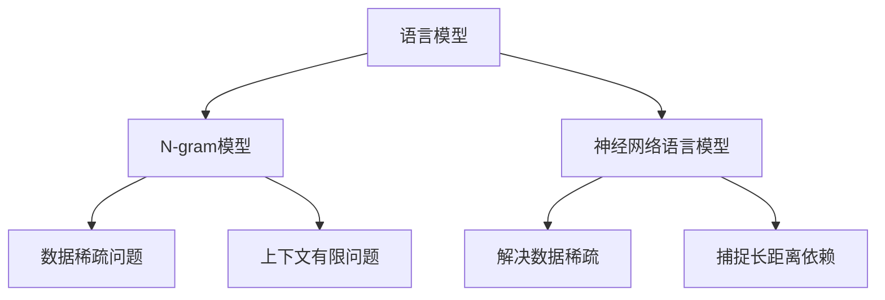
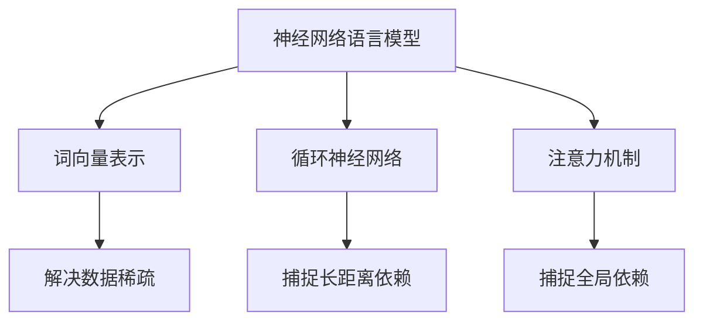
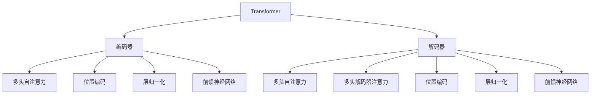

# 语言模型 原理与代码实例讲解

## 1. 背景介绍

### 1.1 问题的由来

在自然语言处理领域中,语言模型扮演着至关重要的角色。它是一种概率分布模型,旨在捕捉语言序列中单词之间的统计规律。传统的语言模型通常基于 N-gram 统计方法,但存在数据稀疏、上下文有限等问题。随着深度学习技术的飞速发展,神经网络语言模型(Neural Network Language Model, NNLM)应运而生,为语言模型注入了新的活力。

### 1.2 研究现状

近年来,基于 Transformer 的大型语言模型取得了令人瞩目的成就,如 GPT、BERT、XLNet 等,展现出强大的语言理解和生成能力。这些模型通过预训练的方式学习大规模语料中的语义和语法知识,再通过微调(fine-tuning)将这些知识转移到下游任务中,极大提升了自然语言处理的性能表现。

### 1.3 研究意义

语言模型在自然语言处理的诸多领域都有广泛应用,如机器翻译、文本生成、问答系统、信息检索等。掌握语言模型的原理和实现方法,对于提高语言理解和生成的质量至关重要。此外,语言模型也是探索人工智能通用能力的重要基础。

### 1.4 本文结构

本文将全面介绍语言模型的核心概念、算法原理、数学模型、代码实现和应用场景。首先阐述语言模型的基本概念和发展历程;其次深入探讨 Transformer 等核心算法的工作原理和具体实现步骤;再者详细推导语言模型中常用的数学模型和公式;接着通过代码示例讲解模型的实现细节;最后分析语言模型在实际应用中的场景,并对未来发展趋势和挑战进行展望。

## 2. 核心概念与联系

语言模型旨在学习自然语言的统计规律,即给定一个词序列,计算该序列出现的概率。形式化地,对于一个长度为 T 的词序列 $w_1, w_2, ..., w_T$,语言模型需要计算该序列的概率:

$$P(w_1, w_2, ..., w_T)$$

根据链式法则,上式可以分解为:

$$P(w_1, w_2, ..., w_T) = \prod_{t=1}^{T}P(w_t|w_1, ..., w_{t-1})$$

其中 $P(w_t|w_1, ..., w_{t-1})$ 表示在给定前 t-1 个词的条件下,第 t 个词出现的条件概率。这就是语言模型需要学习的核心目标。

在早期,语言模型主要基于 N-gram 统计方法,即通过计算语料库中 N 个连续词的出现频率来估计条件概率。但这种方法存在数据稀疏和上下文有限的问题。

神经网络语言模型(NNLM)的出现为语言模型注入了新的活力。NNLM 利用神经网络的强大建模能力,可以有效缓解数据稀疏问题,并通过门控循环单元(如 LSTM 和 GRU)捕捉长距离依赖关系。

Transformer 模型进一步推动了语言模型的发展,通过多头自注意力机制捕捉全局依赖关系,显著提升了语言理解和生成的质量。预训练语言模型(如 BERT、GPT 等)在大规模无标注数据上进行预训练,学习丰富的语义和语法知识,再通过微调将这些知识转移到下游任务中,取得了卓越的性能表现。

## 3. 核心算法原理 & 具体操作步骤

### 3.1 算法原理概述

Transformer 是一种全新的基于注意力机制的序列到序列模型,用于机器翻译等任务。它完全摒弃了 RNN 和 CNN,纯粹使用注意力机制来捕捉输入和输出序列之间的长距离依赖关系。

Transformer 的核心思想是使用自注意力机制,允许模型直接捕捉输入序列中任意两个位置之间的依赖关系,而不受距离的限制。这种全局依赖特性使 Transformer 能够更好地建模长序列,同时通过并行计算加速训练过程。

Transformer 由编码器(Encoder)和解码器(Decoder)两个主要部分组成。编码器的作用是将输入序列编码为一系列连续的向量表示,解码器则基于这些向量表示生成输出序列。

### 3.2 算法步骤详解

#### 3.2.1 编码器(Encoder)

编码器由 N 个相同的层组成,每一层包含两个子层:多头自注意力机制(Multi-Head Attention)和全连接前馈神经网络(Position-wise Feed-Forward Network)。

1. **多头自注意力机制**

自注意力机制的核心思想是,对于输入序列中的每个词,计算它与该序列中其他所有词的相关性,并据此为该词分配注意力权重。多头注意力机制是将注意力机制运用于不同的子空间,以捕捉不同的相关模式。

给定一个输入序列 $\boldsymbol{x} = (x_1, x_2, ..., x_n)$,多头自注意力的计算过程如下:

$$\begin{aligned}
\text{MultiHead}(Q, K, V) &= \text{Concat}(\text{head}_1, \text{head}_2, ..., \text{head}_h)W^O\\
\text{where\ head}_i &= \text{Attention}(QW_i^Q, KW_i^K, VW_i^V)
\end{aligned}$$

其中 $Q$、$K$、$V$ 分别表示查询(Query)、键(Key)和值(Value)向量,通过线性变换得到。$W_i^Q$、$W_i^K$、$W_i^V$ 和 $W^O$ 是可学习的权重矩阵。

2. **位置编码(Positional Encoding)**

由于 Transformer 没有使用 RNN 或 CNN 来直接捕捉序列的顺序信息,因此需要一种位置编码的方法,为序列中的每个词编码它在序列中的位置。常用的位置编码函数有正弦曲线编码和可学习的编码向量。

3. **层归一化(Layer Normalization)和残差连接(Residual Connection)**

为了避免梯度消失或爆炸问题,Transformer 在每个子层之后使用了层归一化和残差连接。

4. **前馈神经网络(Feed-Forward Network)**

每个编码器层中还包含一个全连接的前馈神经网络,对每个位置的向量进行独立的非线性变换,进一步捕捉高阶特征。

#### 3.2.2 解码器(Decoder)

解码器的结构与编码器类似,也由 N 个相同的层组成,每一层包含三个子层:

1. **屏蔽的多头自注意力机制(Masked Multi-Head Attention)**

与编码器类似,解码器也使用多头自注意力机制。不同之处在于,解码器的自注意力机制是"屏蔽"的,即当前位置的词只能关注之前的词,而不能关注之后的词。这种"屏蔽"机制保证了模型的自回归性质,使其能够生成序列。

2. **多头解码器注意力机制(Multi-Head Decoder Attention)**

解码器还需要一种注意力机制,将解码器的输出与编码器的输出进行关联。这种注意力机制被称为"多头解码器注意力"。

3. **前馈神经网络、层归一化和残差连接**

与编码器类似,解码器中也包含前馈神经网络、层归一化和残差连接。

在训练过程中,Transformer 使用标准的序列到序列学习目标函数,最小化输入序列和目标序列之间的交叉熵损失。

### 3.3 算法优缺点

**优点:**

1. **并行计算**:Transformer 完全摒弃了 RNN 结构,可以高效利用并行计算加速训练过程。
2. **长距离依赖**:自注意力机制能够直接捕捉输入序列中任意两个位置之间的依赖关系,无需通过 RNN 的递归计算。
3. **灵活性**:Transformer 可以应用于各种序列到序列的任务,如机器翻译、文本生成、问答系统等。

**缺点:**

1. **计算开销大**:自注意力机制需要计算每个位置与所有其他位置的相关性,计算复杂度较高。
2. **长序列性能下降**:对于非常长的序列,自注意力机制的计算开销会急剧增加,模型性能会下降。
3. **缺乏序列建模归纳偏置**:与 RNN 相比,Transformer 缺乏对序列建模的归纳偏置,需要更多的训练数据。

### 3.4 算法应用领域

Transformer 及其变体模型在自然语言处理的多个领域取得了卓越的表现,主要应用领域包括:

1. **机器翻译**:Transformer 最初就是为机器翻译任务而设计,在多种语言对之间表现出色。
2. **文本生成**:基于 Transformer 的大型语言模型(如 GPT)能够生成高质量、连贯性强的文本。
3. **文本分类**:BERT 等预训练语言模型在文本分类任务上表现优异。
4. **问答系统**:Transformer 模型也被广泛应用于阅读理解和问答系统中。
5. **代码建模**:Transformer 还可以用于源代码的表示学习和代码生成等任务。

## 4. 数学模型和公式 & 详细讲解 & 举例说明

### 4.1 数学模型构建

在介绍 Transformer 的数学模型之前,我们先回顾一下语言模型的基本概念。语言模型的目标是估计一个词序列的概率:

$$P(w_1, w_2, ..., w_T) = \prod_{t=1}^{T}P(w_t|w_1, ..., w_{t-1})$$

其中 $P(w_t|w_1, ..., w_{t-1})$ 表示在给定前 t-1 个词的条件下,第 t 个词出现的条件概率。

神经网络语言模型通过一个神经网络来对条件概率 $P(w_t|w_1, ..., w_{t-1})$ 进行建模和估计。在 Transformer 中,这个神经网络就是编码器-解码器架构。

对于一个给定的输入序列 $\boldsymbol{x} = (x_1, x_2, ..., x_n)$,编码器会将其编码为一系列连续的向量表示 $\boldsymbol{z} = (z_1, z_2, ..., z_n)$。解码器则基于这些向量表示生成输出序列 $\boldsymbol{y} = (y_1, y_2, ..., y_m)$。

在解码器中,我们需要估计每个目标词 $y_t$ 的条件概率:

$$P(y_t|y_1, ..., y_{t-1}, \boldsymbol{z}) = \text{Model}(y_1, ..., y_{t-1}, \boldsymbol{z})$$

其中 $\text{Model}(\cdot)$ 表示 Transformer 模型。通过最大化上式的对数似然,我们可以训练 Transformer 模型的参数。

### 4.2 公式推导过程

接下来,我们详细推导 Transformer 中自注意力机制的数学公式。