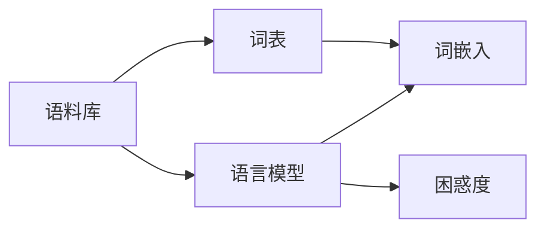

# 语言模型 原理与代码实例讲解

作者：禅与计算机程序设计艺术 / Zen and the Art of Computer Programming

## 1. 背景介绍

### 1.1 问题的由来

随着人工智能技术的飞速发展,自然语言处理(NLP)领域取得了巨大的突破。语言模型作为NLP的核心技术之一,在机器翻译、情感分析、文本生成等任务中发挥着至关重要的作用。然而,语言模型的原理和实现对于很多初学者来说仍然是一个难点。本文旨在通过深入浅出的讲解和代码实例,帮助读者全面理解语言模型的原理和应用。

### 1.2 研究现状

目前,语言模型的研究主要集中在以下几个方面:

1. 基于统计的语言模型,如N-gram模型。这类模型通过统计文本中词语的出现频率,计算词语序列的概率。

2. 基于神经网络的语言模型,如RNN、LSTM、Transformer等。这类模型利用神经网络强大的特征学习能力,从大规模语料中学习词语的分布式表示,捕捉词语之间的长距离依赖关系。

3. 预训练语言模型,如BERT、GPT等。这类模型在海量无标注语料上进行预训练,学习通用的语言表示,再针对特定任务进行微调,取得了显著的效果提升。

4. 多语言语言模型,旨在构建一个通用的语言模型,可以处理多种语言,实现跨语言的迁移学习。

### 1.3 研究意义

语言模型的研究具有重要的理论意义和实践价值:

1. 推动NLP技术的发展。语言模型是NLP的基础,其进展直接影响着NLP各个任务的性能表现。

2. 促进人机交互的自然化。语言模型可以帮助计算机更好地理解和生成自然语言,实现更加智能、人性化的人机对话系统。

3. 挖掘语言规律,加深对语言本质的认识。通过语言模型,我们可以发现语言的内在规律和统计特性,加深对语言认知和习得的理解。

### 1.4 本文结构

本文将从以下几个方面展开论述:

1. 语言模型的核心概念与联系
2. 语言模型的核心算法原理与具体操作步骤
3. 语言模型涉及的数学模型和公式,并给出详细讲解和举例说明
4. 语言模型的代码实例和详细解释说明
5. 语言模型的实际应用场景
6. 语言模型相关的工具和学习资源推荐
7. 语言模型的未来发展趋势与面临的挑战
8. 常见问题与解答

## 2. 核心概念与联系

在正式介绍语言模型之前,我们首先需要了解几个核心概念:

- 语料库(Corpus):一个大规模的文本数据集合,用于语言模型的训练和评估。
- 词表(Vocabulary):语料库中所有唯一词语的集合。
- 词嵌入(Word Embedding):将词语映射为实值向量的方法,使得语义相似的词语具有相近的向量表示。
- 困惑度(Perplexity):衡量语言模型性能的指标,表示模型对测试集的预测能力,越低越好。

这些概念之间的联系可以用下图表示:



语料库经过预处理生成词表,词表中的词语通过词嵌入映射为向量。语言模型在语料库上训练,学习词语的概率分布,并用困惑度来评估模型的性能。

## 3. 核心算法原理 & 具体操作步骤

### 3.1 算法原理概述

语言模型的核心思想是,利用前文信息预测下一个词出现的概率。形式化地,给定一个词语序列 $w_1, w_2, \dots, w_T$,语言模型的目标是计算条件概率:

$$P(w_1, w_2, \dots, w_T) = \prod_{t=1}^T P(w_t | w_1, \dots, w_{t-1})$$

其中,$P(w_t | w_1, \dots, w_{t-1})$ 表示在给定前 $t-1$ 个词的情况下,第 $t$ 个词是 $w_t$ 的概率。

### 3.2 算法步骤详解

以N-gram语言模型为例,其基本步骤如下:

1. 语料预处理:对原始语料进行清洗、分词、去除停用词等操作,得到规范化的文本。

2. 构建词表:统计语料中所有唯一词语,生成词表。

3. 计算N-gram频次:统计语料中长度为N的词语片段(N-gram)的出现频次。例如,bigram统计连续两个词的频次。

4. 计算条件概率:根据N-gram频次,计算每个词在给定前 $N-1$ 个词的情况下出现的条件概率。例如,对于bigram模型:

$$P(w_t | w_{t-1}) = \frac{Count(w_{t-1}, w_t)}{Count(w_{t-1})}$$

其中,$Count(w_{t-1}, w_t)$ 表示 $w_{t-1}$ 和 $w_t$ 连续出现的次数,$Count(w_{t-1})$ 表示 $w_{t-1}$ 出现的次数。

5. 平滑处理:由于数据稀疏性,一些N-gram可能没有出现在训练语料中,导致概率为0。平滑方法(如拉普拉斯平滑)可以缓解这个问题。

6. 模型评估:在测试集上计算语言模型的困惑度,评估模型性能。

### 3.3 算法优缺点

N-gram语言模型的优点包括:

- 简单易懂,实现方便。
- 在小规模语料上效果不错。
- 可以捕捉局部的词序关系。

缺点包括:

- 难以处理长距离依赖。
- 随着N的增大,模型参数急剧增多,数据稀疏问题严重。
- 忽略了词语的语义信息。

### 3.4 算法应用领域

N-gram语言模型广泛应用于NLP的各个任务,如:

- 文本生成:根据前文预测下一个词,生成连贯的文本。
- 拼写纠错:通过计算词序列的概率,检测和纠正拼写错误。
- 语音识别:在候选的识别结果中,选择语言模型概率最高的序列作为最终结果。
- 机器翻译:在解码阶段,利用目标语言的语言模型选择最优译文。

## 4. 数学模型和公式 & 详细讲解 & 举例说明

### 4.1 数学模型构建

N-gram语言模型的数学描述如下:

对于一个长度为 $T$ 的词语序列 $W=(w_1,w_2,\dots,w_T)$,其概率可以表示为:

$$P(W)=P(w_1,w_2,\dots,w_T)=\prod_{t=1}^T P(w_t|w_1,\dots,w_{t-1})$$

根据马尔可夫假设,当前词只与前面的 $N-1$ 个词相关,即:

$$P(w_t|w_1,\dots,w_{t-1}) \approx P(w_t|w_{t-N+1},\dots,w_{t-1})$$

因此,N-gram模型可以表示为:

$$P(W) \approx \prod_{t=1}^T P(w_t|w_{t-N+1},\dots,w_{t-1})$$

### 4.2 公式推导过程

以bigram模型为例,其条件概率计算公式为:

$$P(w_t|w_{t-1})=\frac{P(w_{t-1},w_t)}{P(w_{t-1})}$$

根据大数定律,当语料足够大时,可以用频次估计概率:

$$P(w_t|w_{t-1}) \approx \frac{Count(w_{t-1},w_t)}{Count(w_{t-1})}$$

其中,$Count(w_{t-1},w_t)$ 表示 $w_{t-1}$ 和 $w_t$ 连续出现的次数,$Count(w_{t-1})$ 表示 $w_{t-1}$ 出现的次数。

### 4.3 案例分析与讲解

举个例子,假设我们有如下一个简单的语料库:

```
<s> I like natural language processing </s>
<s> I like machine learning </s>
<s> Natural language processing is interesting </s>
```

其中,`<s>`和`</s>`分别表示句子的开始和结束。

对于bigram模型,我们可以统计出如下的频次:

- Count(I, like) = 2
- Count(like, natural) = 1
- Count(natural, language) = 2
- ...

然后,我们可以计算条件概率,例如:

$$P(like|I) = \frac{Count(I, like)}{Count(I)} = \frac{2}{2} = 1$$

$$P(natural|like) = \frac{Count(like, natural)}{Count(like)} = \frac{1}{2} = 0.5$$

有了这些条件概率,我们就可以计算一个句子的概率,例如:

$$P(<s> I like natural language processing </s>) \\ = P(I|<s>) \times P(like|I) \times P(natural|like) \times \dots \\ = 0.67 \times 1 \times 0.5 \times \dots$$

### 4.4 常见问题解答

Q: N-gram模型中的N应该取多大?

A: N的选择需要权衡模型复杂度和数据稀疏性。N越大,模型考虑的上下文信息越多,但是参数也越多,需要更大的训练语料。实践中,N通常取2~5。

Q: 如何处理未登录词(OOV)?

A: 对于词表之外的词,可以将其映射到一个特殊的 `<UNK>` 符号,统一建模。在应用阶段,可以利用一些启发式规则(如字符相似度)来猜测未登录词的意思。

Q: N-gram模型能否捕捉长距离依赖?

A: N-gram模型只考虑了局部的词序关系,难以捕捉长距离依赖。为了解决这个问题,研究者提出了Cache模型、Topic模型等扩展方法。此外,基于神经网络的语言模型(如RNN)能够更好地建模长距离依赖。

## 5. 项目实践：代码实例和详细解释说明

下面我们通过Python代码来实现一个简单的bigram语言模型。

### 5.1 开发环境搭建

首先,我们需要安装Python和NLTK库。

```bash
pip install nltk
```

### 5.2 源代码详细实现

```python
import nltk
from nltk.util import ngrams
from collections import defaultdict

class BigramLanguageModel:
    def __init__(self):
        self.bigram_counts = defaultdict(int)
        self.unigram_counts = defaultdict(int)
    
    def train(self, corpus):
        for sentence in corpus:
            sentence = ['<s>'] + sentence + ['</s>']
            for w1, w2 in ngrams(sentence, 2):
                self.bigram_counts[(w1, w2)] += 1
                self.unigram_counts[w1] += 1
    
    def score(self, sentence):
        score = 0
        for w1, w2 in ngrams(sentence, 2):
            if self.unigram_counts[w1] == 0:
                score += float('-inf')
            else:
                score += np.log(self.bigram_counts[(w1, w2)] / self.unigram_counts[w1])
        return score
```

### 5.3 代码解读与分析

- 在 `__init__` 方法中,我们初始化了两个默认字典 `bigram_counts` 和 `unigram_counts`,分别用于存储bigram和unigram的频次。
- 在 `train` 方法中,我们遍历语料库中的每个句子,在句子的开头和结尾添加特殊符号 `<s>` 和 `</s>`,然后统计bigram和unigram的频次。
- 在 `score` 方法中,我们对给定的句子计算其在bigram模型下的对数概率得分。如果某个bigram没有出现在训练语料中,我们将其概率设为0(对数概率为负无穷)。

### 5.4 运行结果展示

我们在示例语料上训练bigram模型,并计算一个新句子的得分:

```python
corpus = [
    ['I', 'like', 'natural', 'language', 'processing'],
    ['I', 'like', 'machine', 'learning'],
    ['Natural', 'language', 'processing', 'is', 'interesting']