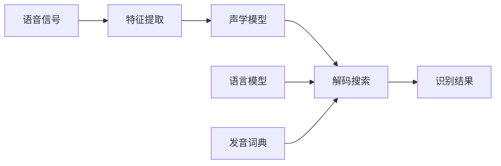

# 语音识别原理与代码实战案例讲解

## 1. 背景介绍
### 1.1 问题的由来
语音识别技术作为人工智能领域的重要分支,在现代社会中扮演着越来越重要的角色。随着智能设备的普及,语音交互已经成为人们日常生活中不可或缺的一部分。无论是智能音箱、手机语音助手,还是车载语音系统,语音识别技术都在其中发挥着关键作用。然而,实现高精度、实时性强的语音识别并非易事,这需要深入理解语音识别的原理,并运用先进的算法和模型来解决实际问题。

### 1.2 研究现状
近年来,语音识别技术取得了长足的进步。深度学习的兴起为语音识别带来了革命性的变革,基于深度神经网络的声学模型和语言模型极大地提升了语音识别的准确率。此外,端到端的语音识别方法如 CTC、Attention 等也受到了广泛关注。科技巨头如谷歌、微软、亚马逊等都在语音识别领域投入了大量资源,推动了技术的发展。但是,语音识别在噪声环境、口音适应、语义理解等方面仍然存在挑战。

### 1.3 研究意义
语音识别技术的研究具有重要的理论意义和实践价值。从理论角度来看,语音识别涉及声学、语音学、自然语言处理等多个学科,是人工智能的重要研究方向之一。深入研究语音识别,有助于推动人工智能的发展,加深对人类语言认知机制的理解。从实践角度来看,语音识别在智能人机交互、医疗辅助、教育培训、智能客服等领域都有广阔的应用前景。提高语音识别的性能,将极大地改善用户体验,提升工作效率。

### 1.4 本文结构
本文将全面探讨语音识别的原理与实践。首先,我们将介绍语音识别的核心概念与技术路线。然后,重点讲解语音识别的核心算法,包括声学模型、语言模型、解码搜索等,并给出详细的数学推导和代码实现。接着,我们将讨论语音识别在实际应用中的场景和挑战。最后,总结语音识别的发展趋势,展望未来的研究方向。通过本文的学习,读者将对语音识别有全面的认识,并掌握实践中的关键技术。

## 2. 核心概念与联系

语音识别的目标是将语音信号转化为相应的文本序列。其核心概念包括:

- 语音信号(Speech Signal):携带语言信息的声波,是语音识别的输入。
- 声学特征(Acoustic Feature):从语音信号中提取的特征向量,常用的有MFCC、Fbank等。
- 声学模型(Acoustic Model):用于将声学特征映射到发音状态的概率模型,一般采用HMM-GMM或DNN-HMM。  
- 语言模型(Language Model):刻画语言中词与词之间的关系,为识别提供语言约束。常见的有N-gram、RNN等。
- 发音词典(Pronunciation Lexicon):建立词与发音之间的映射关系。
- 解码搜索(Decoding):在声学模型和语言模型的约束下,寻找最优的文本假设。常用的有Viterbi、Beam Search等。

下图展示了语音识别的基本流程:

## 3. 核心算法原理 & 具体操作步骤
### 3.1 算法原理概述
语音识别的核心是如何将连续的语音信号转化为离散的文本序列。传统的语音识别系统一般由声学模型、语言模型和解码器三部分组成。其中,声学模型负责将语音特征映射到发音状态的概率;语言模型则提供不同词序列的先验概率;解码器在两个模型的约束下搜索最优的文本假设。

### 3.2 算法步骤详解
1. 特征提取
首先需要对语音信号进行预处理和特征提取。常用的特征有Mel频率倒谱系数(MFCC)和Fbank特征。提取步骤如下:
- 预加重:对语音信号进行高通滤波,增强高频部分。
- 分帧:将语音信号划分为帧,每帧一般为25ms,帧移为10ms。
- 加窗:对每帧语音加汉明窗,减少频谱泄漏。
- FFT:对每帧语音进行快速傅里叶变换,得到频谱。
- Mel滤波器:将频谱通过Mel滤波器组,得到Mel频谱。
- 取对数:对Mel频谱取对数,得到对数Mel频谱。
- DCT:对对数Mel频谱进行离散余弦变换,得到MFCC特征。

2. 声学模型训练
声学模型的作用是估计特征向量到发音状态的条件概率。传统的声学模型为HMM-GMM,即用隐马尔可夫模型(HMM)刻画语音的时间变化,用高斯混合模型(GMM)建模每个状态的发射概率。HMM-GMM的训练步骤如下:
- 初始化:随机初始化模型参数。
- E步:根据当前模型参数,计算每个样本在每个状态的后验概率。
- M步:根据E步的结果,更新模型参数,包括状态转移概率和发射概率。
- 重复E步和M步,直到模型收敛。

近年来,DNN-HMM模型逐渐取代了GMM-HMM,其将神经网络用于发射概率的建模,大幅提升了声学模型的性能。DNN-HMM的训练步骤为:
- 构建神经网络:一般采用多层感知机(MLP)或循环神经网络(RNN)。
- 训练神经网络:以交叉熵为损失函数,用BP算法训练网络参数。
- 用训练好的神经网络计算每帧语音的状态后验概率,作为HMM的发射概率。
- 进行HMM的 Baum-Welch 训练,优化状态转移概率。

3. 语言模型训练
语言模型用于刻画不同词序列出现的概率。常见的语言模型有N-gram和RNN语言模型。以N-gram为例,其训练步骤为:
- 对训练语料进行预处理,如分词、去停用词等。
- 统计N-gram的频次,一般取N=3。
- 用最大似然估计或Kneser-Ney平滑等方法,估计N-gram的条件概率。

4. 解码搜索
解码的任务是在声学模型和语言模型的约束下,寻找概率最大的文本假设。常用的解码算法有Viterbi和Beam Search。以Viterbi算法为例,其步骤为:
- 初始化:为每个状态设置初始概率。
- 递推:对于每一帧语音,计算到达每个状态的最大概率,并记录最佳前驱状态。
- 终止:在最后一帧,找到概率最大的状态。
- 回溯:从最佳终止状态,沿着最佳前驱状态回溯,得到最优状态序列。
- 根据状态到词的映射,得到最终的识别结果。

### 3.3 算法优缺点
HMM-GMM 声学模型的优点是可解释性强,训练速度快,但其对噪声和发音变化的鲁棒性较差。DNN-HMM 克服了 GMM 的不足,在复杂环境下有更好的表现,但需要更多的训练数据和计算资源。

N-gram 语言模型的优点是简单高效,易于实现,但其难以刻画长距离依赖。RNN 语言模型能够建模任意长度的历史信息,但训练难度大,易出现梯度消失等问题。

Viterbi 解码的优点是能够得到全局最优解,但在词图很大时计算开销高。Beam Search 通过设置束宽,在解码效率和识别率间进行折中。

### 3.4 算法应用领域
语音识别技术在智能人机交互、语音文档处理、语音内容检索等领域有广泛应用。典型的应用场景包括:

- 智能音箱:通过语音识别,用户可以用语音控制音箱,如播放音乐、查询天气等。
- 语音输入法:通过语音识别将用户的语音转化为文字,提高输入效率。
- 语音质检:对呼叫中心等场景的语音进行识别和分析,实现质量检测和风险提示。
- 会议记录:对会议语音进行识别,自动生成会议纪要,提高工作效率。
- 医疗辅助:医生的语音病历可通过语音识别自动转写为文字,节省医生时间。

## 4. 数学模型和公式 & 详细讲解 & 举例说明
### 4.1 数学模型构建
语音识别可以表示为如下的最大后验概率(MAP)问题:

$\hat{W} = \arg\max_{W} P(W|O)$

其中,$W$为词序列,$O$为语音特征序列。根据Bayes公式,上式可以转化为:

$\hat{W} = \arg\max_{W} \frac{P(O|W)P(W)}{P(O)} = \arg\max_{W} P(O|W)P(W)$

$P(O|W)$由声学模型提供,$P(W)$由语言模型提供。

声学模型的核心是隐马尔可夫模型(HMM),其由初始概率$\pi$、转移概率$A$和发射概率$B$三部分组成。形式化定义为:

$\lambda = (\pi, A, B)$

其中,
$\pi = (\pi_1, \pi_2, ..., \pi_N), \pi_i = P(q_1=i)$
$A = (a_{ij}), a_{ij} = P(q_{t+1}=j|q_t=i)$
$B = (b_i(o_t)), b_i(o_t) = P(o_t|q_t=i)$

HMM的三个基本问题:
1. 评估问题:给定模型$\lambda$和观测序列$O$,计算$P(O|\lambda)$。
2. 解码问题:给定模型$\lambda$和观测序列$O$,找到最可能的状态序列$Q$。
3. 学习问题:给定观测序列$O$,估计模型参数$\lambda$。

语言模型用于计算词序列$W$的概率$P(W)$。N-gram模型假设一个词的出现只与前面的N-1个词相关,公式为:

$P(W) = \prod_{i=1}^n P(w_i|w_{i-N+1}^{i-1})$

其中,$w_i$为第$i$个词,$w_{i-N+1}^{i-1}$为$w_i$前面的N-1个词。

### 4.2 公式推导过程
下面以Viterbi算法为例,推导其数学公式。

定义$\delta_t(i)$为第$t$帧语音观测到状态$i$的最大概率:

$\delta_t(i) = \max_{q_1,q_2,...,q_{t-1}} P(q_1,q_2,...,q_t=i,o_1,o_2,...,o_t|\lambda)$

通过递推可得:

$\delta_{t+1}(j) = [\max_i \delta_t(i) a_{ij}] \cdot b_j(o_{t+1})$

同时定义$\psi_t(i)$为第$t$帧到达状态$i$的最佳前驱状态:

$\psi_t(i) = \arg\max_j [\delta_{t-1}(j) a_{ji}]$

算法步骤为:
1. 初始化:
$\delta_1(i) = \pi_i b_i(o_1), i=1,2,...,N$
$\psi_1(i) = 0, i=1,2,...,N$

2. 递推:对$t=2,3,...,T$
$\delta_t(j) = \max_i [\delta_{t-1}(i) a_{ij}] \cdot b_j(o_t), j=1,2,...,N$
$\psi_t(j) = \arg\max_i [\delta_{t-1}(i) a_{ij}], j=1,2,...,N$

3. 终止:
$P^* = \max_i \delta_T(i)$
$q_T^* = \arg\max_i \delta_T(i)$

4. 回溯