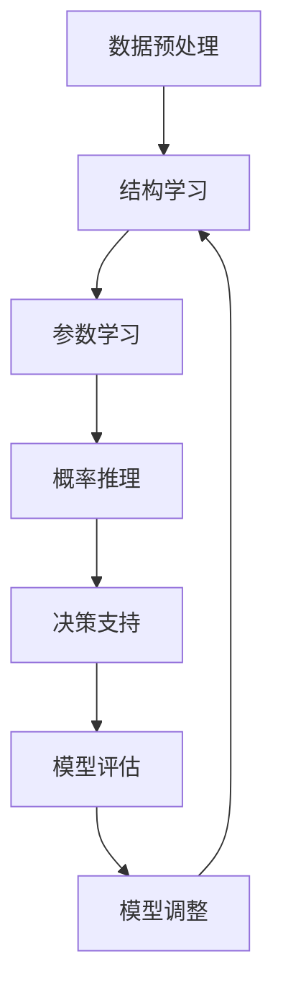

# 贝叶斯网络 (Bayesian Networks) 原理与代码实例讲解

## 1. 背景介绍

### 1.1 问题的由来

在现实世界中,我们经常面临着需要根据有限的信息做出决策的情况。例如,医生需要根据病人的症状和检查结果来诊断疾病;气象学家需要根据各种气象数据来预测天气;金融分析师需要根据市场数据来评估投资风险等。这些决策过程涉及到不确定性和复杂性,传统的确定性方法往往难以很好地处理这些问题。

贝叶斯网络(Bayesian Networks)作为一种基于概率论的图形模型,为表示和推理不确定知识提供了一种强大的工具。它能够有效地捕捉变量之间的相关性,并利用有限的观测数据进行推理和决策。

### 1.2 研究现状

贝叶斯网络的理论基础可以追溯到18世纪,当时托马斯·贝叶斯提出了著名的贝叶斯定理。20世纪80年代,贝叶斯网络作为一种概率图模型被正式引入,并在人工智能、机器学习、决策理论等领域得到广泛应用。

近年来,随着大数据时代的到来,贝叶斯网络在数据挖掘、模式识别、风险分析等领域发挥了越来越重要的作用。许多著名的公司和组织,如微软、谷歌、IBM等,都在积极研究和应用贝叶斯网络技术。

### 1.3 研究意义

贝叶斯网络具有以下重要意义:

1. **不确定性建模**: 贝叶斯网络能够有效地表示和推理不确定知识,为处理复杂的现实问题提供了强有力的工具。

2. **因果关系发现**: 贝叶斯网络可以从数据中发现变量之间的因果关系,为深入理解问题提供了新的视角。

3. **决策支持**: 贝叶斯网络可以用于辅助决策,通过对证据进行推理,为决策者提供有价值的建议。

4. **数据融合**: 贝叶斯网络能够融合来自不同来源的信息,从而提高推理的准确性和可靠性。

5. **可解释性**: 贝叶斯网络的图形结构和概率语义使得模型具有很好的可解释性,有助于人们理解和信任模型的决策过程。

### 1.4 本文结构

本文将全面介绍贝叶斯网络的基本原理、核心算法、数学模型、代码实现以及实际应用场景。文章结构如下:

- 第2部分介绍贝叶斯网络的核心概念和基本理论。
- 第3部分详细阐述贝叶斯网络的核心算法原理和具体操作步骤。
- 第4部分推导贝叶斯网络的数学模型和公式,并通过案例进行讲解和分析。
- 第5部分提供贝叶斯网络的代码实例,并对关键代码进行解读和说明。
- 第6部分介绍贝叶斯网络在实际应用中的场景和案例。
- 第7部分推荐相关的学习资源、开发工具和论文等。
- 第8部分总结贝叶斯网络的研究成果、发展趋势和面临的挑战。
- 第9部分是附录,回答一些常见的问题。

## 2. 核心概念与联系

贝叶斯网络(Bayesian Network)是一种基于概率论的图形模型,用于表示和推理不确定知识。它由两个核心组成部分构成:

1. **有向无环图(Directed Acyclic Graph, DAG)**: 用于表示变量之间的条件独立性和因果关系。节点表示随机变量,有向边表示变量之间的依赖关系。

2. **条件概率表(Conditional Probability Table, CPT)**: 每个节点都与一个条件概率表相关联,用于量化该节点在给定其父节点取值时的条件概率分布。

贝叶斯网络基于以下核心概念和原理:

1. **贝叶斯定理**: 贝叶斯定理是贝叶斯网络的数学基础,它描述了如何根据先验概率和证据更新后验概率的规则。

2. **d-分离(d-separation)**: 用于判断两个非相邻节点在给定证据条件下是否条件独立。

3. **马尔可夫性质(Markov Property)**: 在给定其父节点的情况下,每个节点与其非后代节点是条件独立的。

4. **概率推理**: 贝叶斯网络能够进行各种类型的概率推理,包括预测推理(prediction)、诊断推理(diagnosis)、intercausal推理等。

5. **结构学习**: 从数据中学习贝叶斯网络的结构,发现变量之间的因果关系。

6. **参数学习**: 从数据中估计贝叶斯网络中每个节点的条件概率表。

贝叶斯网络将图形模型、概率论和计算机科学有机结合,为表示和推理不确定知识提供了一种统一的框架。它在人工智能、机器学习、决策理论等领域有着广泛的应用。

## 3. 核心算法原理 & 具体操作步骤

### 3.1 算法原理概述

贝叶斯网络的核心算法包括两个主要部分:概率推理算法和结构学习算法。

**概率推理算法**用于在给定贝叶斯网络结构和条件概率表的情况下,根据观测到的证据计算感兴趣变量的后验概率分布。常见的概率推理算法包括:

1. **枚举法(Enumeration)**: 通过枚举所有可能的联合分布来计算后验概率,计算复杂度较高。

2. **变量消元法(Variable Elimination)**: 通过有效地消去无关变量来降低计算复杂度。

3. **信念传播算法(Belief Propagation)**: 在树形或多重连通网络上高效地计算后验概率,包括基于聚集的信念传播和基于因子的信念传播。

**结构学习算法**用于从数据中学习贝叶斯网络的结构,发现变量之间的条件独立性和因果关系。常见的结构学习算法包括:

1. **约束基算法(Constraint-based Algorithms)**: 基于条件独立性测试来构建网络结构,如PC算法、IC算法等。

2. **评分基算法(Score-based Algorithms)**: 通过优化某种评分函数来搜索最优网络结构,如Hill-Climbing算法、贪婪搜索算法等。

3. **混合算法(Hybrid Algorithms)**: 结合约束基算法和评分基算法的优点,如Max-Min Hill-Climbing算法。

### 3.2 算法步骤详解

以下是贝叶斯网络的一般工作流程:

1. **数据预处理**: 对原始数据进行清洗、规范化等预处理,确保数据质量。

2. **结构学习**: 使用结构学习算法从数据中学习贝叶斯网络的结构,发现变量之间的条件独立性和因果关系。

3. **参数学习**: 根据学习到的网络结构和数据,使用最大似然估计或贝叶斯估计等方法估计每个节点的条件概率表。

4. **概率推理**: 在给定证据的情况下,使用概率推理算法计算感兴趣变量的后验概率分布。

5. **决策支持**: 根据推理结果,为决策者提供建议或预测。

6. **模型评估**: 使用适当的评估指标(如对数似然、预测精度等)评估模型的性能,并根据需要进行模型调整或优化。

### 3.3 算法优缺点

**优点**:

1. **有效表示不确定知识**: 贝叶斯网络能够有效地表示和推理不确定知识,处理复杂的现实问题。

2. **发现因果关系**: 通过结构学习算法,贝叶斯网络可以从数据中发现变量之间的因果关系。

3. **模块化和可解释性**: 贝叶斯网络的图形结构和概率语义使得模型具有很好的模块化和可解释性。

4. **数据融合能力**: 贝叶斯网络能够融合来自不同来源的信息,提高推理的准确性和可靠性。

5. **处理缺失数据**: 贝叶斯网络能够很好地处理缺失数据,通过概率推理来估计缺失值。

**缺点**:

1. **计算复杂度高**: 在复杂的网络结构和大量数据的情况下,概率推理和结构学习的计算复杂度可能很高。

2. **数据需求量大**: 学习准确的贝叶斯网络通常需要大量的训练数据,否则可能会导致过拟合或欠拟合。

3. **因果关系假设**: 贝叶斯网络假设变量之间存在因果关系,但在某些情况下这可能不成立。

4. **离散变量限制**: 传统的贝叶斯网络主要针对离散变量,对于连续变量需要进行离散化处理。

5. **条件独立性假设**: 贝叶斯网络假设每个节点在给定其父节点的情况下与其非后代节点条件独立,这在某些情况下可能不成立。

### 3.4 算法应用领域

贝叶斯网络在许多领域都有广泛的应用,包括但不限于:

1. **医疗诊断**: 利用贝叶斯网络对疾病症状和检查结果进行推理,辅助医生进行诊断和决策。

2. **风险分析**: 在金融、保险等领域,使用贝叶斯网络评估风险并做出相应的决策。

3. **故障诊断**: 在工业系统和设备维护中,使用贝叶斯网络进行故障诊断和预防性维护。

4. **信息检索**: 在文本挖掘和信息检索领域,利用贝叶斯网络对文档进行分类和聚类。

5. **生物信息学**: 在基因调控网络、蛋白质结构预测等生物信息学领域,贝叶斯网络被广泛应用。

6. **计算机视觉**: 在图像识别、目标跟踪等计算机视觉任务中,贝叶斯网络可以融合多种信息源。

7. **自然语言处理**: 在语音识别、机器翻译等自然语言处理任务中,贝叶斯网络可以建模语言的不确定性。

8. **决策支持系统**: 贝叶斯网络可以作为决策支持系统的核心组件,为决策者提供有价值的建议。

总的来说,贝叶斯网络在需要处理不确定性和复杂性的领域都有着广泛的应用前景。

## 4. 数学模型和公式 & 详细讲解 & 举例说明

### 4.1 数学模型构建

贝叶斯网络的数学模型基于贝叶斯定理和图形模型理论。给定一个贝叶斯网络 $\mathcal{B} = (G, \Theta)$,其中 $G$ 是一个有向无环图,表示变量之间的条件独立性和因果关系; $\Theta$ 是每个节点的条件概率表的集合。

对于任意一个节点 $X_i$,它的条件概率分布可以表示为:

$$P(X_i | \text{Parents}(X_i)) = \theta_{X_i|\text{Parents}(X_i)}$$

其中 $\text{Parents}(X_i)$ 表示节点 $X_i$ 的父节点集合。

根据链式法则和贝叶斯网络的马尔可夫性质,整个网络的联合概率分布可以factorized为:

$$P(X_1, X_2, \dots, X_n) = \prod_{i=1}^n P(X_i | \text{Parents}(X_i))$$

这个factorized形式使得我们可以有效地表示和计算复杂的联合概率分布,而不需要指数级的存储空间。

### 4.2 公式推导过程

**贝叶斯定理**是