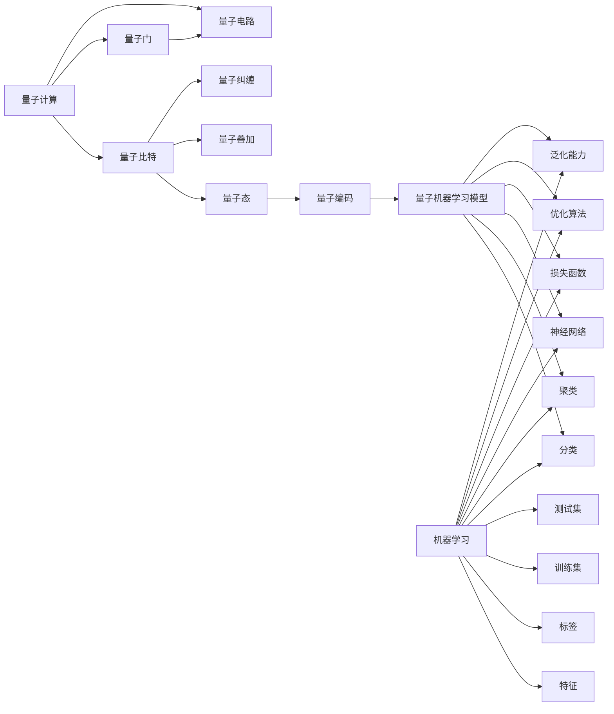

# 量子机器学习原理与代码实战案例讲解

关键词：量子计算、机器学习、量子机器学习、量子算法、量子电路、量子神经网络、量子优化

## 1. 背景介绍
### 1.1  问题的由来
随着大数据时代的到来和人工智能技术的飞速发展，传统的机器学习算法在处理海量高维数据时遇到了瓶颈。量子计算作为一种全新的计算范式，具有并行性强、计算效率高等独特优势，为破解传统机器学习算法的困境提供了新的思路。将量子计算与机器学习相结合，诞生了一门崭新的交叉学科——量子机器学习。

### 1.2  研究现状
近年来，量子机器学习领域涌现出许多令人瞩目的研究成果。谷歌、IBM、微软等科技巨头纷纷投入大量资源，开展量子机器学习的理论和实践探索。一些经典的机器学习算法，如支持向量机、主成分分析、聚类算法等，都被成功移植到了量子计算平台上。量子机器学习在图像识别、自然语言处理、药物发现等领域展现出了广阔的应用前景。

### 1.3  研究意义
量子机器学习是量子计算与人工智能领域交叉融合的产物，代表了未来计算技术的重要发展方向。深入研究量子机器学习的理论基础和实践应用，对于推动人工智能的进一步发展、解决传统机器学习算法的局限性、开拓量子计算的应用场景等方面都具有重要意义。同时，量子机器学习作为一个前沿交叉学科，也为计算机科学、物理学等多个学科领域的交流融合提供了新的契机。

### 1.4  本文结构
本文将全面介绍量子机器学习的原理和代码实战。第2部分介绍量子机器学习涉及的核心概念；第3部分重点阐述量子机器学习的核心算法原理和操作步骤；第4部分从数学角度对量子机器学习的模型和公式进行详细推导和举例说明；第5部分通过代码实例演示量子机器学习算法的具体实现；第6部分探讨量子机器学习的实际应用场景；第7部分推荐量子机器学习的学习资源和开发工具；第8部分总结全文并展望量子机器学习的未来发展趋势和挑战；第9部分列举了一些常见问题解答。

## 2. 核心概念与联系
量子机器学习涉及量子计算和机器学习两大领域的核心概念。

在量子计算方面，需要理解的基本概念包括：量子比特（Qubit）、量子叠加态、量子纠缠、量子门（Quantum Gate）、量子电路（Quantum Circuit）等。量子比特是量子计算的基本单位，与经典比特不同，它可以同时处于 0 和 1 两个状态的叠加态。多个量子比特之间可以形成纠缠，体现量子的非局域关联特性。量子门作用于量子比特，实现各种量子逻辑操作。量子电路由量子门组成，描述了对量子态进行演化的过程。

在机器学习方面，需要了解的概念有：特征（Feature）、标签（Label）、训练集（Training Set）、测试集（Test Set）、分类（Classification）、聚类（Clustering）、神经网络（Neural Network）、损失函数（Loss Function）、优化算法（Optimization）、泛化能力（Generalization）等。机器学习通过学习数据集中样本的特征，建立映射模型，对新样本进行预测。根据是否需要标签，可分为监督学习、无监督学习和强化学习。神经网络是一种常用的机器学习模型，通过多层感知机的连接实现特征学习。

量子机器学习将量子计算的优势与机器学习的建模能力相结合。通过将经典数据编码到量子态，利用量子并行性加速训练和推理过程，从而构建量子机器学习模型。量子机器学习可以显著提升经典机器学习的性能，攻克高维数据、非凸优化等难题。同时，量子机器学习也为开发新型量子算法和量子应用提供了思路。

下图展示了量子机器学习中的核心概念之间的联系：

## 3. 核心算法原理 & 具体操作步骤
### 3.1  算法原理概述
量子机器学习的核心是利用量子计算的优势来加速机器学习算法的训练和推理过程。通过将经典数据编码到量子态，构建量子电路模型，利用量子并行性和量子干涉等特性，实现对高维数据的高效处理和对复杂模型的快速优化。

### 3.2  算法步骤详解
量子机器学习算法的一般步骤如下：

1. 数据预处理：对原始数据进行清洗、归一化、特征选择等预处理操作，将其转化为适合量子编码的形式。

2. 量子编码：将预处理后的经典数据编码到量子态。常见的编码方式有基于振幅的编码和基于相位的编码。

3. 构建量子电路：根据具体的量子机器学习模型，设计相应的量子电路。量子电路由量子门组成，实现对量子态的演化操作。

4. 模型训练：通过优化损失函数，调整量子电路中的参数，使模型在训练集上的预测结果与真实标签尽可能接近。常用的量子优化算法有量子梯度下降、量子变分法等。

5. 模型评估：在测试集上评估训练好的量子机器学习模型的性能，计算准确率、召回率、F1值等评价指标。

6. 模型应用：将训练好的量子机器学习模型部署到实际应用场景中，对新样本进行预测和决策。

### 3.3  算法优缺点
量子机器学习算法的优点包括：

- 高效处理高维数据：量子并行性使得量子机器学习能够高效处理维度灾难问题。
- 加速训练和推理：量子干涉和量子纠缠可以加速梯度计算和模型收敛。
- 强大的表示能力：量子态空间的维度呈指数级增长，具有强大的特征表示能力。

量子机器学习算法的缺点包括：

- 量子硬件的限制：目前量子计算机的规模和稳定性还有待提高，限制了量子机器学习的实际应用。
- 量子编码的难度：将经典数据有效地编码到量子态是一个难题，编码效率直接影响算法性能。
- 量子噪声的影响：量子系统易受环境噪声干扰，需要开发量子纠错技术来保证算法的鲁棒性。

### 3.4  算法应用领域
量子机器学习算法在以下领域具有广阔的应用前景：

- 量子数据压缩：利用量子态的高维特性，实现对大规模数据的高效压缩和存储。
- 量子特征提取：通过量子电路实现对数据的特征提取和降维，提高后续学习的效率。
- 量子分类与聚类：利用量子测量和量子距离度量，实现对样本的高效分类和聚类。
- 量子生成模型：通过量子电路生成逼真的合成数据，应用于图像生成、药物设计等任务。
- 量子强化学习：利用量子并行性加速状态空间的搜索，实现对复杂决策问题的求解。

## 4. 数学模型和公式 & 详细讲解 & 举例说明
### 4.1  数学模型构建
量子机器学习的数学模型建立在量子力学的基础之上。量子态用希尔伯特空间中的向量来表示，量子门用酉矩阵来描述。

给定一个 $n$ 个量子比特的量子态 $|\psi\rangle$，它可以表示为基态的线性组合：

$$|\psi\rangle = \sum_{i=0}^{2^n-1} \alpha_i |i\rangle$$

其中，$|i\rangle$ 表示第 $i$ 个基态，$\alpha_i$ 为对应的复数振幅，满足归一化条件：

$$\sum_{i=0}^{2^n-1} |\alpha_i|^2 = 1$$

一个量子门 $U$ 作用在量子态 $|\psi\rangle$ 上，得到新的量子态 $|\psi'\rangle$：

$$|\psi'\rangle = U|\psi\rangle$$

其中，$U$ 是一个 $2^n \times 2^n$ 的酉矩阵，满足 $UU^\dagger=I$。

量子电路由多个量子门串联而成，对输入的量子态进行一系列的线性变换。设电路包含 $m$ 个量子门 $U_1, U_2, \dots, U_m$，则电路的作用可以表示为：

$$|\psi_{\text{out}}\rangle = U_m \cdots U_2 U_1 |\psi_{\text{in}}\rangle$$

其中，$|\psi_{\text{in}}\rangle$ 和 $|\psi_{\text{out}}\rangle$ 分别表示电路的输入态和输出态。

### 4.2  公式推导过程
以量子支持向量机（QSVM）为例，说明量子机器学习算法的公式推导过程。

经典支持向量机的目标是找到一个超平面，使得不同类别的样本能够被最大间隔地分开。假设训练集为 $\{(\mathbf{x}_i, y_i)\}_{i=1}^N$，其中 $\mathbf{x}_i \in \mathbb{R}^d$ 为第 $i$ 个样本的特征向量，$y_i \in \{-1, +1\}$ 为对应的二元类别标签。SVM 的优化目标可以表示为：

$$\min_{\mathbf{w}, b} \frac{1}{2} \|\mathbf{w}\|^2 \quad s.t. \quad y_i(\mathbf{w}^T\mathbf{x}_i+b) \geq 1, \forall i$$

其中，$\mathbf{w}$ 和 $b$ 分别表示超平面的法向量和偏置项。

在量子支持向量机中，将经典数据编码到量子态，构建量子电路来实现特征空间的变换和分类决策。设编码后的量子态为 $|\psi_i\rangle$，量子电路的参数为 $\theta$，则 QSVM 的优化目标可以写为：

$$\min_{\theta} \frac{1}{2} \|\mathbf{w}(\theta)\|^2 \quad s.t. \quad y_i(\langle \psi_i| U^\dagger(\theta) M U(\theta) |\psi_i\rangle) \geq 1, \forall i$$

其中，$U(\theta)$ 表示参数化的量子电路，$M$ 为测量算子，$\mathbf{w}(\theta)$ 为量子电路输出的决策超平面法向量。

通过引入拉格朗日乘子 $\alpha_i$，可以将上述优化问题转化为对偶问题：

$$\max_{\alpha} \sum_{i=1}^N \alpha_i - \frac{1}{2} \sum_{i,j=1}^N \alpha_i \alpha_j y_i y_j K_{ij} \quad s.t. \quad 0 \leq \alpha_i \leq C, \forall i, \sum_{i=1}^N \alpha_i y_i = 0$$

其中，$K_{ij} = \langle \psi_i| U^\dagger(\theta) M U(\theta) |\psi_j\rangle$ 为量子核函数，$C$ 为正则化参数。

通过求解上述对偶问题，可以得到最优的 $\alpha_i$ 和 $\theta$，从而得到量子支持向量机的决策函数：

$$f(\mathbf{x}) = \text{sign}(\sum_{i=1}^N \alpha_i y_i \langle \p