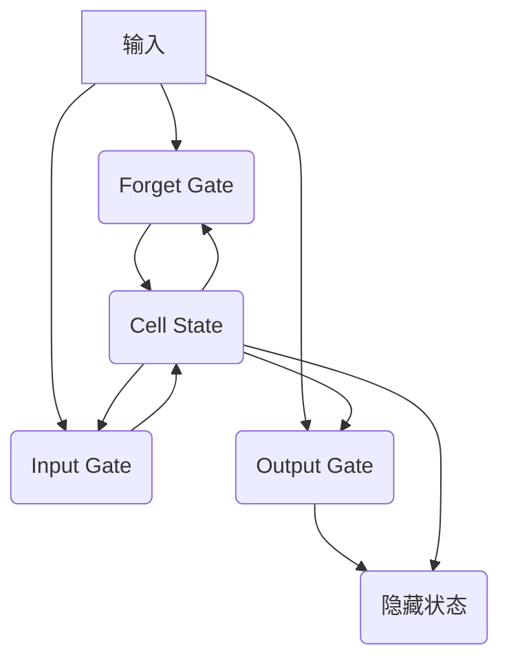

以下是《长短时记忆网络LSTM原理与代码实例讲解》的正文内容:

# 长短时记忆网络LSTM原理与代码实例讲解

## 1. 背景介绍

### 1.1 问题的由来

在处理序列数据时,例如自然语言处理、语音识别、时间序列预测等领域,传统的循环神经网络(RNN)在学习长期依赖关系方面存在着梯度消失和梯度爆炸的问题。这些问题使得RNN难以有效地捕捉序列数据中的长期模式和依赖关系,从而限制了它们在实际应用中的性能。

为了解决这一问题,1997年,Sepp Hochreiter和Jurgen Schmidhuber提出了长短时记忆网络(Long Short-Term Memory,LSTM)。LSTM通过精心设计的门控机制和记忆细胞状态,有效地解决了传统RNN存在的梯度问题,能够更好地捕捉长期依赖关系,从而在各种序列建模任务中取得了卓越的表现。

### 1.2 研究现状

自从LSTM被提出以来,它已经成为处理序列数据的主流方法之一,被广泛应用于自然语言处理、语音识别、机器翻译、时间序列预测等诸多领域。研究人员不断对LSTM进行改进和优化,提出了多种变体模型,如GRU(门控循环单元)、双向LSTM、堆叠LSTM等,以提高其在特定任务中的性能表现。

此外,随着深度学习的快速发展,LSTM也被广泛集成到更加复杂的神经网络架构中,如注意力机制、Transformer模型等,进一步提升了模型的表现力。

### 1.3 研究意义

LSTM是解决序列数据建模问题的关键技术之一,对于提高人工智能系统处理时序数据的能力具有重要意义。深入理解LSTM的原理和实现细节,有助于我们更好地应用和优化这一技术,从而在相关领域取得更好的性能。

此外,LSTM的门控机制和记忆细胞状态的设计思想,也为解决其他机器学习问题提供了新的思路和启发。因此,研究LSTM不仅有助于提高序列建模的性能,也有助于推动整个人工智能领域的发展。

### 1.4 本文结构

本文将全面介绍LSTM的原理、实现细节和应用场景。首先,我们将介绍LSTM的核心概念和与传统RNN的关系;然后详细阐述LSTM的算法原理和具体操作步骤;接着,我们将构建LSTM的数学模型,并推导出相关公式;之后,我们将通过代码实例和详细解释,展示如何实现和应用LSTM;最后,我们将探讨LSTM在实际应用中的场景,介绍相关工具和资源,并总结LSTM的发展趋势和面临的挑战。

## 2. 核心概念与联系

LSTM是一种特殊的RNN(循环神经网络),它通过引入门控机制和记忆细胞状态,有效地解决了传统RNN存在的梯度消失和梯度爆炸问题。

在传统的RNN中,隐藏层的状态由当前输入和上一时刻的隐藏层状态共同决定。然而,在处理长序列时,梯度会在反向传播过程中逐渐衰减或爆炸,导致网络难以捕捉长期依赖关系。

为了解决这一问题,LSTM在隐藏层中引入了一个额外的记忆细胞状态(Cell State),用于保存长期记忆信息。同时,LSTM使用三个门控机制(Forget Gate、Input Gate和Output Gate)来控制记忆细胞状态的更新和输出。这种设计使得LSTM能够有选择地保留、更新或遗忘记忆细胞中的信息,从而有效地捕捉长期依赖关系。

LSTM的核心概念可以用下图来概括:

在这个图中,输入数据首先通过三个门控机制(Forget Gate、Input Gate和Output Gate)进行处理,然后更新记忆细胞状态(Cell State)。记忆细胞状态不仅用于计算当前时刻的隐藏状态(Hidden State),还会传递到下一时刻,参与下一时刻的计算。这种设计使得LSTM能够有效地捕捉长期依赖关系,解决了传统RNN存在的梯度问题。

## 3. 核心算法原理 & 具体操作步骤

### 3.1 算法原理概述

LSTM的核心算法原理可以概括为以下几个步骤:

1. **遗忘门(Forget Gate)**: 决定从上一时刻的记忆细胞状态中遗忘哪些信息。
2. **输入门(Input Gate)**: 决定从当前输入和上一时刻的隐藏状态中获取哪些新信息,并将其与遗忘门的输出结合,更新记忆细胞状态。
3. **记忆细胞状态更新**: 根据遗忘门和输入门的输出,更新记忆细胞状态。
4. **输出门(Output Gate)**: 决定从当前记忆细胞状态和当前输入中输出哪些信息,作为当前时刻的隐藏状态。

这些步骤通过门控机制的设计,使得LSTM能够有选择地保留、更新或遗忘记忆细胞中的信息,从而有效地捕捉长期依赖关系。

### 3.2 算法步骤详解

下面我们将详细介绍LSTM算法的具体操作步骤:

1. **遗忘门(Forget Gate)计算**:

   遗忘门用于决定从上一时刻的记忆细胞状态中遗忘哪些信息。它的计算公式如下:

   $$f_t = \sigma(W_f \cdot [h_{t-1}, x_t] + b_f)$$

   其中:
   - $f_t$ 是遗忘门的输出向量
   - $\sigma$ 是sigmoid激活函数
   - $W_f$ 是遗忘门的权重矩阵
   - $h_{t-1}$ 是上一时刻的隐藏状态向量
   - $x_t$ 是当前时刻的输入向量
   - $b_f$ 是遗忘门的偏置向量

2. **输入门(Input Gate)计算**:

   输入门用于决定从当前输入和上一时刻的隐藏状态中获取哪些新信息。它包括两部分计算:

   (1) 计算输入门的门值向量:

   $$i_t = \sigma(W_i \cdot [h_{t-1}, x_t] + b_i)$$

   其中:
   - $i_t$ 是输入门的门值向量
   - $W_i$ 是输入门的权重矩阵
   - $b_i$ 是输入门的偏置向量

   (2) 计算候选记忆细胞状态向量:

   $$\tilde{C}_t = \tanh(W_C \cdot [h_{t-1}, x_t] + b_C)$$

   其中:
   - $\tilde{C}_t$ 是候选记忆细胞状态向量
   - $\tanh$ 是双曲正切激活函数
   - $W_C$ 是候选记忆细胞状态的权重矩阵
   - $b_C$ 是候选记忆细胞状态的偏置向量

3. **记忆细胞状态更新**:

   根据遗忘门和输入门的输出,更新记忆细胞状态:

   $$C_t = f_t \odot C_{t-1} + i_t \odot \tilde{C}_t$$

   其中:
   - $C_t$ 是当前时刻的记忆细胞状态向量
   - $\odot$ 表示元素wise乘积操作

   这一步骤将遗忘门的输出与上一时刻的记忆细胞状态相乘,以决定遗忘哪些信息;同时,将输入门的输出与候选记忆细胞状态相乘,以决定获取哪些新信息;最后,将这两部分结合,得到当前时刻的记忆细胞状态。

4. **输出门(Output Gate)计算**:

   输出门用于决定从当前记忆细胞状态和当前输入中输出哪些信息,作为当前时刻的隐藏状态。它的计算公式如下:

   $$o_t = \sigma(W_o \cdot [h_{t-1}, x_t] + b_o)$$

   其中:
   - $o_t$ 是输出门的输出向量
   - $W_o$ 是输出门的权重矩阵
   - $b_o$ 是输出门的偏置向量

5. **隐藏状态计算**:

   最后,根据记忆细胞状态和输出门的输出,计算当前时刻的隐藏状态:

   $$h_t = o_t \odot \tanh(C_t)$$

   其中:
   - $h_t$ 是当前时刻的隐藏状态向量

   这一步骤将记忆细胞状态通过$\tanh$激活函数进行缩放,然后与输出门的输出相乘,得到当前时刻的隐藏状态向量。

通过上述步骤,LSTM能够有选择地保留、更新或遗忘记忆细胞中的信息,从而有效地捕捉长期依赖关系。

### 3.3 算法优缺点

**优点**:

1. **解决梯度消失/爆炸问题**: LSTM通过门控机制和记忆细胞状态的设计,有效地解决了传统RNN存在的梯度消失和梯度爆炸问题,能够更好地捕捉长期依赖关系。

2. **强大的建模能力**: LSTM在各种序列建模任务中表现出色,如自然语言处理、语音识别、时间序列预测等,展现了强大的建模能力。

3. **可解释性较好**: LSTM的门控机制和记忆细胞状态的设计思路相对容易理解,有助于提高模型的可解释性。

**缺点**:

1. **计算复杂度较高**: 与传统RNN相比,LSTM的计算过程更加复杂,需要更多的计算资源。

2. **参数较多**: LSTM包含多个门控机制和记忆细胞状态,导致参数数量较多,增加了模型的训练难度。

3. **序列长度限制**:尽管LSTM能够捕捉较长的依赖关系,但在实践中,它仍然存在一定的序列长度限制。

### 3.4 算法应用领域

LSTM已被广泛应用于各种涉及序列数据的领域,包括但不限于:

1. **自然语言处理(NLP)**: 如机器翻译、文本生成、情感分析、命名实体识别等。

2. **语音识别**: 将时域波形序列转换为文本序列。

3. **时间序列预测**: 如股票价格预测、天气预报、销售预测等。

4. **手写识别**: 将手写笔画序列转换为文本。

5. **视频分析**: 如视频描述、动作识别等。

6. **音乐创作**: 根据已有的音乐序列生成新的音乐作品。

7. **机器人控制**: 根据传感器数据序列控制机器人的运动轨迹。

总的来说,LSTM在任何需要处理序列数据的领域都可以发挥作用,展现出强大的建模能力。

## 4. 数学模型和公式 & 详细讲解 & 举例说明

### 4.1 数学模型构建

为了更好地理解LSTM的工作原理,我们将构建其数学模型。假设输入序列为$\mathbf{X} = (x_1, x_2, \dots, x_T)$,其中$x_t \in \mathbb{R}^n$是第$t$个时间步的输入向量,维度为$n$。LSTM的隐藏状态序列为$\mathbf{H} = (h_1, h_2, \dots, h_T)$,其中$h_t \in \mathbb{R}^m$是第$t$个时间步的隐藏状态向量,维度为$m$。记忆细胞状态序列为$\mathbf{C} = (c_1, c_2, \dots, c_T)$,其中$c_t \in \mathbb{R}^m$是第$t$个时间步的记忆细胞状态向量。

在每个时间步$t$,LSTM的计算过程可以表示为:

$$\begin{aligned}
f_t &= \sigma(W_f \cdot [