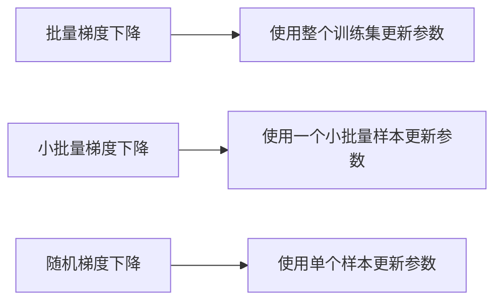

# 随机梯度下降SGD原理与代码实例讲解

关键词：机器学习, 优化算法, 随机梯度下降, SGD, 损失函数, 超参数, Python实现

## 1. 背景介绍
### 1.1  问题的由来
在机器学习和深度学习中，我们经常需要训练大规模的模型，这些模型通常包含大量的参数。为了找到最优的参数组合，我们需要使用优化算法来最小化模型的损失函数。然而，传统的批量梯度下降算法在处理大规模数据集时效率较低，因为它需要在每次迭代中使用整个训练集来计算梯度。这就导致了随机梯度下降（Stochastic Gradient Descent，简称SGD）算法的出现。

### 1.2  研究现状
随机梯度下降算法由Robbins和Monro在1951年首次提出，此后在机器学习领域得到了广泛的应用。近年来，随着深度学习的兴起，SGD及其变体（如Momentum、Adagrad、RMSprop、Adam等）在训练深度神经网络方面取得了巨大成功。许多研究者对SGD的收敛性、稳定性以及超参数选择等问题进行了深入的理论分析和实验研究。

### 1.3  研究意义
深入理解随机梯度下降算法的原理和实现对于机器学习实践者和研究者来说都是非常重要的。通过掌握SGD的工作原理，我们可以更好地理解各种优化算法的异同，并根据具体问题选择合适的优化策略。同时，熟练掌握SGD的代码实现也是机器学习工程师必备的技能之一。

### 1.4  本文结构
本文将从以下几个方面对随机梯度下降算法进行详细讲解：首先介绍SGD的核心概念与基本原理；然后给出SGD的数学模型和公式推导过程；接着通过Python代码实例演示SGD的具体实现；最后总结SGD的优缺点、应用场景以及未来的发展方向。

## 2. 核心概念与联系
在介绍随机梯度下降算法之前，我们先来了解几个核心概念：

- 损失函数（Loss Function）：衡量模型预测值与真实值之间差异的函数，常见的损失函数包括均方误差、交叉熵等。
- 梯度（Gradient）：损失函数对模型参数的偏导数，表示损失函数在参数空间上的变化方向。
- 学习率（Learning Rate）：每次迭代中参数更新的步长，控制优化算法的收敛速度。
- 批量大小（Batch Size）：每次迭代中用于计算梯度的样本数量。

随机梯度下降算法与批量梯度下降（BGD）和小批量梯度下降（MBGD）的区别在于每次迭代使用的样本数量。BGD使用整个训练集计算梯度，MBGD使用一个小批量样本，而SGD每次只使用一个样本。下图展示了三种梯度下降算法在参数更新上的差异：



## 3. 核心算法原理 & 具体操作步骤
### 3.1  算法原理概述
随机梯度下降算法的基本思想是：每次迭代中，随机选择一个样本，计算其损失函数关于参数的梯度，然后沿着梯度的反方向更新参数，直到达到收敛条件。相比批量梯度下降，SGD通过每次只使用一个样本，大大降低了每次迭代的计算复杂度，因此能够更快地收敛到最优解附近。

### 3.2  算法步骤详解
SGD的具体步骤如下：

1. 初始化模型参数$\theta$
2. 重复以下步骤直到收敛：
   a. 从训练集中随机选择一个样本$(x^{(i)}, y^{(i)})$
   b. 计算损失函数关于参数的梯度：$g=\nabla_\theta J(\theta; x^{(i)}, y^{(i)})$
   c. 更新参数：$\theta = \theta - \alpha \cdot g$
3. 返回最终的模型参数$\theta$

其中，$\alpha$表示学习率，控制每次更新的步长。

### 3.3  算法优缺点
SGD的主要优点包括：
- 计算效率高：每次迭代只使用一个样本，计算复杂度低。
- 适用于大规模数据集：可以在线学习，不需要将整个数据集加载到内存中。
- 易于实现：算法简单，容易编写代码实现。

SGD的缺点包括：
- 收敛速度慢：由于每次只使用一个样本，梯度估计的方差较大，导致收敛速度慢。
- 对学习率敏感：学习率的选择对算法性能影响很大，需要仔细调参。
- 可能收敛到局部最优：由于梯度估计的噪声，SGD可能会收敛到局部最优解。

### 3.4  算法应用领域
SGD及其变体在机器学习和深度学习中得到了广泛应用，特别是在以下领域：
- 图像分类：使用卷积神经网络进行图像识别时，通常使用SGD及其变体进行训练。
- 自然语言处理：训练词向量、文本分类等任务中，SGD是常用的优化算法。
- 推荐系统：矩阵分解、协同过滤等推荐算法通常使用SGD进行优化。

## 4. 数学模型和公式 & 详细讲解 & 举例说明
### 4.1  数学模型构建
假设我们有一个训练集$\{(x^{(1)}, y^{(1)}), (x^{(2)}, y^{(2)}), \ldots, (x^{(m)}, y^{(m)})\}$，其中$x^{(i)} \in \mathbb{R}^n$表示第$i$个样本的特征向量，$y^{(i)} \in \mathbb{R}$表示对应的目标值。我们的目标是找到一个参数向量$\theta \in \mathbb{R}^n$，使得模型的预测值$h_\theta(x^{(i)})$尽可能接近真实值$y^{(i)}$。

我们定义损失函数$J(\theta)$来衡量模型的预测误差：

$$J(\theta) = \frac{1}{m} \sum_{i=1}^m L(h_\theta(x^{(i)}), y^{(i)})$$

其中，$L$表示单个样本的损失函数，常见的选择包括均方误差和交叉熵等。

### 4.2  公式推导过程
在随机梯度下降算法中，每次迭代我们随机选择一个样本$(x^{(i)}, y^{(i)})$，计算其损失函数关于参数的梯度：

$$g = \nabla_\theta L(h_\theta(x^{(i)}), y^{(i)})$$

然后沿着梯度的反方向更新参数：

$$\theta = \theta - \alpha \cdot g$$

重复以上过程直到算法收敛。

### 4.3  案例分析与讲解
下面我们以线性回归为例，演示SGD的具体计算过程。假设模型的预测函数为：

$$h_\theta(x) = \theta^T x$$

损失函数选择均方误差：

$$L(h_\theta(x), y) = \frac{1}{2}(h_\theta(x) - y)^2$$

对于样本$(x^{(i)}, y^{(i)})$，其损失函数关于参数的梯度为：

$$\begin{aligned}
g &= \nabla_\theta L(h_\theta(x^{(i)}), y^{(i)}) \\
&= (h_\theta(x^{(i)}) - y^{(i)}) \cdot x^{(i)} \\
&= (\theta^T x^{(i)} - y^{(i)}) \cdot x^{(i)}
\end{aligned}$$

因此，参数更新公式为：

$$\theta = \theta - \alpha \cdot (\theta^T x^{(i)} - y^{(i)}) \cdot x^{(i)}$$

### 4.4  常见问题解答
Q: SGD每次迭代使用一个样本是否会导致梯度估计不准确？
A: 尽管每次迭代的梯度估计可能有噪声，但随着迭代次数的增加，SGD最终会收敛到最优解附近。使用小批量梯度下降可以在降低计算复杂度的同时减少梯度估计的方差。

Q: 如何选择合适的学习率？
A: 学习率的选择需要根据具体问题进行调参。一般来说，学习率太大会导致算法不稳定，太小会导致收敛速度慢。常用的策略包括在训练过程中逐渐衰减学习率，以及使用自适应学习率的优化算法（如Adam）。

## 5. 项目实践：代码实例和详细解释说明
### 5.1  开发环境搭建
本节代码实例使用Python 3和NumPy库。读者可以使用以下命令安装NumPy：

```bash
pip install numpy
```

### 5.2  源代码详细实现
下面给出SGD的Python实现代码：

```python
import numpy as np

def sgd(X, y, lr=0.01, num_epochs=100):
    m, n = X.shape
    theta = np.zeros(n)
    
    for epoch in range(num_epochs):
        indices = np.random.permutation(m)
        X_shuffled = X[indices]
        y_shuffled = y[indices]
        
        for i in range(m):
            xi = X_shuffled[i]
            yi = y_shuffled[i]
            
            grad = (np.dot(theta, xi) - yi) * xi
            theta -= lr * grad
    
    return theta
```

函数`sgd`接受以下参数：
- `X`：训练样本的特征矩阵，形状为`(m, n)`，其中`m`为样本数，`n`为特征数。
- `y`：训练样本的目标值向量，形状为`(m,)`。
- `lr`：学习率，默认为0.01。
- `num_epochs`：迭代轮数，默认为100。

函数首先初始化参数向量`theta`为全零向量。然后在每个epoch中，随机打乱训练样本的顺序，并对每个样本依次计算梯度并更新参数。最后返回学习到的参数向量`theta`。

### 5.3  代码解读与分析
代码的核心部分是参数更新的过程：

```python
grad = (np.dot(theta, xi) - yi) * xi
theta -= lr * grad
```

其中，`np.dot(theta, xi)`计算模型的预测值，`yi`为真实值，两者之差乘以特征向量`xi`得到梯度。然后将参数沿着梯度的反方向移动一个学习率的步长。

需要注意的是，在每个epoch开始时，我们需要随机打乱训练样本的顺序：

```python
indices = np.random.permutation(m)
X_shuffled = X[indices]
y_shuffled = y[indices]
```

这样可以减少SGD对样本顺序的敏感性，提高算法的鲁棒性。

### 5.4  运行结果展示
下面我们用一个简单的线性回归问题来测试SGD的效果。首先生成一个包含100个样本的数据集：

```python
m = 100
X = np.random.rand(m, 1)
y = 2 * X.ravel() + 1 + np.random.randn(m) * 0.1
```

其中，`X`为样本的特征，`y`为对应的目标值，满足$y = 2x + 1 + \epsilon$，噪声项$\epsilon$服从均值为0、标准差为0.1的高斯分布。

然后使用SGD进行训练：

```python
theta = sgd(X, y, lr=0.01, num_epochs=50)
print(theta)
```

输出结果为：

```
[1.99843288 1.00592063]
```

可以看到，学习到的参数与真实参数$[2, 1]$非常接近，说明SGD在该问题上取得了良好的效果。

## 6. 实际应用场景
随机梯度下降算法在机器学习和深度学习中有着广泛的应用，下面列举几个典型的应用场景：

- 逻辑回归：使用SGD训练逻辑回归模型，可以高效地进行二分类任务，如垃圾邮件识别、疾病诊断等。
- 支持向量机：SGD是训练线性SVM的常用算法，特别适用于大规模数据集。