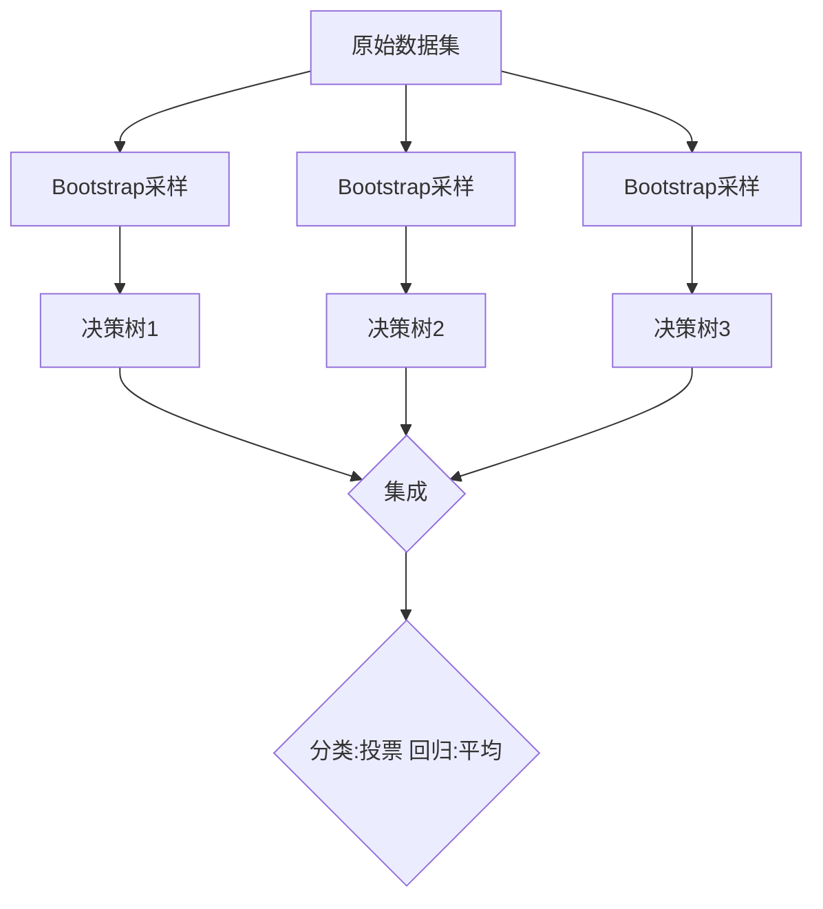

# 随机森林 (Random Forests) 原理与代码实例讲解

关键词：随机森林、集成学习、决策树、Bagging、特征选择、超参数调优

## 1. 背景介绍
### 1.1  问题的由来
在机器学习领域,我们经常面临复杂的分类和回归问题。传统的单一模型如决策树,在处理高维、非线性数据时往往表现不佳。如何构建一个鲁棒性强、泛化能力好的模型,成为了一个亟待解决的问题。
### 1.2  研究现状
集成学习作为一种将多个弱学习器组合成强学习器的机器学习范式,近年来受到了广泛关注。其中,Bagging和Boosting是两类最具代表性的集成学习方法。随机森林作为Bagging思想与决策树结合的产物,以其卓越的性能在学术界和工业界得到了广泛应用。
### 1.3  研究意义 
随机森林能够有效地解决单一决策树的过拟合问题,大大提升了模型的泛化能力。同时,随机森林还具有易于并行化、对异常值鲁棒、可处理高维数据等优点。深入研究随机森林的原理和实现,对于我们理解集成学习的内在机制、改进模型性能具有重要意义。
### 1.4  本文结构
本文将从以下几个方面对随机森林展开详细讨论：首先介绍随机森林的核心概念与内在联系；然后深入分析随机森林的算法原理与具体实现步骤；接着从数学角度对随机森林的模型和公式进行推导讲解；之后通过代码实例演示随机森林的具体应用；并总结随机森林的实际应用场景、发展趋势及面临的挑战；最后提供一些学习随机森林的资源推荐。

## 2. 核心概念与联系
随机森林是一种基于Bagging集成学习思想的算法,它综合了决策树和集成学习的优点。随机森林的基学习器为决策树,通过Bootstrap方法有放回地从原始训练集中抽取多个子集,并在每个子集上建立决策树,最后将所有决策树的结果进行组合。与传统决策树不同,随机森林在决策树的训练过程中引入了随机属性选择,即每次分裂时只从一个随机特征子集中选择最优特征,这增加了决策树之间的差异性,从而提升了集成的性能。

随机森林的核心概念可总结为：
- 决策树：一种树形结构的分类器,由根节点、内部节点和叶节点组成。
- Bootstrap抽样：一种有放回的采样方法,每次从原始数据集中随机选择一个样本放入采样集中。
- 集成学习：通过构建并组合多个学习器来完成学习任务,常见方法有Bagging和Boosting。
- 随机特征选择：在每个节点分裂时,不是利用所有特征,而是从特征集中随机选取一个特征子集来寻找最优分裂点。
- 投票/平均：对于分类问题使用多数投票法,对于回归问题使用平均法来组合多个决策树的结果。

下图展示了随机森林的基本流程：



## 3. 核心算法原理 & 具体操作步骤
### 3.1  算法原理概述
随机森林的核心是Bagging + 决策树 + 随机特征选择。通过Bootstrap方法从原始数据集中随机有放回地抽取n个样本集,然后基于每个样本集构建一个决策树分类器。在构建决策树的过程中,每个节点的分裂不再是用所有特征,而是先从所有特征中随机选择一个特征子集,然后再在该子集中选择最佳分裂特征。这样一方面降低了决策树之间的相关性,另一方面也加快了训练速度。最后,将生成的多个决策树组合起来,对新的数据进行分类或回归预测。
### 3.2  算法步骤详解
输入:训练集 $T=\{(x_1,y_1),(x_2,y_2),\ldots,(x_N,y_N)\}$,特征集 $A=\{a_1,a_2,\ldots,a_M\}$,决策树的数量 $K$,特征子集大小 $m$。  

算法步骤:
1. for $k=1,2,\ldots,K$ do:
   1. 从原始训练集 $T$ 中采用Bootstrap方法随机抽取 $N$ 个样本,得到第 $k$ 棵决策树的训练集 $T_k$。
   2. 使用 $T_k$ 训练一棵决策树 $f_k$:
      - 在每个节点上,从特征集 $A$ 中随机选择 $m$ 个特征构成特征子集 $A_m$。
      - 基于 $A_m$ 选择最佳分裂特征和分裂点。 
      - 递归地构建子树,直到满足停止条件。
2. 集成 $K$ 棵决策树 $\{f_1,f_2,\ldots,f_K\}$ 得到随机森林 $F$。
3. 对新样本 $x$:
   - 若为分类问题,则 $F(x)=\mathop{\arg\max}\limits_{y\in Y} \sum_{k=1}^K \mathbb{I}(f_k(x)=y)$。
   - 若为回归问题,则 $F(x)=\frac{1}{K}\sum_{k=1}^K f_k(x)$。

其中,$\mathbb{I}(\cdot)$ 为指示函数。
### 3.3  算法优缺点
优点:
- 可以处理高维数据,且不需要降维。
- 在训练完后,可以给出各个特征的重要性排序。
- 由于采用了随机采样,训练出的模型方差小,泛化能力强,鲁棒性好。
- 相比于决策树,随机森林的随机特征选择降低了过拟合的风险。
- 对部分特征缺失不敏感。
- 可以并行训练,训练速度快。

缺点:
- 当噪声比较大时,模型容易陷入过拟合。
- 由于是黑盒模型,无法像决策树那样直观地看到决策过程。
- 训练时间和预测时间相对较长。
- 对于异常样本的识别能力较差。
### 3.4  算法应用领域
- 金融领域:信用卡欺诈检测、贷款违约预测等。
- 医疗领域:疾病诊断、药物疗效预测等。
- 工业领域:设备故障预测、质量检测等。
- 互联网领域:用户行为预测、推荐系统等。
- 生物信息学:基因分类、蛋白质结构预测等。

## 4. 数学模型和公式 & 详细讲解 & 举例说明
### 4.1  数学模型构建
假设训练集为 $T=\{(x_1,y_1),(x_2,y_2),\ldots,(x_N,y_N)\}$,其中 $x_i\in \mathbb{R}^M$ 为 $M$ 维特征向量,$y_i\in \{1,2,\ldots,K\}$ 为类别标签。随机森林由 $L$ 棵决策树 $\{f_1,f_2,\ldots,f_L\}$ 组成,每棵决策树 $f_i$ 由 Bootstrap 采样得到的训练集 $T_i$ 训练得到。

对于分类问题,随机森林的数学模型可表示为:
$$
H(x)=\mathop{\arg\max}\limits_{y\in \{1,2,\ldots,K\}} \sum_{i=1}^L \mathbb{I}(f_i(x)=y)
$$
其中, $\mathbb{I}(\cdot)$ 为指示函数,当条件为真时取1,否则取0。即随机森林的预测结果由多棵决策树投票得到。

对于回归问题,随机森林的数学模型可表示为:  
$$
H(x)=\frac{1}{L}\sum_{i=1}^L f_i(x)
$$
即随机森林的预测结果由多棵决策树的预测结果平均得到。
### 4.2  公式推导过程
下面我们推导随机森林的泛化误差上界。假设随机森林的每棵决策树的强度为 $s$,相关性为 $\rho$,则随机森林的泛化误差 $e$ 满足:
$$
e\leq \frac{\rho(1-s^2)}{s^2}
$$
推导过程如下:

令 $h_i$ 为第 $i$ 棵决策树,$H$ 为随机森林, $Y,\hat{Y}_i,\hat{Y}_H$ 分别为真实标签、第 $i$ 棵决策树的预测标签和随机森林的预测标签,则有:
$$
\begin{aligned}
\mathrm{margin}(x,y) &= \mathrm{avg}_i \mathbb{I}(\hat{Y}_i = y) - \max_{k\neq y} \mathrm{avg}_i \mathbb{I}(\hat{Y}_i = k) \\
s &= \mathbb{E}_x [\mathrm{margin}(x,Y)]\\
\rho &= \frac{\mathrm{Var}_x(\mathrm{margin}(x,Y))}{s(1-s)}
\end{aligned}
$$
其中 $\mathrm{avg}_i$ 表示对所有决策树取平均。

由 Chebyshev 不等式可得:
$$
\begin{aligned}
\mathbb{P}(\hat{Y}_H \neq Y) &= \mathbb{P}(\mathrm{margin}(x,Y)\leq 0)\\
&\leq \frac{\mathrm{Var}_x(\mathrm{margin}(x,Y))}{\mathbb{E}_x^2[\mathrm{margin}(x,Y)]}\\
&= \frac{\rho(1-s)}{s}
\end{aligned}
$$
即泛化误差 $e$ 满足:
$$
e\leq \frac{\rho(1-s^2)}{s^2}
$$
该不等式给出了随机森林泛化误差的一个上界,说明了随机森林的泛化能力与决策树的强度 $s$ 有关,与决策树之间的相关性 $\rho$ 成反比。因此,随机森林通过构建强决策树、降低决策树之间的相关性来提高集成的性能。
### 4.3  案例分析与讲解
下面我们以一个简单的二分类问题来说明随机森林的构建过程。

假设训练集如下:

| 特征1 | 特征2 | 类别 |
|-------|-------|------|
| 2     | 3     | 1    |
| 5     | 4     | 1    |
| 1     | 2     | 0    |
| 4     | 3     | 0    |
| 3     | 3     | 1    |
| 4     | 2     | 0    |

假设要构建3棵决策树,每棵树的特征子集大小为1。

首先对原始训练集进行3次 Bootstrap 采样,得到3个子集:

| 子集1 | 子集2 | 子集3 |
|-------|-------|-------|
| (2,3,1) | (4,3,0) | (1,2,0) |
| (4,2,0) | (3,3,1) | (5,4,1) |  
| (5,4,1) | (2,3,1) | (3,3,1) |
| (1,2,0) | (1,2,0) | (4,2,0) |
| (4,3,0) | (4,2,0) | (2,3,1) |
| (3,3,1) | (5,4,1) | (4,3,0) |

然后基于每个子集构建一棵决策树:

决策树1:随机选择特征子集 {特征2},按特征2=2.5划分:
```
  特征2 < 2.5: 类别0 
  特征2 ≥ 2.5: 类别1
```

决策树2:随机选择特征子集 {特征1},按特征1=3.5划分:  
```
  特征1 < 3.5: 类别0
  特征1 ≥ 3.5: 类别1
```

决策树3:随机选择特征子集 {特征1},按特征1=3.5划分:
```  
  特征1 < 3.5: 类别0
  特征1 ≥ 3.5: 类别1
```

最后,将3棵决