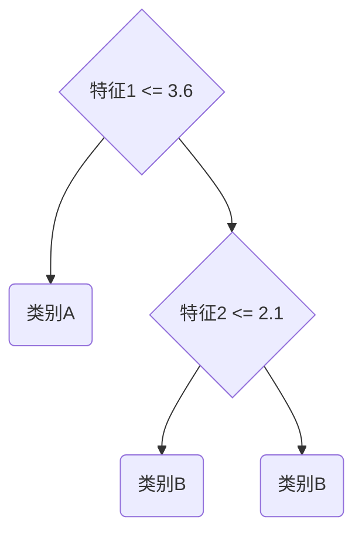
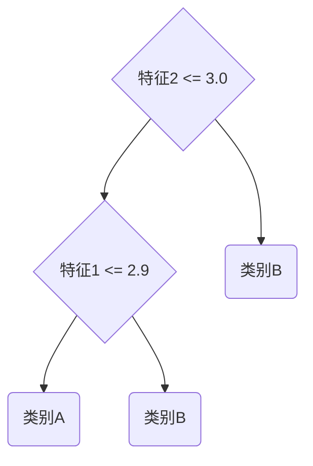
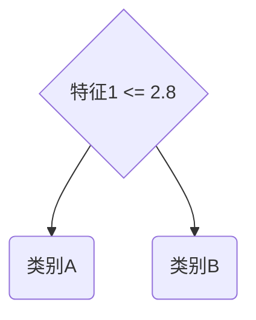

# 随机森林(Random Forests) - 原理与代码实例讲解

关键词：随机森林、集成学习、决策树、Bagging、特征随机化、OOB、超参数调优

## 1. 背景介绍
### 1.1  问题的由来
在现实世界中,我们经常面临着大量复杂的数据和预测问题。传统的机器学习算法如决策树,虽然简单直观,但容易出现过拟合,泛化能力较差。如何在保证模型准确性的同时,提高模型的鲁棒性和泛化能力,成为机器学习领域亟待解决的问题。

### 1.2  研究现状
集成学习作为一种将多个弱学习器组合成强学习器的机器学习范式,为解决上述问题提供了新的思路。随机森林(Random Forests)作为集成学习的代表算法之一,自1995年由Tin Kam Ho首次提出以来,经过Leo Breiman等学者的发展和完善,已成为机器学习领域的研究热点,在理论和实践中得到了广泛应用。

### 1.3  研究意义
随机森林通过集成多棵决策树,在提高预测准确性的同时,很大程度上克服了决策树容易过拟合的缺点。它能够有效处理高维数据,不敏感异常值和缺失值,具有很好的鲁棒性和泛化能力。深入研究随机森林的原理和实现,对于推动集成学习理论的发展,解决实际预测问题具有重要意义。

### 1.4  本文结构
本文将全面介绍随机森林的原理与实现。第2部分介绍随机森林涉及的核心概念;第3部分详细阐述随机森林的算法原理和具体步骤;第4部分给出随机森林的数学模型和公式推导过程;第5部分通过Python代码实例演示随机森林的具体实现;第6部分总结随机森林的实际应用场景;第7部分推荐随机森林的学习资源和工具;第8部分对全文进行总结,并展望随机森林的未来发展方向和挑战;第9部分列举随机森林的常见问题与解答。

## 2. 核心概念与联系
随机森林涉及的核心概念包括:

- 决策树(Decision Tree):一种树形结构的分类器,通过一系列规则将数据分割成不同的叶子节点。
- 集成学习(Ensemble Learning):通过构建并结合多个学习器来完成学习任务,常见方法有Bagging和Boosting。
- Bootstrap聚合(Bootstrap Aggregating,简称Bagging):从原始数据集中有放回地随机抽样,构建多个独立的基学习器,然后将它们的预测结果结合起来。
- 特征随机化(Feature Randomization):在每次分裂时,不使用全部特征,而是从特征集合中随机选择一个特征子集。
- 袋外数据(Out of Bag Data,简称OOB):在Bagging过程中,大约有1/3的样本不会被抽中,可用于模型泛化性能评估。

这些概念之间的联系如下:随机森林本质上是一种Bagging集成学习方法,基学习器是决策树。它在Bagging的基础上引入了特征随机化,进一步提高了模型的多样性和泛化能力。同时利用袋外数据可以在不需要额外验证集的情况下对模型进行性能评估。

## 3. 核心算法原理 & 具体操作步骤
### 3.1  算法原理概述
随机森林的基本思想是:通过Bootstrap方法有放回地从原始训练集中随机抽取多个子数据集,然后基于每个子数据集构建一个决策树分类器。在每棵决策树的训练过程中,除了使用不同的训练集子集外,还对特征进行随机选择。最终将多棵决策树的预测结果进行组合,得到随机森林的输出。

### 3.2  算法步骤详解
随机森林的具体算法步骤如下:

输入:训练集 $D=\{(x_1,y_1),(x_2,y_2),...,(x_N,y_N)\}$,特征集合 $F=\{f_1,f_2,...,f_M\}$,决策树的数量 $T$。  

(1) 对 $t=1,2,...,T$:  
(1.1) 对训练集 $D$ 进行Bootstrap采样,得到第 $t$ 棵决策树的训练集 $D_t$。  
(1.2) 基于 $D_t$ 训练一棵决策树:  
&emsp; (a) 在每个节点,从 $F$ 中随机选取 $m$ 个特征 $(m<<M)$,根据某种准则选择最佳分裂特征和分裂点进行分裂。常用的准则有信息增益、基尼指数等。  
&emsp; (b) 重复(a)直到满足决策树的停止生长条件。  
&emsp; (c) 将第 $t$ 棵决策树记为 $h_t(x)$。  

(2) 组合 $T$ 棵决策树得到随机森林 $H(x)=\{h_1(x),h_2(x),...,h_T(x)\}$。  

输出:随机森林 $H(x)$。  

对于分类问题,随机森林的预测结果采用多数投票法,即 $H(x)=argmax_{y \in Y} \sum_{t=1}^T I(h_t(x)=y)$。  
对于回归问题,随机森林的预测结果采用算术平均,即 $H(x)=\frac{1}{T} \sum_{t=1}^T h_t(x)$。

### 3.3  算法优缺点
随机森林的主要优点有:

- 具有很高的准确率,能够有效避免过拟合。
- 能够处理高维数据,且不需要降维。 
- 可以评估各个特征的重要性。
- 对异常值和缺失值不敏感。
- 可以并行训练,计算效率高。

随机森林的缺点包括:

- 模型可解释性差,是一个黑盒模型。
- 对于噪声较大的分类问题,泛化性能不如支持向量机等方法。
- 训练时间相对较长,尤其在数据量很大时。

### 3.4  算法应用领域
随机森林被广泛应用于多个领域,如:

- 金融领域:信用评分、欺诈检测、股票趋势预测等。
- 医疗领域:疾病诊断、药物疗效预测、基因分类等。
- 工业领域:设备故障预测、质量检测等。
- 生物信息学:基因表达数据分析、蛋白质结构预测等。
- 计算机视觉:图像分类、目标检测、人脸识别等。

## 4. 数学模型和公式 & 详细讲解 & 举例说明
### 4.1  数学模型构建
设训练集为 $D=\{(x_1,y_1),(x_2,y_2),...,(x_N,y_N)\}$,其中 $x_i \in \mathcal{X} \subseteq \mathbf{R}^M$ 为 $M$ 维特征向量, $y_i \in \mathcal{Y}=\{1,2,...,K\}$ 为类别标签。

随机森林由 $T$ 棵决策树组成,第 $t$ 棵决策树记为 $h_t(x)$。每棵决策树基于从原始训练集 $D$ 中Bootstrap采样得到的子数据集 $D_t$ 进行训练。

对于分类问题,随机森林的数学模型可表示为:

$$H(x)=argmax_{y \in \mathcal{Y}} \sum_{t=1}^T I(h_t(x)=y)$$

其中, $I(\cdot)$ 为指示函数,当条件成立时取值为1,否则为0。即随机森林的预测结果由多棵决策树的投票结果决定。

对于回归问题,随机森林的数学模型可表示为:

$$H(x)=\frac{1}{T} \sum_{t=1}^T h_t(x)$$

即随机森林的预测结果是所有决策树预测结果的算术平均。

### 4.2  公式推导过程
下面以分类问题为例,推导随机森林的泛化误差上界。

假设随机森林的每棵决策树的训练集 $D_t$ 是从原始训练集 $D$ 中独立同分布采样得到的,且每棵决策树的泛化误差为 $\epsilon$。记 $I(h_t(x) \neq y)$ 为第 $t$ 棵决策树在样本 $(x,y)$ 上的误分类指示函数。

定义随机森林的边缘函数:

$$mg(x,y)=avg_t I(h_t(x)=y) - max_{j \neq y} avg_t I(h_t(x)=j)$$

其中 $avg_t$ 表示对所有决策树的平均。边缘函数表示正确类别的平均投票数与最高误分类类别的平均投票数之差。

随机森林在样本 $(x,y)$ 上误分类的充分必要条件是 $mg(x,y)<0$。因此,随机森林的泛化误差 $PE^*$ 可以表示为:

$$PE^* = P_{x,y}(mg(x,y)<0)$$

根据Hoeffding不等式,可以得到随机森林泛化误差的上界:

$$PE^* \leq \overline{p}(1-\overline{s}^2)/(\overline{s}^2)$$

其中, $\overline{p}=avg_t P_{x,y}(h_t(x) \neq y)$ 表示每棵决策树的平均泛化误差, $\overline{s}=\frac{1}{T} \sum_{t_1 \neq t_2} \rho(h_{t_1},h_{t_2})$ 表示决策树之间的平均相关系数,其中 $\rho(h_{t_1},h_{t_2})=P_{x,y}(h_{t_1}(x)=h_{t_2}(x))-P_{x,y}(h_{t_1}(x) \neq y)P_{x,y}(h_{t_2}(x) \neq y)$。

由此可见,随机森林的泛化误差上界由两部分决定:单棵决策树的平均泛化误差 $\overline{p}$ 和决策树之间的相关性 $\overline{s}$。减小 $\overline{p}$ 和 $\overline{s}$ 都可以提高随机森林的泛化性能。其中Bagging主要通过降低 $\overline{p}$ 起作用,而特征随机化主要通过降低 $\overline{s}$ 起作用。

### 4.3  案例分析与讲解
下面以一个简单的二分类问题为例,说明随机森林的构建过程。

假设训练集如下:

| 样本编号 | 特征1 | 特征2 | 类别 |  
|:-------:|:-----:|:-----:|:----:|
| 1       | 2.0   | 3.1   | A    |
| 2       | 3.3   | 1.9   | B    |
| 3       | 1.8   | 4.2   | A    |
| 4       | 3.9   | 3.7   | B    |
| 5       | 2.5   | 2.8   | A    |
| 6       | 4.1   | 2.2   | B    |

设决策树的数量为3,每次分裂时从所有特征中随机选择1个特征。

首先对原始训练集进行3次Bootstrap采样,得到3个子数据集:

$D_1=\{1,2,4,4,6,6\}$  
$D_2=\{2,2,3,3,5,6\}$  
$D_3=\{1,1,3,4,5,5\}$

然后基于每个子数据集构建一棵决策树:

决策树1:

决策树2:

决策树3:

最后将3棵决策树组合成随机森林。假设有一个新样本 $x=(2.2,3.5)$,每棵决策树的预测结果分别为:$h_1(x)=A$,$h_2(x)=A$,$h_3(x)=A$。根据多数投票法,随机森林的预测结果为 $H(x)=A$。

可以看出