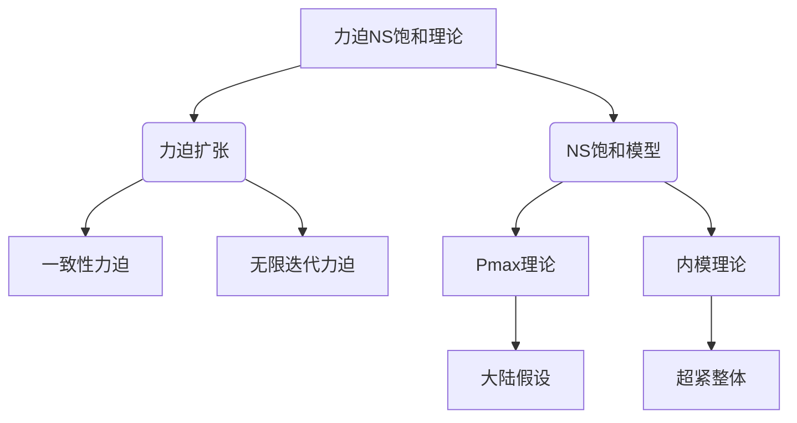
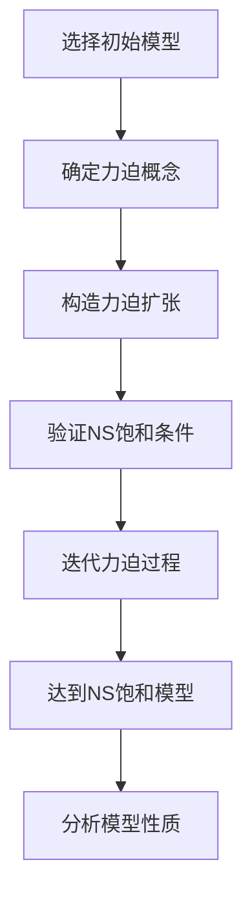

# 集合论导引：力迫NS饱和

## 1. 背景介绍

### 1.1 问题的由来

集合论是数学的一个基础分支,研究集合及其运算、关系和结构。它为数学奠定了坚实的基础,并在逻辑、代数、拓扑、分析等诸多领域发挥着重要作用。然而,传统的集合论存在一些内在的悖论和困难,如康托尔的对角线论证、罗素悖论等,这些问题引发了对集合论公理系统的反思和重构。

在这一背景下,力迫NS饱和(Forcing and NS Saturated)理论应运而生,旨在解决集合论中的一些根本性难题,为集合论提供更加坚实和一致的基础。这一理论的核心思想是引入新的公理和概念,以克服传统集合论的局限性,并探索更广阔的集合论领域。

### 1.2 研究现状

力迫NS饱和理论自20世纪60年代兴起以来,一直是集合论研究的前沿领域。许多著名数学家,如罗伯特·索洛维(Robert M. Solovay)、唐纳德·马丁(Donald A. Martin)、格雷戈里·伍丁(W. Hugh Woodin)等,都做出了重要贡献。

目前,力迫NS饱和理论已经取得了一系列重要成果,如马丁公理、Pmax理论、内模理论等,为集合论的发展注入了新的活力。然而,这一领域仍存在诸多未解决的问题和挑战,如大陆假设、超紧整体问题等,吸引着众多数学家的关注和探索。

### 1.3 研究意义

力迫NS饱和理论的研究具有重要的理论意义和应用价值:

- 理论意义:它为集合论提供了一个更加坚实和一致的基础,有助于解决传统集合论中的悖论和困难,推动集合论的发展。
- 应用价值:集合论在数学的诸多分支中扮演着基础性角色,力迫NS饱和理论的进展将为相关领域带来新的见解和工具。

此外,力迫NS饱和理论本身也是一个富有挑战性的研究领域,吸引着众多数学家的投入和探索,推动着数学思维和方法的创新。

### 1.4 本文结构

本文将全面介绍力迫NS饱和理论的核心概念、算法原理、数学模型、实际应用等方面的内容。文章结构安排如下:

1. 背景介绍
2. 核心概念与联系
3. 核心算法原理与具体操作步骤
4. 数学模型和公式详细讲解与举例说明
5. 项目实践:代码实例和详细解释说明
6. 实际应用场景
7. 工具和资源推荐
8. 总结:未来发展趋势与挑战
9. 附录:常见问题与解答

## 2. 核心概念与联系

力迫NS饱和理论囊括了一系列核心概念,这些概念相互关联、相辅相成,构成了理论的基础框架。本节将介绍其中最为关键的几个概念。

1. **力迫扩张(Forcing Extension)**: 通过在集合论的公理系统中引入新的集合,从而构造出一个更大的模型。这是力迫理论的核心思想,也是解决集合论悖论的关键手段。

2. **NS饱和模型(NS Saturated Model)**: 一种满足特殊条件的内部模型,在这种模型中,所有的可计算理论都有内部解。NS饱和模型是力迫理论的重要工具,在许多领域都有应用。

3. **一致性力迫(Consistency Forcing)**: 一种特殊的力迫方法,用于证明某些新公理在既有公理系统下是一致的。这为集合论的扩展提供了理论保证。

4. **无限迭代力迫(Iterated Forcing)**: 通过无限次重复施加力迫扩张,构造出更复杂的模型。这种方法可以产生许多有趣的现象,如大陆假设等。

5. **Pmax理论(Pmax Theory)**: 研究最大力迫的理论,旨在寻找一种最强大的力迫方法。Pmax理论与大陆假设等重要问题密切相关。

6. **内模理论(Inner Model Theory)**: 研究内部模型的理论,探讨在给定的外部模型中构造出满足特殊条件的内部模型。内模理论与超紧整体等概念紧密联系。

7. **大陆假设(Continuum Hypothesis)**: 一个著名的集合论问题,探讨实数集的基数与自然数集的基数之间的关系。大陆假设在力迫理论中扮演着重要角色。

8. **超紧整体(Supercompact Cardinal)**: 一种具有特殊性质的极大基数,在内模理论中有重要应用。超紧整体的存在与否是力迫理论的一个核心问题。

这些核心概念相互关联、相辅相成,共同构成了力迫NS饱和理论的理论框架。理解和掌握这些概念,是深入探索该领域的必要基础。

## 3. 核心算法原理与具体操作步骤

### 3.1 算法原理概述

力迫NS饱和理论的核心算法原理可以概括为以下几个方面:

1. **力迫扩张**: 通过在现有模型中引入新的集合,构造出一个更大、更丰富的模型。这是力迫理论的基础思想。

2. **无限迭代**: 通过无限次重复施加力迫扩张,产生越来越复杂的模型,探索集合论的更深层次问题。

3. **一致性证明**: 利用一致性力迫等技术,证明新引入的公理或假设在既有公理系统下是一致的,从而保证理论的完整性。

4. **内部构造**: 在给定的外部模型中,利用NS饱和等条件,构造出满足特殊性质的内部模型,用于研究特定的数学对象和现象。

5. **极限过程**: 通过研究无限迭代力迫的极限行为,探索力迫理论的边界和局限性,发现新的数学现象和规律。

这些核心算法原理相互交织、环环相扣,共同构成了力迫NS饱和理论的算法基础。掌握这些原理,对于深入理解和应用该理论至关重要。

### 3.2 算法步骤详解

下面将详细阐述力迫NS饱和理论的核心算法步骤。为了便于理解,我们将以构造一个NS饱和模型为例进行说明。

1. **选择初始模型**: 首先需要选择一个合适的初始模型,通常是ZFC公理系统下的某个标准模型,如构造体模型、内部模型等。

2. **确定力迫概念**: 根据研究目的和需求,确定将要使用的力迫概念,如Cohen实数力迫、Pmax力迫等。不同的力迫概念具有不同的性质和作用。

3. **构造力迫扩张**: 利用选定的力迫概念,在初始模型的基础上,引入新的集合,构造出一个更大的力迫扩张模型。

4. **验证NS饱和条件**: 检验构造出的力迫扩张模型是否满足NS饱和的条件,如链条条件、反链条条件等。如果不满足,需要进行调整或迭代。

5. **迭代力迫过程**: 如果需要,可以对力迫扩张模型进行无限次迭代,每次迭代都会产生一个新的、更复杂的模型。

6. **达到NS饱和模型**: 经过有限次或无限次迭代后,最终可以得到一个满足NS饱和条件的模型,即所需的NS饱和模型。

7. **分析模型性质**: 对获得的NS饱和模型进行深入分析,研究其性质、结构和内在规律,探索其在集合论和其他数学领域的应用。

需要注意的是,上述步骤仅为一个典型示例,在实际应用中,可能需要根据具体情况进行调整和改进。此外,力迫NS饱和理论还包括许多其他技术和方法,如一致性力迫、内模构造等,读者可根据需要进一步学习和掌握。

### 3.3 算法优缺点

力迫NS饱和理论的核心算法具有以下优点:

1. **解决悖论**: 通过引入新的公理和概念,有效解决了传统集合论中的一些根本性悖论和困难,为集合论提供了更加坚实的基础。

2. **扩展视野**: 力迫扩张和无限迭代等技术,使得数学家能够探索集合论的更广阔领域,发现新的数学对象和现象。

3. **统一框架**: 力迫NS饱和理论提供了一个统一的理论框架,将许多看似不相关的概念和技术融合在一起,增强了理论的完整性和内聚性。

4. **应用广泛**: 该理论不仅在集合论本身有重要应用,而且对其他数学分支如代数、拓扑、逻辑等也产生了深远影响。

然而,力迫NS饱和理论也存在一些缺点和局限性:

1. **复杂性**: 该理论涉及大量抽象概念和技术,理解和掌握存在一定难度,对数学功底有较高要求。

2. **一致性问题**: 尽管力迫理论提供了一致性证明的方法,但仍然无法彻底消除一致性问题的隐患。

3. **计算复杂度**: 某些力迫构造过程的计算复杂度极高,给实际应用带来了一定挑战。

4. **理论局限**: 力迫NS饱和理论虽然解决了一些问题,但也引入了新的困难和悖论,理论本身仍有待进一步完善和发展。

总的来说,力迫NS饱和理论是集合论发展的重要里程碑,但同时也面临着一些挑战和局限性,需要数学家们的不断努力和探索。

### 3.4 算法应用领域

力迫NS饱和理论的核心算法在集合论及其他数学领域都有广泛的应用,主要包括以下几个方面:

1. **集合论基础研究**
   - 解决传统集合论中的悖论和困难
   - 探索集合论的新领域,如大陆假设、超紧整体等
   - 构造满足特殊条件的模型,研究集合论对象的性质

2. **逻辑与基础研究**
   - 研究一阶逻辑、二阶逻辑等形式系统的模型理论
   - 探讨形式系统的可满足性、完备性等问题
   - 构造反例模型,验证逻辑规则和公理的正确性

3. **代数与代数几何**
   - 研究代数结构的模型理论,如域、环、群等
   - 构造具有特殊性质的代数对象,如无素环、超紧域等
   - 应用于代数几何、代数拓扑等相关领域

4. **拓扑与分析**
   - 研究拓扑空间、测度空间等对象的模型理论
   - 构造满足特殊条件的拓扑空间或测度空间
   - 应用于实分析、泛函分析等分支

5. **组合数学与图论**
   - 研究组合对象的极限行为,如无限游戏、无限图等
   - 构造具有特殊性质的组合对象,如无界色数图等
   - 应用于算法复杂性理论、计算机科学等领域

6. **其他应用**
   - 概率论、动力系统理论、计算机科学等领域
   - 作为研究工具,探索这些领域的基础理论和前沿问题

可以看出,力迫NS饱和理论的核心算法具有广泛的应用前景,不