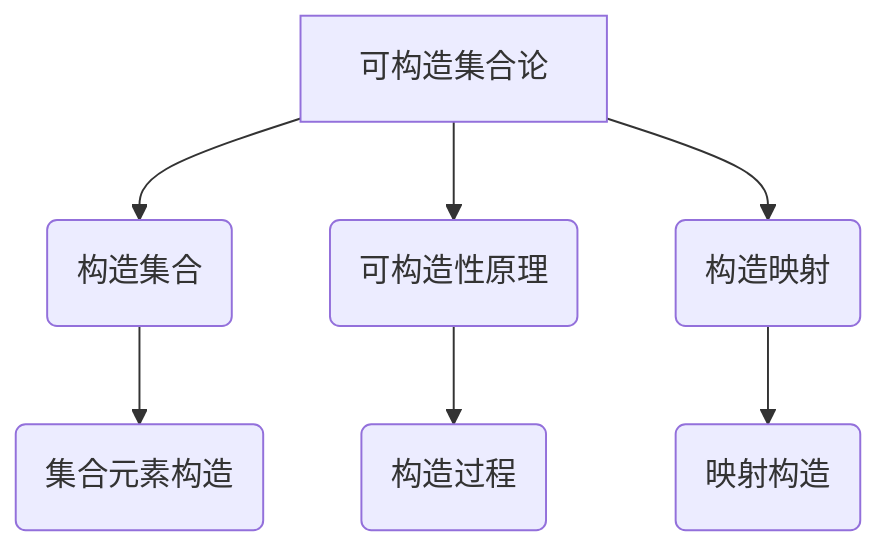

# 集合论导引：可构造集合之秩序

## 1. 背景介绍

### 1.1 问题的由来

集合论作为数学的一个基础分支,其研究对象是集合及其相关运算。它为数学奠定了坚实的基础,并在逻辑、计算机科学等诸多领域发挥着重要作用。然而,传统集合论存在一些缺陷和局限性,例如对于无穷集合的处理存在困难,无法精确描述集合的构造过程等。这促使数学家们开始探索一种新的集合论范式——可构造集合论。

可构造集合论(Constructive Set Theory)是20世纪60年代兴起的一种新的集合论理论体系。它旨在通过严格的构造过程来定义和操作集合,从而克服传统集合论中存在的一些缺陷和困难。与传统集合论不同,可构造集合论强调集合的构造性,要求集合的每个元素都必须能够被构造出来,而不是简单地假设其存在。

### 1.2 研究现状

可构造集合论的研究可以追溯到20世纪60年代,当时数学家A.A.Markov提出了马尔可夫原理(Markov's Principle),这被认为是可构造集合论的开端。随后,许多著名数学家如F.W.Lawvere、P.Aczel、M.Forti等对可构造集合论作出了重要贡献。

目前,可构造集合论已经发展成为一个成熟的理论体系,并在数学基础、计算机科学、类型理论等领域得到广泛应用。可构造集合论不仅解决了传统集合论中的一些困难,还为研究无穷集合的构造过程提供了新的视角和方法。

### 1.3 研究意义

可构造集合论的研究具有重要的理论意义和应用价值:

1. **理论基础**:可构造集合论为数学奠定了更加严格和可靠的基础,有助于解决传统集合论中存在的一些悖论和困难。

2. **计算机科学**:可构造集合论与计算理论密切相关,为研究计算的构造性和可计算性提供了有力工具。

3. **类型理论**:可构造集合论为发展强大的类型理论系统提供了坚实的基础,在编程语言理论和形式化验证等领域有重要应用。

4. **无穷集合研究**:可构造集合论为研究无穷集合的构造过程提供了新的视角和方法,有助于深入理解无穷概念的本质。

### 1.4 本文结构

本文将全面介绍可构造集合论的核心概念、算法原理、数学模型以及实际应用。文章主要结构如下:

1. 背景介绍
2. 核心概念与联系
3. 核心算法原理与具体操作步骤
4. 数学模型和公式详细讲解与举例说明
5. 项目实践:代码实例和详细解释说明
6. 实际应用场景
7. 工具和资源推荐
8. 总结:未来发展趋势与挑战
9. 附录:常见问题与解答

## 2. 核心概念与联系

可构造集合论的核心概念包括:构造集合(Constructive Set)、可构造性原理(Principle of Constructivity)、构造映射(Constructive Mapping)等。这些概念相互关联,共同奠定了可构造集合论的理论基础。

### 2.1 构造集合(Constructive Set)

构造集合是可构造集合论的核心概念。一个集合被称为构造集合,是指该集合中的每个元素都可以通过一个有效的构造过程被构造出来,而不是简单地假设其存在。

构造集合强调集合元素的可构造性,要求对于任意一个元素,都必须存在一个有效的算法或过程能够构造出该元素。这与传统集合论中简单假设集合元素存在的做法形成鲜明对比。

### 2.2 可构造性原理(Principle of Constructivity)

可构造性原理是可构造集合论的基本原则,它要求对于任何数学对象或命题,只有在能够提供一个有效的构造过程时,才能断言它的存在或真实性。

这一原则否定了传统数学中广泛使用的"存在性证明"和"反证法",要求对于每一个数学对象或命题,都必须给出一个显式的构造过程,而不能仅仅依赖逻辑推理。

可构造性原理为可构造集合论提供了坚实的理论基础,确保了集合论的严谨性和可靠性。

### 2.3 构造映射(Constructive Mapping)

构造映射是可构造集合论中的另一个重要概念。它指的是在两个构造集合之间的一种特殊映射,要求对于映射的任意输入元素,都能够通过一个有效的算法或过程计算出其映射值。

构造映射保证了集合之间操作的可构造性,是可构造集合论中进行集合运算和推理的重要工具。它与传统集合论中的任意映射概念形成鲜明对比,体现了可构造集合论对构造过程的重视。

## 3. 核心算法原理与具体操作步骤

### 3.1 算法原理概述

可构造集合论的核心算法原理是基于构造性原理,通过一系列有效的构造过程来定义和操作集合。这些算法能够保证集合元素的可构造性,并为无穷集合的构造提供了新的视角和方法。

算法原理的核心思想可以概括为:

1. 对于任何集合元素,都必须存在一个有效的构造过程能够构造出该元素。
2. 对于任何集合运算,都必须通过构造映射的方式进行,保证运算结果的可构造性。
3. 对于无穷集合,通过递归或迭代的方式逐步构造出其元素,而不是简单假设其存在。

这些原理与传统集合论形成鲜明对比,确保了可构造集合论的严谨性和可靠性。

### 3.2 算法步骤详解

可构造集合论的核心算法可以概括为以下几个步骤:

1. **定义基本构造集合**

   首先需要定义一些基本的构造集合,如空集、单元素集合等。这些集合的元素可以直接构造出来,为后续的构造过程奠定基础。

2. **构造新集合**

   基于已有的构造集合,通过一系列构造操作(如并集、交集、笛卡尔积等)构造出新的构造集合。这些操作都必须满足可构造性原理,即对于新集合中的任何元素,都能够通过有效的构造过程构造出来。

3. **递归构造无穷集合**

   对于无穷集合(如自然数集),通过递归或迭代的方式逐步构造出其元素。每一步都产生一个新的有限构造集合,最终通过无穷多步构造出整个无穷集合。

4. **构造映射和集合运算**

   在构造集合的基础上,定义构造映射和各种集合运算(如并、交、补等)。这些运算都必须满足可构造性原理,即对于任何输入元素,都能够通过有效的算法计算出其映射值或运算结果。

5. **证明和推理**

   基于可构造集合论的公理系统,对构造集合及其运算进行严格的数学证明和推理,确保理论的一致性和正确性。

这些步骤共同构成了可构造集合论的核心算法框架,为集合的严格构造和操作提供了坚实的理论基础。

### 3.3 算法优缺点

可构造集合论的核心算法具有以下优点:

1. **严谨性**:通过强调构造过程,可构造集合论确保了理论的严谨性和可靠性,避免了传统集合论中存在的一些悖论和困难。

2. **计算可行性**:可构造集合论与计算理论密切相关,其算法具有良好的计算可行性,为研究计算的构造性和可计算性提供了有力工具。

3. **无穷集合处理**:通过递归或迭代的方式,可构造集合论为无穷集合的构造提供了新的视角和方法,有助于深入理解无穷概念的本质。

4. **应用广泛**:可构造集合论在数学基础、计算机科学、类型理论等领域有广泛的应用,为相关领域的发展提供了坚实的理论基础。

然而,可构造集合论的算法也存在一些缺点和局限性:

1. **计算复杂度**:对于一些复杂的集合和运算,构造过程可能会变得非常复杂,导致算法的计算复杂度较高。

2. **表达能力限制**:由于强调构造性,可构造集合论在表达某些非构造性概念时可能会受到限制。

3. **理论完备性**:虽然可构造集合论解决了传统集合论中的一些困难,但它本身也存在一些理论上的不完备性,需要进一步完善和发展。

4. **学习曲线陡峭**:可构造集合论的概念和原理相对抽象,对初学者来说可能存在一定的学习曲线。

总的来说,可构造集合论的核心算法为集合论提供了一种全新的视角和方法,虽然存在一些局限性,但其理论意义和应用价值是不容忽视的。

### 3.4 算法应用领域

可构造集合论的核心算法在以下领域有着广泛的应用:

1. **数学基础研究**:可构造集合论为数学奠定了更加严格和可靠的基础,在解决传统集合论中的悖论和困难方面发挥着重要作用。

2. **计算机科学**:可构造集合论与计算理论密切相关,为研究计算的构造性和可计算性提供了有力工具,在算法设计、复杂性理论等领域有重要应用。

3. **类型理论**:可构造集合论为发展强大的类型理论系统提供了坚实的基础,在编程语言理论、形式化验证等领域有广泛应用。

4. **数学逻辑**:可构造集合论为研究数学逻辑和证明理论提供了新的视角和方法,有助于深入理解逻辑推理的本质。

5. **无穷集合研究**:可构造集合论为无穷集合的构造过程提供了新的方法,有助于深入理解无穷概念的本质,在拓扑学、度量理论等领域有重要应用。

6. **形式化数学**:可构造集合论为形式化数学系统的构建提供了坚实的理论基础,在计算机辅助定理证明等领域有广泛应用前景。

总的来说,可构造集合论的核心算法不仅在数学基础研究领域发挥着重要作用,同时也为计算机科学、逻辑学、类型理论等领域的发展提供了有力的理论支持和实践工具。

## 4. 数学模型和公式详细讲解与举例说明

### 4.1 数学模型构建

可构造集合论的数学模型是基于构造性原理构建的,旨在通过严格的构造过程来定义和操作集合。这一模型与传统集合论的模型存在明显差异,体现了可构造集合论对构造过程的重视。

可构造集合论的数学模型可以概括为以下几个核心要素:

1. **构造集合**:模型的基本对象是构造集合,即每个元素都可以通过有效的构造过程被构造出来的集合。

2. **构造映射**:在构造集合之间定义了构造映射,要求对于任何输入元素,都能够通过有效的算法计算出其映射值。

3. **构造操作**:定义了一系列构造操作,如并集、交集、笛卡尔积等,用于从已有的构造集合构造出新的构造集合。

4. **递归构造**:对于无穷集合,通过递归或迭代的方式逐步构造出其元素,而不是简单假设其存在。

5. **公理系统**:可构造集合论建立在一套严格的公理系统之上,确保理论的一致性和正确性。

这些要素共同构成了可构造集合论的数学模型,为集合的严格定