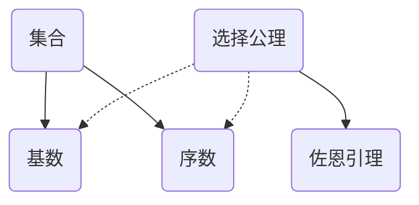

# 集合论导引：基数无穷乘积

关键词：集合论、基数、无穷乘积、康托尔、超限数、选择公理

## 1. 背景介绍
### 1.1  问题的由来
集合论是现代数学的基石之一,它研究集合的性质以及集合之间的关系。在集合论的发展历程中,无穷集合的概念和性质一直是一个核心话题。特别是,不同无穷集合的基数大小比较,以及无穷集合上的代数运算,都引发了深入的探讨。其中,无穷基数的乘积运算就是一个重要而有趣的课题。

### 1.2  研究现状
自从19世纪末德国数学家康托尔开创了集合论以来,无穷集合的研究取得了丰硕的成果。我们知道,自然数集 $\mathbb{N}$、有理数集 $\mathbb{Q}$、实数集 $\mathbb{R}$ 都是无穷集,但它们的基数大小并不相同。康托尔证明了 $|\mathbb{N}| < |\mathbb{R}|$,即实数集的基数大于自然数集。对于任意基数 $\kappa$,康托尔还引入了它的后继基数 $\kappa^+$ 的概念,并证明了 $\kappa < \kappa^+$。此外,康托尔还提出了著名的连续统假设(CH),即 $|\mathbb{R}| = \aleph_1$。

在此基础上,数学家们进一步研究了无穷基数的代数运算,包括加法、乘法、幂运算等。特别是,无穷基数的乘积引起了广泛关注。人们发现,无穷基数的乘积具有一些反直觉的性质,值得深入探讨。

### 1.3  研究意义
研究无穷基数的乘积,有助于加深我们对无穷集合的认识,拓展集合论的理论体系。同时,它在数学的其他分支如拓扑学、代数学等中也有重要应用。探索无穷乘积的性质,有助于解决这些领域的一些问题。此外,这一话题还与数学基础、逻辑学等有密切联系,对于思考数学的本质和无穷的奥秘具有重要意义。

### 1.4  本文结构
本文将从几个方面来探讨无穷基数的乘积问题：
- 首先回顾集合论中的一些核心概念,包括基数、序数等,它们是讨论无穷乘积的基础。 
- 然后介绍无穷基数乘积的定义,分析它的一些基本性质,并给出一些具体的计算方法。
- 接着讨论选择公理在无穷乘积中的重要作用,说明它如何影响乘积结果。
- 进一步,本文将通过一些实例来演示如何计算无穷基数乘积,体会其中的规律。
- 最后总结全文,并对无穷乘积的研究前景作一展望。

## 2. 核心概念与联系
在正式讨论无穷基数乘积之前,我们先来回顾集合论中的一些核心概念。

**集合(Set)**: 集合是一些确定对象的总体,这些对象称为集合的元素。记作 $\{a,b,c\}$ 或 $\{x|P(x)\}$。

**基数(Cardinal Number)**: 集合的基数是表示该集合元素个数的数。有穷集的基数就是其元素的个数,无穷集的基数用希伯来字母 $\aleph$ 表示。例如 $|\mathbb{N}| = \aleph_0$。

**序数(Ordinal Number)**: 序数用来表示集合元素的顺序类型。有穷序数就是自然数,无穷序数用希腊字母 $\omega$ 表示。

**选择公理(Axiom of Choice, AC)**: 对任意一族非空集合,都可以从每个集合中选出一个元素,组成一个新的集合。

**佐恩引理(Zorn's Lemma)**: 如果一个偏序集合的每个全序子集都有上界,那么它必有一个极大元。它与选择公理等价。

这些概念之间有着紧密的联系。基数和序数是刻画集合的两个重要工具。选择公理是集合论的一条重要公理,它对无穷基数的乘积有重大影响。佐恩引理是选择公理的一个重要等价形式。

## 3. 核心算法原理 & 具体操作步骤
### 3.1  算法原理概述
对于两个无穷基数 $\kappa,\lambda$,它们的乘积 $\kappa\cdot\lambda$ 表示基数为 $\kappa,\lambda$ 的两个集合的笛卡尔积的基数。一般地,无穷基数的乘积满足以下性质:

- $\kappa\cdot\lambda = \lambda\cdot\kappa$ (交换律)
- $\kappa\cdot(\lambda\cdot\mu) = (\kappa\cdot\lambda)\cdot\mu$ (结合律)
- $\kappa\cdot(\lambda+\mu) = \kappa\cdot\lambda + \kappa\cdot\mu$ (分配律)
- $\kappa < \lambda \Rightarrow \kappa\cdot\mu \leq \lambda\cdot\mu$
- $cf(\kappa) \leq cf(\lambda) \Rightarrow \kappa^{cf(\lambda)} = \kappa^\lambda$ (此处 $cf$ 表示聚点基数)

但是,无穷基数乘积也有一些反常规的性质,例如 $\aleph_0\cdot\aleph_0 = \aleph_0$。这主要取决于所涉及的基数的大小关系。

### 3.2  算法步骤详解
计算两个无穷基数 $\kappa,\lambda$ 的乘积 $\kappa\cdot\lambda$ 的一般步骤如下:

1) 如果 $\kappa=0$ 或 $\lambda=0$,则 $\kappa\cdot\lambda=0$。

2) 如果 $\kappa=1$,则 $\kappa\cdot\lambda=\lambda$;如果 $\lambda=1$,则 $\kappa\cdot\lambda=\kappa$。

3) 如果 $\kappa,\lambda$ 均为无穷基数,取 $\kappa,\lambda$ 的较大者,记为 $\mu$,则 $\kappa\cdot\lambda=\mu$。

4) 如果 $\kappa,\lambda$ 的大小关系未知,利用基数乘积的性质进行化简。例如利用交换律、结合律等。

5) 如果 $\kappa,\lambda$ 中涉及到超限数(如 $\aleph_\alpha$),可以考虑利用它们的序数指标进行运算。

6) 必要时可以利用选择公理,寻找一个合适的单射或满射,从而确定基数的大小关系。

7) 利用已知的基数算术公式,例如 $\aleph_\alpha\cdot\aleph_\alpha = \aleph_\alpha$, $2^{\aleph_0} = \mathfrak{c}$ 等等。

8) 结合以上步骤,得到 $\kappa\cdot\lambda$ 的值,或者确定它与某个已知基数的大小关系。

### 3.3  算法优缺点
无穷基数乘积的计算算法的优点在于:

- 步骤清晰明了,容易掌握。
- 充分利用了基数乘积的各种性质,化简计算过程。
- 与序数算术相结合,拓宽了运算思路。
- 借助选择公理,解决未知大小关系的比较问题。

但是,该算法也存在一些局限性:

- 对于一些超大的基数,运算结果可能无法准确给出。
- 在缺乏选择公理的情况下,有些大小关系问题可能无法判定。
- 某些结论可能依赖于附加的集合论公理。

### 3.4  算法应用领域
无穷基数乘积的计算在数学的许多领域都有应用,例如:

- 在点集拓扑学中,研究无穷乘积空间的性质。
- 在基数不等式理论中,推导各种基数之间的大小关系。
- 在模型论中,构造一些无穷模型的基数。
- 在描述集理论中,研究 Borel 集、analytic 集等的基数。
- 在公理化集合论中,探讨不同公理系统下的基数算术。

## 4. 数学模型和公式 & 详细讲解 & 举例说明
### 4.1  数学模型构建
我们用 $Card$ 表示所有基数组成的类,它满足以下条件:

1) $0,1 \in Card$。

2) 如果 $\kappa,\lambda \in Card$,则 $\kappa+\lambda, \kappa\cdot\lambda, \kappa^\lambda \in Card$。

3) 如果 $\{\kappa_i|i\in I\} \subseteq Card$,则 $\sum_{i\in I}\kappa_i, \prod_{i\in I}\kappa_i \in Card$。

于是,$(Card,+,\cdot,^)$ 构成一个代数结构,我们称之为基数代数。无穷基数乘积实际上就是研究 $Card$ 中元素的乘法运算。

### 4.2  公式推导过程
下面我们推导一些常见的基数乘积公式。

1) $\aleph_0 \cdot \aleph_0 = \aleph_0$。

证明: 
$$
\begin{aligned}
\aleph_0 \cdot \aleph_0 &= |\mathbb{N} \times \mathbb{N}| \\
&= |\{(i,j)|i,j\in\mathbb{N}\}| \\
&= |\{2^i3^j|i,j\in\mathbb{N}\}| \\
&\leq |\mathbb{N}| = \aleph_0
\end{aligned}
$$
另一方面,显然 $\aleph_0 \leq \aleph_0 \cdot \aleph_0$。所以 $\aleph_0 \cdot \aleph_0 = \aleph_0$。

2) 对任意无穷基数 $\kappa$,有 $\kappa\cdot\kappa = \kappa$。

证明: 设 $A,B$ 为两个基数为 $\kappa$ 的集合。由 $|A| = |B| = \kappa$ 知,存在双射 $f:A \to B$。则映射 $g:A\times A \to A$,其中
$$g(a_1,a_2) = 
\begin{cases}
a_1, & a_1 \neq a_2 \\
f(a_1), & a_1 = a_2
\end{cases}$$
是一个单射。这说明 $|A\times A| \leq |A|$,即 $\kappa\cdot\kappa \leq \kappa$。反之显然 $\kappa \leq \kappa\cdot\kappa$。因此 $\kappa\cdot\kappa = \kappa$。

3) 连续统假设(CH)等价于 $2^{\aleph_0} = \aleph_1$。

证明: 由 Cantor 对角线方法知,$|\mathbb{R}| = 2^{\aleph_0}$。若CH成立,则 $2^{\aleph_0} = \aleph_1$。反之,若 $2^{\aleph_0} = \aleph_1$,由 $\aleph_1$ 的定义知,不存在stricty between $\aleph_0$ 与 $2^{\aleph_0}$ 的基数,所以 CH 成立。

4) König 不等式: 设 $\kappa,\lambda,\mu$ 为三个基数,若 $cf(\mu) > \kappa$,则 $\lambda^\kappa < \mu^\kappa$。

证明: (略,需要用到正则基数、聚点基数等概念)。

### 4.3  案例分析与讲解
下面我们通过一些具体的例子来计算无穷基数的乘积。

例1: 计算 $\aleph_1 \cdot \aleph_2$。

解: 由于 $\aleph_1 < \aleph_2$,所以 $\aleph_1 \cdot \aleph_2 = \aleph_2$。

例2: 计算 $(2^{\aleph_0})^{\aleph_0}$。

解: 由幂运算的单调性,$(2^{\aleph_0})^{\aleph_0} \geq \aleph_0^{\aleph_0} = 2^{\aleph_0}$。又因为 $(2^{\aleph_0})^{\aleph_0} \leq (2^{\aleph_0} \cdot 2^{\aleph_0})^{\aleph_0} = (2^{\aleph_0})^{\aleph_0}$,所以 $(2^{\aleph_0})^{\aleph_0} = 2^{\aleph_0}$。

例3: 计算 $\prod_{n=1}^\infty \al