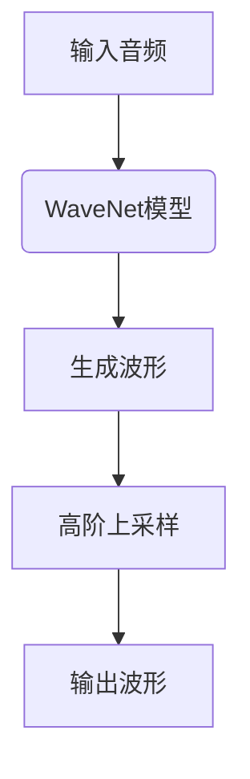

这是一个很有意思和挑战性的话题。让我们一起深入探讨音频生成的原理和实践。

# 音频生成(Audio Generation) - 原理与代码实例讲解

## 1. 背景介绍

### 1.1 问题的由来

随着人工智能和深度学习技术的飞速发展,音频生成已经成为一个热门的研究领域。传统的音频生成方法通常依赖于预先录制的音频样本,通过拼接、混合等方式生成新的音频。然而,这种方法的灵活性和创造力受到了限制。

近年来,基于深度学习的端到端(end-to-end)音频生成模型逐渐兴起,它们可以直接从原始数据(如文本、图像等)生成高质量的音频,极大地拓展了音频生成的应用场景。

### 1.2 研究现状

目前,音频生成主要有以下几种方法:

1. **WaveNet**: 这是最早的基于深度学习的音频生成模型之一,由DeepMind提出。它采用自回归卷积神经网络生成原始波形,可以生成逼真的语音和音乐。

2. **神经编码器-解码器(Encoder-Decoder)**: 将音频生成任务建模为序列到序列(Seq2Seq)的问题,使用编码器捕获输入数据的特征,解码器根据这些特征生成音频。

3. **生成对抗网络(GAN)**: 将生成器和判别器对抗训练,生成器试图生成逼真的音频以欺骗判别器,判别器则努力区分真实音频和生成音频。

4. **变分自编码器(VAE)**: 将输入音频映射到连续的潜在空间,然后从该空间采样生成新的音频。

5. **扩散模型**: 最新的生成模型,通过从高斯噪声中逐步去噪,生成高质量的音频和图像。

这些方法各有优缺点,研究人员正在不断探索和改进,以提高音频生成的质量和多样性。

### 1.3 研究意义

高质量的音频生成技术具有广泛的应用前景:

1. **语音合成**: 生成逼真的人声,用于虚拟助手、有声读物等场景。

2. **音乐创作**: 辅助作曲,生成新颖的音乐素材。

3. **影视制作**: 生成逼真的音效,提高影视作品的沉浸感。

4. **辅助交互**: 为人机交互系统生成多模态响应(语音、音乐等)。

5. **数据增强**: 为语音识别等任务生成大量训练数据,提高模型性能。

因此,音频生成是人工智能领域一个极具潜力和价值的研究方向。

### 1.4 本文结构  

本文将全面介绍音频生成的核心概念、算法原理、数学模型、项目实践、应用场景等内容。我们将从浅入深、理论与实践相结合,帮助读者全面掌握音频生成的方方面面。文章结构安排如下:

## 2. 核心概念与联系

音频生成涉及多个核心概念,包括**时间序列建模**、**自回归模型**、**生成模型**等,这些概念在音频生成中扮演着重要角色。我们先来了解它们的基本含义和内在联系。

### 2.1 时间序列建模

音频数据本质上是一种时间序列数据,即一系列按时间顺序排列的数值。时间序列建模旨在从历史数据中捕获模式和规律,并对未来数据进行预测或生成。

常见的时间序列建模方法有:

- **自回归模型(AR)**:利用历史数据的线性组合来预测当前值。
- **移动平均模型(MA)**:利用历史数据的残差项的线性组合来预测当前值。
- **ARMA模型**:将AR和MA模型结合,同时利用历史数据和残差项进行预测。
- **ARIMA模型**:在ARMA模型的基础上,引入差分运算来处理非平稳序列。

对于音频生成任务,我们通常采用更加灵活和强大的**深度学习模型**,如RNN、LSTM等,来对复杂的音频时间序列进行建模。

### 2.2 自回归模型

自回归模型(Autoregressive Model)是时间序列建模的一种重要方法。在自回归模型中,当前时间步的输出不仅依赖于输入数据,还依赖于之前时间步的输出。

形式化地,给定时间序列 $\{x_t\}$,自回归模型的公式可以表示为:

$$x_t = f(x_{t-1}, x_{t-2}, ..., x_{t-n}; \theta)$$

其中 $f$ 是一个函数(可以是线性的或非线性的), $\theta$ 是模型参数, $n$ 是考虑的历史步数。

自回归模型在音频生成中扮演着关键角色,因为音频数据具有强烈的时间相关性和持续性。通过自回归建模,我们可以捕获音频数据中的长期依赖关系,从而生成更加连贯、流畅的音频。

### 2.3 生成模型

生成模型(Generative Model)是一种通过学习训练数据的潜在分布,从而生成新数据的模型。与判别模型(判断给定数据属于哪个类别)不同,生成模型关注如何从底层的潜在因素生成观测数据。

一些典型的生成模型包括:

- **高斯混合模型(GMM)**
- **隐马尔可夫模型(HMM)** 
- **受限玻尔兹曼机(RBM)**
- **变分自编码器(VAE)**
- **生成对抗网络(GAN)**

近年来,基于深度学习的生成模型在音频、图像、文本等多个领域展现出了强大的生成能力,成为音频生成研究的主流方向。

这些核心概念相互关联、环环相扣。音频生成需要对时间序列数据进行建模,自回归模型是一种行之有效的时间序列建模方法,而生成模型则为我们提供了一种学习数据分布、生成新数据的有力工具。接下来,我们将具体介绍音频生成的核心算法原理。

## 3. 核心算法原理与具体操作步骤

在音频生成领域,有多种算法和模型被广泛使用和研究。我们将重点介绍三种核心算法:WaveNet、Encoder-Decoder和Diffusion Model。

### 3.1 WaveNet算法原理概述

WaveNet是DeepMind于2016年提出的一种用于生成原始波形的自回归模型。它的核心思想是:

1. 将波形建模为一个离散的概率分布,通过对每个采样点的概率密度估计,从而生成波形。

2. 使用堆叠的因果卷积神经网络作为建模工具,以捕获音频数据中的长期依赖关系。

3. 引入高阶上采样(高斯滤波),以提高生成波形的质量。

4. 通过最大化生成波形的条件对数似然,进行有监督的端到端训练。

WaveNet的创新之处在于,它直接对原始波形进行建模,而不是传统的声码器特征,从而避免了信息损失,生成音质更加自然逼真。

### 3.2 WaveNet算法步骤详解

WaveNet算法的具体步骤如下:

1. **数据预处理**:将原始音频波形量化为离散的值序列,如8位或16位整数序列。

2. **堆叠卷积层**:使用多层因果卷积神经网络对输入序列进行编码,每一层捕获不同尺度的局部特征。

3. **门控激活单元**:在每个卷积层之后,使用门控激活单元(如gated tanh)来更好地捕获长期依赖关系。

4. **残差连接和跳跃连接**:为了缓解深层网络的梯度消失问题,引入残差连接和跳跃连接。

5. **softmax分类**:对编码后的特征向量进行softmax分类,输出每个量化值的概率分布。

6. **采样生成**:根据softmax输出的概率分布,对每个时间步进行采样,生成量化的波形序列。

7. **高阶上采样**:使用高斯滤波核对生成的低分辨率波形进行上采样,恢复为高质量的连续波形。

8. **模型训练**:通过最大化生成波形与真实波形的条件对数似然,对WaveNet模型进行有监督的端到端训练。

WaveNet虽然生成质量优秀,但由于其自回归特性,生成效率较低。后续的研究工作主要集中在提高生成效率,以及探索无监督或半监督的训练方式。

### 3.3 WaveNet算法优缺点

**优点**:

1. 直接对原始波形进行建模,避免了信息损失,生成音质自然逼真。
2. 堆叠卷积神经网络结构,能够有效捕获音频数据中的长期依赖关系。
3. 高阶上采样技术,进一步提高了生成波形的质量。

**缺点**:

1. 由于自回归特性,生成效率较低,无法高效生成长音频。
2. 需要大量的训练数据和计算资源,模型训练和推理成本较高。
3. 生成过程是单向的,无法根据上下文进行交互式生成。

### 3.4 WaveNet算法应用领域

WaveNet主要应用于以下几个领域:

1. **语音合成**:生成高质量的人声语音,用于虚拟助手、有声读物等场景。

2. **音乐创作**:生成各种乐器声音和音乐素材,辅助作曲。

3. **音效生成**:为影视动画生成逼真的环境音效,增强沉浸感。

4. **语音转换**:将一个人的语音转换为另一个人的语音,用于语音伪造等任务。

5. **语音增强**:生成清晰的语音以提高语音识别的性能。

WaveNet开创了深度生成模型在音频领域的应用,为后续的相关研究工作奠定了基础。接下来,我们将介绍另一种广为人知的音频生成模型:Encoder-Decoder。

## 4. 数学模型和公式详细讲解举例说明

在介绍音频生成的数学模型之前,我们先了解一下相关的基础知识。

### 4.1 时间序列建模基础

音频数据是一种时间序列数据,可以表示为一个序列 $\{x_t\}_{t=1}^T$,其中 $x_t$ 表示时间步 $t$ 的音频采样值。

时间序列建模的目标是学习概率分布 $P(X)$,对给定的时间序列 $X=(x_1, x_2, ..., x_T)$ 进行概率建模。根据链式法则,我们可以将联合概率分解为条件概率的乘积:

$$P(X) = P(x_1, x_2, ..., x_T) = \prod_{t=1}^T P(x_t | x_1, ..., x_{t-1})$$

传统的自回归模型通常对条件概率 $P(x_t | x_1, ..., x_{t-1})$ 进行建模,即当前时间步的输出仅依赖于之前的输出。而神经序列模型则能够更好地捕获长期依赖关系,对整个条件概率分布 $P(x_t | x_1, ..., x_{t-1})$ 进行建模。

### 4.2 Encoder-Decoder模型

Encoder-Decoder模型将音频生成任务建模为一个序列到序列(Seq2Seq)的问题。它包含两个主要组件:

1. **Encoder(编码器)**: 将输入序列(如文本、图像等)编码为一个潜在表示 $z$。
2. **Decoder(解码器)**: 将潜在表示 $z$ 解码为目标音频序列 $\{y_t\}_{t=1}^T$。

编码器和解码器通常都是基于递归神经网络(如LSTM、GRU)或者Transformer等序列模型。

在训练过程中,我们最大化生成序列 $Y$ 的条件对数似然:

$$\max_{\theta} \log P(Y|X; \theta) = \sum_{t=1}^T \log P(y_t | y_1, ..., y_{t-1}, X; \theta)$$

其中 $\theta