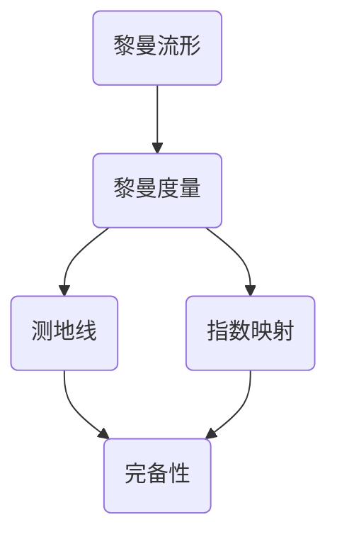

# 黎曼几何引论：Hopf-rinow定理

## 1. 背景介绍
### 1.1  问题的由来
黎曼几何是数学的一个重要分支,它研究具有内蕴曲率的流形。在黎曼几何中,Hopf-Rinow定理是一个关键性的结果,它揭示了完备黎曼流形的一些重要性质。这个定理最早由Heinz Hopf和Willi Rinow在1931年提出和证明。
### 1.2  研究现状
自从Hopf-Rinow定理提出以来,它就成为黎曼几何研究的一个重要基石。许多数学家在此基础上进行了深入研究,得到了一系列重要结果。比如,Gromov和Cheeger利用Hopf-Rinow定理研究了黎曼流形的紧致性问题。Perelman利用Hopf-Rinow定理对Poincaré猜想给出了一个新的证明思路。
### 1.3  研究意义 
Hopf-Rinow定理在黎曼几何乃至整个数学领域都有着重要意义:

1. 它揭示了完备黎曼流形的一些本质性质,如测地线的存在性和完备性等。
2. 它是研究黎曼流形大范围理论的基础,在黎曼几何的许多问题中都发挥着关键作用。
3. 它体现了局部性质和整体性质之间的联系,展现了数学的内在美和和谐。
4. 它启发了现代几何学的发展,如Gromov引入的逐点有界几何就受到Hopf-Rinow定理的启发。

### 1.4  本文结构
本文将从以下几个方面来探讨Hopf-Rinow定理:

1. 介绍黎曼几何的一些核心概念,如黎曼度量、测地线等。 
2. 阐述Hopf-Rinow定理的主要内容和证明思路。
3. 分析Hopf-Rinow定理蕴含的数学原理和思想方法。
4. 举例说明Hopf-Rinow定理在几何和分析中的应用。
5. 探讨Hopf-Rinow定理对现代数学发展的影响和启示。

## 2. 核心概念与联系
在讨论Hopf-Rinow定理之前,我们先来了解一下黎曼几何的一些核心概念。

**黎曼流形**: 一个n维光滑流形M配备了一个黎曼度量g,称为黎曼流形,记为(M,g)。直观地说,黎曼流形就是曲率不为零的光滑曲面。

**黎曼度量**: 对流形上每一点的切空间定义一个内积,光滑地变化,就得到黎曼度量。它是研究黎曼流形的基本工具。

**测地线**: 黎曼流形上的测地线是长度最短的曲线,类似于欧氏空间中的直线。测地线是理解黎曼流形的重要概念。

**指数映射**: 在黎曼流形上每一点处,可以定义指数映射,将切向量映射到对应的测地线上。它反映了局部和整体的联系。

**完备性**: 如果黎曼流形的测地线可以无限延拓,那么称此流形是完备的。完备性是黎曼流形的整体性质。

这些概念之间有着紧密联系,组成了黎曼几何的基本框架。Hopf-Rinow定理就建立在这些概念之上,揭示了它们之间的内在规律。



## 3. 核心算法原理 & 具体操作步骤
### 3.1  算法原理概述
Hopf-Rinow定理的证明用到了黎曼几何和分析的许多重要方法,体现了数学的精妙和创造性。其主要思想是:

1. 利用指数映射将问题局部化,化整为零。
2. 利用测地线的极小性质,将局部性质提升为整体性质。
3. 利用完备性条件,保证测地线的延拓性。

### 3.2  算法步骤详解
下面我们来详细介绍Hopf-Rinow定理的证明步骤:

1. 局部化:对任意一点x∈M,在x点的切空间TxM上可以定义指数映射 expx:TxM→M,将切向量v映射到距离为|v|的测地线上。

2. 极小性质:测地线是长度极小的曲线,即任意两点之间的测地线都比其他曲线短。这个性质保证了测地线在局部邻域内的存在性和唯一性。

3. 延拓性:如果(M,g)是完备的,那么测地线可以无限延拓。具体来说,对任意的测地线 γ:[0,a)→M,如果当t→a时,γ(t)收敛于M上的一点,那么γ可以延拓到[0,a]上。

4. 紧致性:由测地线的延拓性可以推出,任意闭球Br(x)={y∈M:d(x,y)≤r}都是紧的。这是因为,任意y∈Br(x)都可以用一条长度不超过r的测地线连接到x。

5. 完备性:由紧致性可知,闭球Br(x)中任意Cauchy列都收敛于Br(x)内的一点。由闭球的任意性可知,(M,g)是完备的。

6. 闭包定理:设(M,g)是连通的完备黎曼流形,U⊂M是开集,则U的闭包¯¯¯U也是测地凸的。这可由紧致性和测地线的延拓性推出。

### 3.3  算法优缺点
Hopf-Rinow定理的证明是非常精彩的,它巧妙地利用了黎曼几何的基本概念,通过局部到整体的提升,揭示了完备性和紧致性之间的内在联系。这种思想方法对后来的数学研究产生了深远影响。

但同时,Hopf-Rinow定理也有其局限性。它只适用于黎曼流形,对于更一般的度量空间,可能不再成立。此外,定理的证明用到了较深的分析方法,对初学者来说可能不太容易理解。

### 3.4  算法应用领域
Hopf-Rinow定理在黎曼几何和分析中有广泛应用,主要体现在以下几个方面:

1. 研究黎曼流形的大范围理论,如紧致性、收敛性等。
2. 研究黎曼流形上的调和分析和热核估计问题。
3. 研究黎曼流形上的极小曲面和测地线问题。
4. 研究黎曼流形的特征值和谱理论问题。

此外,Hopf-Rinow定理的思想方法也启发了其他数学领域的研究,如度量空间理论、几何群论等。

## 4. 数学模型和公式 & 详细讲解 & 举例说明
### 4.1  数学模型构建
为了精确刻画Hopf-Rinow定理,我们需要引入一些数学模型和公式。设(M,g)是n维黎曼流形,其中g=∑gijdxi⊗dxj是黎曼度量,Γijk是Christoffel符号,定义为:

$\Gamma_{ij}^k=\frac{1}{2}g^{kl}(\frac{\partial g_{jl}}{\partial x^i}+\frac{\partial g_{il}}{\partial x^j}-\frac{\partial g_{ij}}{\partial x^l})$

设γ(t)是M上的一条曲线,它在局部坐标下的表示为 xi=xi(t),则γ(t)是测地线当且仅当它满足测地线方程:

$\frac{d^2x^k}{dt^2}+\sum_{i,j}\Gamma_{ij}^k\frac{dx^i}{dt}\frac{dx^j}{dt}=0$

黎曼流形(M,g)上两点x,y的距离可用测地线的长度来定义:

$d(x,y)=\inf_\gamma\int_0^1\sqrt{\sum_{i,j}g_{ij}(\gamma(t))\frac{dx^i}{dt}\frac{dx^j}{dt}}dt$

其中下确界取遍所有连接x,y的可求长曲线γ:[0,1]→M。

### 4.2  公式推导过程
下面我们来推导Hopf-Rinow定理的一些关键公式。

1. 指数映射的表达式:设v∈TxM是x点处的单位切向量,expx(tv)表示从x出发,方向为v,长度为t的测地线的终点,则有

$\exp_x(tv)=\gamma_v(t),\quad \gamma_v(0)=x,\quad \dot{\gamma}_v(0)=v$

其中γv(t)是满足测地线方程的曲线。

2. 指数映射的微分:设w∈TxM是另一个切向量,则expx在tv处沿w方向的导数为

$d(\exp_x)_{tv}(w)=J(t),\quad J(0)=0,\quad \dot{J}(0)=w$

其中J(t)是Jacobi场,满足Jacobi方程:

$\ddot{J}+R(\dot{\gamma}_v,J)\dot{\gamma}_v=0$

这里R是黎曼曲率张量。

3. 指数映射的奇点:如果Jacobi场J(t)在t=t0处消失,即J(t0)=0,则称t0v是expx的共轭点。可以证明,当t足够小时,expx是单射,但当t超过第一个共轭点时,expx不再是单射。

4. 完备性与测地线延拓:设(M,g)是完备黎曼流形,γ:[0,a)→M是测地线,如果极限limt→aγ(t)存在,那么γ可以延拓到[0,a]上。这可用Cauchy列的收敛性来证明。

### 4.3  案例分析与讲解
下面我们来看一些具体的例子,来加深对Hopf-Rinow定理的理解。

例1:欧氏空间Rn上的通常度量ds2=∑(dxi)2显然是完备的,因为任意测地线都可以无限延拓。此时Hopf-Rinow定理是平凡成立的。

例2:单位球面Sn⊂Rn+1也是完备黎曼流形。这是因为,任意大圆弧都是测地线,而大圆弧显然可以延拓为整个大圆。

例3:双曲空间Hn的Poincaré模型{x∈Rn:|x|<1}配备黎曼度量 ds2=4∑(dxi)2/(1-|x|2)2 也是完备的。这可用Möbius变换下测地线的不变性来证明。

例4:设M是紧致黎曼流形,则M一定是完备的。这是因为,紧致性保证了任意测地线的延拓性。反之,如果完备黎曼流形是紧致的,则它的直径一定有限。

这些例子展示了Hopf-Rinow定理在不同情形下的应用,体现了它的普适性和重要性。

### 4.4  常见问题解答
问题1:Hopf-Rinow定理的逆定理是否成立?即若黎曼流形上任意闭测地球都是紧的,是否可推出它是完备的?

答:一般情况下逆定理不成立。比如,在双曲空间H2上去掉一个点得到的流形M,它不是完备的,但任意闭测地球都是紧的。

问题2:Hopf-Rinow定理能否推广到度量空间?

答:对于一般的度量空间,Hopf-Rinow定理未必成立。但对于某些特殊的度量空间,如CAT(0)空间,类似的结论仍然成立。这引出了Gromov的逐点有界几何理论。

问题3:Hopf-Rinow定理在物理和工程中有何应用?

答:在广义相对论中,时空连续体通常被模型化为黎曼流形。Hopf-Rinow定理保证了测地线的完备性,这在研究粒子运动和因果结构时非常重要。在工程中,很多优化问题可以转化为黎曼流形上的测地线问题,Hopf-Rinow定理提供了理论保障。

## 5. 项目实践：代码实例和详细解释说明
### 5.1  开发环境搭建
在Python中,我们可以利用NumPy和SciPy库来模拟黎曼流形和测地线。首先导入所需的库:

```python
import numpy as np
from scipy.integrate import solve_ivp
```

### 5.2  