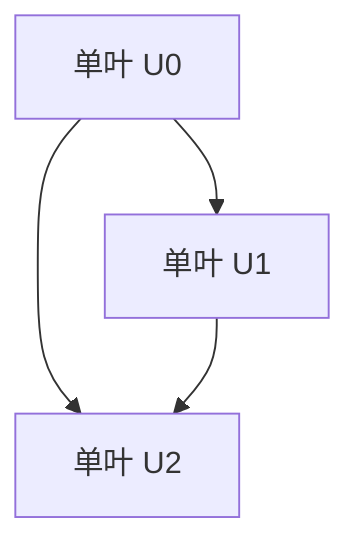

# 黎曼曲面：非紧Riemann曲面

## 1. 背景介绍

### 1.1 问题的由来

黎曼曲面是一个广泛应用于数学、物理和工程领域的重要概念。它源于19世纪初期,由伟大的数学家伯恩哈德·黎曼(Bernhard Riemann)提出。黎曼曲面是对欧几里德平面的推广,允许在曲面上定义复分析函数。

在研究复分析函数时,人们发现平面上的单值函数在某些点存在奇异性,例如对数函数在原点处有一个分支点。为了解决这个问题,黎曼提出了一种新的曲面,称为黎曼曲面,它可以将多值函数在不同的单叶上表示为单值函数。

### 1.2 研究现状

黎曼曲面理论自诞生以来,一直是数学研究的热点领域之一。在过去的两个世纪里,数学家们对黎曼曲面的性质、构造方法和应用进行了深入的研究。

目前,黎曼曲面理论已经发展成为一个成熟的分支,涉及到代数几何、拓扑学、复分析等多个数学领域。研究人员已经建立了一系列关于黎曼曲面的理论框架,如Abel定理、Riemann-Roch定理等,并且发现了黎曼曲面在物理学、工程学等领域的广泛应用。

### 1.3 研究意义

黎曼曲面理论具有重要的理论意义和应用价值。从理论层面上讲,黎曼曲面为复分析函数的研究提供了一种新的视角,帮助人们更好地理解和处理多值函数的性质。同时,黎曼曲面也为代数几何、拓扑学等数学分支提供了新的研究对象和方法。

在应用层面上,黎曼曲面在物理学、工程学等领域发挥着重要作用。例如,在量子场论中,费米子的传播可以用黎曼曲面来描述;在计算机图形学中,黎曼曲面可以用于表面参数化和网格生成;在通信领域,黎曼曲面也被应用于信号处理和编码等方面。

### 1.4 本文结构

本文将全面介绍黎曼曲面的基本概念、理论基础和应用领域。文章将分为以下几个部分:

1. 背景介绍
2. 核心概念与联系
3. 核心算法原理与具体操作步骤
4. 数学模型和公式详细讲解与举例说明
5. 项目实践:代码实例和详细解释说明
6. 实际应用场景
7. 工具和资源推荐
8. 总结:未来发展趋势与挑战
9. 附录:常见问题与解答

## 2. 核心概念与联系

黎曼曲面是一个丰富而复杂的概念,它与许多其他数学概念密切相关。在介绍黎曼曲面的核心概念之前,我们先来了解一下它与其他概念的联系。

首先,黎曼曲面是对欧几里德平面的推广,它允许在曲面上定义复分析函数。复分析函数是复变函数论的核心概念,描述了复变量之间的函数关系。

其次,黎曼曲面与代数曲线和代数曲面有着密切的联系。事实上,每一个代数曲线或代数曲面都可以构造出一个对应的黎曼曲面。这种联系为研究代数曲线和曲面提供了新的视角和方法。

再次,黎曼曲面与拓扑学概念也有着内在的联系。黎曼曲面的构造过程涉及到了许多拓扑不变量,如基本群、同伦群等。同时,黎曼曲面本身也是一种特殊的拓扑空间,具有丰富的拓扑性质。

最后,黎曼曲面还与代数几何、微分几何等数学分支有着密切的关联。例如,在代数几何中,人们研究黎曼曲面上的线性系统、丰富度等概念;而在微分几何中,人们则关注黎曼曲面上的度量张量、曲率等性质。

总的来说,黎曼曲面是一个跨学科的概念,它将复分析、代数几何、拓扑学和微分几何等数学分支紧密地联系在一起,为这些领域的研究提供了新的视角和方法。

## 3. 核心算法原理与具体操作步骤

### 3.1 算法原理概述

构造黎曼曲面的核心算法原理是将一个代数曲线或代数曲面"展开"为一个二维或高维的曲面,使得原来在平面上表示为多值函数的复分析函数,在这个新的曲面上可以表示为单值函数。

这个过程可以概括为以下几个步骤:

1. 确定一个代数曲线或代数曲面的方程。
2. 对该方程进行因式分解,得到一个或多个不可约多项式。
3. 将每个不可约多项式对应的曲线或曲面"展开"为一个单叶。
4. 将所有单叶沿着它们的分支点适当地"缝合"在一起,形成一个连通的曲面。

通过这个过程,我们就得到了一个黎曼曲面,它是由多个单叶组成的一个复杂的拓扑空间。在这个曲面上,原来在平面上表示为多值函数的复分析函数,现在可以表示为单值函数了。

### 3.2 算法步骤详解

下面我们将详细介绍构造黎曼曲面的算法步骤。为了便于理解,我们将以一个具体的例子来说明。

假设我们要构造代数曲线 $y^2 = x^3 - x$ 对应的黎曼曲面。首先,我们对该方程进行因式分解:

$$y^2 = x^3 - x = x(x^2 - 1) = x(x - 1)(x + 1)$$

可以看出,这个方程有三个不可约因子 $x$、$(x - 1)$ 和 $(x + 1)$。

接下来,我们将每个不可约因子对应的曲线"展开"为一个单叶。对于 $x = 0$ 这条直线,我们将它展开为一个无边无界的平面 $\mathbb{R}^2$,记为 $U_0$。对于 $x - 1 = 0$ 这条直线,我们将它展开为另一个无边无界的平面 $\mathbb{R}^2$,记为 $U_1$。最后,对于 $x + 1 = 0$ 这条直线,我们将它展开为第三个无边无界的平面 $\mathbb{R}^2$,记为 $U_2$。

现在,我们需要将这三个单叶沿着它们的分支点适当地"缝合"在一起。在本例中,三个单叶在无穷远处相交,所以我们需要将它们的无穷远边缘"缝合"在一起。具体来说,我们将 $U_0$ 和 $U_1$ 的正无穷半线缝合在一起,将 $U_0$ 和 $U_2$ 的负无穷半线缝合在一起,将 $U_1$ 和 $U_2$ 的无穷远点缝合在一起。

经过这个"缝合"过程,我们就得到了一个连通的黎曼曲面,如下图所示:

在这个黎曼曲面上,原来在平面上表示为多值函数的 $\sqrt{x^3 - x}$,现在可以表示为单值函数了。具体来说,在 $U_0$ 上,它取值为 $\sqrt{x}$;在 $U_1$ 上,它取值为 $\sqrt{x - 1}$;在 $U_2$ 上,它取值为 $-\sqrt{x + 1}$。

### 3.3 算法优缺点

构造黎曼曲面的算法具有以下优点:

1. 简单直观:算法思路清晰,易于理解和实现。
2. 通用性强:该算法可以应用于任何代数曲线或代数曲面,构造出对应的黎曼曲面。
3. 保持了原曲线或曲面的代数结构:构造出的黎曼曲面与原曲线或曲面具有相同的代数结构,便于进一步研究。

但是,这个算法也存在一些缺点:

1. 计算复杂度较高:对于高阶代数方程,因式分解和"缝合"过程可能会变得非常复杂。
2. 可视化困难:黎曼曲面是一个高维拓扑空间,很难直观地可视化和表示。
3. 理论基础要求较高:算法背后涉及到了代数几何、拓扑学等深奥的数学理论,对于初学者来说可能难以完全掌握。

### 3.4 算法应用领域

构造黎曼曲面的算法在数学、物理学和工程学等领域都有广泛的应用。

在数学领域,黎曼曲面理论为研究代数曲线、代数曲面等提供了新的视角和方法。通过研究黎曼曲面的性质,人们可以更好地理解和处理代数方程的解析解。

在物理学领域,黎曼曲面被广泛应用于量子场论、弦论等前沿理论。例如,在量子场论中,费米子的传播可以用黎曼曲面来描述,这为研究费米子的性质提供了新的工具。

在工程学领域,黎曼曲面也有着重要的应用。例如,在计算机图形学中,黎曼曲面可以用于表面参数化和网格生成,为三维建模提供了新的方法。另外,在通信领域,黎曼曲面也被应用于信号处理和编码等方面。

总的来说,构造黎曼曲面的算法不仅在理论层面上具有重要意义,而且在实际应用中也发挥着重要作用。它为多个学科领域的发展提供了有力的工具和方法。

## 4. 数学模型和公式详细讲解与举例说明

### 4.1 数学模型构建

为了更好地理解和研究黎曼曲面,数学家们构建了一系列数学模型。这些模型不仅为黎曼曲面的理论研究提供了坚实的基础,也为实际应用提供了有力的工具。

最基本的数学模型是将黎曼曲面视为一个复析构品。具体来说,一个黎曼曲面 $X$ 可以表示为一个有限个坐标卡片 $(U_\alpha, \varphi_\alpha)$ 的并,其中 $U_\alpha$ 是 $\mathbb{C}^n$ 中的开子集,而 $\varphi_\alpha: U_\alpha \rightarrow X$ 是一个全纯映射。这些坐标卡片在它们的交集上需要满足一些余切条件,以保证整个曲面是连通的。

在这个模型中,我们可以定义黎曼曲面上的全纯函数、全纯微分形式等概念,并研究它们的性质。例如,我们可以计算一个全纯函数在黎曼曲面上的零点和极值的分布,或者研究微分形式的积分等。

另一个重要的数学模型是将黎曼曲面视为一个代数簇。在这个模型中,我们将黎曼曲面 $X$ 看作是一个代数方程在 $\mathbb{P}^n$ 中的解析集。这种视角将黎曼曲面与代数几何紧密地联系在一起,为我们研究黎曼曲面的代数几何性质提供了有力的工具。

例如,我们可以计算黎曼曲面的几何genus、算术genus等不变量,研究它们之间的关系。同时,我们也可以应用代数几何中的一些重要定理,如 Riemann-Roch 定理、Abel 定理等,来研究黎曼曲面上的线性系统和丰富度等概念。

除了这两个基本模型之外,数学家们还构建了许多其他的数学模型,如将黎曼曲面视为一个微分流形、一个拓扑空间等。这些模型为我们从不同的角度研究黎曼曲面提供了丰富的视角和方法。

### 4.2 公式推导过程

在研究黎曼曲面的过程中,我们经常需要推导