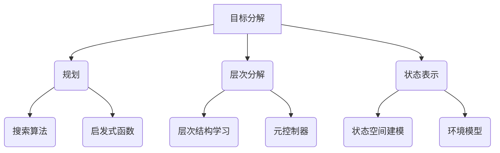

# AI Agent 如何将系统输入转化为可执行的原子动作序列，以实现最终目标

## 1. 背景介绍

### 1.1 问题的由来

在人工智能系统中，代理(Agent)需要根据环境的输入来决策和执行相应的动作,以达成既定的目标。然而,从原始输入到最终目标之间存在着一个重要的鸿沟,即如何将高层次的任务目标分解为一系列可执行的原子动作序列。这一问题的解决对于实现智能系统的自主性和有效性至关重要。

在复杂环境中,代理需要处理多种输入信号,如视觉、语音、文本等,并将其转化为对应的动作指令。这些动作指令通常是离散的和原子性的,如机器人的关节运动或软件程序的API调用。然而,人类给出的目标通常是高层次的,如"打扫房间"或"预订机票"。因此,代理需要能够将这些高层次目标分解为一系列有条理的原子动作序列,以便执行和实现最终目标。

### 1.2 研究现状

目前,将高层次目标分解为原子动作序列的研究主要集中在以下几个方向:

1. **经典规划算法**: 这些算法基于符号逻辑和搜索技术,试图从初始状态和目标状态推导出一系列动作序列。著名的算法包括状态空间搜索、层次任务网络(HTN)规划等。然而,这些算法通常假设环境是完全可观测的,并且需要手动编码领域知识,难以应对复杂动态环境。

2. **强化学习**: 强化学习算法通过与环境的交互来学习最优策略,可以直接从原始输入(如像素级别的视觉数据)中学习动作序列。但是,强化学习算法通常需要大量的试错数据,并且难以解释和理解学习到的策略。

3. **层次强化学习**: 这种方法试图将任务分解为不同层次的子任务,每个子任务由一个较低层次的策略来完成。通过这种分层方式,代理可以更好地处理长期依赖和可转移性问题。但是,如何自动发现和学习这些层次结构仍然是一个挑战。

4. **神经程序合成**: 这种方法使用神经网络来直接生成可执行的程序代码,从而将高层次目标转化为动作序列。神经程序合成可以利用大量的程序数据进行训练,但生成的程序可解释性较差,并且难以保证正确性和鲁棒性。

5. **神经符号集成**: 这种方法试图将神经网络和符号系统相结合,利用神经网络的强大表示能力和符号系统的可解释性和可组合性。但是,如何有效地集成这两种范式仍然是一个挑战性的研究课题。

总的来说,将高层次目标转化为原子动作序列是一个错综复杂的问题,需要综合利用多种技术和方法。下一部分将介绍这一问题的核心概念和算法原理。

### 1.3 研究意义

能够将高层次目标分解为可执行的原子动作序列,对于实现真正的人工智能系统具有重要意义:

1. **自主性提升**: 智能代理能够根据高层次目标自主规划和执行动作序列,而不需要人工逐步指导,从而大大提高了系统的自主性能力。

2. **任务复杂性处理**: 通过分解和规划,代理可以处理复杂的长期序列决策问题,而不是仅限于简单的单步决策。这使得代理能够应对更加复杂的现实世界任务。

3. **可解释性增强**: 将目标分解为动作序列的过程,为代理的决策提供了可解释的中间表示,有助于人类理解和信任智能系统的行为。

4. **知识融合**: 在目标分解的过程中,可以融合多种形式的知识,如经验知识、规则知识、模型知识等,从而提高系统的智能水平。

5. **泛化和迁移**: 通过学习将目标分解为动作序列的能力,代理可以更好地将已学习的知识迁移和泛化到新的任务和环境中。

因此,研究如何将高层次目标转化为原子动作序列,对于推动人工智能系统向真正的智能迈进至关重要。

### 1.4 本文结构

本文将从理论和实践两个层面,全面阐述如何将高层次目标分解为可执行的原子动作序列。主要内容包括:

1. 核心概念与联系
2. 核心算法原理及具体操作步骤
3. 数学模型和公式详细讲解与案例分析
4. 项目实践:代码实例和详细解释说明
5. 实际应用场景
6. 工具和资源推荐
7. 总结:未来发展趋势与挑战
8. 附录:常见问题与解答

接下来,我们将从核心概念入手,为读者打下理论基础。

## 2. 核心概念与联系

将高层次目标分解为原子动作序列,涉及了多个核心概念,包括**规划**、**层次分解**、**状态表示**等。这些概念相互关联,共同构建了该问题的理论框架。

1. **规划(Planning)**: 规划是一种根据给定的初始状态和目标状态,自动推导出一系列动作序列的过程。规划算法通常采用启发式搜索或其他优化技术,在状态空间中寻找从初始状态到目标状态的最优路径。经典的规划算法包括A*搜索、快速前向规划等。

2. **层次分解(Hierarchical Decomposition)**: 层次分解是将复杂任务分解为多个层次的子任务的过程。每个子任务由一个较低层次的策略来完成,最终实现高层次目标。层次分解可以减少搜索空间,提高规划效率,并增强系统的可解释性和可迁移性。关键技术包括层次结构学习和元控制器设计。

3. **状态表示(State Representation)**: 状态表示是将环境的原始输入(如图像、文本等)转化为适合规划和决策的内部表示形式。有效的状态表示对于减少状态空间的维数、捕捉任务相关的特征至关重要。常用的状态表示方法包括符号状态、向量状态等。

4. **搜索算法(Search Algorithms)**: 搜索算法是规划中用于在状态空间中寻找最优路径的核心算法。常见的搜索算法包括A*搜索、Best-First搜索、Monte Carlo树搜索等。这些算法通常需要设计合适的启发式函数来提高搜索效率。

5. **启发式函数(Heuristic Functions)**: 启发式函数用于估计当前状态到目标状态的剩余代价,从而引导搜索算法朝着更有希望的方向前进。设计好的启发式函数可以极大地提高规划效率。常见的启发式函数包括曼哈顿距离、子目标交互等。

6. **层次结构学习(Hierarchy Learning)**: 层次结构学习是自动发现和构建任务层次结构的过程。这可以通过数据驱动的方法(如技能发现)或基于领域知识的方法(如层次任务网络)来实现。学习到的层次结构可以用于指导层次分解和规划。

7. **元控制器(Meta-Controller)**: 元控制器负责在不同层次的策略之间进行协调和切换,以实现高层次目标。它根据当前状态和子目标,选择合适的低层次策略来执行,并监控执行过程。元控制器的设计对于层次分解的效率和有效性至关重要。

8. **状态空间建模(State Space Modeling)**: 状态空间建模是将环境和任务形式化为一个状态空间模型的过程。这个模型定义了状态的表示、可执行的动作、状态转移函数等,为规划算法提供了形式化的基础。

9. **环境模型(Environment Model)**: 环境模型描述了代理与环境之间的交互,包括环境的动态、观测模型、奖励函数等。精确的环境模型可以用于模拟和规划,提高代理的决策质量。但在复杂环境中,建模本身就是一个挑战。

上述核心概念相互关联、环环相扣,共同构建了将高层次目标分解为原子动作序列的理论框架。接下来,我们将深入探讨核心算法的原理和具体操作步骤。

## 3. 核心算法原理 & 具体操作步骤

### 3.1 算法原理概述

将高层次目标分解为原子动作序列的核心算法原理,可以概括为以下几个关键步骤:

1. **状态空间建模**: 首先需要将环境和任务形式化为一个状态空间模型,定义状态的表示、可执行的动作、状态转移函数等。

2. **层次分解**: 根据任务的复杂性,将高层次目标分解为多个层次的子任务,每个子任务由一个较低层次的策略来完成。

3. **策略学习**: 在每个层次上,使用强化学习、监督学习或其他机器学习技术,学习能够完成对应子任务的策略。

4. **元控制**: 设计一个元控制器,根据当前状态和子目标,选择合适的低层次策略来执行,并监控执行过程。

5. **规划与搜索**: 在高层次,使用经典规划算法(如A*搜索)或其他启发式搜索技术,寻找从初始状态到目标状态的最优路径,即原子动作序列。

6. **执行与监控**: 执行规划出的原子动作序列,并根据执行反馈调整规划和策略。

该算法原理融合了多种技术,包括规划、层次分解、强化学习、搜索算法等,形成了一个完整的解决方案。下面将详细介绍每个步骤的具体操作。

### 3.2 算法步骤详解

1. **状态空间建模**

   - 定义状态的表示形式(如符号状态或向量状态)
   - 确定可执行的原子动作集合
   - 建立状态转移模型,描述动作如何改变当前状态
   - 构建环境模型,包括观测模型、奖励函数等

   状态空间建模为后续的规划和学习奠定了形式化的基础。在复杂环境中,这一步骤本身就是一个挑战,需要综合利用领域知识和数据驱动的方法。

2. **层次分解**

   - 根据任务的复杂性,将高层次目标分解为多个层次的子任务
   - 可以使用手工设计的层次任务网络(HTN)或自动层次结构学习
   - 每个子任务由一个较低层次的策略来完成
   - 层次分解可以减少搜索空间,提高规划效率

3. **策略学习**

   - 在每个层次上,使用强化学习、监督学习或其他机器学习技术
   - 学习能够完成对应子任务的策略
   - 策略可以是价值函数、策略网络或其他形式的模型
   - 可以利用示教数据、环境模拟或实际交互来获取训练数据

4. **元控制器设计**

   - 设计一个元控制器,作为高层次策略
   - 根据当前状态和子目标,选择合适的低层次策略来执行
   - 监控执行过程,根据反馈调整策略选择
   - 元控制器的设计对于层次分解的效率和有效性至关重要

5. **规划与搜索**

   - 在高层次,使用经典规划算法(如A*搜索)或其他启发式搜索技术
   - 搜索从初始状态到目标状态的最优路径,即原子动作序列
   - 需要设计合适的启发式函数来提高搜索效率
   - 可以利用学习到的低层次策略来估计动作代价

6. **执行与监控**

   - 执行规划出的原子动作序列
   - 监控执行过程,获取环境反馈
   - 根据反馈调整规划和策略
   - 在动态环境中,需要持