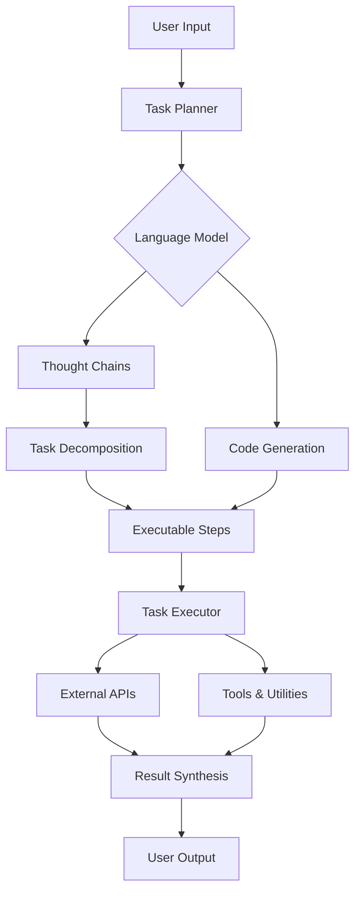

# AI Agent: AI的下一个风口 AutoGPT：通过自然语言的需求描述执行自动化任务

## 1. 背景介绍
### 1.1  问题的由来
人工智能(Artificial Intelligence, AI)技术的飞速发展正在深刻改变着我们的生活和工作方式。从智能客服、语音助手到自动驾驶汽车,AI无处不在。然而,目前大多数AI系统仍然是专用于特定任务的,缺乏通用性和自主学习能力。如何让AI系统像人一样,能够理解自然语言指令,自主学习和执行各种任务,是AI领域亟待解决的问题。

### 1.2 研究现状  
近年来,AI领域涌现出一批通用人工智能(Artificial General Intelligence, AGI)研究项目,如OpenAI的GPT系列语言模型、DeepMind的AlphaFold蛋白质结构预测系统等。这些AGI系统展现出了惊人的学习和推理能力,在多个领域取得了突破性进展。

其中最引人注目的当属Anthropic公司最新发布的AI Agent系统AutoGPT。与传统的AI助手不同,AutoGPT可以像人一样理解自然语言需求,自主制定和执行计划,完成复杂的多步骤任务。这标志着AI正在从感知智能走向认知智能、从专用系统走向通用系统的重大突破。

### 1.3 研究意义
AutoGPT的出现为未来AI系统的发展指明了方向。一个理想的AI Agent应该具备以下特点:
1. 拥有类似人类的认知和学习能力,能够理解、记忆和运用知识;
2. 能够进行因果推理、目标规划和任务分解,自主完成复杂任务;
3. 通过自然语言与人无缝交互,成为人类得力助手。

AutoGPT在这些方面都取得了重要进展,其背后的技术突破值得深入研究。AutoGPT的进一步发展将极大提升AI系统的智能水平和实用价值,为人类生活和科技进步做出重大贡献。

### 1.4 本文结构
本文将围绕AutoGPT这一最新AGI系统,深入探讨其核心原理、关键技术和应用前景。主要内容包括:

1. AutoGPT的整体架构与工作流程
2. 大语言模型(LLM)和思维链(CoT)推理技术
3. 任务规划、分解与执行的算法实现
4. 基于Python和LangChain的AutoGPT开源实现
5. AutoGPT在智能助理、代码开发等领域的应用
6. AutoGPT当前局限性和未来研究方向

## 2. 核心概念与联系

要理解AutoGPT的工作原理,首先需要了解以下几个核心概念:

- 大语言模型(Large Language Model, LLM):以GPT、BERT等为代表的海量语料预训练模型,具有强大的自然语言理解和生成能力,是AutoGPT的语言基础。

- 思维链(Chain-of-Thought, CoT)推理:一种多步骤推理方法。LLM根据问题生成推理链,解释了得出答案的中间步骤,大大提升了复杂推理任务的准确率。

- 提示工程(Prompt Engineering):通过精心设计输入文本,引导LLM进行特定任务如问答、写作等,是调用LLM能力的关键。

- 任务规划(Task Planning):将复杂任务分解为多个可执行的原子步骤,并合理安排执行顺序,是AutoGPT自主执行任务的基础。

- 代码自动生成(Code Generation):根据自然语言需求,自动生成可执行的代码片段。AutoGPT可以调用外部API和工具,实现更强大的功能。

下图展示了AutoGPT的核心组件和工作流程:

AutoGPT首先通过提示工程将用户输入转化为标准化任务描述,交给任务规划器进行分解。规划器生成一系列可执行步骤,每一步都通过LLM进行推理或代码生成。推理过程采用思维链方法,确保结果的可解释性。生成的代码片段可以调用外部API和工具,执行特定功能。最后,所有步骤的结果被整合,以自然语言的形式反馈给用户。

## 3. 核心算法原理 & 具体操作步骤

### 3.1 算法原理概述
AutoGPT的核心是大语言模型和思维链推理。传统的端到端LLM虽然在许多NLP任务上表现出色,但在复杂推理任务上容易出错,而且推理过程是黑盒的。CoT通过生成问题的推理链,每一步给出了得出结论的理由,增强了LLM的推理能力和可解释性。

另一方面,AutoGPT还利用LLM进行代码生成。通过精心设计的提示模板,引导模型生成特定编程语言的代码片段,再通过语法解析和运行时执行,实现更强大的功能。

### 3.2 算法步骤详解
AutoGPT的任务执行可以分为以下几个步骤:

1. 任务理解:对用户输入的自然语言需求进行语义解析,提取关键信息,转化为结构化的任务描述。
2. 任务分解:将复杂任务拆解为多个可执行的子任务或步骤,生成有向无环图(DAG)表示的任务流。
3. 步骤执行:对于每个原子步骤,根据需要调用LLM进行推理或代码生成。
   - 对于推理步骤,采用思维链方法,生成推理链并逐步执行;
   - 对于代码生成步骤,根据任务需求生成代码片段,并通过语法解析和运行时执行。
4. 结果整合:将各个步骤的输出结果进行汇总和后处理,以自然语言的形式生成最终输出。
5. 交互优化:根据用户反馈对执行过程进行优化,提高系统的鲁棒性和适应性。

### 3.3 算法优缺点
AutoGPT的主要优点包括:
- 通用性强,可以执行各种类型的任务,不限于特定领域;
- 使用自然语言交互,用户友好,易于使用;
- 支持多步骤复杂任务,自主性和灵活性高;
- 基于大语言模型,具有强大的语言理解和生成能力。

但AutoGPT目前也存在一些局限性:
- 依赖海量语料训练的LLM,训练成本高,难以个性化定制;
- 推理和生成过程不可控,可能产生错误或不恰当的结果;
- 缺乏常识推理能力,对于一些简单的任务可能出错;
- 安全性和伦理性有待进一步评估,如何避免滥用是一大挑战。

### 3.4 算法应用领域
AutoGPT作为一种通用AI Agent,可以应用于多个领域,包括但不限于:

- 智能客服:通过对话了解用户需求,提供个性化服务和解决方案。
- 代码开发:根据需求描述自动生成代码,提高开发效率。
- 数据分析:自动执行数据处理、可视化等任务,辅助数据驱动决策。
- 内容创作:协助撰写文案、文章、脚本等各类内容。
- 任务自动化:执行日常办公、数据处理等重复性任务,节省人力成本。

随着AutoGPT的不断发展和完善,其应用领域必将更加广泛。未来,AutoGPT有望成为每个人的得力助手,用自然语言就能完成各种任务,大大提升生活和工作效率。

## 4. 数学模型和公式 & 详细讲解 & 举例说明

### 4.1 数学模型构建
AutoGPT的核心是基于Transformer的大语言模型。Transformer是一种基于自注意力机制(Self-Attention)的神经网络结构,可以有效处理序列数据。其基本思想是,通过注意力机制计算序列中每个位置与其他位置的相关性,生成位置的上下文表示。

形式化地,给定输入序列$\mathbf{X}=(\mathbf{x}_1, \mathbf{x}_2, \dots, \mathbf{x}_n)$,Transformer的编码器将其映射为上下文表示序列$\mathbf{H}=(\mathbf{h}_1, \mathbf{h}_2, \dots, \mathbf{h}_n)$:

$$
\mathbf{H} = \text{Transformer}(\mathbf{X})
$$

其中,每个$\mathbf{h}_i$融合了$\mathbf{x}_i$与其他位置的信息。这是通过多头自注意力(Multi-Head Self-Attention)机制实现的:

$$
\text{MultiHead}(\mathbf{Q}, \mathbf{K}, \mathbf{V}) = \text{Concat}(\text{head}_1, \dots, \text{head}_h)\mathbf{W}^O
$$

$$
\text{head}_i = \text{Attention}(\mathbf{Q}\mathbf{W}_i^Q, \mathbf{K}\mathbf{W}_i^K, \mathbf{V}\mathbf{W}_i^V)
$$

$$
\text{Attention}(\mathbf{Q}, \mathbf{K}, \mathbf{V}) = \text{softmax}(\frac{\mathbf{Q}\mathbf{K}^T}{\sqrt{d_k}})\mathbf{V}
$$

其中,$\mathbf{Q}, \mathbf{K}, \mathbf{V}$分别是查询(Query)、键(Key)、值(Value)矩阵,$\mathbf{W}_i^Q, \mathbf{W}_i^K, \mathbf{W}_i^V$是对应的投影矩阵,$d_k$是键向量的维度。

多头注意力允许模型在不同的表示子空间里计算注意力,捕捉更丰富的语义信息。Transformer堆叠多层这样的编码器,形成深度模型,进一步提升特征提取和抽象能力。

### 4.2 公式推导过程
以上是Transformer编码器的前向计算过程。在实际应用中,我们还需要解码器将编码表示$\mathbf{H}$映射为目标输出$\mathbf{Y}=(\mathbf{y}_1, \mathbf{y}_2, \dots, \mathbf{y}_m)$。解码器与编码器结构类似,但多了一个编码-解码注意力层,用于捕捉输入序列与输出序列的对应关系:

$$
\mathbf{S} = \text{TransformerDecoder}(\mathbf{H}, \mathbf{Y})
$$

$$
p(\mathbf{y}_t|\mathbf{y}_{<t}, \mathbf{X}) = \text{softmax}(\mathbf{W}_o\mathbf{s}_t + \mathbf{b}_o)
$$

其中,$\mathbf{S}=(\mathbf{s}_1, \mathbf{s}_2, \dots, \mathbf{s}_m)$是解码器的输出表示,$\mathbf{W}_o, \mathbf{b}_o$是输出层的参数。模型通过最大化条件概率$\prod_{t=1}^m p(\mathbf{y}_t|\mathbf{y}_{<t}, \mathbf{X})$来生成目标序列。

训练时,模型的目标是最小化输出序列的负对数似然损失:

$$
\mathcal{L} = -\sum_{t=1}^m \log p(\mathbf{y}_t|\mathbf{y}_{<t}, \mathbf{X})
$$

通过反向传播和梯度下降等优化算法,不断更新模型参数,最终得到性能优异的Transformer语言模型。

### 4.3 案例分析与讲解
下面我们以一个简单的例子来说明AutoGPT的工作流程。假设用户输入以下需求:

"帮我写一个Python程序,爬取微博热搜榜的内容,并保存到CSV文件中。"

AutoGPT首先对需求进行语义解析,提取出关键信息:
- 任务:爬虫
- 目标网站:微博热搜榜  
- 编程语言:Python
- 输出格式:CSV文件

然后,AutoGPT对任务进行分解,生成执行步骤:
1. 导入所需的Python库,如requests、BeautifulSoup、csv等。
2. 发送HTTP请求,获取微博热搜榜页面