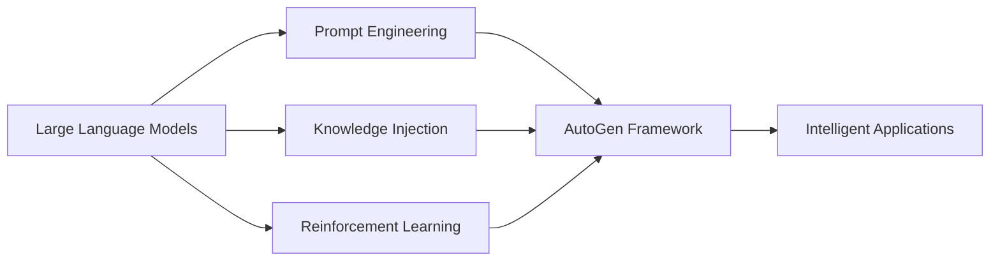

# AI Agent: AI的下一个风口 AutoGen：下一代LLM应用的启动器

## 1. 背景介绍
### 1.1  问题的由来
人工智能(Artificial Intelligence, AI)技术的迅猛发展正在深刻影响和改变着我们的生活。从智能助手、自动驾驶汽车到智能医疗诊断系统，AI无处不在。然而，构建一个真正智能、高效、易用的AI应用仍然面临诸多挑战。传统的AI开发方式往往需要大量的人力、物力和时间成本，开发周期长，迭代慢，难以快速响应市场变化。同时，大多数AI系统仍然是封闭的黑盒子，缺乏解释性和透明性，这限制了它们在关键领域的应用。

近年来，大型语言模型(Large Language Models, LLMs)的出现为AI应用的开发带来了新的曙光。LLMs是一种基于海量文本数据训练的AI模型，能够理解和生成接近人类水平的自然语言。以GPT-3、PaLM等为代表的LLMs展现出了惊人的语言理解和生成能力，在问答、对话、写作、编程等诸多任务上取得了瞩目的成绩。LLMs强大的语言能力使得构建智能对话系统、知识问答系统、文案生成等AI应用变得前所未有的简单。

然而，直接使用LLMs构建应用仍然存在一些问题和局限性。首先，LLMs生成的内容虽然通顺流畅，但往往缺乏连贯性和逻辑性，容易出现事实性错误和自相矛盾。其次，LLMs对特定领域知识掌握不足，难以应对复杂的垂直场景。再次，LLMs生成的内容缺乏可控性，难以满足实际应用的个性化需求。最后，LLMs的推理过程是不透明的，难以解释其输出背后的原因。

因此，如何利用LLMs的强大语言能力，同时克服其局限性，构建高质量、可控、可解释的AI应用，是当前AI领域亟待解决的问题。这需要从模型、数据、算法等多个层面入手，探索LLMs应用的新范式。本文将重点介绍一种名为AutoGen的技术框架，旨在利用LLMs作为基座，结合垂直领域知识、对话管理策略、可解释性机制等，快速构建新一代智能AI应用，推动AI民主化进程。

### 1.2  研究现状 
目前，学术界和工业界都在积极探索利用LLMs构建智能应用的方法。总体来看，现有的研究可以分为以下几个方向：

1. 基于提示工程(Prompt Engineering)的方法。这类方法通过精心设计输入给LLMs的提示(Prompt)模板，引导LLMs生成所需的输出。代表工作包括PaLM[1]、InstructGPT[2]等。提示工程可以在一定程度上控制LLMs的行为，但设计最优提示需要大量的人工尝试，成本较高。

2. 基于知识注入(Knowledge Injection)的方法。这类方法通过将外部知识库中的结构化知识编码成自然语言形式，喂给LLMs学习，从而提升LLMs在特定领域的表现。代表工作包括KALM[3]、KG-BART[4]等。知识注入可以弥补LLMs在垂直领域知识的不足，但构建高质量的领域知识库本身就是一个挑战。

3. 基于强化学习(Reinforcement Learning)的方法。这类方法将LLMs看作一个智能体(Agent)，通过设计适当的奖励函数(Reward Function)，训练LLMs生成符合特定目标的输出。代表工作包括InstructGPT[2]、Constitutional AI[5]等。强化学习可以有效控制LLMs的行为，但设计合适的奖励函数具有挑战性。

4. 基于少样本学习(Few-Shot Learning)的方法。这类方法通过给LLMs喂入少量的示例数据，让其快速适应新的任务。代表工作包括GPT-3[6]、PaLM[1]等。少样本学习可以大大降低LLMs应用的开发成本，但其泛化能力和鲁棒性有待进一步提高。

5. 基于模型压缩(Model Compression)的方法。这类方法通过知识蒸馏(Knowledge Distillation)、量化(Quantization)、剪枝(Pruning)等技术，将庞大的LLMs压缩到可部署的规模。代表工作包括DistilGPT2[7]、TinyBERT[8]等。模型压缩可以促进LLMs的工程落地，但如何在压缩的同时保持性能是一个难题。

6. 基于人机交互(Human-AI Interaction)的方法。这类方法研究如何设计友好的人机交互界面和协议，让人类用户可以更自然地与LLMs进行交互。代表工作包括ChatGPT[9]、LaMDA[10]等。人机交互技术的进步将极大拓展LLMs的应用场景和边界。

尽管上述方法都取得了一定的进展，但如何将这些技术有机地结合起来，形成一套系统化的LLMs应用构建方法论，仍然是一个亟待探索的问题。同时，LLMs在安全性、伦理性、可解释性等方面也面临诸多挑战，需要学界和业界的共同努力。

### 1.3  研究意义
研究利用LLMs构建智能应用具有重要的理论意义和实践价值。

从理论角度看，LLMs为认知科学和人工智能研究提供了一个全新的视角。LLMs展现出了惊人的语言理解和逻辑推理能力，这在很大程度上模拟了人类的认知过程。深入研究LLMs的工作机制，有助于我们理解人类语言和思维的奥秘，推动认知科学和人工智能理论的发展。同时，探索LLMs与其他AI技术(如知识图谱、因果推理等)的融合，将开辟人工智能研究的新疆域。

从实践角度看，LLMs有望极大降低AI应用开发的门槛和成本，加速AI技术的民主化进程。传统的AI应用开发往往需要大量的数据标注和特征工程，而LLMs可以直接从海量文本数据中学习知识和模式，大大减少了对人工干预的依赖。LLMs的few-shot学习能力使得开发者可以用少量样本快速开发出定制化的AI应用。LLMs还可以作为"插件"嵌入到各种软件系统中，赋予它们语言理解和交互的能力。这将极大拓展AI技术的应用场景和边界，催生出大量创新的智能产品和服务，为社会经济发展注入新的动力。

总之，研究LLMs在智能应用构建中的作用，对于推动人工智能理论创新、技术进步和产业应用都具有重要意义。本文提出的AutoGen框架，旨在探索一种灵活、高效、可控的LLMs应用范式，为新一代智能系统的构建提供思路和指导。

### 1.4  本文结构
本文将围绕AutoGen框架，系统阐述利用LLMs构建智能应用的方法和实践。全文共分为9个章节：

第1章是引言，介绍了研究背景、现状、意义和全文结构。

第2章阐述了AutoGen框架的核心概念和总体架构。 

第3章重点介绍AutoGen的核心算法原理和实现步骤。

第4章给出了AutoGen涉及的关键数学模型和公式，并结合案例进行详细讲解。

第5章通过一个实际项目，演示了如何用AutoGen快速构建一个智能应用。

第6章分析了AutoGen的主要应用场景，展望了其未来的发展方向。

第7章总结了一些AutoGen相关的开发工具和学习资源。

第8章对全文工作进行了总结，并讨论了AutoGen未来的机遇和挑战。

第9章的附录给出了一些常见问题的解答。

## 2. 核心概念与联系

AutoGen框架的核心理念是利用LLMs作为基座，通过提示工程、知识注入、强化学习等技术，将LLMs与垂直领域知识、对话管理策略、可解释性机制等有机融合，快速构建高质量、可控、可解释的智能应用。AutoGen的总体架构如图1所示。

图1 AutoGen总体架构

AutoGen主要包含以下几个核心组件：

1. 大型语言模型(LLMs)。LLMs是AutoGen的基础，负责自然语言理解和生成。AutoGen可以灵活选择各种开源或商业LLMs(如GPT-3、PaLM、BLOOM等)作为后端，并根据应用需求对LLMs进行微调。

2. 提示工程(Prompt Engineering)。提示工程用于设计最优的输入提示，引导LLMs生成所需的输出。AutoGen利用学习算法(如梯度下降、进化算法等)自动搜索最优提示，并利用Few-Shot Learning降低设计成本。

3. 知识注入(Knowledge Injection)。知识注入用于将垂直领域知识编码成LLMs可理解的形式，提升LLMs在特定领域的表现。AutoGen支持多种知识表示方法(如知识三元组、知识图谱等)，可以自动将结构化知识转化为自然语言形式。

4. 强化学习(Reinforcement Learning)。强化学习用于训练LLMs生成符合特定目标的输出。AutoGen利用策略梯度等算法，根据应用场景自适应地调整LLMs的生成策略，以满足安全性、伦理性等约束。

5. 对话管理(Dialogue Management)。对话管理用于控制人机对话的流程和策略。AutoGen基于有限状态机(FSM)实现了一个通用的对话管理器，可以处理多轮对话、上下文理解、意图识别等任务。

6. 可解释性模块(Explainability Module)。可解释性模块用于分析LLMs的决策过程，提供输出背后的原因解释。AutoGen利用因果推理、归因技术等，实现了LLMs推理过程的可视化和可解释。

7. 人机交互接口(Human-AI Interface)。人机交互接口是AutoGen的前端，负责与最终用户进行交互。AutoGen提供了一套声明式UI开发框架，可以快速搭建Web、移动端等各种交互界面。

上述组件协同工作，构成了一个完整的AutoGen应用开发流程。开发者可以根据应用场景，灵活选择和组合不同的模块，快速构建出定制化的智能应用。

## 3. 核心算法原理 & 具体操作步骤
### 3.1  算法原理概述
AutoGen的核心算法主要包括提示工程算法、知识注入算法、强化学习算法三个部分。下面分别进行介绍。

#### 3.1.1 提示工程算法
提示工程算法旨在自动搜索最优的提示模板，引导LLMs生成所需的输出。其基本思想是将提示模板参数化，通过优化算法(如梯度下降、进化算法等)在参数空间中搜索最优解。

具体来说，我们将提示模板定义为一个参数化函数$P(x;\theta)$，其中$x$为输入文本，$\theta$为提示模板参数。给定一组训练样本$D=\{(x_i,y_i)\}$，我们希望找到最优参数$\theta^*$，使得LLMs基于提示$P(x_i;\theta^*)$生成的输出$\hat{y_i}$与真实输出$y_i$尽可能接近。这可以形式化为如下的优化问题：

$$
\theta^* = \arg\min_\theta \sum_{(x_i,y_i)\in D} \mathcal{L}(\hat{y_i}, y_i)
$$

其中$\mathcal{L}$为损失函数，衡量生成输出与真实输出之间的差异。常见的损失函数包括交叉熵损失、编辑距离等。

在实际应用中，我们通常还需要在目标函数中加入正则化项，以控制提示模板的复杂度和泛化能力。同时，我们还可以利用Few-Shot Learning技术，通过在提示中添加少量示例，引导LLMs生成所需的输出，从而降低训练样本的需求。

#### 3.1.2 知识注入算法
知识