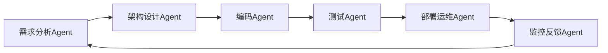

# AI Agent: AI的下一个风口 ChatDev：重塑软件开发的AI群体智能协作框架

## 1. 背景介绍
### 1.1 问题的由来
随着人工智能技术的快速发展,AI在各行各业的应用日益广泛。特别是大语言模型(LLM)的出现,让AI具备了接近人类的语言理解和生成能力。这为AI在软件开发领域的应用带来了新的可能。然而,目前AI在软件开发中的应用还比较有限,主要集中在代码补全、代码生成等辅助性工作上。如何利用AI的智能来重塑软件开发流程,提高开发效率和质量,是业界亟待解决的问题。

### 1.2 研究现状
目前,学术界和工业界已经开始探索将AI应用于软件开发的各个环节。微软、GitHub等科技巨头纷纷推出了AI辅助编程工具,如GitHub Copilot、微软IntelliCode等。这些工具利用机器学习算法,通过分析大量优质代码,学习编码模式和最佳实践,从而实现代码补全、代码生成等功能,提高开发人员的编码效率。

此外,一些研究者提出了将AI Agent引入软件开发过程的设想。通过构建多个AI Agent,让它们扮演不同的角色(如需求分析师、架构师、开发工程师、测试工程师等),协同完成软件开发任务。这种基于AI Agent的群体智能协作框架,有望进一步提升软件开发的自动化水平和效率。

### 1.3 研究意义
探索AI在软件开发领域的创新应用,对于推动软件工程的发展具有重要意义:

1. 提高开发效率:利用AI自动化部分编码工作,减轻开发人员的重复性劳动,让他们可以专注于更有创造性的任务,从而提高整体开发效率。 

2. 改善代码质量:通过AI算法分析海量代码,总结编码最佳实践,可以有效规避代码缺陷,提升软件质量。

3. 优化资源配置:利用AI Agent的群体协作,可以打破人力资源的限制,灵活调配"虚拟开发团队",从而优化开发资源配置。

4. 促进知识积累:AI可以从历史项目中持续学习,沉淀和积累软件开发知识,并应用到新项目中,有利于软件开发知识的传承和复用。

### 1.4 本文结构
本文将重点探讨一种基于AI Agent群体智能协作的软件开发新范式——ChatDev框架。内容安排如下:

第2部分,介绍ChatDev的核心概念,以及各类AI Agent之间的关系;
第3部分,重点阐述ChatDev的工作机制和算法原理;
第4部分,给出ChatDev的数学建模过程和关键公式;
第5部分,演示一个基于ChatDev的代码实例,并详细解读;
第6部分,分析ChatDev框架的潜在应用场景;
第7部分,推荐ChatDev相关的学习资源和开发工具;
第8部分,总结全文,并展望ChatDev的未来发展方向和挑战;
第9部分,是一些常见问题的解答。

## 2. 核心概念与联系
ChatDev框架的核心理念,是利用多个AI Agent组成虚拟开发团队,通过群体智能实现端到端的软件开发。其中涉及的核心概念包括:

- AI Agent:扮演特定角色的智能体,具备对应的知识和技能。如需求分析Agent、架构设计Agent、编码Agent、测试Agent等。
- 群体智能:多个Agent通过分工协作,取长补短,产生"群体智慧",从而高效完成复杂任务。
- 端到端:覆盖从需求分析到部署运维的全流程软件开发。
- 虚拟团队:由AI Agent组成的虚拟开发团队,可以灵活调配和弹性伸缩。
- 知识沉淀:AI Agent可以持续学习,将项目经验转化为知识积累,并应用到后续项目中。

下图描述了ChatDev框架中各类AI Agent的关系:



可以看出,ChatDev采用了类似流水线的工作方式,各类Agent按照软件开发流程依次工作,并形成闭环反馈。需求分析Agent负责从用户需求中提取功能点,输出需求规格说明。架构设计Agent据此输出系统架构和技术选型。编码Agent负责代码的编写和单元测试。测试Agent进行集成测试和验收测试。部署运维Agent负责代码的编译、打包、部署和运维监控。监控反馈Agent收集线上系统的运行数据,并反馈给需求分析Agent,以优化后续版本的需求。

各类Agent之间通过接口协议进行通信和数据交换。比如,需求分析Agent将需求规格说明写入知识库,供架构设计Agent读取;编码Agent提交代码后,触发测试Agent自动化测试等。

## 3. 核心算法原理 & 具体操作步骤
### 3.1 算法原理概述
ChatDev的核心算法包括:

1. 自然语言处理(NLP):需求分析Agent利用NLP技术,从用户需求描述中抽取功能点,生成结构化的需求文档。

2. 知识图谱推理:架构设计Agent基于需求,在知识图谱中检索合适的架构模式和技术组件,并进行推理和决策,输出架构方案。

3. 代码生成:编码Agent读取架构设计方案,检索知识库中的类似代码案例,利用神经网络算法(如Transformer)生成代码。

4. 智能测试:测试Agent采用基于模型的测试生成技术,自动设计测试用例,并使用强化学习不断优化测试策略。

5. AIOps:部署运维Agent利用AIOps平台,实现智能化的部署、资源调度、故障诊断等。

6. 数据挖掘:监控反馈Agent对海量的系统运行数据和用户反馈数据进行挖掘分析,提炼改进需求和优化方向。

### 3.2 算法步骤详解
下面以代码生成算法为例,详细说明其工作步骤:

1. 读取架构设计方案,提取出待开发的模块、接口等信息。

2. 在知识库中检索与待开发模块相似的历史代码案例。知识库中存储了大量优质项目的代码库。

3. 将检索到的相似代码转化为抽象语法树(AST),并使用树编辑距离算法,计算各代码案例与目标模块的相似度。

4. 选取Top K个最相似的代码案例,送入Transformer神经网络进行学习。Transformer通过Attention机制,建模AST节点间的关系。

5. 在Transformer的Decoder部分,采用Beam Search算法,从AST空间中搜索出结构最优、语义最贴近目标模块的代码。

6. 将生成的AST还原成源代码,并进行代码风格美化、注释生成等后处理。

7. 生成的代码经过单元测试后,提交到代码仓库,并触发后续的集成测试。

### 3.3 算法优缺点

ChatDev的代码生成算法具有以下优点:
- 利用海量优质代码进行学习,可以模仿人类开发者的编码模式和最佳实践,生成高质量代码。
- 通过检索相似代码案例,可以最大程度复用已有代码,减少重复开发。
- 采用Transformer神经网络,可以建模代码的结构和语义信息,生成语义连贯、逻辑正确的代码。

但该算法也存在一些局限性:
- 生成的代码质量很大程度上取决于知识库中代码案例的质量,需要持续扩充和优化知识库。
- 对于全新的、创新性的开发任务,缺乏现成的参考案例,生成代码的质量可能不高。
- 不同项目、不同团队的代码风格差异较大,生成的代码可能需要进行风格调整,以符合特定项目的规范。

### 3.4 算法应用领域
ChatDev的代码生成算法可以广泛应用于以下领域:

- 业务系统开发:对于传统的管理信息系统、电商系统、金融系统等业务系统,很多功能模块都有成熟的代码案例可以参考,非常适合采用ChatDev进行开发。

- 移动应用开发:移动APP的页面布局、交互逻辑等,也有大量优质开源项目可供学习,ChatDev可以显著提升开发效率。

- 微服务开发:微服务架构下,很多服务模块功能单一,逻辑简单,更容易通过ChatDev自动生成。

- 低代码平台:ChatDev可以作为低代码开发平台的核心引擎,根据用户的配置和选择,自动生成后台代码。

- 程序修复:当系统出现bug时,ChatDev可以分析bug的堆栈信息,检索相似bug的修复案例,自动生成修复补丁。

当然,对于算法、底层系统、操作系统内核等偏工程性、创新性较强的开发任务,目前采用ChatDev全自动生成代码还有一定难度,更多是作为辅助工具来提升开发者的效率。

## 4. 数学模型和公式 & 详细讲解 & 举例说明
### 4.1 数学模型构建
ChatDev的代码生成算法,可以用下面的数学模型来描述:

令$C$表示待生成的代码,$K$为知识库,$S_i$为检索到的第$i$个相似代码案例,$sim(C,S_i)$为$C$和$S_i$的相似度,则ChatDev的目标是找到一个最优的$C^*$,使得:

$$C^* = \arg\max_C \sum_{i=1}^K sim(C,S_i) \tag{1}$$

其中,$sim(C,S_i)$可以用树编辑距离(Tree Edit Distance, TED)来度量。TED是指将一棵树转换为另一棵树所需的最少编辑操作次数,编辑操作包括插入、删除、替换节点。

令$T_C$和$T_{S_i}$分别表示$C$和$S_i$的抽象语法树(AST),则$sim(C,S_i)$可以定义为:

$$sim(C,S_i) = \frac{1}{1+TED(T_C, T_{S_i})} \tag{2}$$

直接优化公式(1)是一个NP难问题,因此ChatDev采用启发式搜索算法,通过Transformer神经网络来近似求解。

### 4.2 公式推导过程
Transformer的本质是一个Seq2Seq模型,它接收输入序列$x=(x_1,\dots,x_n)$,生成输出序列$y=(y_1,\dots,y_m)$。在ChatDev中,$x$对应AST的前序遍历序列,$y$对应生成代码的AST序列。

Transformer由Encoder和Decoder组成。Encoder将输入$x$映射为一组隐向量$z=(z_1,\dots,z_n)$:

$$z_i = Encoder(x_i), i=1,\dots,n \tag{3}$$

Decoder根据$z$和已生成的前缀$y_{<t}$,预测下一个token $y_t$的概率分布:

$$p(y_t|y_{<t},z) = Decoder(y_{<t},z), t=1,\dots,m \tag{4}$$

整个序列$y$的生成概率为:

$$p(y|x) = \prod_{t=1}^m p(y_t|y_{<t},z) \tag{5}$$

Transformer的训练目标是最大化$p(y|x)$,即最小化交叉熵损失:

$$L = -\sum_{t=1}^m \log p(y_t|y_{<t},z) \tag{6}$$

在推理阶段,Decoder采用Beam Search算法,在维护的$B$个最优候选序列中,选取$p(y|x)$最大的作为最终输出。

### 4.3 案例分析与讲解
下面以一个简单的Java方法为例,说明ChatDev的代码生成过程。

假设需要生成一个计算两个整数最大公约数的方法,ChatDev首先检索知识库,找到以下三个相似案例:

```java
// 案例1:计算两个整数的最小公倍数
public static int lcm(int a, int b) {
    return a * b / gcd(a, b);
}

// 案例2:计算两个整数的最大公