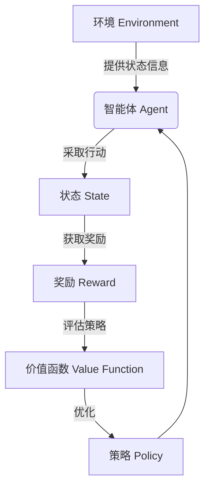

好的,我明白了您的要求。以下是按照您提供的标题和约束条件撰写的技术博客文章正文内容:

# AI Agent: AI的下一个风口 技术的发展趋势

## 1. 背景介绍

### 1.1 问题的由来

在过去的几十年里,人工智能(AI)技术取得了长足的进步,并在诸多领域得到了广泛应用。从语音识别、图像处理到自然语言处理,AI已经深深融入了我们的日常生活。然而,随着AI技术的不断发展,人们开始意识到,传统的人工智能系统存在一些固有的局限性。

传统AI系统通常是以规则或模型为基础,需要大量的人工编码和标注数据。这种方法在处理结构化数据时表现良好,但在面对复杂、动态的现实世界时,往往力有未逮。此外,传统AI系统缺乏自主学习和推理的能力,难以适应环境的变化,也无法像人类那样具备通用智能。

为了突破这些局限,研究人员开始探索新的人工智能范式,其中一个备受关注的方向就是AI Agent。AI Agent被视为AI技术发展的下一个风口,它有望推动人工智能向着更加智能、更加通用的方向发展。

### 1.2 研究现状

AI Agent是一种新兴的人工智能范式,它试图模拟人类智能的本质特征,如自主性、交互性和适应性。与传统AI系统不同,AI Agent不是被动地接受输入并产生输出,而是能够主动感知环境、制定计划并采取行动,以达成特定目标。

目前,AI Agent的研究主要集中在以下几个方面:

1. **智能体架构**:设计能够感知、规划和行动的智能体架构,以模拟人类智能的核心特征。
2. **多智能体系统**:探索多个智能体如何协作、竞争和协调,以解决复杂的问题。
3. **人机交互**:研究智能体与人类用户之间的自然交互方式,如自然语言处理和计算机视觉。
4. **环境建模**:建立能够模拟真实世界复杂环境的虚拟环境,用于训练和测试AI Agent。
5. **决策理论**:研究AI Agent在不确定性和动态环境下的决策和规划算法。

虽然AI Agent的研究还处于起步阶段,但已经取得了一些初步进展。例如,DeepMind公司的AlphaGo系统就是一种AI Agent,它能够自主学习并精通下棋游戏。此外,一些机器人系统和虚拟助手也可以被视为AI Agent的雏形。

### 1.3 研究意义

AI Agent的研究对于推动人工智能技术的发展具有重大意义:

1. **通用智能**:AI Agent旨在模拟人类智能的本质特征,有望实现真正的通用人工智能(Artificial General Intelligence, AGI)。
2. **自主性和适应性**:AI Agent能够自主感知环境、制定计划并采取行动,具有较强的适应性和鲁棒性。
3. **人机协作**:AI Agent可以与人类用户进行自然交互,为人机协作提供了新的可能性。
4. **复杂问题求解**:多智能体系统有望解决一些复杂的问题,如交通管理、应急救援等。
5. **新兴应用**:AI Agent技术可以应用于机器人、虚拟助手、智能家居等新兴领域。

总的来说,AI Agent代表了人工智能技术发展的新方向,它有望推动AI技术向着更加智能、更加通用的目标迈进。

### 1.4 本文结构

本文将全面介绍AI Agent这一新兴的人工智能范式。文章首先阐述AI Agent的核心概念和理论基础,包括智能体架构、决策理论等。接下来,详细讲解AI Agent的核心算法原理和数学模型。然后,通过实际项目案例,展示如何开发和应用AI Agent系统。最后,探讨AI Agent的实际应用场景,以及未来的发展趋势和挑战。

通过本文的介绍,读者将能够全面了解AI Agent的基本概念、核心技术和实际应用,为进一步研究和开发AI Agent系统奠定基础。

## 2. 核心概念与联系

AI Agent是一种新兴的人工智能范式,它试图模拟人类智能的本质特征,如自主性、交互性和适应性。AI Agent的核心概念主要包括:

1. **智能体(Agent)**:智能体是AI Agent系统的核心组成部分,它是一个能够感知环境、制定计划并采取行动的自主实体。智能体通过与环境交互,不断学习和优化自己的行为策略,以达成特定目标。

2. **环境(Environment)**:环境是智能体所处的外部世界,它可以是真实的物理环境,也可以是虚拟的模拟环境。环境会提供状态信息,智能体根据这些信息作出决策并采取行动,环境又会根据智能体的行动产生新的状态。

3. **状态(State)**:状态描述了环境的当前情况,包括智能体自身的状态和外部环境的状态。状态是智能体进行决策的基础。

4. **奖励(Reward)**:奖励是对智能体行为的评价,它反映了智能体行为对于达成目标的贡献程度。奖励信号是智能体学习和优化策略的驱动力。

5. **策略(Policy)**:策略定义了智能体在给定状态下应该采取的行动,它是智能体的行为准则。智能体的目标就是学习一个最优策略,以最大化长期累积奖励。

6. **价值函数(Value Function)**:价值函数估计了在给定状态下,执行某一策略所能获得的长期累积奖励。它为智能体选择最优策略提供了依据。

这些核心概念相互关联,共同构成了AI Agent系统的理论基础。智能体通过与环境交互,不断更新状态、获取奖励,并根据价值函数评估和优化策略,最终学习到一个最优策略,以完成特定任务。

上图使用Mermaid流程图展示了AI Agent系统中核心概念之间的关系。智能体根据环境状态采取行动,获得奖励反馈,并基于价值函数评估和优化策略,形成一个闭环的学习过程。

## 3. 核心算法原理及具体操作步骤

### 3.1 算法原理概述

AI Agent系统的核心算法原理是基于强化学习(Reinforcement Learning)理论。强化学习是一种机器学习范式,它通过与环境交互并获取奖励反馈,自主学习最优策略。

强化学习算法的基本思想是:智能体在环境中采取行动,环境会根据智能体的行为给出奖励信号。智能体的目标是学习一个策略,使长期累积奖励最大化。为了实现这一目标,智能体需要估计每个状态下采取不同行动所能获得的长期累积奖励,即价值函数。基于价值函数,智能体可以选择最优行动,不断优化策略。

强化学习算法可以分为三个主要类别:

1. **基于价值的方法**:直接估计并优化价值函数,例如Q-Learning算法。
2. **基于策略的方法**:直接优化策略函数,例如策略梯度算法。
3. **Actor-Critic方法**:结合价值函数估计和策略优化,例如优势Actor-Critic算法。

这些算法各有优缺点,适用于不同的场景。在实际应用中,研究人员还会结合深度学习技术,发展出深度强化学习(Deep Reinforcement Learning)算法,以提高AI Agent系统的性能和泛化能力。

### 3.2 算法步骤详解

以下是基于Q-Learning算法的强化学习过程详细步骤:

1. **初始化**:初始化智能体和环境,设置初始状态$s_0$,初始化Q值函数$Q(s,a)$。

2. **选择行动**:在当前状态$s_t$下,根据一定的策略(如$\epsilon$-贪婪策略)选择行动$a_t$。

3. **执行行动**:智能体执行选择的行动$a_t$,环境转移到新状态$s_{t+1}$,并返回奖励$r_{t+1}$。

4. **更新Q值**:根据下式更新Q值函数:

$$Q(s_t, a_t) \leftarrow Q(s_t, a_t) + \alpha \left[r_{t+1} + \gamma \max_a Q(s_{t+1}, a) - Q(s_t, a_t)\right]$$

其中$\alpha$是学习率,$\gamma$是折现因子。

5. **重复步骤**:将$s_{t+1}$设为新的当前状态,重复步骤2-4,直到达到终止条件。

通过不断与环境交互并更新Q值函数,算法最终会收敛到一个最优的Q值函数,从而得到最优策略$\pi^*(s) = \arg\max_a Q(s,a)$。

### 3.3 算法优缺点

Q-Learning算法具有以下优点:

1. **无模型**:算法不需要事先了解环境的转移概率模型,可以通过在线学习获取环境动态。
2. **离线学习**:算法可以使用经验回放的方式,充分利用历史数据,提高样本利用效率。
3. **收敛性**:在满足一定条件下,算法保证收敛到最优Q值函数和最优策略。

但Q-Learning算法也存在一些缺点:

1. **维数灾难**:当状态空间和行动空间很大时,算法收敛速度会变慢。
2. **过度估计**:由于使用了最大化操作,Q值容易被高估,影响收敛性。
3. **探索与利用权衡**:需要在探索(尝试新行动)和利用(选择已知最优行动)之间寻求平衡。

为了解决这些问题,研究人员提出了多种改进算法,如Double Q-Learning、Prioritized Experience Replay等。此外,结合深度学习技术,可以使用深度神经网络来逼近Q值函数,有效缓解维数灾难问题。

### 3.4 算法应用领域

强化学习算法及其改进版本已经在多个领域取得了成功应用,例如:

1. **游戏AI**:DeepMind公司的AlphaGo/AlphaZero等系统使用深度强化学习算法,达到了超越人类水平的棋力。
2. **机器人控制**:强化学习可以训练机器人在复杂环境中执行各种任务,如行走、抓取等。
3. **自动驾驶**:通过与模拟环境交互,可以训练出高性能的自动驾驶策略。
4. **对话系统**:将对话过程建模为强化学习问题,可以优化对话策略。
5. **资源管理**:在数据中心、电网等资源管理系统中,强化学习可以学习出优化的资源调度策略。

总的来说,强化学习算法擅长解决序列决策问题,在任何需要基于环境反馈不断优化策略的领域,都可以尝试应用强化学习技术。

## 4. 数学模型和公式详细讲解及举例说明

### 4.1 数学模型构建

AI Agent系统可以用马尔可夫决策过程(Markov Decision Process, MDP)来建模。MDP是一种离散时间随机控制过程,由以下5元组组成:

$$\langle \mathcal{S}, \mathcal{A}, \mathcal{P}, \mathcal{R}, \gamma \rangle$$

- $\mathcal{S}$是状态空间的集合
- $\mathcal{A}$是行动空间的集合  
- $\mathcal{P}$是状态转移概率函数,定义为$\mathcal{P}_{ss'}^a = \mathbb{P}(s_{t+1}=s'|s_t=s, a_t=a)$
- $\mathcal{R}$是奖励函数,定义为$\mathcal{R}_s^a = \mathbb{E}[r_{t+1}|s_t=s, a_t=a]$
- $\gamma \in [0, 1)$是折现因子,用于权衡当前奖励和未来奖励的权重

在MDP中,智能体的目标是学习一