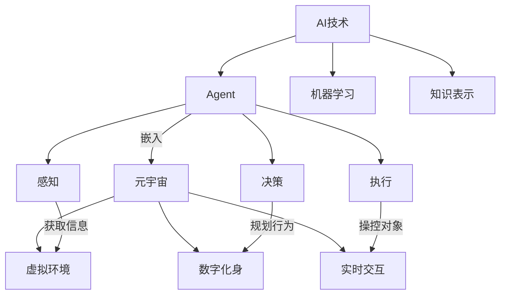

# AI Agent: AI的下一个风口 智能体在元宇宙里的应用

关键词：AI Agent, 元宇宙, 智能体, 虚拟世界, 人工智能, 沉浸式体验

## 1. 背景介绍
### 1.1  问题的由来
随着人工智能技术的快速发展,AI已经在各个领域得到广泛应用。而元宇宙的出现,为AI技术提供了一个全新的应用场景。在元宇宙中,AI Agent作为智能化的虚拟助手,将扮演越来越重要的角色。它们不仅能为用户提供个性化的服务,还能与虚拟世界进行交互,创造出更加沉浸和真实的体验。

### 1.2  研究现状
目前,国内外已有不少科技公司和研究机构开始探索AI Agent在元宇宙中的应用。例如,Facebook正在开发一个名为"Horizon Workrooms"的虚拟办公室平台,用户可以通过VR设备进入其中,与AI助手一起完成各种工作任务。而英伟达也推出了"Omniverse"平台,旨在打造一个虚拟协作环境,让AI系统与人类用户能够无缝互动。

### 1.3  研究意义
研究AI Agent在元宇宙中的应用,具有重要的理论和实践意义。一方面,它有助于推动人工智能和虚拟现实技术的融合创新,催生出更多突破性的应用场景。另一方面,智能化的AI Agent将极大提升元宇宙的交互性和沉浸感,为用户带来前所未有的虚拟体验。同时,AI Agent还可以应用于教育、医疗、商业等多个领域,为相关行业赋能增效。

### 1.4  本文结构
本文将围绕AI Agent在元宇宙中的应用展开深入探讨。首先,我们将介绍AI Agent和元宇宙的核心概念,以及两者之间的内在联系。接着,重点阐述AI Agent的关键技术原理,包括知识图谱、自然语言处理、计算机视觉等,并给出具体的算法步骤。然后,我们将通过数学建模的方式,分析AI Agent的工作机制和性能优化策略。在实践部分,本文将给出一个AI Agent的代码实现示例,并详细解释其中的关键环节。最后,我们将展望AI Agent在元宇宙中的发展前景,并总结全文的核心观点。

## 2. 核心概念与联系
人工智能是一门综合性学科,它涉及计算机科学、数学、认知科学等多个领域。其核心目标是研究如何让机器模拟人类的智能行为,包括感知、学习、推理、决策等。而Agent则是人工智能的一个重要概念,它指代能够自主行动、与环境交互的智能实体。一个典型的Agent通常包含感知、决策、执行三个模块,通过感知外部信息,结合自身知识和目标,自主地做出决策并付诸行动。

元宇宙是一个虚拟的共享空间,由计算机生成的沉浸式环境构成。在元宇宙中,用户以数字化身的形式存在,能够与虚拟世界进行实时交互。元宇宙具有去中心化、可编程性、交互性等特点,为各种应用提供了广阔的创新空间。将AI Agent引入元宇宙,能够大幅提升虚拟世界的智能化水平。一方面,AI Agent可以作为用户的智能助手,提供个性化服务和决策支持。另一方面,AI Agent还可以成为元宇宙中的"数字公民",与其他Agent和用户进行社交互动,共同塑造虚拟世界的生态系统。

下图展示了AI Agent与元宇宙的关系:



## 3. 核心算法原理 & 具体操作步骤
### 3.1  算法原理概述
实现智能化的AI Agent,需要用到多种人工智能算法。其中,知识图谱可以用于表示Agent的领域知识,自然语言处理算法如BERT可以赋予Agent语言理解和生成能力,而强化学习算法如DQN则可以训练Agent的策略网络,使其能够在复杂环境中自主决策。

### 3.2  算法步骤详解
以DQN为例,其核心思想是使用深度神经网络来逼近最优的Q函数。训练过程中,我们从环境中采样转移数据 $(s_t,a_t,r_t,s_{t+1})$,然后最小化TD误差:

$$
L(\theta)=\mathbb{E}[(r+\gamma \max_{a'}Q(s',a';\theta^-)-Q(s,a;\theta))^2]
$$

其中 $\theta^-$ 表示目标网络的参数,用于计算TD目标。整个算法的具体步骤如下:

1. 随机初始化Q网络参数 $\theta$,并复制到目标网络 $\theta^-$
2. 初始化经验回放池 $\mathcal{D}$  
3. for episode=1 to M do
4.   初始化环境状态 $s_0$
5.   for t=1 to T do
6.     以 $\epsilon-greedy$ 策略选择动作 $a_t$
7.     执行动作 $a_t$,观察奖励 $r_t$ 和新状态 $s_{t+1}$
8.     将转移样本 $(s_t,a_t,r_t,s_{t+1})$ 存入 $\mathcal{D}$
9.     从 $\mathcal{D}$ 中随机采样一个批量的转移数据  
10.    计算TD目标 $y_i=r_i+\gamma \max_{a'}Q(s'_i,a';\theta^-)$
11.    最小化损失 $L(\theta)=\frac{1}{N}\sum_i(y_i-Q(s_i,a_i;\theta))^2$
12.    每隔C步,将 $\theta$ 复制给 $\theta^-$
13.  end for
14. end for

### 3.3  算法优缺点
DQN算法的优点在于,它利用深度神经网络强大的函数拟合能力,可以处理大规模的状态空间,并从原始像素中直接提取特征。同时,经验回放和目标网络的设计,有效缓解了数据的相关性和非平稳分布问题。但DQN也存在一定局限,例如它不适用于连续动作空间,且需要大量的环境交互数据来进行训练。

### 3.4  算法应用领域
DQN及其变体在许多领域取得了不错的效果,例如在Atari游戏、机器人控制、自动驾驶等任务中。将其用于训练元宇宙中的AI Agent,可以使Agent掌握复杂的交互策略,提供更加智能化的服务。例如,一个售货员Agent可以通过DQN来学习如何与客户进行有效沟通,根据客户的反馈调整自己的销售策略,从而达成更高的成交率。

## 4. 数学模型和公式 & 详细讲解 & 举例说明
### 4.1  数学模型构建
为了研究AI Agent的工作机制,我们可以使用马尔可夫决策过程(MDP)来对其建模。一个MDP由状态空间 $\mathcal{S}$、动作空间 $\mathcal{A}$、转移概率 $\mathcal{P}$ 和奖励函数 $\mathcal{R}$ 组成。Agent的目标是寻找一个最优策略 $\pi^*$,使得期望累积奖励最大化:

$$
\pi^*=\arg\max_{\pi} \mathbb{E}[\sum_{t=0}^{\infty}\gamma^t r_t | \pi]
$$

其中 $\gamma \in [0,1]$ 是折扣因子。根据Bellman最优性方程,最优状态值函数 $V^*(s)$ 满足:

$$
V^*(s)=\max_a \mathcal{R}(s,a)+\gamma \sum_{s' \in \mathcal{S}} \mathcal{P}(s'|s,a)V^*(s')
$$

### 4.2  公式推导过程
假设状态值函数可以用参数 $\theta$ 的函数逼近,即 $V(s) \approx \hat{V}(s;\theta)$。我们可以通过最小化均方误差来训练该函数:

$$
J(\theta)=\mathbb{E}[(V^{\pi}(s)-\hat{V}(s;\theta))^2]
$$

对 $J(\theta)$ 求导,得到梯度:

$$
\nabla_{\theta}J(\theta)=\mathbb{E}[(V^{\pi}(s)-\hat{V}(s;\theta))\nabla_{\theta}\hat{V}(s;\theta)]
$$

进一步,根据Bellman方程,我们可以将 $V^{\pi}(s)$ 替换为 $\mathcal{R}(s,\pi(s))+\gamma V^{\pi}(s')$,得到:

$$
\nabla_{\theta}J(\theta)=\mathbb{E}[(\mathcal{R}(s,\pi(s))+\gamma V^{\pi}(s')-\hat{V}(s;\theta))\nabla_{\theta}\hat{V}(s;\theta)]
$$

这就是著名的TD(0)算法。在实际应用中,我们可以使用函数逼近器(如神经网络)来表示 $\hat{V}(s;\theta)$,并通过随机梯度下降来更新参数。

### 4.3  案例分析与讲解
考虑一个简单的格子世界环境,如下图所示:

```
+---+---+---+
| A |   | B |
+---+---+---+
|   | X |   |
+---+---+---+
| C |   | D |
+---+---+---+
```

其中A、B、C、D为四个房间,X表示障碍物。Agent的目标是从任意起点出发,尽快到达目标房间D。我们可以将每个格子视为一个状态,Agent在每个状态下有四个可选动作:上、下、左、右。如果执行动作后到达目标D,则获得奖励1,否则奖励为0。

在这个环境中,我们可以用一个线性函数来逼近状态值函数:

$$
\hat{V}(s;\theta) = \theta^T \phi(s)
$$

其中 $\phi(s)$ 为状态的特征表示。假设我们用one-hot编码来表示状态,即 $\phi(s) \in \{0,1\}^9$。那么,状态值函数可以表示为:

$$
\hat{V}(s;\theta) = \sum_{i=1}^9 \theta_i \phi_i(s)
$$

我们可以通过TD(0)算法来训练该模型,不断更新参数 $\theta$,直到收敛。训练完成后,Agent的决策策略就是在每个状态下选择使 $\hat{V}(s;\theta)$ 最大化的动作。

### 4.4  常见问题解答
Q: TD算法能否保证收敛到最优策略?
A: 在表格式的情况下,TD(0)算法可以收敛到最优状态值函数。但在函数逼近的情况下,一般只能收敛到次优解。为了提高稳定性和收敛速度,可以使用一些改进方法,如TD($\lambda$)、GTD等。

Q: 如何处理连续状态空间?
A: 对于连续状态空间,可以使用函数逼近的方法来表示状态值函数,如线性逼近、神经网络等。也可以考虑使用值函数的梯度信息,如DDPG算法。另外,还可以通过状态聚合或状态编码的方式,将连续状态离散化。

## 5. 项目实践：代码实例和详细解释说明
### 5.1  开发环境搭建
本项目使用Python语言和PyTorch库来实现DQN算法。首先,我们需要安装以下依赖:

- Python 3.6+
- PyTorch 1.8+
- NumPy
- Gym

可以使用pip命令来安装这些库:

```
pip install torch numpy gym
```

### 5.2  源代码详细实现
下面给出DQN算法的核心代码实现:

```python
import torch
import torch.nn as nn
import torch.optim as optim
import numpy as np
import random
from collections import deque

class DQN(nn.Module):
    def __init__(self, state_dim, action_dim):
        super(DQN, self).__init__()
        self.fc1 = nn.Linear(state_dim, 64)