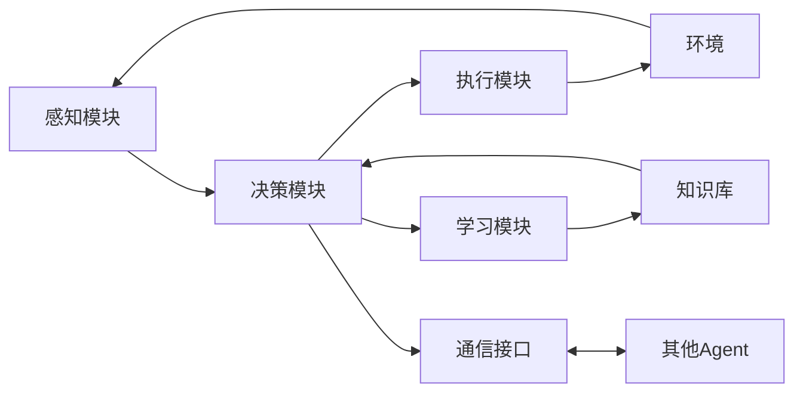

# AI Agent: AI的下一个风口 智能体的定义与特点

关键词：AI Agent, 人工智能, 智能体, 多智能体系统, 深度强化学习, 自主学习, 目标导向, 自适应, 分布式协作

## 1. 背景介绍
### 1.1  问题的由来
人工智能(Artificial Intelligence, AI)技术的飞速发展,已经在许多领域取得了令人瞩目的成就。从计算机视觉、自然语言处理,到机器人控制、自动驾驶等,AI正在深刻改变着人类社会。然而,当前主流的AI系统大多是基于单一模型的集中式学习范式,面对复杂多变的现实世界环境时,往往难以适应。因此,如何构建更加灵活、鲁棒、智能的AI系统,成为了业界关注的焦点。而AI Agent(智能体)技术的兴起,为解决这一问题提供了新的思路。

### 1.2  研究现状 
近年来,以AI Agent为代表的分布式人工智能技术受到学术界和工业界的广泛关注。国内外顶级高校、研究机构纷纷开展AI Agent相关研究,取得了一系列重要进展。例如麻省理工学院(MIT)的多智能体系统实验室,专注于研究多个智能体之间的交互与协作;斯坦福大学的多智能体强化学习研究,探索智能体群体的自主学习能力;谷歌DeepMind团队提出的AlphaGo系统,展示了单智能体的惊人实力。

工业界方面,谷歌、亚马逊、微软、百度等科技巨头也纷纷布局AI Agent领域。如亚马逊的分布式多智能体仓储调度系统,大大提升了物流效率;百度的Apollo自动驾驶平台,采用多智能体协同感知和决策技术,实现了复杂城市道路环境下的自动驾驶。可以预见,AI Agent将成为未来人工智能发展的重要方向之一。

### 1.3  研究意义
AI Agent技术的研究具有重要的理论意义和应用价值:

1. 从理论角度看,AI Agent为探索高级智能奠定基础。通过研究多个智能体的交互、协作、进化等机制,有助于揭示群体智能的内在规律,推动人工智能迈向更高层次。 

2. 从应用角度看,AI Agent可应用于众多现实场景,提升系统性能。例如在工业制造、智慧城市、金融交易等领域引入AI Agent,可显著提高生产效率、优化资源配置、降低运营成本。

3. 此外,AI Agent还为跨学科研究提供了新的视角。将AI Agent与博弈论、控制论、生物学等学科思想结合,有望催生出一批交叉创新成果。

### 1.4  本文结构
本文将围绕AI Agent的定义、特点、原理等展开系统阐述。全文共分为9个章节:第1章介绍研究背景;第2章明确AI Agent的核心概念;第3章讲解AI Agent的关键算法原理;第4章建立AI Agent的数学模型;第5章通过代码实例演示AI Agent的实现;第6章分析AI Agent的应用场景;第7章梳理AI Agent相关的工具和资源;第8章总结全文并展望未来;第9章列举AI Agent领域的常见问题。

## 2. 核心概念与联系
AI Agent,即人工智能体,是一种能够感知环境并据此采取行动的自主实体。它集感知、决策、执行、学习等多种能力于一身,可以根据环境的变化动态调整自身行为,以实现预定目标。

从概念上看,AI Agent与传统AI系统的区别主要体现在以下几点:

1. 自主性:AI Agent具有较高的自主性,可以在没有人为干预的情况下独立运行、自主决策。而传统AI系统的行为往往由预设程序决定,缺乏灵活性。

2. 适应性:AI Agent能够根据环境的反馈信息不断调整策略,具有很强的适应性。传统AI系统则很难应对动态变化的复杂环境。

3. 社会性:多个AI Agent可以相互通信、协作,共同完成任务,体现出群体智能。传统AI系统一般是独立工作,很少考虑彼此间的交互。

4. 目标性:每个AI Agent都有明确的目标函数,并朝着优化目标函数的方向努力。传统AI系统往往只完成特定的任务,缺乏宏观的优化目标。

从结构上看,一个典型的AI Agent包含以下关键组件:

- 感知模块:负责接收环境信息,可以是图像、文本、数值等多种形式。
- 决策模块:根据感知信息和知识库,进行推理、规划,生成行动决策。
- 执行模块:负责执行具体的动作指令,驱动效应器。
- 学习模块:利用环境反馈,优化内部模型,提升系统性能。
- 知识库:存储先验知识和学习到的新知识,供决策时查询。
- 通信接口:用于多个Agent之间的信息交换,实现协同工作。

下图展示了一个AI Agent的基本架构:

可以看出,AI Agent通过感知、决策、执行、学习等模块形成一个闭环,并与环境和其他Agent实时交互,不断提升自身能力,以更好地适应环境变化,完成目标任务。这种"感知-决策-执行-学习"的智能体范式,是构建高级AI系统的重要途径。

总的来说,AI Agent代表了一种全新的人工智能范式。与传统AI相比,它更加灵活、适应性更强、更具社会属性,为实现通用人工智能(AGI)打开了一扇大门。随着AI Agent相关理论和技术的不断发展,智能体有望在更广阔的领域大显身手,为人类发展注入新的动力。

## 3. 核心算法原理 & 具体操作步骤
### 3.1  算法原理概述
AI Agent的核心算法主要包括强化学习、进化算法、博弈论等。其中,强化学习是目前应用最广泛、发展最快的一类算法。

强化学习的基本思想是:智能体通过与环境的交互,根据环境反馈的奖励或惩罚信号,不断优化自身策略,最终学习到最优行为策略。这一过程可以用马尔可夫决策过程(MDP)来描述:

- 状态空间 $\mathcal{S}$:表示智能体所处的环境状态集合。
- 动作空间 $\mathcal{A}$:表示智能体可采取的行动集合。
- 状态转移概率 $\mathcal{P}$:表示在状态 $s$ 下执行动作 $a$ 后,转移到状态 $s'$ 的概率。
- 奖励函数 $\mathcal{R}$:表示智能体执行动作后,环境给出的即时奖励。
- 折扣因子 $\gamma$:表示对未来奖励的衰减程度,取值范围 $[0,1]$。

智能体的目标是最大化长期累积奖励 $G_t$:

$$G_t = R_{t+1} + \gamma R_{t+2} + ... = \sum_{k=0}^{\infty} \gamma^k R_{t+k+1}$$

为实现这一目标,智能体需要学习一个最优策略 $\pi^*$,使得在该策略下的期望累积奖励达到最大:

$$\pi^* = \arg\max_\pi \mathbb{E}[G_t | \pi]$$

常见的强化学习算法包括Q学习、SARSA、Policy Gradient等。它们在状态值函数、动作值函数的基础上,通过值迭代、策略迭代等方式,不断更新策略,最终收敛到最优策略。

### 3.2  算法步骤详解
下面以Q学习算法为例,详细讲解其工作步骤:

1. 初始化Q表格 $Q(s,a)$,对于所有状态-动作对,令初值为0。

2. 重复以下步骤,直到收敛:
   
   - 根据 $\epsilon$-贪婪策略选择动作 $a_t$,即以 $\epsilon$ 的概率随机选择动作,否则选择Q值最大的动作:
     
     $$
     a_t=\begin{cases}
     \arg\max_{a} Q(s_t,a) & \text{with prob. } 1-\epsilon \\
     \text{random action} & \text{with prob. } \epsilon
     \end{cases}
     $$
   
   - 执行动作 $a_t$,观察奖励 $r_t$ 和下一状态 $s_{t+1}$。
   
   - 更新Q表格:
     
     $$Q(s_t,a_t) \leftarrow Q(s_t,a_t) + \alpha [r_t + \gamma \max_a Q(s_{t+1},a) - Q(s_t,a_t)]$$
     
     其中 $\alpha \in (0,1]$ 为学习率。

3. 输出最优策略 $\pi^*(s) = \arg\max_a Q(s,a)$。

Q学习算法的核心是Q表格的更新。每次更新时,先计算TD误差:

$$\delta_t = r_t + \gamma \max_a Q(s_{t+1},a) - Q(s_t,a_t)$$

然后根据TD误差和学习率,对Q值进行修正:

$$Q(s_t,a_t) \leftarrow Q(s_t,a_t) + \alpha \delta_t$$

直观地看,新的Q值是老Q值与修正项的加权平均,权重由学习率 $\alpha$ 控制。当 $\alpha=1$ 时,完全采用新估计;当 $\alpha=0$ 时,完全采用老估计。通过逐步修正Q值,最终使其收敛到真实值。

### 3.3  算法优缺点
Q学习算法的主要优点包括:

1. 简单易实现,适用于小规模问题。
2. 能够在未知环境下学习,不需要环境模型。
3. 收敛性有理论保证,只要探索充分,一定会收敛到最优策略。

但Q学习也存在一些局限:

1. 大规模问题的Q表格难以存储,维数灾难严重。
2. 难以处理连续状态和动作空间。
3. 样本利用率低,学习效率不高。

针对这些问题,研究者提出了一系列改进方法,如使用函数逼近器(如神经网络)拟合Q函数,使用Experience Replay提高样本利用率等。这些改进极大地拓展了强化学习的应用范围。

### 3.4  算法应用领域
强化学习在AI Agent领域有广泛应用,主要包括:

1. 游戏AI。如AlphaGo系列、Atari游戏通关AI等。
2. 机器人控制。如Deepmind的杂技机器人、OpenAI的机械臂等。
3. 自动驾驶。如CARLA模拟器中的自动驾驶AI等。
4. 推荐系统。如阿里的淘宝推荐、腾讯的广告投放等。
5. 资源调度。如数据中心的能耗优化、工厂的生产调度等。

随着强化学习理论的不断发展和计算能力的持续提升,其应用领域必将更加广阔。同时,如何将强化学习与深度学习、迁移学习等技术更好地结合,也是一个值得探索的方向。

## 4. 数学模型和公式 & 详细讲解 & 举例说明
### 4.1  数学模型构建
为更好地刻画AI Agent的学习过程,我们引入价值函数的概念。价值函数分为状态值函数和动作值函数两类。

状态值函数 $V^{\pi}(s)$ 表示从状态 $s$ 开始,遵循策略 $\pi$ 能获得的期望回报:

$$V^{\pi}(s) = \mathbb{E}_{\pi} [G_t | S_t = s] = \mathbb{E}_{\pi} [\sum_{k=0}^{\infty} \gamma^k R_{t+k+1} | S_t = s]$$

动作值函数 $Q^{\pi}(s,a)$ 表示在状态 $s$ 下选择动作 $a$,遵循策略 $\pi$ 能获得的期望回报:

$$Q^{\pi}(s,a) = \mathbb{E}_{\pi} [G_t | S_t = s,