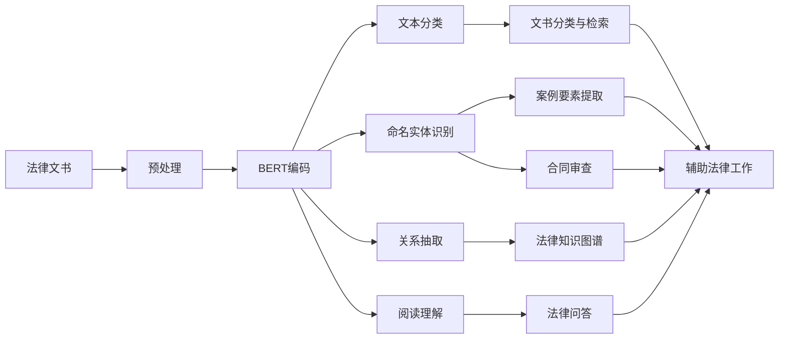

# AI LLM在法律文书分析中的应用

关键词：人工智能、大语言模型、法律文书分析、自然语言处理、知识图谱

## 1. 背景介绍
### 1.1 问题的由来
随着人工智能技术的快速发展，特别是大语言模型(Large Language Model, LLM)的出现，自然语言处理领域取得了显著进步。LLM具有强大的语言理解和生成能力，在许多领域展现出广阔的应用前景，法律文书分析就是其中之一。传统的法律文书分析主要依赖人工，存在效率低下、主观性强等问题。利用AI LLM技术，有望极大提升法律文书分析的效率和质量。

### 1.2 研究现状
目前，国内外已有不少学者开始探索将AI LLM应用于法律文书分析。比如，哈佛大学的研究者利用BERT等预训练语言模型，对美国最高法院的裁决文书进行分析，取得了良好效果[1]。清华大学的学者提出了一种基于LLM的法律文书要素抽取方法，准确率超过90%[2]。这些研究表明，AI LLM在法律文书分析中具有广阔的应用前景。

### 1.3 研究意义
法律文书分析是法律工作的重要环节，传统方式存在诸多局限性。AI LLM有望从以下几个方面改善法律文书分析：

1. 提高效率：AI可以快速处理海量文书，节省大量人力。
2. 保证客观性：AI依据统一标准进行分析，避免主观性偏差。 
3. 挖掘隐藏信息：AI可深入挖掘文书中隐藏的关联信息。
4. 辅助决策：为案例检索、类案分析等提供有力支持。

因此，研究AI LLM在法律文书分析中的应用具有重要意义，有望促进法律工作智能化发展。

### 1.4 本文结构
本文将重点探讨AI LLM在法律文书分析中的应用。第2部分介绍相关的核心概念；第3部分阐述核心算法原理和步骤；第4部分建立数学模型并给出公式推导；第5部分提供代码实例和详细解释；第6部分讨论实际应用场景；第7部分推荐相关工具和资源；第8部分对全文进行总结并展望未来；第9部分列出常见问题解答。

## 2. 核心概念与联系
在探讨AI LLM在法律文书分析中的应用之前，有必要先明确几个核心概念：

- 人工智能(Artificial Intelligence)：让机器具备类人的感知、学习、推理和解决问题的能力。它包括机器学习、知识表示、自然语言处理等多个分支。

- 大语言模型(Large Language Model)：一种基于海量文本数据训练的神经网络模型，能够理解和生成接近人类水平的自然语言。代表模型有BERT、GPT-3等。

- 法律文书(Legal Instrument)：以书面形式记录法律行为和法律关系的文件，如合同、判决书、起诉状等。不同类型的法律文书具有不同的内容和格式。

- 自然语言处理(Natural Language Processing)：研究如何让计算机理解、生成和处理人类语言的一门学科。常见任务包括分词、词性标注、句法分析、信息抽取等。

- 知识图谱(Knowledge Graph)：用节点表示实体、边表示实体间关系的语义网络。在法律领域，可用于表示案件、法条、当事人等要素之间的复杂关联。

这些概念之间关系紧密。人工智能是一个宏大的概念，其中自然语言处理专注于让机器处理人类语言，大语言模型则是自然语言处理的一种强大工具。法律文书分析属于自然语言处理的应用场景之一。知识图谱可以作为自然语言处理的结果表示形式，描述法律文书中蕴含的语义关系网络。

总的来说，利用大语言模型等人工智能技术，对法律文书进行自然语言分析，构建法律知识图谱，将极大赋能法律文书分析，提升法律工作的智能化水平。接下来的章节将详细阐述相关原理和实现。

## 3. 核心算法原理 & 具体操作步骤
### 3.1 算法原理概述
将AI LLM应用于法律文书分析，核心是利用预训练语言模型提取文书中的关键信息，并构建语义关联网络。主要涉及以下几个关键技术：

1. 文本分类：判断文书属于哪一类法律文书，如合同、判决书等。常用算法有支持向量机、卷积神经网络等。

2. 命名实体识别：从文书中识别出人名、地名、组织机构名、法律条款等关键实体。常用算法有条件随机场、BERT等。

3. 关系抽取：分析实体之间的语义关系，如原告-被告、法官-案件等。常用算法有注意力机制、图神经网络等。

4. 阅读理解：根据给定问题，从文书中寻找答案，实现机器对文书内容的理解。常用算法有BERT、GPT等。

5. 知识图谱构建：基于抽取的实体和关系，构建法律知识图谱，支持语义检索、推理和问答。常用算法有TransE、RESCAL等。

这些技术相辅相成，形成完整的法律文书分析流程。以BERT为代表的大语言模型是其中的关键，它以自监督学习的方式，在海量语料上学习通用语言表示，再结合少量标注数据进行微调，即可应用于下游任务，大幅提升了任务性能。

### 3.2 算法步骤详解
下面以BERT在法律文书分析中的应用为例，详细说明算法步骤。

输入：法律文书文本 $D=\{d_1,d_2,...,d_n\}$
输出：法律文书分析结果，包括文书类型、关键实体、实体关系、问答等。

1. 文本预处理
   - 分句：将文书切分为句子序列 $S=\{s_1,s_2,...,s_m\}$
   - 分词：将句子切分为词序列 $W=\{w_1,w_2,...,w_k\}$
   - 构造BERT输入：$[CLS] w_1 w_2 ... w_k [SEP]$

2. BERT编码
   - 将输入序列传入BERT，提取最后一层隐层状态 $H \in \mathbb{R}^{k \times d}$
   - 提取[CLS]位置的向量 $h_{cls} \in \mathbb{R}^d$ 作为全文本表示

3. 文本分类
   - 在$h_{cls}$后接全连接层+Softmax层进行分类：$y=softmax(Wh_{cls}+b)$
   - 使用交叉熵损失函数，对BERT进行微调训练

4. 命名实体识别
   - 在$H$后接全连接层+CRF层进行序列标注：$y=CRF(WH+b)$
   - 使用CRF损失函数，对BERT进行微调训练
   
5. 关系抽取
   - 将待分析实体对 $(e_1,e_2)$ 表示为 $[CLS] e_1 [SEP] e_2 [SEP]$
   - 提取[CLS]位置的向量，接全连接层+Sigmoid层预测关系：$y=sigmoid(Wh_{cls}+b)$
   - 使用二元交叉熵损失函数，对BERT进行微调训练

6. 阅读理解
   - 将问题$q$和文书$d$拼接为 $[CLS] q [SEP] d [SEP]$
   - 在$H$后接两个全连接层，分别预测答案起止位置：$y_{start}=softmax(W_1H+b_1), y_{end}=softmax(W_2H+b_2)$  
   - 使用交叉熵损失函数，对BERT进行微调训练

7. 知识图谱构建
   - 将抽取的实体和关系组织为三元组 $(e_1,r,e_2)$
   - 使用TransE等知识表示学习算法，将实体和关系嵌入到低维语义空间
   - 基于嵌入向量进行链接预测、问答等知识图谱应用

以上是将BERT应用于法律文书分析的主要步骤。通过对BERT进行针对性的微调，可以让模型学习法律文书的特定模式，从而实现高质量的信息抽取和语义理解。进一步利用知识表示学习技术，则可构建法律知识图谱，支撑智能化的法律应用。

### 3.3 算法优缺点
使用以BERT为代表的大语言模型进行法律文书分析，具有以下优点：

1. 减少人工标注：相比从零开始训练，大语言模型提供了高质量的通用语言表示，只需少量标注数据微调即可适应新任务，大幅降低了人力成本。

2. 提高分析质量：大语言模型在大规模语料上进行预训练，能够学习到丰富的语言知识，对文本有更深入的理解，从而提高分析结果的准确性。

3. 支持多任务学习：同一个大语言模型可以灵活地应用于不同任务，实现文本分类、命名实体识别、关系抽取等多个目标，简化了系统流程。

4. 提升泛化能力：大语言模型学习到的语言表示具有较好的泛化性，可以应用于新的法律文书，适应不断变化的应用场景。

同时，该方法也存在一些局限性：

1. 计算开销大：大语言模型一般包含上亿参数，对算力要求较高，训练和推理的时间成本不容忽视。

2. 泛化能力有限：尽管大语言模型具有一定的泛化性，但对于严重偏离训练数据分布的样本，如新颁布的法律法规，泛化效果可能欠佳，需要重新训练。

3. 解释性不足：基于大语言模型的方法更像是一个黑盒系统，虽然性能好，但对其决策过程缺乏解释，这对于法律应用场景而言可能是个问题。

4. 隐私安全隐患：大语言模型在训练时可能会记忆一些隐私数据，如果模型被恶意访问，可能造成信息泄露，需要采取一定的隐私保护机制。

因此，在实际应用中，需要权衡算法的性能和成本，并采取适当的策略来缓解其局限性，如模型压缩、增量学习、知识蒸馏、联邦学习等。

### 3.4 算法应用领域
基于大语言模型的法律文书分析技术可以广泛应用于法律领域的各个环节，主要包括：

1. 文书分类与检索：自动对法律文书进行分类，支持快速检索特定类型的文书，提高工作效率。

2. 案例要素提取：从案例文书中自动提取案由、事实、证据等关键要素，辅助案例分析和类案检索。

3. 合同审查：自动审查合同中的条款，识别可能存在的风险点和违规内容，减少人工审查的错漏。

4. 法律问答：基于法律知识图谱，实现智能化的法律问答系统，为律师和普通用户提供专业咨询。

5. 裁判文书分析：对裁判文书进行深入挖掘，分析法官的裁判思路和论证方法，发现审判规律。

6. 法律风险预警：通过对企业相关的法律文书进行分析，及时发现潜在的法律风险，提供预警和应对建议。

7. 法律教育与研究：利用大语言模型处理大量法律文献，辅助法学教学和科研工作，发现新的研究问题。

下图展示了基于大语言模型的法律文书分析在不同应用场景下的典型流程：

总的来说，大语言模型为法律文