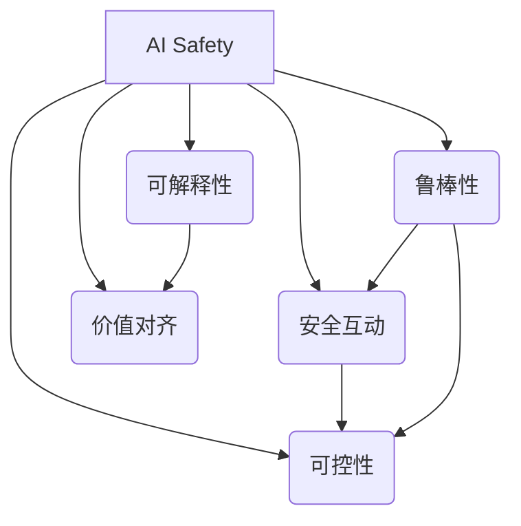

# AI Safety原理与代码实例讲解

## 1. 背景介绍
### 1.1  问题的由来
随着人工智能技术的飞速发展,AI系统在各行各业得到广泛应用,给人类社会带来巨大便利的同时,AI安全问题也日益凸显。一些AI系统表现出偏离人类价值观和伦理道德的行为,甚至可能对人类社会造成威胁和伤害。因此,如何确保AI系统以安全、可控、符合伦理的方式运行,成为亟待解决的关键问题。

### 1.2  研究现状  
目前,AI Safety领域已经成为人工智能研究的重要分支。谷歌DeepMind、OpenAI等知名机构纷纷成立AI Safety研究团队,投入大量资源开展理论和应用研究。一些关键性的研究成果不断涌现,如安全互动、可解释性、价值对齐等。但总体而言,AI Safety研究尚处于起步阶段,许多基础理论和关键技术有待突破。

### 1.3  研究意义
AI Safety研究对于人工智能的长远发展至关重要。只有确保AI系统的安全性和可控性,人工智能才能真正造福人类。系统性地总结AI Safety的理论基础和技术方法,有助于指导AI系统的设计开发,规避潜在的安全隐患,促进人工智能健康有序发展。同时,AI Safety研究也为人工智能伦理、法律等问题提供重要参考。

### 1.4  本文结构
本文将重点探讨AI Safety的核心原理和典型应用。首先介绍AI Safety的核心概念,包括安全互动、可解释性、价值对齐等。然后重点阐述AI Safety的关键技术,包括算法原理、数学模型、代码实现等。接着通过实际案例分析AI Safety的应用情况。最后总结全文,展望AI Safety的发展趋势和挑战。

## 2. 核心概念与联系
AI Safety的核心概念主要包括:

1. 安全互动(Safe Interruptibility):是指AI系统能够安全地中断或终止执行某项任务,以避免产生危害。
2. 可解释性(Explainability):AI系统能够对其决策和行为做出合理的解释,以便人类理解和监管。 
3. 价值对齐(Value Alignment):确保AI系统的目标和行为与人类的价值观保持一致,不会产生危害人类利益的行为。
4. 鲁棒性(Robustness):AI系统能够在复杂多变的现实环境中稳定可靠地运行,不受对抗样本等恶意攻击的影响。
5. 可控性(Controllability):人类能够有效控制和干预AI系统的行为,把最终决策权掌握在人手中。

这些核心概念相互关联,共同构成AI Safety的理论基础。比如,安全互动是实现可控性的重要手段;可解释性是实现价值对齐的必要条件;鲁棒性是确保安全互动和可控性的基础。



## 3. 核心算法原理 & 具体操作步骤
### 3.1  算法原理概述
AI Safety的核心算法主要基于强化学习、因果推理、逆向强化学习等技术。通过设计合理的奖励函数,引导agent学习安全的策略;通过因果模型描述agent行为的因果机制,增强系统的可解释性;通过逆向强化学习估计人类偏好,实现价值对齐。同时,采用对抗训练等方法提高系统的鲁棒性。

### 3.2  算法步骤详解
以基于因果模型的安全强化学习算法为例,主要步骤如下:

1. 构建环境因果模型,描述agent行为和环境变量之间的因果关系。
2. 定义安全性评估函数,度量某个状态或行为的安全程度。
3. 设计奖励函数,将安全性评估与环境奖励相结合。
4. 采用强化学习算法如PPO,优化agent策略,最大化累积奖励。
5. 在训练过程中,通过对抗样本等方法增强模型鲁棒性。
6. 对agent的决策过程进行因果分析,生成直观的解释。

### 3.3  算法优缺点
基于因果模型的安全强化学习算法的优点在于:
1. 通过因果模型直观地建模agent行为的安全性影响。
2. 奖励函数同时考虑性能和安全,平衡两者的权衡。
3. 因果分析增强了模型的可解释性。

但该算法也存在一些局限:
1. 因果模型的构建需要大量的先验知识,容易出错。
2. 安全性评估函数的设计有一定主观性。
3. 训练过程计算开销大,难以应用于复杂环境。

### 3.4  算法应用领域
基于因果模型的安全强化学习算法可以应用于自动驾驶、工业控制、医疗诊断等安全攸关的领域。通过该算法训练的agent能够在保证安全的前提下追求性能的最大化,并能对决策过程做出合理的解释。

## 4. 数学模型和公式 & 详细讲解 & 举例说明
### 4.1  数学模型构建
考虑一个马尔可夫决策过程(MDP),其状态空间为$\mathcal{S}$,动作空间为$\mathcal{A}$,状态转移概率为$\mathcal{P}$,奖励函数为$\mathcal{R}$,折扣因子为$\gamma$。agent的策略为$\pi: \mathcal{S} \times \mathcal{A} \to [0,1]$。

定义因果模型$\mathcal{M}=\langle\mathcal{U},\mathcal{V},\mathcal{F},\mathcal{P}\rangle$:
- $\mathcal{U}$表示外生变量集合。
- $\mathcal{V}$表示内生变量集合,包括状态变量$S$和动作变量$A$。 
- $\mathcal{F}$表示因果机制集合,描述各变量之间的因果关系。
- $\mathcal{P}$表示外生变量的概率分布。

引入安全评估函数$\Phi:\mathcal{S}\times\mathcal{A}\to\mathbb{R}$,度量状态动作对的安全程度。值越大表示越安全。

定义安全增强型奖励函数:

$$
R'(s,a)=R(s,a)+\lambda\cdot\Phi(s,a)
$$

其中$\lambda$为平衡因子,控制安全性和性能的权重。

最终,agent的目标是最大化期望累积奖励:

$$
\max_{\pi} \mathbb{E}_{\pi}\left[\sum_{t=0}^{\infty}\gamma^t \cdot R'(s_t,a_t)\right]
$$

### 4.2  公式推导过程
为了求解上述优化问题,采用近端策略优化(PPO)算法。

定义广义优势估计(GAE):

$$
\hat{A}_t=\delta_t+(\gamma\lambda)\delta_{t+1}+\dots+(\gamma\lambda)^{T-t+1}\delta_{T-1}
$$

其中$\delta_t=r_t+\gamma V(s_{t+1})-V(s_t)$为TD误差,$V$为价值函数。

定义代理目标函数:

$$
L^{CLIP}(\theta)=\hat{\mathbb{E}}_t\left[min(r_t(\theta)\hat{A}_t,clip(r_t(\theta),1-\epsilon,1+\epsilon)\hat{A}_t)\right]
$$

其中$r_t(\theta)=\frac{\pi_{\theta}(a_t|s_t)}{\pi_{\theta_{old}}(a_t|s_t)}$为概率比,$\epsilon$为超参数,控制更新幅度。

最后,采用随机梯度上升优化$L^{CLIP}$,更新策略参数$\theta$:

$$
\theta \leftarrow \theta + \alpha \nabla_{\theta} L^{CLIP}(\theta)
$$

### 4.3  案例分析与讲解
考虑一个自动驾驶场景,状态变量包括车辆位置、速度、障碍物位置等,动作变量包括加速、刹车、转向等。安全评估函数可以考虑车辆与障碍物之间的距离、碰撞风险等因素。因果模型刻画了动作变量对状态变量的影响。

通过合理设置奖励函数和平衡因子,agent在训练过程中逐渐学习到安全且高效的驾驶策略。比如,agent学会与前车保持安全车距,在有碰撞风险时及时刹车,在交通流顺畅时加速行驶等。

在决策过程中,因果模型可以解释agent的行为逻辑。比如,因为探测到前方障碍物,所以选择减速并变道。这种解释有助于人类监管者理解agent的决策过程。

### 4.4  常见问题解答
Q: 如何设计安全评估函数?
A: 可以考虑agent行为的直接风险和潜在风险。直接风险如碰撞、违规等,潜在风险如车距过近、超速等。风险越大,安全评估值越低。

Q: 如何权衡安全性和性能?
A: 可以通过调节奖励函数中的平衡因子来控制。平衡因子越大,越强调安全性;越小,越强调性能。需要根据具体应用场景合理设置。

Q: 因果模型如何构建?
A: 因果模型的构建需要结合先验知识和数据分析。先验知识来自专家经验,如动作变量一般为因,状态变量一般为果。数据分析可通过因果发现算法自动挖掘变量之间的因果关系。

Q: 对抗训练会不会影响模型性能?
A: 对抗训练在提高模型鲁棒性的同时,确实可能会一定程度地降低模型性能。需要平衡对抗样本的强度,避免过度影响模型的决策边界。

## 5. 项目实践：代码实例和详细解释说明
### 5.1  开发环境搭建
- Python 3.7
- PyTorch 1.8
- OpenAI Gym 0.18
- NumPy, SciPy, Matplotlib等常用库

### 5.2  源代码详细实现
以下为基于因果模型的安全强化学习算法的简要实现:

```python
import torch
import torch.nn as nn
import torch.optim as optim
import gym
import numpy as np

# 定义策略网络
class PolicyNet(nn.Module):
    def __init__(self, state_dim, action_dim):
        super(PolicyNet, self).__init__()
        self.fc1 = nn.Linear(state_dim, 64)
        self.fc2 = nn.Linear(64, 64)
        self.fc3 = nn.Linear(64, action_dim)
        
    def forward(self, x):
        x = torch.relu(self.fc1(x))
        x = torch.relu(self.fc2(x))
        x = torch.softmax(self.fc3(x), dim=-1)
        return x

# 定义价值网络
class ValueNet(nn.Module):
    def __init__(self, state_dim):
        super(ValueNet, self).__init__()
        self.fc1 = nn.Linear(state_dim, 64)
        self.fc2 = nn.Linear(64, 64)
        self.fc3 = nn.Linear(64, 1)
        
    def forward(self, x):
        x = torch.relu(self.fc1(x))
        x = torch.relu(self.fc2(x))
        x = self.fc3(x)
        return x

# 定义安全评估函数
def safety_critic(state, action):
    # 计算状态-动作对的安全性,值越大越安全
    # 这里只是一个示例,需要根据具体环境定制
    safety_score = 0.0
    if state[0] < 0.1 and action == 0:  # 在危险状态下选择刹车动作
        safety_score = 1.0
    elif state[0] > 0.9 and action == 1:  # 在安全状态下选择加速动作
        safety_score = 0.5
    else:
        safety_score = 0.0
    return safety_score

# 定义因果模型
def causal_model(state, action):
    # 基于因果关系预测下一状态
    # 这里只是一个示例,需要根据具体环境定制
    next_state = np.copy(state)
    if action == 0:  # action=0表示刹车
        next_state[1] -= 0.1
    elif action == 1:  # action=1表示加速
        next_state[1] += 0.1
    next_state[0] += next_state[1]
    return