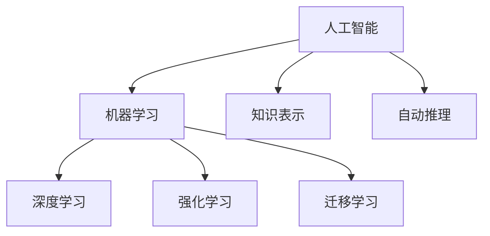
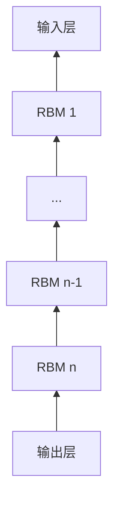

# AI 大模型计算机科学家群英传：机器学习和深度学习教育家 Andrew Ng

## 1. 背景介绍

### 1.1 问题的由来

在人工智能(Artificial Intelligence, AI)领域中，机器学习(Machine Learning, ML)和深度学习(Deep Learning, DL)是两个重要的分支。近年来，随着计算机硬件性能的提升和大数据时代的到来，ML和DL取得了突飞猛进的发展，在计算机视觉、自然语言处理、语音识别等诸多领域取得了令人瞩目的成就。这其中，斯坦福大学教授Andrew Ng功不可没，他是将ML和DL推向大众视野的关键人物之一。

### 1.2 研究现状

目前，ML和DL已经成为了AI领域的研究热点和产业发展的重要驱动力。各大科技巨头如谷歌、微软、亚马逊、百度等纷纷投入巨资，成立专门的AI实验室，致力于ML和DL技术的研发和应用。与此同时，高校和研究机构也在积极开展相关基础理论和应用技术的研究。ML和DL在图像识别、语音识别、自然语言理解、智能问答、自动驾驶等领域取得的成果，正在深刻影响和改变着人们的生活。

### 1.3 研究意义

对Andrew Ng在ML和DL领域的贡献进行系统梳理和总结，有助于我们更好地理解这两个分支的发展脉络，把握前沿技术动向。同时，对Andrew Ng的教学理念和方法进行分析，可以为广大AI从业者和爱好者提供宝贵的学习借鉴，让更多人走进ML和DL的殿堂，为推动AI事业的发展贡献力量。

### 1.4 本文结构

本文将首先介绍Andrew Ng的学术背景和主要成就，然后重点介绍他在ML和DL领域的代表性工作，包括聚类、异常检测、稀疏自编码、深度学习等，并对其教学理念和方法进行分析总结。最后，展望Andrew Ng未来可能的研究方向，以及ML和DL技术的发展趋势。

## 2. 核心概念与联系

在介绍Andrew Ng的研究工作之前，有必要先对ML、DL等核心概念进行必要的说明，以便读者更好地理解后文内容。

机器学习是一门多领域交叉学科，涉及概率论、统计学、逼近论、凸分析、算法复杂度理论等多个学科。它主要研究计算机怎样模拟或实现人类的学习行为，以获取新的知识或技能，重新组织已有的知识结构，不断改善自身的性能。

深度学习是机器学习的一个新的研究方向。它试图用包含多个隐层的机器学习模型，模拟人脑的层级结构（即神经网络），从而更好地表示和学习数据中蕴含的高层语义信息。深度学习是当前AI领域最活跃、最成功的研究方向之一，在语音识别、图像识别等多个领域取得了突破性进展。

机器学习和深度学习的关系可以用下图表示：

可以看出，机器学习是实现人工智能的一个途径，而深度学习又是机器学习的一个重要分支。Andrew Ng正是在这两个领域取得了杰出成就。

## 3. 核心算法原理 & 具体操作步骤

### 3.1 算法原理概述

Andrew Ng主要从事机器学习算法的研究，尤其擅长非监督学习和深度学习。他主导开发了多个影响深远的算法模型，包括：

1. K-Means聚类算法
2. 异常检测算法
3. 稀疏自编码算法
4. 深度置信网络

下面我们将对这些算法的原理进行概述。

### 3.2 算法步骤详解

#### K-Means聚类算法

K-Means是一种常用的聚类算法，其基本思想是：通过迭代寻找K个聚类的一种划分方案，使得用这K个聚类的均值来代表相应各类样本时，所得的总体误差最小。

算法步骤如下：

1. 随机选取K个初始聚类中心点 
2. 重复下面过程直到收敛：
   - 对于每个样本，计算其到各个聚类中心的距离，将其分到距离最近的聚类中心所对应的类
   - 重新计算每个聚类的聚类中心（即属于该聚类的所有样本的质心）
3. 输出最终的聚类结果

在实际应用中，K值的选取很关键，一般根据对数据的先验知识或者交叉验证等方法来确定。

#### 异常检测算法

异常检测是指识别出测试数据中与训练数据有显著差异的那些点。Andrew Ng提出的异常检测算法是一种基于高斯分布的概率模型。

给定一组训练样本 $\{x^{(1)}, x^{(2)}, \cdots, x^{(m)}\}$，异常检测的主要步骤如下：

1. 拟合训练集的特征，计算样本均值和方差：

   $\mu_j = \frac{1}{m}\sum_{i=1}^m x_j^{(i)}$

   $\sigma_j^2 = \frac{1}{m} \sum_{i=1}^m (x_j^{(i)} - \mu_j)^2$

2. 给定一个新样本 $x$，计算 $p(x)$：

   $p(x) = \prod_{j=1}^n p(x_j; \mu_j, \sigma_j^2)$

   其中，$p(x_j; \mu_j, \sigma_j^2) = \frac{1}{\sqrt{2\pi}\sigma_j} \exp\left(-\frac{(x_j-\mu_j)^2}{2\sigma_j^2}\right)$

3. 如果 $p(x) < \epsilon$，则 $x$ 是异常点。$\epsilon$ 为用户自定义的异常判断阈值。

该算法假设数据服从高斯分布，对于那些并不服从高斯分布的数据，可以考虑对数据进行变换，例如取对数等。

#### 稀疏自编码算法

稀疏自编码是一种无监督学习算法，可以用于学习数据的高阶特征。其核心思想是在神经网络的隐层引入稀疏性约束，使得网络能够学习到数据的稀疏表示。

具体来说，给定一组无标签数据 $\{x^{(1)}, x^{(2)}, \cdots, x^{(m)}\}$，稀疏自编码的目标是找到一个编码函数 $f(x)$ 和一个解码函数 $g(h)$，使得 $g(f(x)) \approx x$，同时 $f(x)$ 尽可能稀疏。其优化目标可以表示为：

$$\min_{W,b} \frac{1}{m} \sum_{i=1}^m \|x^{(i)} - g(f(x^{(i)}))\|^2 + \lambda \sum_{j=1}^n KL(\rho\|\hat{\rho}_j)$$

其中，$W,b$ 为网络参数，$\lambda$ 为稀疏惩罚项系数，$\rho$ 为稀疏性参数，$\hat{\rho}_j$ 为隐层第 $j$ 个神经元的平均激活度，$KL(\rho\|\hat{\rho}_j)$ 为 $\rho$ 和 $\hat{\rho}_j$ 的KL散度，用于度量两个分布的差异性。

网络训练时，通过反向传播算法来最小化上述损失函数，同时使用L1正则化来诱导隐层神经元的稀疏激活。训练得到的稀疏自编码器可以用于提取数据的高阶特征，进而应用于分类、聚类等下游任务中。

#### 深度置信网络

深度置信网络(Deep Belief Network, DBN)是一种基于受限玻尔兹曼机(Restricted Boltzmann Machine, RBM)的深度学习模型，由多个RBM堆叠而成。其结构如下图所示：

DBN的训练分为两个阶段：预训练和微调。

在预训练阶段，DBN采用无监督逐层贪婪训练的方式，即每次训练一层RBM，将训练好的RBM的隐层作为下一层RBM的可视层，逐层训练直到最顶层。这样可以有效地缓解深度网络的梯度消失问题，并为网络提供一个较好的初始化。

在微调阶段，DBN在顶层添加一个分类器（如Softmax层），然后采用有监督的方式对整个网络进行端到端的微调，以进一步提高性能。

DBN的训练算法可以总结如下：

1. 逐层预训练：
   - 将输入数据作为第一层RBM的可视层，训练第一层RBM
   - 将第一层RBM的隐层作为第二层RBM的可视层，训练第二层RBM
   - 重复上述过程，直到训练完最顶层RBM
2. 微调：
   - 在顶层RBM上添加分类器
   - 使用有标签数据对整个网络进行端到端的微调

DBN能够有效地学习数据的层次化特征表示，在图像、语音等领域取得了很好的效果。

### 3.3 算法优缺点

以上几种算法都是Andrew Ng的代表性工作，在学术界和工业界产生了广泛影响。它们的主要优点包括：

- 能够有效地学习数据的内在结构和高层特征
- 无需人工设计特征，降低了特征工程的成本
- 具有一定的普适性，可以应用于多个领域

当然，这些算法也存在一些局限性，例如：

- K-Means等聚类算法容易陷入局部最优，且聚类结果依赖于初始值选取
- 异常检测算法对数据分布的假设较为严格，实际数据未必完全符合
- 稀疏自编码和DBN等需要较长的训练时间，且网络结构设计需要依靠经验

### 3.4 算法应用领域

Andrew Ng的这些算法在多个领域得到了成功应用，例如：

- 在计算机视觉领域，稀疏自编码和DBN可以用于学习图像的高阶特征，进而应用于目标检测、图像分类等任务
- 在语音识别领域，DBN可以用于学习语音信号的层次化表示，有助于提升语音识别的性能
- 在异常检测领域，Andrew Ng的算法可以用于工业生产中的质量检测、网络安全中的入侵检测等
- 在推荐系统领域，聚类算法可以用于对用户或物品进行分组，实现个性化推荐

总之，Andrew Ng的这些算法为AI的发展做出了重要贡献，推动了机器学习和深度学习技术的进步与应用。

## 4. 数学模型和公式 & 详细讲解 & 举例说明

前面我们对Andrew Ng的几个代表性算法进行了原理介绍，下面我们选取其中的稀疏自编码算法，对其数学模型和公式进行更加详细的讲解，并给出具体的例子加以说明。

### 4.1 数学模型构建

稀疏自编码的数学模型可以表示为：

给定训练样本集 $\{x^{(1)}, x^{(2)}, \cdots, x^{(m)}\}$，其中 $x^{(i)} \in \mathbb{R}^n$，找到一个编码函数 $f(x)$ 和一个解码函数 $g(h)$，使得重构误差最小，且隐层表示 $h=f(x)$ 尽可能稀疏。

我们用神经网络来参数化 $f(x)$ 和 $g(h)$，即：

$$f(x) = \sigma(Wx+b)$$
$$g(h) = \sigma(W'h+b')$$

其中，$\sigma$ 为激活函数（通常取Sigmoid函数），$W, W'$ 分别为编码器和解码器的权重矩阵，$b, b'$ 为偏置向量。

为了使重构误差最小，我们最小化如下损失函数：

$$J(W,