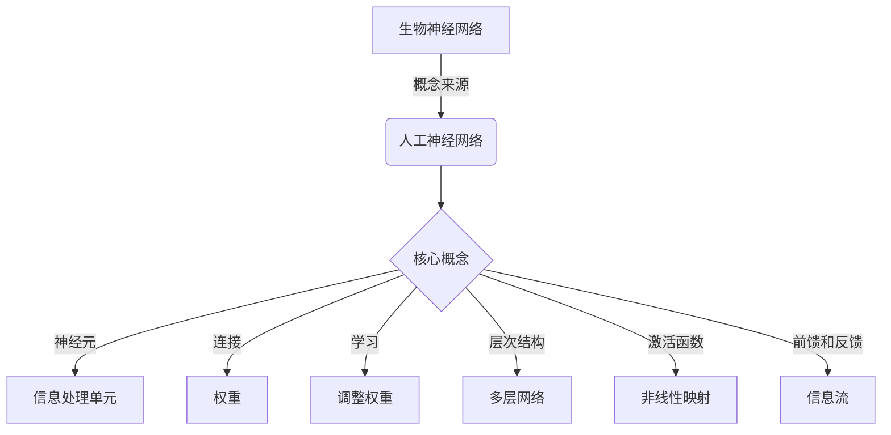

# AI 神经网络计算艺术之禅：如何把大自然亿万年进化训练出的生物神经网络作为新一代人工神经网络的蓝本

作者：禅与计算机程序设计艺术 / Zen and the Art of Computer Programming

## 1. 背景介绍

### 1.1 问题的由来

在过去几十年中，人工智能领域取得了长足的进步,尤其是在深度学习和神经网络方面。然而,与生物大脑相比,现有的人工神经网络在效率、鲁棒性和能量消耗方面仍有很大差距。生物神经网络是大自然亿万年进化过程中的杰作,通过自然选择优化而成,具有高度的并行处理能力、容错性和能量效率。因此,研究生物神经网络的工作原理,并将其应用于人工神经网络设计,可能是突破人工智能发展瓶颈的关键所在。

### 1.2 研究现状

目前,神经科学家和计算机科学家正在通过跨学科合作,努力揭示生物神经网络的奥秘。通过对大脑的解剖学、电生理学和成像技术的研究,我们对神经元的连接模式、信号传递机制以及大脑不同区域的功能有了更深入的了解。同时,人工智能研究人员也在尝试模拟生物神经网络的结构和功能,设计出更加高效和智能的人工神经网络模型。

### 1.3 研究意义

将生物神经网络的原理应用于人工智能系统设计,不仅可以提高计算效率和能量利用率,还有望解决目前人工智能系统面临的一些挑战,如泛化能力不足、缺乏常识推理等。此外,这种跨学科研究还有助于我们更好地理解人类大脑的工作机制,为治疗神经系统疾病提供新的思路。

### 1.4 本文结构

本文将首先介绍生物神经网络和人工神经网络的核心概念,探讨两者之间的联系和区别。接下来,将详细阐述生物神经网络的工作原理和算法,包括神经元的信号传递机制、突触可塑性等。然后,我们将构建相应的数学模型,并推导出描述生物神经网络行为的公式。在此基础上,我们将提供一个实际项目的代码实例,说明如何将生物神经网络的原理应用于人工神经网络设计。最后,我们将讨论生物神经网络在实际应用中的场景,以及未来的发展趋势和挑战。

## 2. 核心概念与联系

生物神经网络是大自然亿万年进化优化的杰作,其核心概念为人工神经网络的发展奠定了基础。神经元作为生物神经网络的基本信息处理单元,与人工神经网络中的节点类似。神经元之间通过突触连接形成复杂的网络结构,类似于人工神经网络中的权重连接。

生物神经网络通过突触可塑性机制实现学习,即根据输入信号调整突触连接强度,这与人工神经网络中通过调整权重实现学习的过程相似。此外,生物神经网络和人工神经网络都采用了层次结构,将输入信号经过多层处理得到最终输出。

神经元通过非线性激活函数对输入信号进行处理,与人工神经网络中的激活函数起到类似作用。信息在生物神经网络中通过前馈和反馈连接在不同区域之间传递,这种信息流机制也被应用于人工神经网络的设计中。

总的来说,生物神经网络为人工神经网络的发展提供了重要的理论基础和设计灵感。通过深入研究生物神经网络的工作原理,我们可以更好地优化人工神经网络的结构和算法,提高其性能和智能水平。

## 3. 核心算法原理 & 具体操作步骤

### 3.1 算法原理概述

生物神经网络的核心算法原理可以概括为以下几个方面:

1. **信号传递**: 神经元通过电化学信号在神经网络中传递信息。当神经元受到足够强的刺激时,会产生动作电位,并沿着轴突向其他神经元传播。

2. **突触可塑性**: 神经元之间的连接强度(即突触权重)并非固定不变,而是会根据神经活动的历史进行调整,这种现象被称为突触可塑性。突触可塑性是生物神经网络实现学习和记忆的关键机制。

3. **兴奋性和抑制性连接**: 在生物神经网络中,神经元之间不仅存在兴奋性连接(增强下游神经元的活动),还存在抑制性连接(抑制下游神经元的活动),这种平衡机制有助于网络的稳定性和信息处理能力。

4. **反馈回路**: 生物神经网络中存在大量的反馈连接,形成复杂的回路结构。这些反馈回路在注意力、工作记忆等高级认知功能中发挥着重要作用。

5. **神经元集群**: 生物神经网络中的神经元通常以集群的形式组织,每个集群对应特定的功能或表征。神经元集群之间通过复杂的连接模式实现信息整合和处理。

### 3.2 算法步骤详解

生物神经网络的信息处理过程可以概括为以下步骤:

1. **输入编码**: 外界刺激(如视觉、听觉等)被转化为神经元的电化学信号,作为网络的输入。

2. **前馈传递**: 输入信号沿着神经元的轴突向下一层神经元传递,每个神经元根据接收到的总输入和激活函数计算自身的输出。

3. **突触整合**: 每个神经元将来自上游神经元的输入信号按照对应的突触权重进行加权求和,得到总输入。

4. **激活函数**: 神经元通过非线性激活函数(如sigmoid函数)对总输入进行处理,产生输出信号。

5. **反馈调节**: 网络中的反馈连接将高层神经元的输出回传到低层,对信息处理过程进行调节和修正。

6. **突触可塑性**: 根据神经元活动的历史,调整突触权重,实现网络的学习和记忆。

7. **输出解码**: 最终层神经元的输出被解码为特定的表征或行为响应。

该算法的核心在于通过前馈传递、反馈调节和突触可塑性机制,实现对输入信号的高效处理和自适应学习。

### 3.3 算法优缺点

生物神经网络算法的优点包括:

1. **高度并行性**: 生物神经网络中有数十亿个神经元同时工作,具有极高的并行处理能力。

2. **容错性**: 由于神经元之间存在大量冗余连接,生物神经网络具有很强的容错性,即使部分神经元损坏,整体功能也不会受到严重影响。

3. **自适应性**: 通过突触可塑性机制,生物神经网络能够根据环境和任务需求自主调整连接强度,实现自适应学习。

4. **节能高效**: 生物神经网络的能量效率极高,人脑的功耗仅为现代超级计算机的一小部分。

5. **多任务处理**: 生物神经网络能够同时处理多种输入和任务,具有出色的多任务处理能力。

然而,生物神经网络算法也存在一些缺点:

1. **黑箱性质**: 由于生物神经网络的复杂性,我们对其工作机制的理解仍然有限,存在一定的黑箱性质。

2. **难以模拟**: 准确模拟生物神经网络的所有细节是一项艰巨的挑战,需要大量的计算资源和数据。

3. **噪声敏感性**: 生物神经网络对噪声和干扰较为敏感,可能会导致错误的信息处理。

4. **发展缓慢**: 与计算机硬件的快速发展相比,生物神经网络的研究进展相对缓慢。

5. **伦理道德问题**: 模拟生物神经网络可能会引发一些伦理和道德方面的争议。

### 3.4 算法应用领域

生物神经网络算法的原理可以应用于多个领域,包括但不限于:

1. **人工智能**: 借鉴生物神经网络的结构和工作机制,设计更高效、更智能的人工神经网络模型。

2. **机器人技术**: 赋予机器人生物神经网络般的感知、学习和决策能力,实现更自然、更智能的人机交互。

3. **脑机接口**: 通过解码生物神经网络的活动模式,实现大脑与外部设备之间的直接通信。

4. **神经科学**: 模拟生物神经网络有助于更好地理解人类大脑的工作原理,为治疗神经系统疾病提供新的思路。

5. **计算机视觉**: 借鉴视觉皮层的信息处理机制,提高计算机视觉系统的性能。

6. **自然语言处理**: 模拟语言区域的神经网络活动,提高自然语言处理系统的理解和生成能力。

7. **决策与规划**: 利用生物神经网络的并行处理和自适应学习能力,解决复杂的决策和规划问题。

总的来说,生物神经网络算法为多个领域带来了新的发展机遇,有望推动人工智能和相关技术的突破性进展。

## 4. 数学模型和公式 & 详细讲解 & 举例说明

### 4.1 数学模型构建

为了更好地描述和分析生物神经网络的行为,我们需要构建相应的数学模型。一个典型的生物神经网络模型包括以下几个主要组成部分:

1. **神经元模型**:描述单个神经元的动力学行为,包括膜电位、动作电位发放等。常用的神经元模型有积分与发放模型(Integrate-and-Fire Model)、Hodgkin-Huxley模型等。

2. **突触模型**:描述突触的传递特性,包括突触权重、延迟、可塑性等。常用的突触模型有Alpha函数模型、双指数模型等。

3. **网络拓扑**:描述神经元之间的连接模式,包括层次结构、反馈连接等。常用的网络拓扑有前馈网络、递归网络等。

4. **学习规则**:描述突触权重根据神经活动进行调整的规则,如Hebbian学习规则、Spike-Timing Dependent Plasticity (STDP)等。

在构建数学模型时,我们通常需要做出一些简化假设,以降低模型的复杂性,同时保留生物神经网络的核心特征。下面我们将介绍一个常用的生物神经网络模型:积分与发放神经元网络(Integrate-and-Fire Neural Network)。

### 4.2 公式推导过程

#### 4.2.1 积分与发放神经元模型

积分与发放神经元模型是描述单个神经元动力学行为的简化模型。它的核心思想是,神经元将接收到的输入信号进行积分,当积分值达到阈值时,神经元就会发放一个动作电位(脉冲),然后将膜电位重置为静息电位。

设第 $i$ 个神经元在时间 $t$ 时刻的膜电位为 $V_i(t)$,接收到的总输入电流为 $I_i(t)$,则膜电位的动力学方程为:

$$
\tau_m \frac{dV_i(t)}{dt} = -V_i(t) + RI_i(t)
$$

其中, $\tau_m$ 是膜电位时间常数, $R$ 是膜电阻。

当 $V_i(t)$ 达到阈值电压 $V_{th}$ 时,神经元就会发放一个动作电位,并将膜电位重置为 $V_{reset}$。发放动作电位后,膜电位将在绝对不应期 $t_{ref}$ 