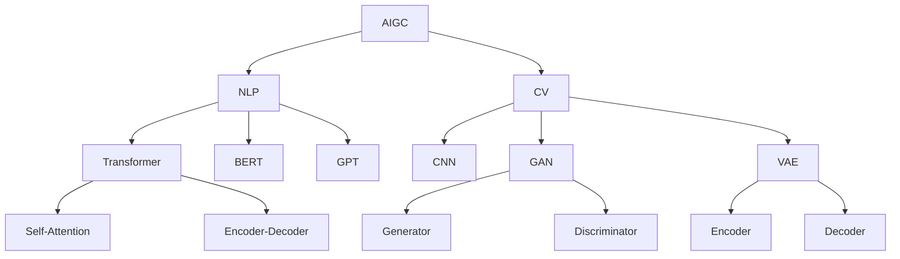
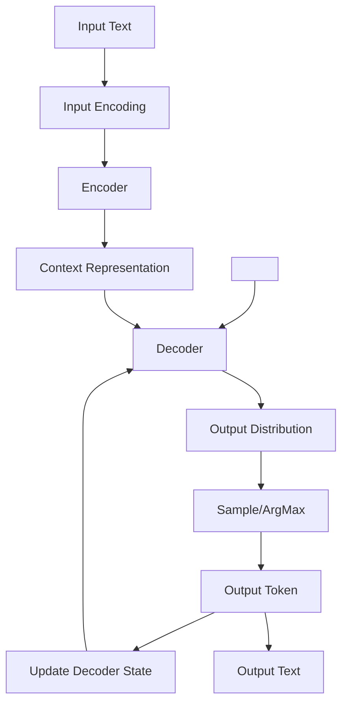

# AIGC 原理与代码实例讲解

## 1. 背景介绍

### 1.1 问题的由来

在过去几年中,人工智能(AI)和生成式人工智能(Generative AI)技术取得了长足的进步,尤其是自然语言处理(NLP)和计算机视觉(CV)领域。随着大型语言模型(LLM)和生成式对抗网络(GAN)等技术的不断发展,AI生成内容(AIGC)应用正在快速兴起。

AIGC技术可以根据用户提供的文本、图像或其他形式的输入,自动生成高质量的内容,例如文章、图像、视频、音频等。这种技术极大地提高了内容创作的效率,为各行各业带来了新的机遇。然而,AIGC技术的原理和实现方式对许多人来说仍然是个黑箱,缺乏透明度和可解释性。

### 1.2 研究现状

目前,主流的AIGC模型通常采用自回归(Autoregressive)架构,例如GPT(Generative Pre-trained Transformer)和DALL-E等。这些模型通过预训练学习大量数据,获取丰富的知识和上下文理解能力,再通过微调(Fine-tuning)针对特定任务进行优化。

虽然这些模型展现出了强大的生成能力,但它们的内部机制仍然存在一些缺陷和局限性。例如,生成的内容可能存在不一致、偏差或不合理的地方;模型的可解释性较差,难以理解其决策过程;生成效率有待提高等。

### 1.3 研究意义

深入探究AIGC技术的原理和实现方式,对于充分发挥其潜力,规避潜在风险,并推动该领域的可持续发展至关重要。透彻理解AIGC模型的工作机制,有助于:

1. 提高模型的可解释性和可控性,确保生成内容的一致性和合理性。
2. 优化模型架构和训练策略,提升生成效率和质量。
3. 评估模型的局限性和潜在风险,制定相应的缓解措施。
4. 促进AIGC技术在各行业的落地应用,释放其巨大潜能。

### 1.4 本文结构

本文将全面深入地探讨AIGC技术的原理和实现细节。我们将从核心概念和算法原理出发,详细讲解数学模型和公式推导,并结合代码实例进行实践操作。最后,我们将总结AIGC技术的应用场景、发展趋势和面临的挑战。

通过本文,读者将能够全面理解AIGC技术的理论基础和实现细节,掌握相关算法和代码实现,为将来在该领域的研究和应用奠定坚实的基础。

## 2. 核心概念与联系

AIGC技术涉及多个核心概念,包括自然语言处理(NLP)、计算机视觉(CV)、生成式对抗网络(GAN)、变分自编码器(VAE)、transformer等。这些概念相互关联,共同构建了AIGC技术的理论基础。

上图展示了AIGC技术中的核心概念及其关系。我们将逐一介绍这些概念:

1. **自然语言处理(NLP)**: 研究计算机处理和理解自然语言的方法,是AIGC文本生成的理论基础。
2. **计算机视觉(CV)**: 研究计算机如何获取、处理、分析和理解数字图像或视频数据,是AIGC图像/视频生成的理论基础。
3. **Transformer**: 一种基于自注意力机制的序列到序列模型,广泛应用于NLP和CV任务。
4. **BERT**: 基于Transformer的预训练语言模型,用于各种NLP下游任务。
5. **GPT**: 另一种基于Transformer的大型语言模型,擅长生成自然语言文本。
6. **卷积神经网络(CNN)**: 一种常用于CV任务的神经网络架构。
7. **生成式对抗网络(GAN)**: 由生成器和判别器组成的框架,用于生成逼真的图像或其他数据。
8. **变分自编码器(VAE)**: 一种基于深度学习的生成模型,可以学习数据的潜在表示并生成新数据。

这些概念相互关联、相辅相成,共同推动了AIGC技术的发展。下一节我们将深入探讨AIGC的核心算法原理。

## 3. 核心算法原理与具体操作步骤

### 3.1 算法原理概述

AIGC技术的核心算法通常基于自回归(Autoregressive)模型,例如GPT和DALL-E等。这些模型的工作原理可以概括为:

1. **预训练(Pre-training)**: 在大量通用数据(如网页、书籍、图像等)上进行无监督预训练,学习通用的表示能力。
2. **微调(Fine-tuning)**: 在特定任务的标注数据上进行有监督微调,使模型适应特定任务。
3. **生成(Generation)**: 给定一个起始输入(如文本或图像),模型自回归地生成下一个token(文本或像素),直到生成完整的输出。

这种自回归生成过程可以用概率模型来刻画。对于文本生成任务,我们希望最大化生成序列 $y = (y_1, y_2, ..., y_T)$ 的条件概率 $P(y|x)$,其中 $x$ 是输入提示。根据链式法则,我们可以将其分解为:

$$P(y|x) = \prod_{t=1}^{T}P(y_t|y_{<t}, x)$$

即在给定输入 $x$ 和之前生成的tokens $y_{<t}$ 的条件下,预测当前token $y_t$ 的概率。模型的目标是学习这种条件概率分布,以生成高质量、连贯的输出序列。

对于图像生成任务,原理类似,但需要对像素进行建模。我们将图像 $x$ 看作一个像素序列 $x = (x_1, x_2, ..., x_N)$,其中 $N$ 是像素数量。目标是最大化像素序列的概率:

$$P(x) = \prod_{i=1}^{N}P(x_i|x_{<i})$$

即在给定之前的像素 $x_{<i}$ 的条件下,预测当前像素 $x_i$ 的概率分布。

这种自回归建模方式使得模型能够捕捉输入和输出之间的复杂依赖关系,并生成高质量、连贯的内容。但同时也带来了一些缺陷,如生成效率较低、存在累积错误风险等。我们将在后面讨论一些改进方法。

### 3.2 算法步骤详解

现在让我们具体看一下自回归生成算法的实现步骤,以文本生成任务为例:

1. **输入编码(Input Encoding)**: 将输入文本 $x$ 编码为模型可以理解的表示,通常使用词嵌入(Word Embedding)或子词嵌入(Subword Embedding)。

2. **前向计算(Forward Computation)**: 将编码后的输入 $x$ 传入Transformer编码器(Encoder),获得其上下文表示 $c$。

3. **初始化(Initialization)**: 将起始token `<bos>` 传入Transformer解码器(Decoder),获得其隐状态 $h_0$。

4. **自回归生成(Autoregressive Generation)**: 
   a. 在时间步 $t$, 将 $h_{t-1}$ 和 $c$ 传入Decoder,得到当前token的概率分布 $P(y_t|y_{<t}, x)$。
   b. 从 $P(y_t|y_{<t}, x)$ 中采样(或取最大值)得到 $y_t$。
   c. 将 $y_t$ 传入Decoder,更新隐状态 $h_t$。
   d. 重复步骤a-c,直到生成终止token `<eos>` 或达到最大长度。

5. **输出解码(Output Decoding)**: 将生成的token序列解码为原始文本格式的输出。

上图展示了自回归文本生成算法的工作流程。对于图像生成任务,步骤类似,但需要对像素进行建模,并使用卷积神经网络(CNN)或其他CV模型替代Transformer结构。

需要注意的是,这种自回归生成方式存在一些缺陷,如生成效率较低(每个时间步都需要重新计算)、累积错误风险(前面的错误会影响后续生成)等。因此,研究人员提出了一些改进方法,如使用非自回归(Non-Autoregressive)生成、层次生成(Hierarchical Generation)等,我们将在后面章节讨论。

### 3.3 算法优缺点

自回归生成算法具有以下优缺点:

**优点**:

1. **建模灵活**: 能够捕捉输入和输出之间的复杂依赖关系,生成高质量、连贯的内容。
2. **广泛应用**: 可以应用于各种生成任务,如文本、图像、音频等。
3. **可解释性较好**: 生成过程具有一定的可解释性,易于理解和调试。

**缺点**:

1. **生成效率低下**: 每个时间步都需要重新计算,生成速度较慢。
2. **累积错误风险**: 前面的错误会影响后续生成,可能导致偏差或不合理的输出。
3. **训练数据偏差**: 生成的内容可能受限于训练数据的偏差和局限性。
4. **一致性和多样性权衡**: 难以在生成内容的一致性和多样性之间取得平衡。

为了缓解这些缺陷,研究人员提出了多种改进方法,如非自回归生成、层次生成、控制生成等,我们将在后面章节讨论。

### 3.4 算法应用领域

自回归生成算法及其改进版本广泛应用于以下领域:

1. **自然语言处理(NLP)**: 
   - 文本生成(新闻、故事、诗歌等)
   - 机器翻译
   - 问答系统
   - 文本摘要

2. **计算机视觉(CV)**: 
   - 图像生成
   - 图像描述
   - 图像编辑
   - 视频生成

3. **多模态任务**:
   - 视觉问答
   - 图文生成
   - 多模态对话

4. **音频处理**:
   - 语音合成
   - 音乐生成
   - 音频转换

5. **其他领域**:
   - 分子设计
   - 蛋白质结构预测
   - 推荐系统
   - 强化学习

总的来说,自回归生成算法为各种人工智能生成任务提供了有力的理论支撑和实现方式,是AIGC技术的核心算法之一。

## 4. 数学模型和公式详细讲解与举例说明

在前面章节中,我们介绍了AIGC技术的核心算法原理,本节将深入探讨其背后的数学模型和公式推导过程。

### 4.1 数学模型构建

AIGC技术通常采用基于神经网络的概率模型,目标是学习输入 $x$ 和输出 $y$ 之间的条件概率分布 $P(y|x)$。对于文本生成任务,我们将输出序列 $y$ 分解为:

$$P(y|x) = \prod_{t=1}^{T}P(y_t|y_{<t}, x)$$

其中 $y_{<t}$ 表示之前生成的tokens序列。我们使用神经网络 $f_\theta$ 来近似这个条件概率分布,即:

$$P(y_t|y_{<t}, x) \approx f_\theta(y_t, y_{<t}, x)$$

在训练过程中,我们最小化负对数似然损失函数:

$$\mathcal{L}(\theta) = -\frac{1}{N}\sum_{i=