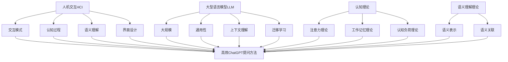
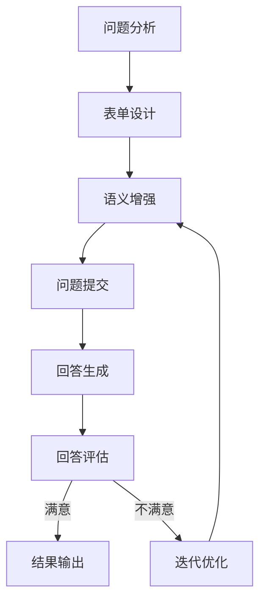

# AIGC从入门到实战：ChatGPT 提问表单

## 1. 背景介绍

### 1.1 问题的由来

在当前的数字时代,人工智能(AI)和生成式人工智能(Generative AI,AIGC)技术正在迅速发展,其中以ChatGPT为代表的大型语言模型已经展现出了令人惊叹的能力。作为一种通用的对话式AI助手,ChatGPT可以根据用户的自然语言输入,生成高度相关和内容丰富的响应,涵盖了从创作写作到编程开发等多个领域。

然而,与传统的搜索引擎不同,ChatGPT的交互方式更加自然和灵活,用户需要通过提问的方式来获取所需的信息。因此,如何高效地向ChatGPT提出问题,以获得准确、全面的回答,成为了一个亟待解决的问题。

### 1.2 研究现状

目前,已有一些研究人员和实践者探索了如何更好地利用ChatGPT的能力。一些常见的做法包括:

1. **明确问题目标**:在提问时,明确表达出所需信息的目标和范围,有助于ChatGPT更好地理解和回答问题。

2. **提供背景信息**:为ChatGPT提供一些相关的背景信息和上下文,可以帮助它更好地理解问题,并生成更加贴切的回答。

3. **分解复杂问题**:将一个复杂的问题分解为多个相对简单的子问题,逐步向ChatGPT提问并整合回答,可以获得更全面的解决方案。

4. **反馈和迭代**:根据ChatGPT的初步回答,提出进一步的追问或反馈,引导它不断完善和优化回答内容。

然而,这些做法大多是基于个人经验和直觉,缺乏系统性的理论指导。因此,需要一种更加科学和规范的方法来指导如何高效地与ChatGPT进行交互和提问。

### 1.3 研究意义

建立一种科学的ChatGPT提问方法论,对于充分发挥AIGC技术的潜力,提高人机协作效率,具有重要的理论和实践意义:

1. **理论意义**:可以深入探索人与AIGC系统的交互模式,揭示其中的认知机理和语义理解过程,为发展更加智能和人性化的人机交互界面提供理论基础。

2. **实践意义**:可以为各行业的从业人员提供一种高效的工具和方法,利用ChatGPT等AIGC技术来解决实际问题,提高工作效率和创新能力。

3. **教育意义**:可以将该方法论应用于教育领域,培养学生利用AIGC工具解决问题的能力,促进探究式学习和自主学习。

4. **社会意义**:随着AIGC技术的不断发展和普及,建立科学的人机交互方式,有助于缩小不同群体之间的技术鸿沟,实现技术的公平获取和共享。

### 1.4 本文结构

本文将围绕"如何高效地向ChatGPT提出问题"这一主题,从理论和实践两个层面进行深入探讨。

理论层面,将介绍提问的认知机理和语义理解过程,构建一个系统的ChatGPT提问理论框架。

实践层面,将提出一种基于表单的ChatGPT提问方法,并给出具体的设计原则和操作步骤,最后通过案例分析来验证该方法的有效性。

同时,本文还将探讨提问方法在不同应用场景下的实践,分享相关的工具和资源,并对未来的发展趋势和挑战进行展望和讨论。

## 2. 核心概念与联系

在探讨如何高效地向ChatGPT提问之前,我们需要理解一些核心概念及其相互关系。

### 2.1 人机交互(Human-Computer Interaction, HCI)

人机交互是一门研究人与计算机系统之间交互过程、交互方式和界面设计的学科。它涉及多个领域,包括计算机科学、心理学、社会学、人体工程学等。

在与ChatGPT的交互中,我们需要考虑以下几个关键因素:

1. **交互模式**: 自然语言是人与ChatGPT交互的主要模式,需要探索如何利用自然语言来高效、准确地表达需求。

2. **认知过程**: 人在提出问题和理解回答时,会经历一系列认知过程,如注意力分配、信息加工、推理判断等,需要深入研究这些过程对交互的影响。

3. **语义理解**: ChatGPT需要准确理解人类的自然语言输入,并生成相关的回答,这涉及到自然语言处理和语义理解的技术。

4. **界面设计**: 为了提高交互效率,需要设计一个友好、直观的人机交互界面,如表单式提问等。

### 2.2 大型语言模型(Large Language Model, LLM)

ChatGPT是一种基于大型语言模型(LLM)的对话式AI系统。LLM是一种利用大量文本数据训练而成的深度神经网络模型,能够捕捉自然语言的复杂模式和语义关系。

LLM的核心特点包括:

1. **大规模**: 模型参数量通常达到数十亿甚至上百亿,能够学习和表示海量的语言知识。

2. **通用性**: 模型可以应用于多种自然语言处理任务,如文本生成、问答、总结、翻译等。

3. **上下文理解**: 模型能够捕捉输入文本的上下文信息,生成与上下文相关的响应。

4. **迁移学习**: 通过对大规模语料进行预训练,模型可以获得通用的语言表示能力,再通过微调(fine-tuning)来适应特定的任务和领域。

在与ChatGPT交互时,我们需要充分利用LLM的上下文理解和迁移学习能力,设计合理的提问策略,以获得准确、全面的回答。

### 2.3 认知理论与语义理解

人在提出问题和理解回答的过程中,会涉及多种认知过程,如注意力分配、工作记忆、推理判断等。相关的认知理论可以为我们设计高效的提问方法提供理论指导。

1. **注意力理论**: 人的注意力资源是有限的,在提问时需要合理分配注意力,关注问题的核心目标和关键信息。

2. **工作记忆理论**: 工作记忆是人暂时存储和操作信息的系统,在提问和理解回答时起着关键作用。合理利用工作记忆可以提高交互效率。

3. **认知负荷理论**: 过多的认知负荷会影响人的理解和决策能力。在设计提问方法时,需要考虑减轻认知负荷,提高交互的流畅性。

4. **语义理解理论**: 人在理解自然语言时,需要建立语义表示,捕捉词语、句子和上下文之间的语义关联。ChatGPT也需要准确理解人类输入的语义,才能生成相关的回答。

通过结合认知理论和语义理解理论,我们可以更好地理解人与ChatGPT之间的交互过程,并设计出高效的提问策略。

上图展示了人机交互(HCI)、大型语言模型(LLM)、认知理论和语义理解理论等核心概念之间的关系,以及它们如何共同指导设计高效的ChatGPT提问方法。

## 3. 核心算法原理 & 具体操作步骤

### 3.1 算法原理概述

为了高效地向ChatGPT提出问题,我们提出了一种基于表单的提问方法。该方法的核心思想是:通过设计一个结构化的提问表单,引导用户按照一定的逻辑和步骤来组织和表达问题,从而提高问题的清晰性和准确性,有助于ChatGPT生成高质量的回答。

该方法的算法原理可以概括为以下三个主要步骤:

1. **问题分解(Question Decomposition)**: 将复杂的问题分解为多个相对简单的子问题,每个子问题对应表单中的一个字段。这有助于减轻认知负荷,并为ChatGPT提供清晰的问题结构。

2. **语义增强(Semantic Enhancement)**: 在表单中为每个子问题提供相关的背景信息、上下文约束和示例,以增强问题的语义表达,帮助ChatGPT更好地理解问题意图。

3. **迭代优化(Iterative Optimization)**: 根据ChatGPT的初步回答,用户可以通过修改表单字段的内容,引导ChatGPT进一步完善和优化回答,直到获得满意的结果。

该算法的优点在于:

- 降低了问题表达的认知负荷,提高了问题的清晰性和准确性。
- 充分利用了大型语言模型的上下文理解和迁移学习能力。
- 通过迭代优化,可以不断完善和优化ChatGPT的回答质量。

### 3.2 算法步骤详解

具体来说,该算法的操作步骤如下:

1. **问题分析(Question Analysis)**: 首先对待解决的问题进行分析,识别出其中的关键要素,如目标、约束条件、背景信息等。

2. **表单设计(Form Design)**: 根据问题分析的结果,设计一个包含多个字段的表单,每个字段对应问题的一个子要素。

3. **语义增强(Semantic Enhancement)**: 在表单的每个字段中,除了填写对应的子问题内容外,还需要提供相关的背景信息、上下文约束和示例,以增强问题的语义表达。

4. **问题提交(Question Submission)**: 将填写完成的表单提交给ChatGPT,作为对话的初始输入。

5. **回答生成(Answer Generation)**: ChatGPT根据表单中的问题描述和语义增强信息,生成对应的回答。

6. **回答评估(Answer Evaluation)**: 用户评估ChatGPT生成的初步回答的质量和完整性。

7. **迭代优化(Iterative Optimization)**: 如果初步回答不够满意,用户可以修改表单中的内容,如补充背景信息、调整约束条件等,然后重新提交给ChatGPT,引导它优化和完善回答。

8. **结果输出(Result Output)**: 当用户对ChatGPT的回答感到满意时,将最终结果输出。

该算法的执行流程如下所示:

上图展示了该算法的详细执行流程,包括问题分析、表单设计、语义增强、问题提交、回答生成、回答评估、迭代优化和结果输出等步骤,其中回答评估和迭代优化构成了一个循环,直到获得满意的最终结果。

### 3.3 算法优缺点

该算法的主要优点包括:

1. **结构化和规范化**: 通过表单的方式,将问题表达过程结构化和规范化,有助于提高问题的清晰性和准确性。

2. **降低认知负荷**: 将复杂问题分解为多个子问题,并提供语义增强信息,可以减轻用户的认知负荷。

3. **利用大型语言模型能力**: 充分利用了大型语言模型的上下文理解和迁移学习能力,有助于生成高质量的回答。

4. **迭代优化**: 通过不断修改表单内容并与ChatGPT进行交互,可以不断优化和完善回答质量。

5. **通用性**: