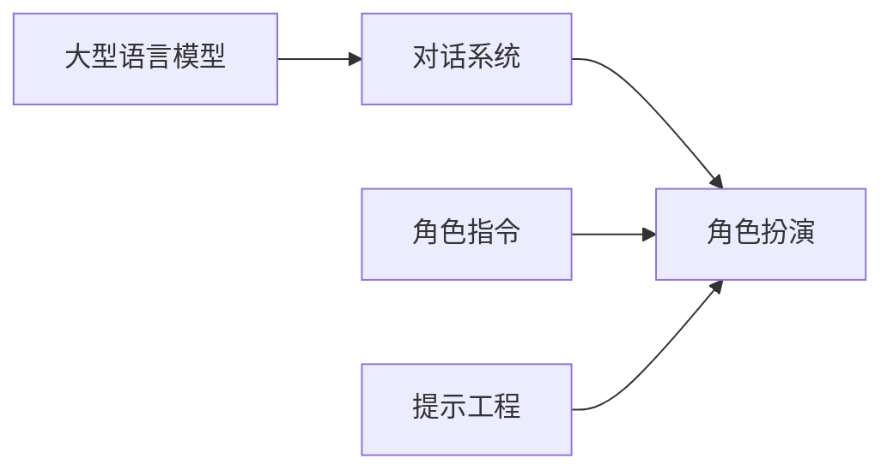

# AIGC从入门到实战：测试：ChatGPT 能扮演什么角色？

关键词：AIGC、ChatGPT、角色扮演、对话系统、自然语言处理、生成式AI

## 1. 背景介绍

### 1.1 问题的由来

人工智能生成内容(AIGC)技术的迅猛发展,尤其是以ChatGPT为代表的大型语言模型的出现,使得AI在内容生成领域展现出了前所未有的能力。ChatGPT作为一个基于海量语料训练的对话系统,不仅能够就各种话题进行流畅自然的对话,还能根据用户的指令扮演各种不同的角色。这引发了人们对ChatGPT角色扮演能力极限的好奇和探索。

### 1.2 研究现状

目前,业界和学界对ChatGPT的角色扮演能力已经开展了一些初步的研究和测试。一些研究者让ChatGPT扮演心理咨询师、面试官、程序员等不同角色,考察其对话的专业性和针对性。还有研究者让ChatGPT扮演虚拟人物,如名人、动漫角色等,考察其对人物性格特点的把握能力。总的来说,ChatGPT展现出了惊人的角色扮演能力,但其中也存在一些局限性有待进一步研究。

### 1.3 研究意义 

深入研究和测试ChatGPT的角色扮演能力,一方面有助于我们更全面地认识大型语言模型的能力边界,另一方面也为AIGC技术的实际应用提供了重要参考。通过考察ChatGPT在不同领域、不同场景下的角色扮演表现,我们可以更好地设计面向特定任务的对话系统,为智能客服、虚拟助手、智能教育等领域带来革命性变化。同时,ChatGPT角色扮演能力的局限性研究,也将推动对话系统技术的进一步发展。

### 1.4 本文结构

本文将从以下几个方面对ChatGPT的角色扮演能力进行系统探讨：第2部分介绍角色扮演相关的核心概念；第3部分分析ChatGPT角色扮演的实现原理；第4部分建立角色扮演能力评估的数学模型；第5部分通过代码实例展示如何实现角色扮演；第6部分讨论ChatGPT角色扮演的应用场景；第7部分推荐相关工具和资源；第8部分总结全文并展望未来。

## 2. 核心概念与联系

要理解ChatGPT的角色扮演能力,首先需要明确几个核心概念：

- 角色扮演(Role-playing):通过言语、动作等方式模仿特定人物的行为,体现其性格特点的一种表演形式。
- 对话系统(Dialogue System):能够与人进行自然语言交互的人工智能系统,通常由语言理解、对话管理、语言生成等模块构成。
- 大型语言模型(Large Language Model):基于海量文本语料训练的神经网络模型,能够生成连贯、通顺的自然语言文本。ChatGPT就是一种大型语言模型。
- 角色指令(Role Instruction):用户输入的指定ChatGPT扮演特定角色的指令,如"请你扮演一名心理医生"。
- 提示工程(Prompt Engineering):通过设计合适的提示(Prompt)引导语言模型生成期望的内容的技术。角色扮演可以看作一种提示工程应用。

下图展示了这些概念之间的关系:



可以看出,ChatGPT的角色扮演能力是以大型语言模型为基础,通过角色指令和提示工程技术实现的对话系统应用。

## 3. 核心算法原理 & 具体操作步骤

### 3.1 算法原理概述

ChatGPT的角色扮演能力主要基于其强大的语言生成能力。作为一个生成式的语言模型,ChatGPT通过预测下一个词的概率来生成连贯的文本。在角色扮演场景下,ChatGPT根据角色指令调整其语言生成策略,以符合特定角色的语言风格和行为模式。同时,ChatGPT还利用其海量知识,对不同角色的背景、性格特点等进行合理的把握和模拟。

### 3.2 算法步骤详解

ChatGPT角色扮演的主要步骤如下:

1. 接收用户的角色指令,理解要扮演的角色身份;
2. 在知识库中检索该角色的相关信息,如背景、性格、语言风格等;
3. 根据角色信息,调整语言生成策略,如使用特定词汇、语气、句式等;
4. 利用角色信息对用户输入进行理解和推理,以符合角色身份进行回复;
5. 生成符合角色身份的回复文本;
6. 根据用户反馈动态调整角色扮演策略。

可以看出,角色扮演是一个动态调整语言生成策略以适应角色身份的过程。

### 3.3 算法优缺点

ChatGPT角色扮演算法的主要优点包括:

- 语言生成能力强,能够生成流畅自然的对话;
- 知识库丰富,可以对各种角色进行合理模拟;
- 具有一定的推理和理解能力,能够根据角色身份对用户输入做出恰当反应。

但该算法也存在一些局限性:

- 很难对角色进行完全准确的模拟,有时会出现与角色身份不符的言行;
- 缺乏真正的情感和同理心,难以代入角色进行深度互动;
- 应对复杂场景和突发事件的能力有限。

### 3.4 算法应用领域

尽管有局限性,ChatGPT的角色扮演算法仍然在很多领域有重要应用价值,如:

- 智能客服:扮演客服人员,提供咨询服务;
- 虚拟助手:扮演私人助理,执行各种任务;  
- 教育培训:扮演教师、学生等角色,模拟教学场景;
- 娱乐游戏:扮演游戏角色,提供沉浸式体验;
- 心理咨询:扮演心理咨询师,提供心理疏导服务。

## 4. 数学模型和公式 & 详细讲解 & 举例说明

### 4.1 数学模型构建

为了定量评估ChatGPT的角色扮演能力,我们可以构建一个简单的数学模型。设ChatGPT在扮演角色r时的角色相似度为$S_r$,其计算公式为:

$$S_r=\alpha C_r + \beta L_r + \gamma B_r$$

其中,$C_r$表示ChatGPT对话内容与角色r的相似度,$L_r$表示ChatGPT语言风格与角色r的相似度,$B_r$表示ChatGPT行为模式与角色r的相似度。$\alpha$、$\beta$、$\gamma$为三个相似度的权重系数。

### 4.2 公式推导过程

为了计算$C_r$、$L_r$、$B_r$这三个相似度,我们可以分别构建角色r的内容、语言和行为特征向量$\vec{v}_c^r$、$\vec{v}_l^r$、$\vec{v}_b^r$,以及ChatGPT生成回复的特征向量$\vec{v}_c$、$\vec{v}_l$、$\vec{v}_b$。然后利用余弦相似度计算两个向量之间的相似度:

$$C_r=\cos(\vec{v}_c,\vec{v}_c^r)=\frac{\vec{v}_c \cdot \vec{v}_c^r}{||\vec{v}_c|| \times ||\vec{v}_c^r||}$$

$$L_r=\cos(\vec{v}_l,\vec{v}_l^r)=\frac{\vec{v}_l \cdot \vec{v}_l^r}{||\vec{v}_l|| \times ||\vec{v}_l^r||}$$

$$B_r=\cos(\vec{v}_b,\vec{v}_b^r)=\frac{\vec{v}_b \cdot \vec{v}_b^r}{||\vec{v}_b|| \times ||\vec{v}_b^r||}$$

权重系数$\alpha$、$\beta$、$\gamma$可以根据具体应用场景进行调整,以反映不同相似度的重要程度。

### 4.3 案例分析与讲解

下面我们以ChatGPT扮演心理咨询师为例,来说明如何使用上述模型评估其角色扮演能力。

首先,我们根据心理咨询师的特点,构建其内容、语言和行为特征向量:

- 内容特征词:倾听、共情、引导、中立、保密……
- 语言特征词:温和、耐心、疑问句、开放式问题……  
- 行为特征词:分析、总结、反馈、鼓励……

然后,我们对ChatGPT生成的咨询回复提取相应的特征向量,计算它们与心理咨询师特征向量的余弦相似度,再加权得到综合的角色相似度。

假设计算得到的内容、语言、行为相似度分别为0.8、0.7、0.9,权重系数都设为1/3,则ChatGPT扮演心理咨询师的角色相似度为:

$$S_r=\frac{1}{3} \times 0.8 + \frac{1}{3} \times 0.7 + \frac{1}{3} \times 0.9 = 0.8$$

这说明ChatGPT在扮演心理咨询师时,有较高的角色相似度,能够较好地模拟心理咨询师的对话特点。

### 4.4 常见问题解答

- 问:如何选择合适的特征词构建角色特征向量?
- 答:可以参考该角色的岗位描述、培训教材等材料,提取其中的关键词作为特征词。也可以咨询领域专家,了解该角色的特点。

- 问:权重系数如何设置?
- 答:可以根据具体应用场景,考虑不同相似度的重要性进行设置。一般来说,内容相似度的权重最高,其次是语言相似度,最后是行为相似度。

- 问:如何评估该模型的有效性?  
- 答:可以邀请领域专家对ChatGPT的角色扮演表现进行主观评分,然后计算主观评分与模型预测值的相关性。相关性越高,说明模型越有效。

## 5. 项目实践：代码实例和详细解释说明

### 5.1 开发环境搭建

要实现ChatGPT的角色扮演功能,首先需要搭建必要的开发环境。我们可以使用Python语言,调用OpenAI提供的API接口与ChatGPT进行交互。主要步骤如下:

1. 安装Python 3.x版本；
2. 安装openai库:pip install openai；
3. 注册OpenAI账号,获取API密钥。

### 5.2 源代码详细实现

下面是一个简单的ChatGPT角色扮演的Python代码示例:

```python
import openai

# 设置OpenAI API密钥
openai.api_key = "your_api_key"

# 设置角色指令
role_prompt = "你现在是一名心理咨询师,请用专业、温和的语气与来访者交流,分析他们的心理问题,并给出建议。"

# 定义对话函数
def chat_with_role(prompt):
    response = openai.Completion.create(
        engine="text-davinci-002",
        prompt=f"{role_prompt}\n\n{prompt}",
        max_tokens=1024,
        n=1,
        stop=None,
        temperature=0.5,
    )
    message = response.choices[0].text.strip()
    return message

# 测试角色扮演
while True:
    user_input = input("User: ")
    if user_input.lower() in ["bye", "quit"]:
        print("ChatGPT: 再见,欢迎下次来访!")
        break
    else:
        response = chat_with_role(user_input)
        print(f"ChatGPT: {response}")
```

### 5.3 代码解读与分析

- 第1行:导入openai库,用于调用OpenAI API。
- 第4行:设置OpenAI API密钥,用于验证API调用权限。
- 第7行:设置角色指令,指定ChatGPT扮演心理咨询师的角色。
- 第10-20行:定义对话函数chat_with_role,用于将用户输入和角色指令拼接成prompt,发送给ChatGPT生成回复。
- 第23-30行:循环接收用户输入,调用chat_with_role