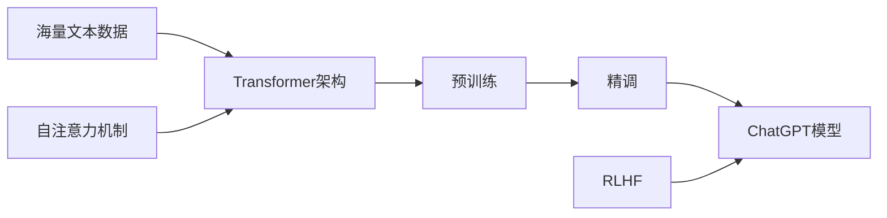

# AIGC从入门到实战：白也诗无敌，飘然思不群：ChatGPT，博学、"聪明"的好助手

关键词：AIGC、ChatGPT、自然语言处理、深度学习、Transformer、RLHF、人工智能

## 1. 背景介绍

### 1.1 问题的由来

人工智能生成内容（AIGC）技术的快速发展，尤其是自然语言处理领域的突破，催生了一系列智能对话助手的诞生。其中，由OpenAI开发的ChatGPT以其卓越的对话和内容生成能力脱颖而出，受到广泛关注。

### 1.2 研究现状

目前，AIGC技术已经在多个领域取得了显著进展，如文本生成、图像生成、音频合成等。ChatGPT作为其中的佼佼者，展现了惊人的自然语言理解和生成能力，引发了学术界和产业界的高度兴趣。

### 1.3 研究意义

深入研究ChatGPT的技术原理和应用前景，对于推动AIGC技术的发展、拓展人工智能的应用边界具有重要意义。同时，也为探索人机协作、认知智能等前沿课题提供了新的视角。

### 1.4 本文结构

本文将从ChatGPT的核心概念出发，深入剖析其背后的算法原理和数学模型，并通过代码实例和应用场景分析，全面展示ChatGPT的技术特点和实践价值。最后，本文将展望AIGC技术的未来发展趋势和挑战。

## 2. 核心概念与联系

ChatGPT是一种基于Transformer架构的大型语言模型，通过海量文本数据的预训练和精调，掌握了出色的自然语言理解和生成能力。其核心概念包括：

- Transformer：一种基于自注意力机制的神经网络架构，能够高效处理序列数据。
- 预训练：在大规模无标签文本数据上进行自监督学习，掌握语言的基本特征和规律。
- 精调：在特定任务数据上微调模型参数，使其适应具体的应用场景。
- 自注意力：一种捕捉序列内部依赖关系的机制，使模型能够更好地理解上下文信息。
- RLHF（Reinforcement Learning from Human Feedback）：通过人类反馈指导模型优化，提高生成内容的质量和合理性。

下图展示了ChatGPT的核心概念与技术架构之间的关系：



## 3. 核心算法原理 & 具体操作步骤

### 3.1 算法原理概述

ChatGPT的核心算法基于Transformer架构和自注意力机制。Transformer通过自注意力层和前馈神经网络层的堆叠，实现了对序列数据的高效建模。自注意力机制则通过计算序列中各个位置之间的相关性，捕捉上下文信息。

### 3.2 算法步骤详解

ChatGPT的训练过程可以分为以下几个步骤：

1. 数据准备：收集和清洗大量高质量的文本数据，作为模型的训练语料。
2. 预训练：在无标签文本数据上进行自监督学习，通过掩码语言建模等任务，让模型学习语言的基本特征和规律。
3. 精调：在特定任务数据上微调模型参数，使其适应具体的应用场景，如对话生成、问答等。
4. RLHF优化：通过人类反馈指导模型生成更高质量、更合理的内容。
5. 推理应用：使用训练好的ChatGPT模型进行推理，生成符合要求的文本内容。

### 3.3 算法优缺点

ChatGPT算法的优点包括：

- 强大的语言理解和生成能力，能够处理复杂的自然语言任务。
- 通过预训练和精调，可以快速适应不同的应用场景。
- 引入人类反馈优化，生成内容更加合理、符合伦理道德。

但ChatGPT算法也存在一些局限性，如：

- 对训练数据的质量和规模要求较高，需要大量的计算资源。
- 生成内容可能存在事实错误、逻辑漏洞等问题，需要进一步改进。
- 对于某些特定领域的知识掌握不足，生成内容的专业性有待提高。

### 3.4 算法应用领域

ChatGPT算法可以应用于多个领域，包括但不限于：

- 智能客服：提供24小时全天候的客户服务，解答常见问题。
- 内容创作：辅助生成文章、脚本、广告文案等各类内容。
- 教育助手：为学生提供学习辅导、问题解答等服务。
- 医疗咨询：提供初步的医疗建议和指导，辅助医生诊断。
- 金融分析：协助进行市场趋势分析、投资决策等。

## 4. 数学模型和公式 & 详细讲解 & 举例说明

### 4.1 数学模型构建

ChatGPT的数学模型建立在Transformer架构之上。Transformer的核心是自注意力机制，通过计算序列中各个位置之间的相关性，捕捉上下文信息。

给定一个输入序列 $X=(x_1,x_2,...,x_n)$，自注意力机制首先计算查询向量 $Q$、键向量 $K$ 和值向量 $V$：

$$
Q=XW^Q, K=XW^K, V=XW^V
$$

其中，$W^Q, W^K, W^V$ 是可学习的参数矩阵。

然后，通过查询向量和键向量的点积计算相关性得分：

$$
\text{score}(x_i,x_j)=\frac{QK^T}{\sqrt{d_k}}
$$

其中，$d_k$ 是键向量的维度，用于缩放点积结果。

接着，对相关性得分进行 softmax 归一化，得到注意力权重：

$$
\alpha_{ij}=\frac{\exp(\text{score}(x_i,x_j))}{\sum_{k=1}^n \exp(\text{score}(x_i,x_k))}
$$

最后，利用注意力权重对值向量进行加权求和，得到自注意力输出：

$$
\text{Attention}(Q,K,V)=\sum_{j=1}^n \alpha_{ij}v_j
$$

通过堆叠多个自注意力层和前馈神经网络层，Transformer 能够高效地建模序列数据。

### 4.2 公式推导过程

以上公式的推导过程如下：

1. 计算查询向量、键向量和值向量：
   - 查询向量 $Q=XW^Q$，其中 $X$ 是输入序列，$W^Q$ 是可学习的参数矩阵。
   - 键向量 $K=XW^K$，其中 $W^K$ 是可学习的参数矩阵。
   - 值向量 $V=XW^V$，其中 $W^V$ 是可学习的参数矩阵。

2. 计算相关性得分：
   - 将查询向量 $Q$ 与键向量 $K$ 的转置进行点积运算，得到相关性得分矩阵。
   - 为了缩放点积结果，将得分矩阵除以 $\sqrt{d_k}$，其中 $d_k$ 是键向量的维度。

3. 计算注意力权重：
   - 对相关性得分矩阵应用 softmax 函数，对每一行进行归一化，得到注意力权重矩阵。
   - softmax 函数将得分转化为概率分布，使得每一行的权重和为1。

4. 计算自注意力输出：
   - 将注意力权重矩阵与值向量 $V$ 相乘，得到加权求和结果。
   - 每个位置的输出是值向量的加权组合，权重由注意力权重矩阵决定。

通过以上步骤，自注意力机制能够动态地计算序列中各个位置之间的依赖关系，捕捉上下文信息。

### 4.3 案例分析与讲解

下面以一个简单的例子来说明自注意力机制的计算过程。

假设有一个输入序列 $X=\begin{bmatrix} 1 & 2 & 3 \\ 4 & 5 & 6 \end{bmatrix}$，维度为 $2\times3$。

1. 计算查询向量、键向量和值向量：
   - 假设 $W^Q=W^K=W^V=I$（单位矩阵），则 $Q=K=V=X$。

2. 计算相关性得分：
   - 计算 $QK^T$，得到相关性得分矩阵 $\begin{bmatrix} 14 & 32 \\ 32 & 77 \end{bmatrix}$。
   - 假设 $d_k=3$，则缩放后的得分矩阵为 $\begin{bmatrix} 8.08 & 18.48 \\ 18.48 & 44.44 \end{bmatrix}$。

3. 计算注意力权重：
   - 对缩放后的得分矩阵应用 softmax 函数，得到注意力权重矩阵 $\begin{bmatrix} 0.27 & 0.73 \\ 0.12 & 0.88 \end{bmatrix}$。

4. 计算自注意力输出：
   - 将注意力权重矩阵与值向量 $V$ 相乘，得到输出 $\begin{bmatrix} 2.19 & 3.46 & 4.73 \\ 4.76 & 5.64 & 6.52 \end{bmatrix}$。

通过这个简单的例子，我们可以看到自注意力机制如何根据序列中的相关性计算注意力权重，并生成上下文感知的输出。

### 4.4 常见问题解答

1. 问：自注意力机制与传统的循环神经网络（如RNN、LSTM）相比有什么优势？
   答：自注意力机制能够并行计算序列中各个位置之间的依赖关系，而不像循环神经网络那样需要按顺序处理。这使得自注意力机制能够更高效地处理长序列数据，并且更容易捕捉长距离依赖关系。

2. 问：Transformer 中使用了多头自注意力机制，这有什么好处？
   答：多头自注意力机制允许模型在不同的子空间中计算注意力权重，捕捉不同方面的上下文信息。这种机制增强了模型的表达能力，使其能够更好地理解和生成复杂的自然语言。

3. 问：自注意力机制是否存在一些局限性？
   答：尽管自注意力机制在处理序列数据方面表现出色，但它也存在一些局限性。例如，计算自注意力权重的时间和空间复杂度与序列长度的平方成正比，这在处理极长序列时可能会带来挑战。此外，自注意力机制对位置信息的建模能力相对较弱，需要引入位置编码等技术来补充。

## 5. 项目实践：代码实例和详细解释说明

### 5.1 开发环境搭建

要实现一个基于 Transformer 的 ChatGPT 模型，首先需要搭建适当的开发环境。以下是一些常用的工具和库：

- Python 3.x：ChatGPT 的开发通常使用 Python 编程语言。
- PyTorch 或 TensorFlow：这些深度学习框架提供了强大的工具和库，用于构建和训练神经网络模型。
- Hugging Face Transformers：这是一个流行的自然语言处理库，提供了多种预训练的 Transformer 模型和实用工具。
- NLTK 或 spaCy：这些自然语言处理库提供了各种文本预处理和分析工具。

### 5.2 源代码详细实现

下面是一个简化版的 ChatGPT 模型的 PyTorch 实现示例：

```python
import torch
import torch.nn as nn
from transformers import GPT2Tokenizer, GPT2LMHeadModel

class ChatGPT(nn.Module):
    def __init__(self):
        super(ChatGPT, self).__init__()
        self.tokenizer = GPT2Tokenizer.from_pretrained('gpt2')
        self.model = GPT2LMHeadModel.from_pretrained('gpt2')
    
    def forward(self, input_ids, attention_mask=None):
        outputs = self.model(input_ids, attention_mask=attention_mask)
        return outputs.logits
    
    def generate(self, prompt, max_length=