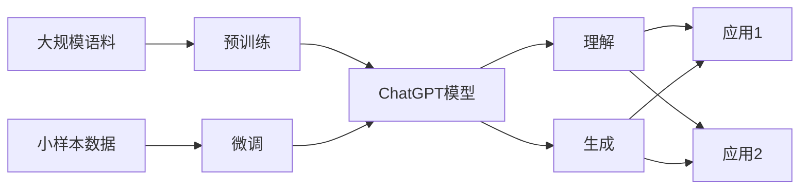

# AIGC从入门到实战：简单的 ChatGPT 应用范例

## 1. 背景介绍
### 1.1 问题的由来
人工智能生成内容(AIGC)技术的快速发展,尤其是以 ChatGPT 为代表的大语言模型(LLM)的出现,正在深刻改变着人们获取信息、知识和服务的方式。ChatGPT 强大的自然语言理解和生成能力,使其在问答、对话、写作等领域展现出广阔的应用前景。然而,对于许多初学者和开发者而言,如何快速上手并利用 ChatGPT 实现有趣、实用的应用,仍然存在一定门槛。

### 1.2 研究现状
目前,围绕 ChatGPT 的研究和应用正方兴未艾。学术界重点关注 ChatGPT 的内在机理、性能优化、伦理安全等基础问题;工业界则积极探索其在智能客服、内容创作、教育培训等领域的落地应用。不过,现有研究多聚焦于算法模型本身,对于如何利用 ChatGPT 快速构建应用的指导性文章还相对较少。初学者在学习过程中,往往需要阅读大量文档、调试诸多代码,难以快速上手并开发出有价值的应用。

### 1.3 研究意义
本文旨在帮助 ChatGPT 初学者和开发者快速入门,通过几个简单、典型的应用范例,讲解如何利用 ChatGPT 的 API 接口,结合 Python 等编程语言,开发一些实用、有趣的应用。这不仅能加深读者对 ChatGPT 工作原理的理解,更能启发大家进一步探索其在不同场景下的应用可能,激发创新的灵感。同时,这些应用范例也可作为项目原型,供进阶学习者继续优化完善。

### 1.4 本文结构
本文将首先介绍 ChatGPT 的核心概念和工作原理,然后通过 3 个具体的应用范例:聊天机器人、智能写作助手、知识问答系统,讲解如何利用 ChatGPT API 和 Python 实现这些应用的核心功能。每个范例都包含详细的需求分析、系统设计、关键代码、运行结果等内容。最后,本文还将分享一些相关的学习资源、开发工具,供读者进一步研究探索。

## 2. 核心概念与联系
ChatGPT 是一种基于 Transformer 架构的大型语言模型,通过海量文本数据的预训练,掌握了强大的自然语言理解和生成能力。其核心概念包括:

- Transformer:一种注意力机制为主的神经网络结构,善于处理序列数据。
- 预训练:在大规模无标注语料上进行自监督学习,掌握语言的通用特征和知识。  
- 微调:在特定任务的小样本标注数据上进行监督学习,使模型适应具体应用。
- Token:将文本切分为离散可处理的单元,如单词、字符、子词等。
- Embedding:将 token 映射为连续的低维向量表示,蕴含语义信息。
- Attention:一种权重机制,使模型能关注输入序列中的重要片段。
- Prompt:输入给模型的上下文信息,引导其生成目标内容。

这些概念环环相扣,共同构成了 ChatGPT 的技术核心。掌握这些概念,对理解 ChatGPT 的工作原理和开发应用都至关重要。

## 3. 核心算法原理 & 具体操作步骤 
### 3.1 算法原理概述
ChatGPT 的核心算法是基于 Transformer 的自注意力机制。与传统的 RNN、CNN 等结构不同,Transformer 抛弃了递归和卷积操作,完全依赖于注意力机制来捕捉序列间的依赖关系。具体来说,Transformer 包含编码器和解码器两个部分:

- 编码器将输入序列 $X=(x_1,\ldots,x_n)$ 映射为隐表示 $Z=(z_1,\ldots,z_n)$
- 解码器根据 $Z$ 和之前的输出 $y_{<t}$ 预测下一个输出 $y_t$

编码器和解码器内部都是由多个相同的层堆叠而成,每一层包含两个子层:自注意力层和前馈神经网络层。其中最关键的就是自注意力机制。

### 3.2 算法步骤详解
以编码器的自注意力层为例,详细步骤如下:

1. 将输入 $X$ 通过三个线性变换,分别得到 Query 矩阵 $Q$、Key 矩阵 $K$、Value 矩阵 $V$

$$
\begin{aligned}
Q &= XW^Q \\
K &= XW^K \\
V &= XW^V
\end{aligned}
$$

2. 计算 $Q$ 和 $K$ 的点积注意力分数,再除以 $\sqrt{d_k}$ 缩放,并用 softmax 归一化得到注意力权重 $A$

$$
A = \text{softmax}(\frac{QK^T}{\sqrt{d_k}})
$$

3. 用注意力权重 $A$ 对 $V$ 加权求和,得到输出表示 $Z$

$$
Z = AV
$$

解码器的自注意力层与此类似,只是在计算注意力分数时引入了 mask 机制,避免看到未来的信息。多头注意力机制则是将 $Q,K,V$ 线性变换为多个子空间,分别计算注意力,再拼接起来。

前馈神经网络层就是两个简单的全连接层,对自注意力层的输出做非线性变换:

$$
\text{FFN}(Z) = \text{ReLU}(ZW_1 + b_1)W_2 + b_2
$$

最后,这些层的输出会通过残差连接、Layer Normalization 等操作进行融合。

### 3.3 算法优缺点
Transformer 相比 RNN、CNN 的优点在于:

- 并行计算能力强,训练速度快
- 捕捉长距离依赖关系的能力强
- 可以更灵活地建模不同位置的上下文信息

但其缺点是:

- 计算和内存消耗大,难以处理很长的序列
- 缺乏位置信息,需要引入位置编码
- 解释性和可控性较差,容易产生幻觉

### 3.4 算法应用领域
得益于其强大的语义理解和生成能力,ChatGPT 在诸多领域得到广泛应用,如:

- 智能对话:客服聊天、陪伴聊天、任务型对话等
- 内容创作:文案写作、文本摘要、知识问答等
- 代码开发:代码补全、代码解释、代码审查等
- 语言翻译:机器翻译、同传、本地化等
- 数据处理:文本分类、情感分析、实体识别等

随着研究的不断深入和算力的持续提升,ChatGPT 的应用领域还将不断扩展。

## 4. 数学模型和公式 & 详细讲解 & 举例说明
### 4.1 数学模型构建
ChatGPT 的数学模型可以用概率图模型来描述。设输入序列为 $X=(x_1,\ldots,x_n)$,输出序列为 $Y=(y_1,\ldots,y_m)$,ChatGPT 的目标就是学习条件概率分布:

$$
P(Y|X) = \prod_{t=1}^m P(y_t|y_{<t},X)
$$

其中 $y_{<t}$ 表示 $y_t$ 之前的所有输出。为了建模 $P(y_t|y_{<t},X)$,ChatGPT 引入了隐变量 $Z=(z_1,\ldots,z_n)$ 来表示输入 $X$ 的隐表示。于是有:

$$
\begin{aligned}
P(y_t|y_{<t},X) &= \int P(y_t|y_{<t},Z)P(Z|X)dZ \\
&\approx P(y_t|y_{<t},\hat{Z}) \\
\hat{Z} &= \text{Encoder}(X)
\end{aligned}
$$

这里 $\text{Encoder}$ 就是 Transformer 的编码器,$\hat{Z}$ 是 $Z$ 的一个确定性估计。而 $P(y_t|y_{<t},\hat{Z})$ 则可以通过 Transformer 的解码器来建模:

$$
P(y_t|y_{<t},\hat{Z}) = \text{softmax}(\text{Decoder}(y_{<t},\hat{Z}))
$$

### 4.2 公式推导过程
以编码器的自注意力层为例,详细推导如下:

1. 计算 Query、Key、Value 矩阵:

$$
\begin{aligned}
Q &= XW^Q \\
K &= XW^K \\
V &= XW^V
\end{aligned}
$$

其中 $W^Q,W^K,W^V \in \mathbb{R}^{d \times d_k}$ 是可学习的参数矩阵。

2. 计算点积注意力分数:

$$
\text{score}(q_i,k_j) = \frac{q_i k_j^T}{\sqrt{d_k}}
$$

其中 $q_i$ 是 $Q$ 的第 $i$ 行,$k_j$ 是 $K$ 的第 $j$ 行。除以 $\sqrt{d_k}$ 是为了缓解点积结果的量级。

3. 对注意力分数应用 softmax 归一化:

$$
a_{ij} = \frac{\exp(\text{score}(q_i,k_j))}{\sum_{l=1}^n \exp(\text{score}(q_i,k_l))}
$$

得到注意力权重矩阵 $A=(a_{ij})_{n \times n}$。

4. 用注意力权重对 Value 矩阵加权求和:

$$
z_i = \sum_{j=1}^n a_{ij}v_j
$$

其中 $v_j$ 是 $V$ 的第 $j$ 列。最终得到输出表示矩阵 $Z=(z_1,\ldots,z_n)^T$。

### 4.3 案例分析与讲解
下面以一个简单的句子对为例,演示 ChatGPT 的编码器如何提取语义表示。

输入:"我爱自然语言处理" $\Rightarrow$ $X=(\text{我},\text{爱},\text{自然},\text{语言},\text{处理})$

假设词嵌入维度 $d=4$,隐表示维度 $d_k=2$,词嵌入矩阵为:

$$
W^{(e)} = 
\begin{bmatrix}
1 & 2 & 3 & 4 \\
2 & 4 & 1 & 3 \\
3 & 1 & 4 & 2 \\
4 & 3 & 2 & 1 \\
1 & 3 & 2 & 4
\end{bmatrix}
$$

参数矩阵为:

$$
W^Q = W^K = 
\begin{bmatrix}
1 & 2 \\
2 & 1 \\
1 & 1 \\
2 & 2
\end{bmatrix},
W^V = 
\begin{bmatrix}
2 & 1 \\
1 & 2 \\
2 & 2 \\
1 & 1
\end{bmatrix}
$$

首先将输入 $X$ 通过词嵌入矩阵映射为:

$$
X = 
\begin{bmatrix}
1 & 2 & 3 & 4 \\
2 & 4 & 1 & 3 \\
3 & 1 & 4 & 2 \\
4 & 3 & 2 & 1 \\
1 & 3 & 2 & 4
\end{bmatrix}
$$

然后分别计算 Query、Key、Value 矩阵:

$$
\begin{aligned}
Q &= XW^Q = 
\begin{bmatrix}
20 & 13 \\
18 & 17 \\
15 & 16 \\
16 & 15 \\
19 & 14
\end{bmatrix}
\\
K &= XW^K =
\begin{bmatrix}
20 & 13 \\
18 & 17 \\
15 & 16 \\
16 & 15 \\
19 & 14
\end{bmatrix}
\\  
V &= XW^V =
\begin{bmatrix}
23 & 20 \\
25 & 22 \\
24 & 23 