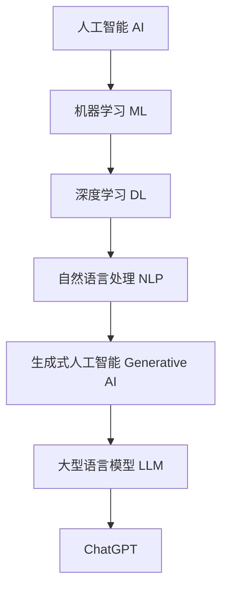
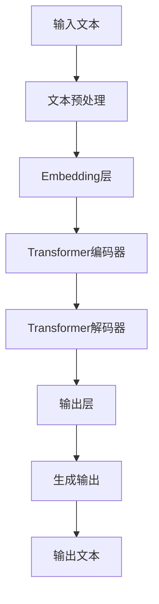

# AIGC从入门到实战：简单的 ChatGPT 应用范例

## 1. 背景介绍

### 1.1 问题的由来

在过去的几年里，人工智能(AI)和生成式人工智能(Generative AI)技术取得了长足的进步,尤其是自然语言处理(NLP)和机器学习(ML)领域的突破性发展。其中,ChatGPT的出现引起了全球关注,它展示了大型语言模型在自然语言理解和生成方面的卓越能力。

作为一种新兴技术,ChatGPT不仅在学术界和科技界引起热议,也吸引了普通用户的浓厚兴趣。人们开始探索ChatGPT在各个领域的应用前景,期望它能够助力工作、学习和生活。然而,由于ChatGPT技术的复杂性,普通用户难以快速上手,缺乏实践经验和指导,这成为了ChatGPT普及和应用的一大障碍。

### 1.2 研究现状

目前,ChatGPT的研究主要集中在以下几个方面:

1. **模型优化**:研究人员致力于提高ChatGPT的性能、准确性和鲁棒性,通过改进模型架构、训练策略和数据预处理等方式来优化模型。

2. **应用探索**:许多学者和开发者正在探索ChatGPT在不同领域的应用,如自然语言处理、内容生成、问答系统、智能助手等。

3. **安全和伦理**:随着ChatGPT的不断发展,确保其安全性和符合伦理准则也成为研究的重点,包括防止模型输出有害内容、保护隐私和知识产权等。

4. **人机交互**:改善人机交互体验是ChatGPT研究的另一个重点方向,旨在使ChatGPT更加自然、友好和个性化。

5. **开源和共享**:一些研究团队和公司正在开源ChatGPT模型和相关资源,促进技术的共享和发展。

然而,现有研究大多聚焦于理论层面,缺乏面向普通用户的实践指导,这给ChatGPT的普及和应用带来了一定阻碍。

### 1.3 研究意义

本文旨在为普通用户提供一个全面而实用的ChatGPT入门指南,帮助读者快速上手并掌握ChatGPT的基本应用。通过实际案例和代码示例,读者可以深入了解ChatGPT的工作原理、使用方法和实战技巧,从而更好地将ChatGPT应用于工作、学习和生活中。

具体来说,本文的研究意义包括:

1. **普及ChatGPT技术**:通过浅显易懂的讲解,降低ChatGPT的入门门槛,让更多普通用户了解和使用这项前沿技术。

2. **提供实践指导**:结合丰富的实例和代码示例,为读者提供实践操作指导,帮助他们快速掌握ChatGPT的使用技巧。

3. **探索应用场景**:介绍ChatGPT在不同领域的应用案例,激发读者对ChatGPT应用潜力的思考和探索。

4. **促进技术发展**:通过普及ChatGPT技术,吸引更多人才投身于该领域的研究和开发,推动相关技术的进一步发展。

### 1.4 本文结构

本文共分为9个部分,内容安排如下:

1. **背景介绍**:阐述研究背景、现状和意义,为读者建立基本认知。

2. **核心概念与联系**:介绍ChatGPT的核心概念,并与相关技术进行对比和联系。

3. **核心算法原理与具体操作步骤**:深入解释ChatGPT的核心算法原理,并详细讲解具体的操作步骤。

4. **数学模型和公式详细讲解与举例说明**:阐述ChatGPT所涉及的数学模型和公式,通过案例分析加深理解。

5. **项目实践:代码实例和详细解释说明**:提供完整的代码实例,并对关键部分进行详细解释和分析。

6. **实际应用场景**:介绍ChatGPT在不同领域的实际应用案例,并展望未来应用前景。

7. **工具和资源推荐**:推荐ChatGPT相关的学习资源、开发工具、论文等,方便读者进一步学习和研究。

8. **总结:未来发展趋势与挑战**:总结研究成果,并对ChatGPT的未来发展趋势和面临的挑战进行展望。

9. **附录:常见问题与解答**:列出一些常见问题并给出解答,帮助读者解决实践中可能遇到的困惑。

## 2. 核心概念与联系

在深入探讨ChatGPT的核心算法原理之前,我们需要先了解一些与之密切相关的核心概念,这有助于加深对ChatGPT的理解。

### 2.1 人工智能(AI)

人工智能(Artificial Intelligence,AI)是一门研究如何使机器具有智能行为的学科,旨在开发能够模仿人类智能的系统和算法。AI技术广泛应用于各个领域,如计算机视觉、自然语言处理、机器学习等。

### 2.2 机器学习(ML)

机器学习(Machine Learning,ML)是人工智能的一个重要分支,它赋予计算机从数据中自动学习和构建模型的能力,而无需显式编程。常见的机器学习算法包括监督学习、非监督学习和强化学习等。

### 2.3 深度学习(DL)

深度学习(Deep Learning,DL)是机器学习的一种特殊形式,它基于人工神经网络,通过构建深层次的神经网络模型来模拟人脑的工作机制。深度学习在计算机视觉、自然语言处理等领域表现出色,是推动人工智能发展的核心技术之一。

### 2.4 自然语言处理(NLP)

自然语言处理(Natural Language Processing,NLP)是人工智能的一个重要分支,旨在使计算机能够理解和生成人类语言。NLP技术广泛应用于机器翻译、问答系统、文本分类等领域。

### 2.5 生成式人工智能(Generative AI)

生成式人工智能(Generative AI)是一种新兴的人工智能技术,它能够基于输入数据生成新的、原创性的内容,如文本、图像、音频等。ChatGPT就是一种典型的生成式人工智能应用。

### 2.6 大型语言模型(LLM)

大型语言模型(Large Language Model,LLM)是一种基于深度学习的自然语言处理模型,通过在海量文本数据上进行预训练,获得对自然语言的深刻理解和生成能力。ChatGPT就是一种基于大型语言模型的应用。

### 2.7 ChatGPT

ChatGPT是一种基于大型语言模型的对话式人工智能系统,由OpenAI开发。它能够进行自然语言对话、回答问题、生成文本等,展现出了令人惊叹的语言理解和生成能力。

上述概念相互关联,共同构成了ChatGPT的理论基础和技术支撑。人工智能、机器学习和深度学习为ChatGPT提供了算法和模型支持;自然语言处理技术赋予了ChatGPT理解和生成自然语言的能力;生成式人工智能和大型语言模型则是ChatGPT的核心技术。

## 3. 核心算法原理与具体操作步骤

### 3.1 算法原理概述

ChatGPT的核心算法基于大型语言模型(LLM),具体来说是一种基于Transformer架构的自回归(Autoregressive)语言模型。该模型通过在海量文本数据上进行无监督预训练,学习到了自然语言的深层次表示,从而获得了强大的语言理解和生成能力。

在预训练过程中,模型会根据给定的文本序列,预测下一个单词(Token)的概率分布。通过最大化预测的对数似然,模型可以逐步调整参数,从而更好地捕捉语言的结构和语义信息。

预训练完成后,模型可以在特定任务上进行微调(Fine-tuning),以适应不同的应用场景,如对话系统、问答系统、文本生成等。在微调过程中,模型会在特定任务的数据集上进行有监督训练,进一步优化模型参数。

在实际应用中,ChatGPT会根据用户的输入,生成相应的自然语言回复。具体来说,模型会将用户输入编码为Token序列,然后基于预训练得到的语言模型,预测下一个Token的概率分布。通过采样或贪婪搜索等策略,模型可以逐步生成回复的Token序列,最终解码为自然语言文本。

### 3.2 算法步骤详解

ChatGPT的核心算法可以概括为以下几个主要步骤:

1. **文本预处理**:将输入的自然语言文本进行标记化(Tokenization)、填充(Padding)和编码(Encoding),转换为模型可以处理的Token序列。

2. **embedding层**:将Token序列输入到Embedding层,将每个Token映射为对应的向量表示,作为模型的输入。

3. **Transformer编码器**:输入序列经过多层Transformer编码器,捕捉序列中Token之间的依赖关系,生成上下文表示。

4. **Transformer解码器**:上下文表示作为解码器的输入,解码器通过自回归机制,预测下一个Token的概率分布。

5. **输出层**:根据解码器的输出,通过一个线性层和Softmax函数,计算每个Token的概率分布。

6. **生成输出**:基于输出的Token概率分布,通过贪婪搜索或采样等策略,逐步生成输出序列。

7. **解码输出**:将生成的Token序列解码为自然语言文本,作为模型的最终输出。

上述步骤在训练和推理阶段会有一些差异,但总体流程是相似的。在训练阶段,模型会根据目标输出调整参数,最小化损失函数;而在推理阶段,模型则根据输入生成相应的输出序列。

### 3.3 算法优缺点

ChatGPT算法具有以下优点:

1. **语言理解能力强**:通过在大规模语料库上预训练,ChatGPT能够捕捉自然语言的深层次语义和结构信息,展现出了强大的语言理解能力。

2. **生成质量高**:自回归语言模型可以生成流畅、连贯的自然语言文本,ChatGPT的输出质量优于传统的规则系统或模板系统。

3. **泛化能力好**:由于预训练过程中涉及大量不同领域的数据,ChatGPT具有很强的泛化能力,可以应用于多种不同的任务和场景。

4. **可解释性较好**:与一些黑盒模型相比,Transformer架构的可解释性较强,有助于分析和解释模型的行为。

5. **易于微调**:预训练的语言模型可以在特定任务上进行微调,快速适应新的场景,降低了开发成本。

但ChatGPT算法也存在一些缺点和局限性:

1. **缺乏常识推理能力**:尽管语言理解能力强,但ChatGPT缺乏真正的常识推理和因果推理能力,有时会产生不合理的输出。

2. **存在偏见和不确定性**:由于训练数据的局限性,ChatGPT可能会存在一些偏见和不确定性,输出结果可能不够公正或可靠。

3. **安全性和隐私问题**:生成式模型可能会产生有害或违法内容,同时也存在隐私泄露的风险。

4. **计算资源需求高**:训练和推理大型语言模型需要大量的计算资源,对硬件设备要求较高。

5. **解释性