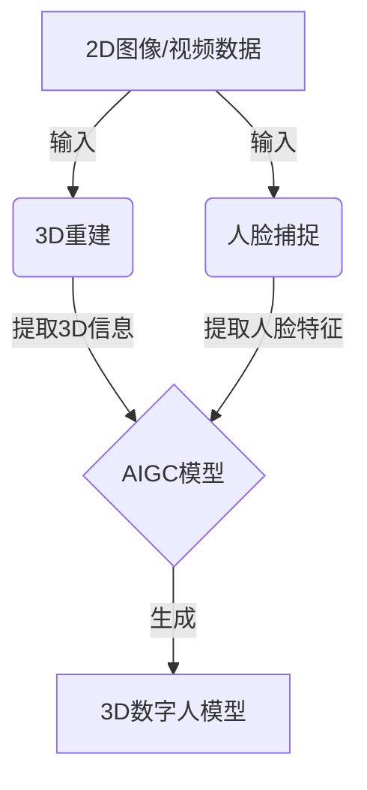

# AIGC从入门到实战：飞升：MetaHuman 三步构建数字人模型，带领我们走向元宇宙

## 1. 背景介绍

### 1.1 问题的由来

随着元宇宙概念的兴起，数字人模型的构建成为了一个备受关注的热门话题。元宇宙旨在打造一个沉浸式的虚拟世界,而高质量的数字人模型是其中不可或缺的重要组成部分。传统的3D建模方式存在着诸多挑战,例如制作周期长、成本高昂、细节处理困难等,因此亟需一种更加高效、便捷的数字人模型构建方法。

### 1.2 研究现状

近年来,人工智能生成内容(AIGC)技术的飞速发展为解决这一问题提供了新的思路。基于深度学习的AIGC模型能够从大量数据中学习,并生成逼真的图像、视频、3D模型等内容。在这一背景下,MetaHuman作为一种先进的AIGC技术应运而生,它利用深度学习算法从头像照片中捕捉人物特征,并生成高保真的3D数字人模型。

### 1.3 研究意义

MetaHuman技术的出现极大地提高了数字人模型的制作效率,降低了制作成本,并使得模型质量更加逼真。这为元宇宙的发展提供了有力支撑,同时也为游戏、影视、虚拟主播等领域带来了新的机遇。MetaHuman技术的研究和应用具有重要的理论价值和实际意义。

### 1.4 本文结构

本文将全面介绍MetaHuman技术的核心概念、算法原理、数学模型、实现细节以及实际应用场景。我们将从入门到实战,循序渐进地探索这一前沿技术,为读者提供一个全面、深入的理解。

## 2. 核心概念与联系

MetaHuman技术的核心概念包括:

1. **3D重建(3D Reconstruction)**:利用2D图像或视频数据重建3D模型的过程。
2. **人脸捕捉(Face Capture)**:从人脸图像或视频中提取人脸特征的技术。
3. **生成对抗网络(Generative Adversarial Networks, GANs)**:一种基于深度学习的生成模型,可以生成逼真的图像、视频等数据。
4. **人工智能生成内容(AIGC)**:利用人工智能技术自动生成文本、图像、音频、视频等内容。

这些概念之间存在着紧密的联系。MetaHuman技术利用3D重建和人脸捕捉技术从2D图像或视频中提取人物特征,然后使用基于GAN的AIGC模型生成高保真的3D数字人模型。

## 3. 核心算法原理 & 具体操作步骤

### 3.1 算法原理概述

MetaHuman技术的核心算法原理可以概括为三个主要步骤:

1. **3D重建**:利用多视图立体视觉(Multi-View Stereo, MVS)技术从2D图像或视频数据中重建出3D模型的初始形状。
2. **人脸捕捉**:使用基于深度学习的人脸捕捉算法从图像或视频中提取人脸特征,包括面部姿态、表情、纹理等信息。
3. **生成对抗网络(GAN)生成**:将重建的3D模型形状和捕捉的人脸特征作为输入,通过训练有素的GAN模型生成高保真的3D数字人模型。

### 3.2 算法步骤详解

1. **3D重建**
   - 步骤1:从不同视角拍摄目标人物的多张2D图像或视频。
   - 步骤2:使用结构光或激光扫描等技术获取目标人物的粗略3D模型。
   - 步骤3:利用MVS算法从多视图图像或视频中重建出高分辨率的3D模型初始形状。

2. **人脸捕捉**
   - 步骤1:使用人脸检测算法从图像或视频中定位人脸区域。
   - 步骤2:利用基于深度学习的人脸关键点检测算法提取面部特征点。
   - 步骤3:根据特征点信息估计人脸姿态、表情等参数。
   - 步骤4:使用3D面部重建算法生成高保真的3D面部模型及纹理信息。

3. **GAN生成**
   - 步骤1:将重建的3D模型形状和捕捉的人脸特征作为输入,送入经过预训练的GAN模型。
   - 步骤2:GAN模型的生成器网络尝试生成逼真的3D数字人模型。
   - 步骤3:GAN模型的判别器网络评估生成的模型质量,并将评估结果反馈给生成器网络。
   - 步骤4:生成器网络根据反馈不断优化,最终生成高保真的3D数字人模型。

### 3.3 算法优缺点

**优点**:

- 高效便捷,大幅缩短了数字人模型的制作周期。
- 生成的模型质量高,细节丰富,接近真人水准。
- 只需少量2D图像或视频数据即可生成3D模型,数据采集成本低。

**缺点**:

- 对输入数据质量要求较高,图像或视频需要清晰、完整。
- 算法复杂度较高,需要大量计算资源和训练数据。
- 生成的模型可能存在一定程度的失真或artifact。

### 3.4 算法应用领域

MetaHuman技术可以广泛应用于以下领域:

- **元宇宙**:为虚拟世界提供逼真的数字人模型。
- **游戏**:生成高质量的游戏角色模型。
- **影视特效**:制作电影、电视剧中的数字化角色。
- **虚拟主播**:创建逼真的虚拟主播形象。
- **虚拟试衣间**:为在线购物提供虚拟试衣体验。
- **虚拟助手**:开发具有人性化外观的虚拟助手。

## 4. 数学模型和公式 & 详细讲解 & 举例说明

### 4.1 数学模型构建

MetaHuman技术中涉及到多个数学模型,包括3D重建、人脸捕捉和生成对抗网络等。

1. **3D重建模型**

   3D重建模型的目标是从2D图像或视频数据中恢复出3D模型的形状和纹理信息。常用的数学模型包括:

   - **多视图几何模型**:利用多视角图像之间的对应关系估计3D点云。
   - **体素模型**:将3D空间划分为离散的体素,通过优化每个体素的颜色和占据概率来重建3D模型。

2. **人脸捕捉模型**

   人脸捕捉模型的目标是从图像或视频中提取人脸特征,包括面部姿态、表情等参数。常用的数学模型包括:

   - **3D形变模型**:将人脸表示为一个基准形状与一系列形变系数的组合。
   - **渲染模型**:根据估计的面部参数渲染出对应的2D图像,并与输入图像进行对比优化参数。

3. **生成对抗网络模型**

   生成对抗网络(GAN)是一种基于深度学习的生成模型,由生成器网络和判别器网络组成。生成器网络的目标是生成逼真的数据样本,而判别器网络的目标是区分真实数据与生成数据。两个网络通过对抗训练相互促进,最终达到生成高质量数据的目的。

   GAN模型的数学表示形式通常采用损失函数的形式,例如最小二乘损失、交叉熵损失等,用于衡量生成数据与真实数据之间的差异。

### 4.2 公式推导过程

1. **3D重建公式推导**

   假设我们有 $n$ 个相机视角,每个视角拍摄到的图像为 $I_i,i=1,2,...,n$,目标是重建出3D点云 $\mathbf{P}=\{p_j\}_{j=1}^m$,其中 $p_j$ 表示第 $j$ 个点的三维坐标。

   我们可以定义重建目标函数为:

   $$
   E(\mathbf{P}) = \sum_{i=1}^n \sum_{j=1}^m \rho\left(I_i(p_j) - \hat{I}_i(p_j)\right)
   $$

   其中 $I_i(p_j)$ 表示第 $i$ 个视角下点 $p_j$ 在图像上的观测值, $\hat{I}_i(p_j)$ 表示根据当前估计的3D点云渲染出的理论值, $\rho$ 是一个鲁棒的误差函数(如Huber函数)。

   通过优化目标函数 $E(\mathbf{P})$,我们可以得到最佳的3D点云估计 $\mathbf{P}^*$。

2. **人脸捕捉公式推导**

   假设我们有一个基准人脸模型 $\mathbf{M}_0$,以及一系列形变系数 $\boldsymbol{\alpha}=(\alpha_1,\alpha_2,...,\alpha_k)$,则当前人脸模型可以表示为:

   $$
   \mathbf{M}(\boldsymbol{\alpha}) = \mathbf{M}_0 + \sum_{i=1}^k \alpha_i \mathbf{B}_i
   $$

   其中 $\mathbf{B}_i$ 是第 $i$ 个形变基。

   我们可以定义一个渲染函数 $\mathcal{R}$,将3D人脸模型 $\mathbf{M}$ 投影到2D图像平面上,得到理论渲染图像 $\hat{I}$:

   $$
   \hat{I} = \mathcal{R}(\mathbf{M}(\boldsymbol{\alpha}), \boldsymbol{\theta})
   $$

   其中 $\boldsymbol{\theta}$ 表示渲染参数,如相机参数、光照参数等。

   通过优化目标函数:

   $$
   E(\boldsymbol{\alpha}, \boldsymbol{\theta}) = \rho\left(I - \mathcal{R}(\mathbf{M}(\boldsymbol{\alpha}), \boldsymbol{\theta})\right)
   $$

   我们可以得到最佳的形变系数 $\boldsymbol{\alpha}^*$ 和渲染参数 $\boldsymbol{\theta}^*$,从而重建出与输入图像 $I$ 最匹配的3D人脸模型。

### 4.3 案例分析与讲解

以下是一个使用MetaHuman技术生成数字人模型的案例分析。

**输入数据**:一组包含10张不同视角的人物头像照片。

**3D重建步骤**:

1. 使用MVS算法从多视图图像中重建出初始的3D点云模型。
2. 对点云模型进行平滑、去噪处理,获得较为完整的3D模型形状。

**人脸捕捉步骤**:

1. 在每张图像上检测并定位人脸区域。
2. 提取人脸关键点,估计面部姿态和表情参数。
3. 根据估计的参数生成高保真的3D面部模型及纹理信息。

**GAN生成步骤**:

1. 将重建的3D模型形状和捕捉的人脸特征作为输入,送入预训练的GAN模型。
2. GAN生成器网络生成初始的3D数字人模型。
3. GAN判别器网络评估生成模型的质量,并将评估结果反馈给生成器网络。
4. 生成器网络根据反馈不断优化,最终生成高保真的3D数字人模型。

**输出结果**:一个逼真的3D数字人模型,能够自然地模拟目标人物的面部细节和表情。

通过上述步骤,MetaHuman技术成功地从少量2D图像数据中生成了高质量的3D数字人模型,展现了其强大的能力。

### 4.4 常见问题解答

1. **问题**:MetaHuman技术对输入数据质量有何要求?

   **解答**:MetaHuman技术对输入数据质量的要求较高