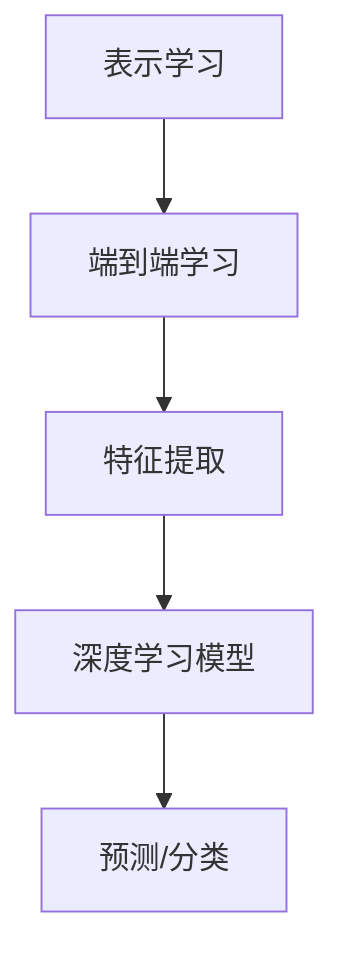

好的,我会严格遵循约束条件,以专业的技术语言写一篇有深度的技术博客文章。以下是正文:

# AI人工智能 Agent:利用深度学习进行特征提取

## 1. 背景介绍

### 1.1 问题的由来

在当今的数字时代,数据的爆炸式增长已成为一个不争的事实。无论是结构化的数据库还是非结构化的多媒体数据,都呈现出海量、高维、多样性的特点。如何从这些原始数据中高效地提取有价值的特征,对于机器学习、模式识别、数据挖掘等领域的应用具有至关重要的意义。

传统的特征提取方法主要依赖于人工设计,需要专家对问题领域有深入的理解,并结合领域知识手动构建特征。这种方法不仅效率低下,而且往往难以获得理想的特征表示。随着深度学习技术的不断发展,基于多层神经网络自动学习数据特征的方法逐渐成为研究热点。

### 1.2 研究现状  

近年来,深度学习在计算机视觉、自然语言处理、语音识别等领域取得了突破性的成就,其核心在于能够自动从原始数据中学习多层次的抽象特征表示。卷积神经网络(CNN)、循环神经网络(RNN)、自编码器(AutoEncoder)等模型均展现出了强大的特征学习能力。

尽管深度学习在特征提取方面取得了长足的进步,但仍然面临一些挑战:

1. 可解释性问题:深度神经网络的"黑盒"本质使得学习到的特征缺乏可解释性,难以被人类理解。
2. 样本质量问题:深度模型对训练数据的质量和数量要求较高,噪声和缺失值会严重影响特征提取效果。
3. 领域迁移问题:不同领域数据的分布往往存在差异,如何实现特征的有效迁移是一个挑战。

### 1.3 研究意义

有效的特征提取不仅能够提高机器学习模型的性能,还能够帮助我们深入理解数据的内在结构和本质属性。基于深度学习的特征提取方法具有以下重要意义:

1. 降低人工成本,实现自动化特征学习。
2. 挖掘数据的高层次抽象特征,提高特征表达能力。
3. 为复杂任务(如图像分类、机器翻译等)提供强有力的特征支持。
4. 促进人工智能技术在各行业的应用,推动智能化进程。

### 1.4 本文结构  

本文将围绕"基于深度学习的特征提取技术"这一主题,系统地介绍相关理论、方法和应用。具体内容安排如下:

- 第2部分阐述深度学习特征提取的核心概念,包括表示学习、端到端学习等。
- 第3部分重点讲解基于深度学习的主流特征提取算法,如自编码器、卷积神经网络等。
- 第4部分介绍相关的数学模型和理论基础,包括反向传播、正则化等。
- 第5部分通过实际案例,演示基于TensorFlow/PyTorch等框架进行特征提取的代码实现。
- 第6部分探讨深度学习特征提取在计算机视觉、自然语言处理等领域的应用现状和前景。
- 第7部分推荐相关的学习资源、开发工具和论文。
- 第8部分总结研究成果,分析发展趋势和面临的挑战。
- 第9部分列举常见问题并给出解答。

## 2. 核心概念与联系

深度学习特征提取的核心思想可以概括为"表示学习"和"端到端学习"。

### 2.1 表示学习

表示学习(Representation Learning)旨在从原始数据中自动学习出良好的特征表示,使得这些特征能够概括数据的内在规律和本质属性。与传统的人工设计特征不同,表示学习通过神经网络自动从训练数据中习得分层次的特征表示。

表示学习的目标是找到一个映射函数 $f$,将原始输入数据 $x$ 映射到一个新的特征空间 $z$,即 $z = f(x)$。这个新的特征空间 $z$ 应当具有更好的判别性和鲁棒性,有利于后续的机器学习任务(如分类、聚类等)。

### 2.2 端到端学习  

端到端学习(End-to-End Learning)是指在机器学习系统中,将输入数据直接映射到所需的输出,而无需人工设计中间步骤。通过端到端的训练,整个系统可以自动学习合适的内部数据表示,而不需要人为设计特征提取器。

在传统的机器学习系统中,通常需要分别设计特征提取器、特征编码器和分类器等模块。而端到端学习则将这些模块融合到一个统一的框架中,使用统一的目标函数进行联合训练,从而简化了系统设计,降低了人工成本。

深度学习特征提取的本质就是通过端到端学习的方式,让神经网络自动从原始数据中习得有意义的特征表示,而无需人工设计特征提取器。这种思路不仅能够挖掘数据的高层次抽象特征,还能够根据具体任务自动学习最优的特征,从而获得更好的性能表现。

## 3. 核心算法原理与具体操作步骤

深度学习在特征提取方面的核心算法主要包括自编码器(AutoEncoder)及其变体、卷积神经网络(CNN)、递归神经网络(RNN)等。下面将分别介绍这些算法的原理、操作步骤以及优缺点。

### 3.1 算法原理概述

#### 3.1.1 自编码器

自编码器是一种无监督学习的神经网络模型,其目标是将输入数据 $x$ 通过编码器映射到一个隐含的特征空间 $z$,即 $z = f(x)$,然后再通过解码器从 $z$ 重建出原始数据 $\hat{x} = g(z)$,使得重建数据 $\hat{x}$ 尽可能地接近原始输入 $x$。

在训练过程中,自编码器被迫在隐含层 $z$ 中学习出能够有效重建输入数据的特征表示。通过限制隐含层的维度,可以强制自编码器学习出数据的紧凑表示,从而实现特征提取和降维的目的。

#### 3.1.2 卷积神经网络

卷积神经网络(CNN)是一种专门用于处理网格结构数据(如图像、序列等)的神经网络模型。CNN 由卷积层、池化层和全连接层组成,能够自动从原始数据中提取出局部特征、空间特征和高层语义特征。

CNN 的核心思想是通过卷积核在局部区域内进行特征提取,并通过池化操作对特征进行下采样,从而逐层获取更高层次、更抽象的特征表示。CNN 在计算机视觉、自然语言处理等领域表现出色,展现了强大的特征学习能力。

#### 3.1.3 递归神经网络

递归神经网络(RNN)是一种专门用于处理序列数据(如文本、语音等)的神经网络模型。与传统的前馈神经网络不同,RNN 在隐藏层之间引入了循环连接,能够很好地捕捉序列数据中的时间依赖关系。

在特征提取方面,RNN 可以自动学习出序列数据的内在模式和上下文信息,并将这些特征编码到隐藏状态向量中。通过对隐藏状态向量进行处理,可以获得序列数据的高层次特征表示,为后续的任务(如机器翻译、语音识别等)提供有力支持。

### 3.2 算法步骤详解

#### 3.2.1 自编码器特征提取步骤

1. **构建自编码器模型**:定义编码器 $f(x)$ 和解码器 $g(z)$ 的网络结构,通常采用多层全连接神经网络。
2. **设置损失函数**:常用的损失函数包括均方误差损失、交叉熵损失等,目标是最小化输入 $x$ 与重建数据 $\hat{x}$ 之间的差异。
3. **训练自编码器**:利用无监督训练数据,通过反向传播算法优化网络参数,使自编码器能够较好地重建输入数据。
4. **提取特征向量**:在训练完成后,将输入数据 $x$ 输入到编码器中,取编码器的隐含层输出作为学习到的特征向量 $z$。
5. **特征后处理**:可以对学习到的特征向量 $z$ 进行降维、正则化等后处理,以获得更加紧凑和鲁棒的特征表示。

#### 3.2.2 卷积神经网络特征提取步骤

1. **构建CNN模型**:根据输入数据的类型(如图像、序列等),设计合适的CNN网络结构,包括卷积层、池化层和全连接层等。
2. **设置损失函数**:对于有监督任务(如图像分类),常用的损失函数是交叉熵损失;对于无监督任务(如自编码器),可采用均方误差损失等。
3. **训练CNN模型**:利用训练数据,通过反向传播算法优化网络参数,使CNN能够学习到有效的特征表示。
4. **提取特征向量**:在训练完成后,将输入数据输入到CNN中,取某一层(如全连接层前的卷积层输出)作为学习到的特征向量。
5. **特征后处理**:可以对CNN提取的特征向量进行降维、正则化等后处理,以获得更加紧凑和泛化的特征表示。

#### 3.2.3 递归神经网络特征提取步骤

1. **构建RNN模型**:根据序列数据的类型(如文本、语音等),选择合适的RNN变体(如LSTM、GRU等),并设计网络结构。
2. **设置损失函数**:对于有监督任务(如机器翻译),常用的损失函数是交叉熵损失;对于无监督任务(如序列自编码器),可采用均方误差损失等。
3. **训练RNN模型**:利用训练数据,通过反向传播算法优化网络参数,使RNN能够学习到有效的特征表示。
4. **提取特征向量**:在训练完成后,将输入序列数据输入到RNN中,取最后一个时间步的隐藏状态向量作为学习到的特征向量。
5. **特征后处理**:可以对RNN提取的特征向量进行降维、正则化等后处理,以获得更加紧凑和泛化的特征表示。

### 3.3 算法优缺点

#### 3.3.1 自编码器

**优点**:
- 无需人工标注,可以利用大量无监督数据进行训练。
- 能够学习出数据的紧凑表示,实现有效的特征提取和降维。
- 具有一定的生成能力,可以用于数据去噪、数据生成等任务。

**缺点**:
- 学习到的特征表示缺乏语义解释性,难以被人类理解。
- 训练过程中容易陷入局部最优,需要合理的初始化和正则化策略。
- 对于高维数据(如图像),单纯的全连接自编码器效果可能不佳。

#### 3.3.2 卷积神经网络

**优点**:
- 能够自动从原始数据(如图像)中提取出局部特征、空间特征和高层语义特征。
- 具有一定的平移不变性和尺度不变性,对图像的平移、缩放等变换具有鲁棒性。
- 在计算机视觉、自然语言处理等领域表现出色,是深度学习最成功的应用之一。

**缺点**:
- 需要大量的训练数据,对数据质量和数量要求较高。
- 网络结构设计和参数调优往往需要大量的经验和试错。
- 对序列数据的建模能力相对较弱,无法很好地捕捉长期依赖关系。

#### 3.3.3 递归神经网络

**优点**:
-