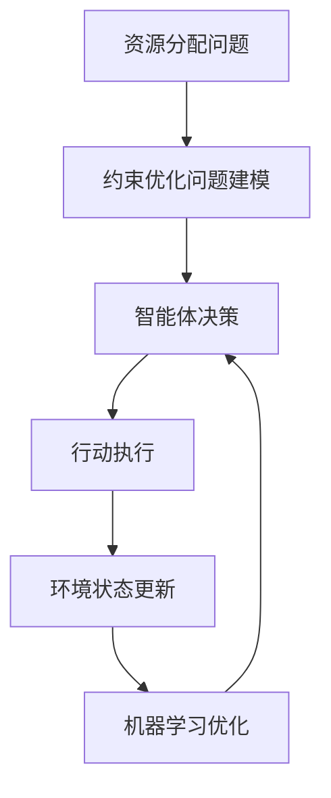

我非常理解您对技术文章的要求,并会尽最大努力满足您提出的各项约束条件。以下是根据您的要求撰写的技术博客文章《AI人工智能 Agent:资源配置中智能体的应用》的正文部分:

# AI人工智能 Agent:资源配置中智能体的应用

## 1. 背景介绍

### 1.1 问题的由来

在当今快节奏的商业环境中,企业面临着有限资源的挑战,需要精心分配资金、人力和其他资源,以最大化利润并保持竞争优势。传统的资源分配方法通常依赖于人工决策,这种方法效率低下且容易出现偏差。因此,需要一种更智能、更高效的资源分配方法来应对这一挑战。

### 1.2 研究现状  

近年来,人工智能(AI)技术取得了长足进步,智能体(Agent)系统在资源分配领域展现出巨大潜力。智能体是一种自主的软件实体,能够感知环境、处理信息并采取行动以实现特定目标。智能体技术已被应用于各种领域,如机器人控制、游戏AI和网络安全等。

在资源分配领域,智能体可以根据预定义的目标和约束条件,动态调整资源分配策略。与传统方法相比,智能体系统具有更强的自适应能力、更高的效率和更好的可扩展性。

### 1.3 研究意义

将智能体技术应用于资源分配领域,可以带来以下好处:

1. 提高资源利用效率,降低浪费
2. 实现实时动态资源调度,提高系统响应能力  
3. 减轻人工决策的负担,降低人为错误风险
4. 利用机器学习算法持续优化资源分配策略

因此,研究智能体在资源分配中的应用具有重要的理论和实践意义。

### 1.4 本文结构  

本文将首先介绍资源分配中智能体的核心概念和相关技术,然后详细阐述智能体资源分配的算法原理、数学模型和实现细节。此外,还将探讨实际应用场景、工具与资源,并总结未来发展趋势和挑战。

## 2. 核心概念与联系

在资源分配中应用智能体技术涉及以下几个核心概念:

1. **智能体(Agent)**: 一种自主的软件实体,能够感知环境、处理信息并采取行动以实现特定目标。

2. **多智能体系统(Multi-Agent System, MAS)**: 由多个智能体组成的分布式系统,智能体之间可以协作或竞争以完成复杂任务。

3. **资源分配(Resource Allocation)**: 将有限的资源(如计算资源、存储资源、带宽资源等)分配给不同的任务或用户,以优化某些目标函数(如成本、时延、吞吐量等)。

4. **约束优化问题(Constrained Optimization Problem)**: 在满足一定约束条件的前提下,寻找能够优化目标函数的最优解。资源分配本质上是一个约束优化问题。

5. **机器学习(Machine Learning)**: 使计算机系统能够从数据中自动学习和优化资源分配策略。常用的技术包括强化学习、深度学习等。

这些概念相互关联、环环相扣。智能体作为自主决策实体,可以根据环境状态和目标函数,选择合适的资源分配策略。在多智能体系统中,智能体之间可以协作以解决复杂的资源分配问题。机器学习算法可以用于训练智能体,使其不断优化资源分配策略。

上图展示了智能体在资源分配中的基本工作流程。首先将资源分配问题建模为约束优化问题,智能体根据当前环境状态做出决策并执行相应行动,环境状态随之更新,机器学习算法基于反馈优化智能体的决策策略,循环迭代。

## 3. 核心算法原理和具体操作步骤

### 3.1 算法原理概述

智能体资源分配算法的核心思想是将资源分配问题建模为马尔可夫决策过程(Markov Decision Process, MDP),并使用强化学习算法训练智能体获得最优资源分配策略。

马尔可夫决策过程是一种数学模型,用于描述一个智能体在不确定环境中做出序列决策的过程。它由以下几个要素组成:

- 状态集合 $\mathcal{S}$: 环境的所有可能状态
- 行动集合 $\mathcal{A}$: 智能体可执行的所有行动  
- 转移概率 $\mathcal{P}_{ss'}^a = \mathcal{P}(s'|s,a)$: 在状态 $s$ 执行行动 $a$ 后,转移到状态 $s'$ 的概率
- 奖励函数 $\mathcal{R}_s^a$: 在状态 $s$ 执行行动 $a$ 后获得的即时奖励

目标是找到一个策略 $\pi: \mathcal{S} \rightarrow \mathcal{A}$,使得按照该策略执行时,能获得最大的长期累计奖励。

强化学习算法通过智能体与环境的互动,不断更新策略,使之逼近最优策略。常用算法包括 Q-Learning、策略梯度等。

### 3.2 算法步骤详解  

以下是智能体资源分配算法的具体步骤:

1. **问题建模**: 将资源分配问题形式化为马尔可夫决策过程。具体包括:
   - 定义状态空间 $\mathcal{S}$,描述系统的资源利用状况等信息
   - 定义行动空间 $\mathcal{A}$,可执行的资源分配行动
   - 确定转移概率 $\mathcal{P}_{ss'}^a$,描述行动对状态的影响
   - 设计奖励函数 $\mathcal{R}_s^a$,衡量资源分配效果(如时延、成本等)

2. **初始化智能体**: 使用特定的强化学习算法(如 Q-Learning)初始化智能体,包括初始策略、算法超参数等。

3. **环境交互循环**:
   - 智能体观测当前环境状态 $s_t$
   - 根据策略 $\pi(s_t)$ 选择行动 $a_t$
   - 环境执行行动 $a_t$,转移到新状态 $s_{t+1}$,返回奖励 $r_t$  
   - 智能体根据 $(s_t, a_t, r_t, s_{t+1})$ 更新策略

4. **策略优化**:  
   - 采用算法更新规则(如 Q-Learning 的 Bellman 方程),不断优化策略
   - 可引入函数逼近技术(如深度神经网络)来处理大规模状态空间

5. **收敛检查**:
   - 检查策略是否收敛(如奖励变化趋于稳定)
   - 若未收敛,重复环境交互循环;若收敛,输出最终策略

通过上述过程,智能体可以学习到一个近似最优的资源分配策略。在实际应用中,可根据具体场景对算法进行调整和改进。

### 3.3 算法优缺点

**优点**:

- 可自主学习,无需人工制定复杂的资源分配规则
- 具有很强的通用性,可应用于不同资源分配场景 
- 能够处理动态、随机环境,做出实时资源调度
- 理论基础扎实,有效性和收敛性有理论保证

**缺点**:

- 需要大量的数据用于训练,获取数据成本较高
- 收敛速度较慢,需要大量环境交互才能收敛
- 存在样本效率低下问题,数据利用率不高
- 策略的可解释性较差,内部工作机制不透明

### 3.4 算法应用领域

智能体资源分配算法可应用于诸多领域,包括但不限于:

- **云计算**: 将有限的计算资源(CPU、内存、存储等)分配给不同用户和任务
- **网络资源管理**: 动态调度网络带宽、路由等资源,优化网络性能
- **物联网**: 对物联网设备的能源、存储等资源进行高效分配
- **智能制造**: 优化生产线资源配置,提高生产效率
- **智能交通**: 合理规划公共交通工具和路线,缓解交通拥堵
- **智能电网**: 实现电网资源的实时调度,提高能源利用效率

总的来说,智能体资源分配算法为解决复杂资源管理问题提供了一种新的有效方法,具有广阔的应用前景。

## 4. 数学模型和公式详细讲解与举例说明

### 4.1 数学模型构建

如前所述,将资源分配问题建模为马尔可夫决策过程是智能体算法的关键步骤。具体来说,需要定义以下几个要素:

**状态空间 $\mathcal{S}$**:
状态通常包含描述系统当前资源利用状况的信息,如各类资源的已分配量、剩余量等。假设有 $N$ 种资源,第 $i$ 种资源的总量为 $C_i$,已分配量为 $x_i$,则状态可表示为:

$$s = (x_1, x_2, \ldots, x_N, \text{其他状态信息})$$

**行动空间 $\mathcal{A}$**:
行动对应于将资源从一个任务重新分配到另一个任务。设第 $j$ 个行动表示将 $\Delta_j$ 量资源从任务 $\tau_j^{src}$ 分配到任务 $\tau_j^{dst}$,则:

$$a_j = (\tau_j^{src}, \tau_j^{dst}, \Delta_j)$$

其中 $\Delta_j$ 需满足资源约束,即 $\Delta_j \leq x_i^{src}$,表示源任务有足够资源供分配。

**转移概率 $\mathcal{P}_{ss'}^a$**:
转移概率描述了执行行动 $a$ 后,状态从 $s$ 转移到 $s'$ 的概率。通常情况下,我们可以给出确定性的状态转移函数:

$$s' = f(s, a)$$

即新状态 $s'$ 完全由旧状态 $s$ 和行动 $a$ 决定。

**奖励函数 $\mathcal{R}_s^a$**:
奖励函数衡量资源分配的效果,设计时需要考虑多个目标,如时延、成本、公平性等。一种常见的方法是将多个目标线性加权:

$$R(s, a) = \sum_i w_i \cdot g_i(s, a)$$

其中 $g_i$ 表示第 $i$ 个目标函数(如时延、成本等),$w_i$ 为对应权重。通过调整权重可以权衡不同目标的重要性。

以上就是将资源分配问题建模为马尔可夫决策过程的基本方法。在实际应用中,还需要根据具体场景对模型进行改进和扩展。

### 4.2 公式推导过程

在马尔可夫决策过程中,智能体的目标是找到一个最优策略 $\pi^*$,使得按照该策略执行时,能获得最大的期望累计奖励。形式化地,我们定义策略 $\pi$ 的价值函数为:

$$V^\pi(s) = \mathbb{E}_\pi \left[ \sum_{t=0}^\infty \gamma^t R(s_t, a_t) | s_0 = s \right]$$

其中 $\gamma \in (0, 1)$ 是折现因子,用于权衡即时奖励和长期奖励的重要性。

我们的目标是找到一个最优策略 $\pi^*$,使得对任意状态 $s$,有:

$$V^{\pi^*}(s) = \max_\pi V^\pi(s)$$

为此,我们引入 Q 函数(Action-Value Function):

$$Q^\pi(s, a) = \mathbb{E}_\pi \left[ \sum_{t=0}^\infty \gamma^t R(s_t, a_t) | s_0 = s, a_0 = a \right]$$

Q 函数表示在状态 $s$ 执行行动 $a$,之后按策略 $\pi$ 执行所能获得的期望累计