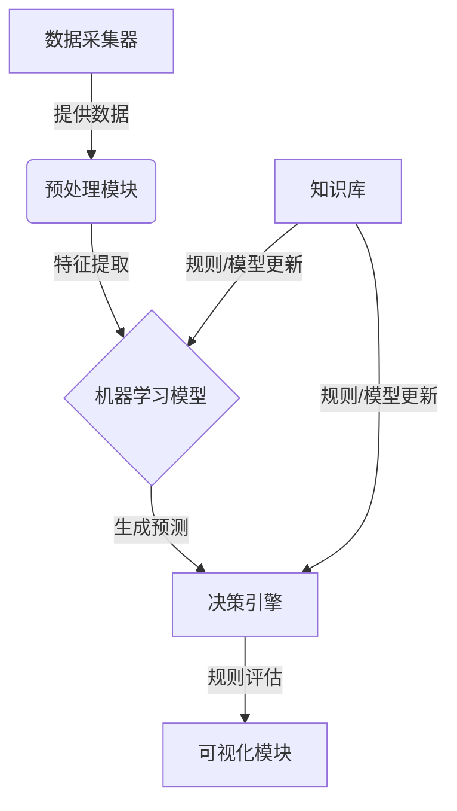
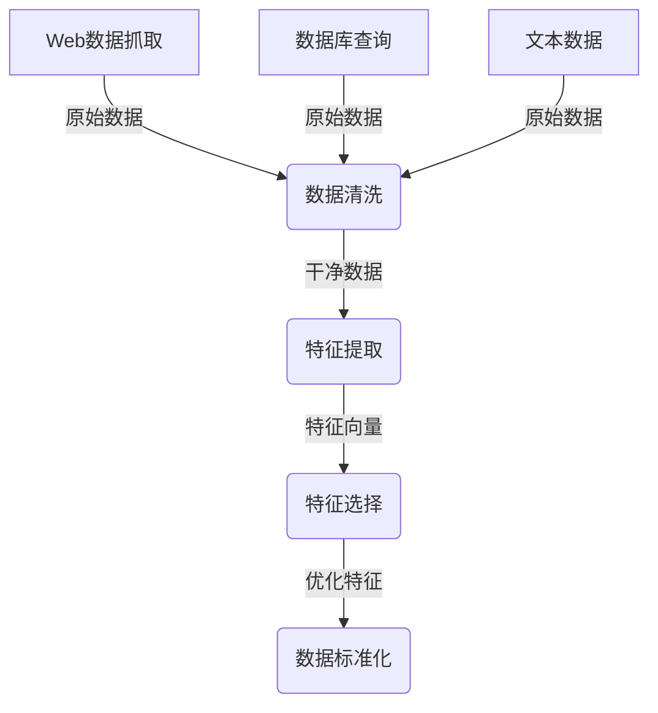
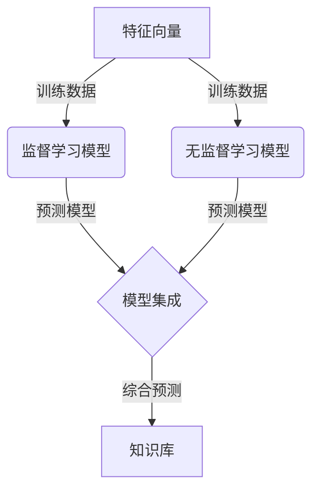
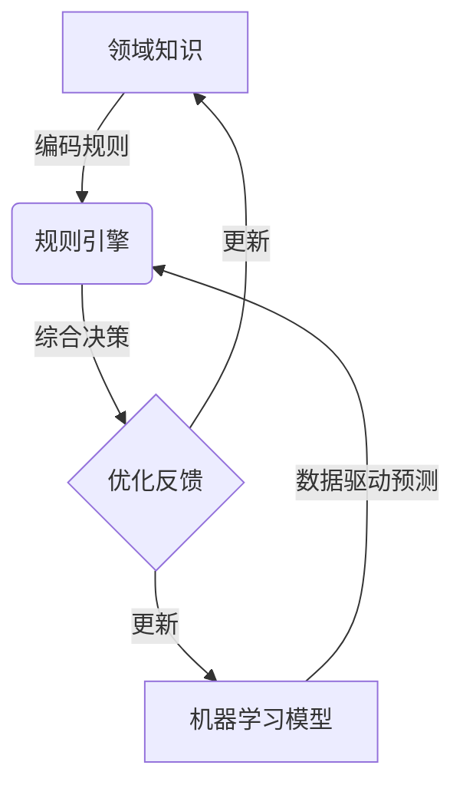

好的,我会严格按照约束条件要求,以专业的技术语言写一篇关于"AI人工智能代理工作流在市场预测中的应用"的深度技术博客文章。

# AI人工智能代理工作流 AI Agent WorkFlow:在市场预测中的应用

## 1. 背景介绍

### 1.1 问题的由来

在当今瞬息万变的商业环境中,准确预测市场趋势对于企业的决策制定至关重要。传统的预测方法通常依赖于人工分析和有限的历史数据,难以全面捕捉市场的复杂动态。随着人工智能(AI)和大数据技术的不断发展,AI代理工作流应运而生,为市场预测提供了新的解决方案。

### 1.2 研究现状  

近年来,AI代理工作流在市场预测领域得到了广泛关注和应用。研究人员通过集成多种AI技术,如机器学习、自然语言处理和智能规则引擎等,构建了高效的预测模型。这些模型能够从海量异构数据中提取有价值的信息,并自动生成准确的预测结果。

### 1.3 研究意义

AI代理工作流为市场预测带来了诸多优势:

1. 提高预测准确性
2. 减少人工干预
3. 实现实时动态预测
4. 支持多维度数据融合
5. 可解释性和可追溯性

通过应用AI代理工作流,企业能够做出更明智的决策,抓住市场机遇,提高竞争力。

### 1.4 本文结构

本文首先介绍AI代理工作流的核心概念,阐述其在市场预测中的应用价值。然后详细讲解工作流的算法原理、数学模型和实现细节。接着探讨实际应用场景,给出工具和资源推荐。最后总结研究成果,并展望未来发展趋势和挑战。

## 2. 核心概念与联系

AI代理工作流是一种智能系统,集成了多种AI技术,旨在自动化执行复杂的预测任务。它由以下几个核心组件组成:

1. **数据采集器**: 从各种来源(如网络、数据库、文本等)收集相关数据。
2. **预处理模块**: 对原始数据进行清洗、转换和标准化等预处理。
3. **机器学习模型**: 使用监督或无监督算法从预处理数据中学习模式。
4. **决策引擎**: 基于规则引擎和机器学习模型的输出做出决策。 
5. **可视化模块**: 以图表或报告的形式呈现预测结果。
6. **知识库**: 存储领域知识、规则和训练好的模型。

这些组件通过工作流进行有序集成,形成了高效的预测系统。在市场预测任务中,该系统可以持续接收各类市场数据,自动生成准确的趋势预测,为决策者提供有价值的参考。

## 3. 核心算法原理及具体操作步骤

### 3.1 算法原理概述

AI代理工作流的核心算法是一种混合方法,结合了机器学习和基于规则的推理。其基本思想是:

1. 利用机器学习技术从历史数据中自动学习市场模式。
2. 将学习到的模式表示为数学模型或规则。
3. 将新的市场数据输入模型/规则系统,生成预测结果。
4. 基于领域知识不断优化和更新模型/规则。

该算法的关键在于机器学习和规则推理的有机结合,充分利用数据驱动的模型和人类专家知识,从而获得高精度的预测。

### 3.2 算法步骤详解

AI代理工作流算法可分为以下几个主要步骤:

#### 3.2.1 数据采集和预处理

1. **Web数据抓取**: 使用网络爬虫从互联网上抓取相关网页、新闻等非结构化文本数据。
2. **数据库查询**: 从企业内部数据库系统获取历史销售、库存等结构化数据。
3. **文本数据**: 收集行业报告、分析师观点等文本数据。
4. **数据清洗**: 处理缺失值、重复数据、异常值等数据质量问题。
5. **特征提取**: 从原始数据中提取有价值的数值型或类别型特征,构建特征向量。
6. **特征选择**: 使用过滤法或包裹法等方法选择最相关的特征子集。
7. **数据标准化**: 将数值型特征缩放到相似的范围,避免某些特征因数值过大而主导模型。

经过以上步骤,原始数据被转换为适合机器学习算法的特征向量表示。

#### 3.2.2 机器学习建模

1. **监督学习模型**: 基于带有标签的历史数据(如过去的市场趋势),使用回归、决策树、支持向量机等算法训练预测模型。
2. **无监督学习模型**: 对未标记数据进行聚类、主题建模等分析,发现潜在的数据模式和规律。
3. **模型集成**: 将多个基础模型的预测结果进行加权融合,形成综合预测模型,提高预测的准确性和鲁棒性。
4. **知识库**: 存储训练好的模型、规则,并根据新的领域知识不断优化和更新。

机器学习模型能够自动从大量数据中学习复杂的非线性模式,并生成数据驱动的预测。

#### 3.2.3 规则推理和决策

1. **领域知识**: 由领域专家总结的经验法则、规范性约束等形式化知识。
2. **规则引擎**: 将领域知识编码为可计算的规则,与机器学习模型的预测结果相结合,进行推理和决策。
3. **优化反馈**: 将决策结果与实际结果进行比对,对知识库和机器学习模型进行持续优化,形成闭环学习。

规则推理能够有效地引入人类专家经验,提高系统的可解释性和可控性。同时,机器学习模型和规则系统相互补充,发挥各自的优势。

### 3.3 算法优缺点

**优点**:

1. 高预测精度:融合机器学习和规则推理,能够充分利用数据和领域知识。
2. 可解释性强:基于规则的决策具有较好的可解释性和可追溯性。
3. 泛化能力好:通过持续学习,能够适应市场的动态变化。
4. 处理异构数据:能够融合结构化、非结构化等异构数据源。

**缺点**:

1. 系统复杂度高:需要集成多种AI技术,系统架构相对复杂。
2. 知识获取成本高:需要领域专家持续输入和维护知识库。
3. 实时性要求高:需要高效处理大量数据流,对计算资源要求较高。

### 3.4 算法应用领域

AI代理工作流算法可广泛应用于以下市场预测领域:

- 金融证券市场预测
- 电子商务销售预测  
- 能源需求预测
- 旅游景点人流预测
- 房地产市场预测
- 供应链需求预测
- ...

无论是传统行业还是新兴领域,只要存在大量异构数据和复杂的决策需求,该算法都可以发挥优势。

## 4. 数学模型和公式详细讲解及举例说明

AI代理工作流中的机器学习模型通常基于以下数学理论:

### 4.1 数学模型构建

#### 4.1.1 线性回归模型

线性回归是最基础的监督学习模型,用于预测连续型目标变量。其基本形式为:

$$y = w_0 + w_1x_1 + w_2x_2 + ... + w_nx_n$$

其中$y$为预测目标,$x_i$为特征变量,$w_i$为模型参数。

模型参数可通过最小二乘法等优化算法学习得到。

#### 4.1.2 逻辑回归模型

逻辑回归用于二分类问题,预测目标变量属于正类或负类的概率:

$$P(y=1|x) = \sigma(w_0 + w_1x_1 + ... + w_nx_n)$$

其中$\sigma(z) = \frac{1}{1+e^{-z}}$为Sigmoid函数。

#### 4.1.3 决策树模型

决策树通过递归分割特征空间构建决策树状模型,可用于分类和回归任务。

构建决策树的目标是最小化不纯度,如基尼系数或熵:

$$Gini(D) = 1 - \sum_{k=1}^{K}p_k^2$$

$$Entropy(D) = -\sum_{k=1}^{K}p_k\log p_k$$

其中$p_k$为第k类样本占比,$K$为类别数。

#### 4.1.4 支持向量机模型

支持向量机(SVM)在高维空间中构建最大间隔超平面,用于线性和非线性分类:

$$\underset{w,b}{min}\frac{1}{2}||w||^2$$
$$s.t.\ y_i(w^Tx_i+b)\geq 1,\ i=1,...,N$$

对于非线性情况,通过核技巧$\phi(x)$将数据映射到高维空间。

上述模型只是机器学习中的一小部分,在实际应用中还可以使用深度学习、聚类、主题模型等更加先进的模型。

### 4.2 公式推导过程

以线性回归为例,我们推导模型参数的解析解:

已知数据集$D=\{(x_i,y_i)\}_{i=1}^N$,目标是找到最小化均方误差的参数$w$:

$$\underset{w}{min}\ J(w)=\frac{1}{2}\sum_{i=1}^{N}(y_i-w^Tx_i)^2$$

对$w$求偏导并令其为0:

$$\frac{\partial J(w)}{\partial w}=\sum_{i=1}^{N}(w^Tx_i-y_i)x_i=0$$

化简可得:$Xw=y$,其中$X$为设计矩阵,$y$为目标向量。

于是最小二乘解为:$w=(X^TX)^{-1}X^Ty$

当特征数量$n$较大时,可使用梯度下降等迭代优化算法求解$w$。

### 4.3 案例分析与讲解

**案例背景**:

某电商公司希望预测未来一周的销售额,以便合理安排库存和营销策略。我们将基于该公司过去一年的销售数据,构建AI代理工作流预测模型。

**特征工程**:

- 天气数据(温度、湿度等)
- 节假日标记
- 广告投放量 
- 历史销量时间序列
- 商品类别
- ...

**机器学习模型**:

1. 线性回归模型:基于历史销量时间序列数据训练线性模型。
2. 决策树回归模型:基于天气、节假日等特征训练树模型。
3. 模型集成:将线性模型和树模型的预测结果加权融合。

**规则推理**:

1. 如果当周有重大节假日,则销量增加30%。
2. 如果广告投放量