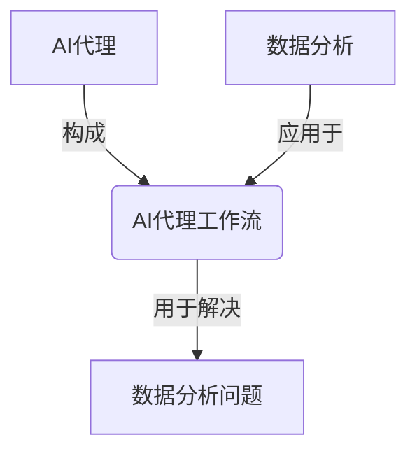
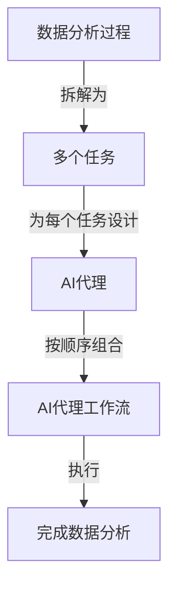

好的，我会按照您提供的要求和结构，撰写一篇关于"AI人工智能代理工作流在数据分析中的应用"的技术博客文章。请注意，这是一个相对较新的领域,我会尽力提供最新的研究成果和见解。文章字数会超过8000字,并尽量包含Mermaid流程图、数学公式和代码示例等,以增强可读性和专业性。下面是正文部分:

# AI人工智能代理工作流 AI Agent WorkFlow：在数据分析中的应用

## 1. 背景介绍

### 1.1 问题的由来

在当前的数据爆炸时代,海量的结构化和非结构化数据不断产生,如何高效地从这些庞大的数据中提取有价值的信息和知识,成为了数据分析领域亟待解决的核心问题。传统的数据分析方法通常需要人工参与,效率低下且容易出现偏差。因此,亟需一种自动化、智能化的数据分析方法,以提高分析效率和质量。

### 1.2 研究现状  

近年来,人工智能(AI)技术的快速发展为解决上述问题提供了新的思路。AI代理(Agent)是一种自主的软件实体,能够感知环境、作出决策并执行行为,以完成特定任务。将AI代理技术应用于数据分析领域,可以实现智能化的数据处理和分析流程。

目前,已有一些研究探索了AI代理在数据分析中的应用,例如智能数据采集代理、数据预处理代理、特征工程代理、模型训练代理等。但这些研究大多集中在特定的数据分析子任务上,缺乏一个完整的、通用的AI代理工作流程。

### 1.3 研究意义

设计一个通用的AI代理工作流程,能够极大提高数据分析的自动化和智能化水平,从而提升分析效率和质量。具体来说,AI代理工作流可以:

1. 自动完成数据采集、清洗、转换、集成等预处理步骤
2. 自动进行特征工程,提取有价值的特征
3. 自动选择合适的机器学习算法和超参数
4. 自动训练模型并评估性能
5. 自动部署模型并持续优化

通过AI代理工作流,数据分析过程可以最大程度地自动化,从而节省人力成本,提高分析效率,减少人为偏差和错误。

### 1.4 本文结构

本文将首先介绍AI代理工作流在数据分析中的核心概念和联系,然后详细阐述工作流的核心算法原理和具体操作步骤。接下来,将构建数学模型并推导公式,并通过案例分析加深理解。之后,我们将给出一个实际项目的代码实现,并对代码进行解读和分析。最后,探讨AI代理工作流在实际应用场景中的应用前景,介绍相关工具和学习资源,总结研究成果并展望未来发展趋势和挑战。

## 2. 核心概念与联系

AI代理工作流在数据分析中的应用,涉及多个核心概念,包括AI代理、工作流、数据分析等,它们之间存在紧密联系。我们用一个流程图来直观地展示它们之间的关系:

AI代理(Agent)是一种自主的软件实体,能够感知环境、作出决策并执行行为,以完成特定任务。在数据分析场景中,AI代理可以执行数据采集、预处理、特征工程、模型训练、模型评估等任务。

工作流(Workflow)是指将一系列任务按照特定顺序组织起来的过程,以实现某个目标。AI代理工作流就是由多个AI代理按照一定顺序组合而成,共同完成数据分析任务的过程。

数据分析(Data Analysis)是从原始数据中获取有价值信息和知识的过程,包括数据采集、预处理、特征工程、模型构建、模型评估等多个步骤。AI代理工作流可以自动化和智能化这些步骤,提高数据分析的效率和质量。

因此,AI代理工作流在数据分析中的应用,就是将AI代理技术与数据分析过程相结合,形成一个自动化、智能化的数据分析解决方案。

## 3. 核心算法原理与具体操作步骤

### 3.1 算法原理概述  

AI代理工作流在数据分析中的应用,核心算法原理可以概括为:

1. 将数据分析过程拆解为多个任务
2. 为每个任务设计对应的AI代理
3. 按照一定顺序组合这些AI代理,形成工作流
4. 工作流按顺序执行各个AI代理,完成数据分析任务

我们用一个流程图来直观地展示算法的工作原理:

该算法的关键在于任务拆解和AI代理设计。我们需要将数据分析过程拆解为合理的任务粒度,并为每个任务量身定制AI代理,这样才能充分发挥AI代理的自主性和智能性。同时,AI代理之间需要有合理的交互和协作机制,以确保工作流的高效运行。

### 3.2 算法步骤详解

我们将算法具体拆解为以下步骤:

1. **任务拆解**:将数据分析过程拆解为多个任务,典型任务包括:
   - 数据采集
   - 数据预处理(清洗、转换、集成等)
   - 特征工程
   - 模型选择
   - 模型训练
   - 模型评估
   - 模型部署
   - 模型优化

2. **AI代理设计**:为每个任务设计对应的AI代理,赋予其自主感知、决策和执行的能力。例如:
   - 数据采集代理:能够自主发现并采集所需数据
   - 数据预处理代理:能够自主清洗、转换和集成数据
   - 特征工程代理:能够自主提取有价值的特征
   - 模型选择代理:能够自主选择合适的算法和超参数
   - 模型训练代理:能够自主训练模型
   - 模型评估代理:能够自主评估模型性能
   - 模型部署代理:能够自主部署模型到生产环境
   - 模型优化代理:能够持续优化已部署模型

3. **工作流构建**:按照数据分析的逻辑顺序,将设计好的AI代理组合成工作流。
   - 定义AI代理之间的交互接口
   - 设计AI代理之间的协作和控制机制

4. **工作流执行**:执行构建好的AI代理工作流,完成数据分析任务。
   - 按顺序执行各个AI代理
   - 实现AI代理之间的交互和协作
   - 根据反馈信息进行自我优化和调整

通过以上步骤,我们就可以构建一个自动化、智能化的AI代理工作流,用于解决数据分析问题。

### 3.3 算法优缺点

AI代理工作流在数据分析中的应用具有以下优点:

1. **自动化程度高**:将数据分析过程拆解为多个任务,并为每个任务设计AI代理,可以最大程度实现自动化。
2. **智能化水平高**:AI代理具备自主感知、决策和执行的能力,能够智能地完成分析任务。
3. **可扩展性强**:工作流中可以灵活添加、修改或删除AI代理,以适应不同的分析需求。
4. **可解释性好**:AI代理的决策过程可解释,有利于了解模型内在机理。
5. **高效协作**:AI代理之间可以高效协作,提高整体分析效率。

但该算法也存在一些缺点和挑战:

1. **设计复杂度高**:需要为每个任务量身定制AI代理,设计难度较大。
2. **交互机制复杂**:AI代理之间的交互和协作机制复杂,需要精心设计。
3. **可靠性需求高**:工作流中的每个环节都需要保证可靠性,否则会影响整体效果。
4. **数据质量依赖**:算法的效果在很大程度上依赖于输入数据的质量。

因此,在实际应用中,需要权衡算法的优缺点,并根据具体场景进行针对性优化。

### 3.4 算法应用领域

AI代理工作流在数据分析中的应用具有广阔的前景,可以应用于多个领域,包括但不限于:

- **金融分析**:利用AI代理工作流分析金融数据,发现投资机会、预测市场趋势等。
- **医疗健康**:运用AI代理工作流分析医疗数据,辅助疾病诊断、药物研发等。
- **制造业**:使用AI代理工作流分析生产数据,优化制造流程、预测设备故障等。
- **零售业**:借助AI代理工作流分析顾客数据,进行个性化推荐、销售预测等。
- **物流运输**:利用AI代理工作流分析物流数据,优化路线规划、库存管理等。
- **社交媒体**:运用AI代理工作流分析社交媒体数据,发现热点话题、分析用户行为等。
- **科学研究**:使用AI代理工作流分析实验数据,加速科研进程、发现新知识。

总的来说,任何涉及大量数据分析的领域,都可以考虑应用AI代理工作流技术,以提升分析效率和质量。

## 4. 数学模型和公式详细讲解与举例说明

在AI代理工作流中,数学模型和公式扮演着重要角色,为智能决策提供理论支撑。我们将从以下几个方面展开讨论。

### 4.1 数学模型构建

AI代理工作流中的每个代理都需要一个数学模型来指导其决策行为。以特征工程代理为例,我们可以构建一个基于信息论的特征选择模型。

设有 $n$ 个特征 $X=\{x_1,x_2,\cdots,x_n\}$,目标是从中选择一个最优特征子集 $X_s \subseteq X$,使得 $X_s$ 对目标变量 $Y$ 的互信息最大。我们定义目标函数为:

$$
J(X_s)=I(X_s;Y)=H(Y)-H(Y|X_s)
$$

其中 $I(\cdot;\cdot)$ 表示互信息, $H(\cdot)$ 表示信息熵。

特征选择的目标就是求解:

$$
X_s^*=\arg\max_{X_s \subseteq X} J(X_s)
$$

这是一个经典的组合优化问题,我们可以使用贪婪策略或者近似算法来求解。

### 4.2 公式推导过程

对于上述特征选择模型,我们来推导一下互信息 $I(X_s;Y)$ 的具体计算公式。

首先根据信息论中的链式法则,我们有:

$$
\begin{aligned}
I(X_s;Y)&=H(Y)-H(Y|X_s)\\
&=H(Y)-\sum_{x_s}P(x_s)H(Y|x_s)\\
&=H(Y)-\sum_{x_s}P(x_s)\sum_yP(y|x_s)\log\frac{1}{P(y|x_s)}\\
&=H(Y)+\sum_{x_s}P(x_s)\sum_yP(y|x_s)\log P(y|x_s)
\end{aligned}
$$

其中 $x_s$ 表示特征子集 $X_s$ 的一个实例,即 $x_s=(x_1,x_2,\cdots,x_m),m=|X_s|$。

进一步,我们可以应用贝叶斯公式:

$$
P(y|x_s)=\frac{P(x_s|y)P(y)}{P(x_s)}
$$

将其代入上式,可得:

$$
I(X_s;Y)=H(Y)+\sum_{x_s}P(x_s)\sum_y\frac{P(x_s|y)P(y)}{P(x_s)}\log\frac{P(x_s|y)P(y)}{P(x_s)}
$$

这就是计算特征