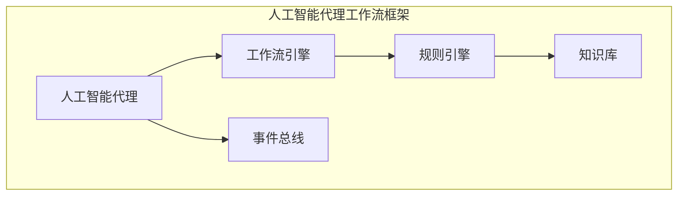

好的,我会严格遵循约束条件,以专业的技术语言写一篇有深度的博客文章。

# AI人工智能代理工作流 AI Agent WorkFlow：在新零售中的应用

## 1. 背景介绍

### 1.1 问题的由来

在当今快节奏的商业环境中,企业面临着来自多方面的挑战,例如快速响应客户需求、优化供应链管理、提高运营效率等。传统的商业模式和流程已经无法满足企业的需求,迫切需要引入新的技术和方法来提高竞争力。

新零售作为一种新兴的商业模式,融合了线上线下渠道,利用大数据、人工智能等技术,为消费者提供无缝体验。然而,在新零售的实施过程中,企业面临着诸多挑战,如数据孤岛、业务系统碎片化、决策缓慢等,亟需一种灵活、高效的解决方案来整合各种资源,实现智能化运营。

### 1.2 研究现状  

近年来,人工智能代理技术逐渐兴起,被认为是解决上述问题的有效途径。人工智能代理是一种基于规则或机器学习算法的软件实体,能够自主地感知环境、规划行动并执行任务。代理技术可以在复杂的业务环境中协调不同系统、整合数据源、自动化决策流程,从而提高企业的运营效率和决策质量。

目前,已有一些企业和研究机构开始探索将人工智能代理应用于新零售场景,取得了一定的成果。但是,现有的解决方案大多局限于特定的业务领域或功能模块,缺乏一个通用的、可扩展的人工智能代理工作流框架,难以满足新零售的复杂需求。

### 1.3 研究意义

本文提出了一种基于人工智能代理的工作流框架,旨在为新零售场景下的智能化运营提供一种系统化、标准化的解决方案。该框架将人工智能代理、工作流引擎、规则引擎等技术有机结合,能够灵活适配各种业务场景,实现端到端的自动化流程。

该框架不仅可以提高企业的运营效率和决策质量,还能够促进数据资源的共享和重用,打破数据孤岛,实现业务系统的无缝集成。同时,该框架具有良好的可扩展性和可维护性,能够随着业务需求的变化而动态调整,为企业的长期发展提供坚实的技术基础。

### 1.4 本文结构

本文首先介绍人工智能代理工作流框架的核心概念和关键技术,包括人工智能代理、工作流引擎、规则引擎等。接下来详细阐述框架的设计原理、核心算法和数学模型。然后通过一个新零售场景下的实际应用案例,展示框架的具体实现和运行效果。最后,探讨该框架在新零售领域的应用前景,并指出未来的发展方向和需要关注的挑战。

## 2. 核心概念与联系

人工智能代理工作流框架融合了多种先进技术,其核心概念包括:

1. **人工智能代理(AI Agent)**: 一种基于规则或机器学习算法的软件实体,能够自主地感知环境、规划行动并执行任务。代理可以根据预定义的目标和策略,与环境进行交互并作出决策。

2. **工作流引擎(Workflow Engine)**: 用于定义、执行和监控业务流程的软件系统。它能够协调各个任务的执行顺序和依赖关系,确保流程按照预期的方式运行。

3. **规则引擎(Rule Engine)**: 一种用于执行商业规则和决策逻辑的软件组件。它可以根据预定义的规则集合,对输入数据进行评估和推理,从而做出相应的决策。

4. **知识库(Knowledge Base)**: 存储领域知识、业务规则和决策逻辑的中央存储库。知识库为人工智能代理和规则引擎提供了必要的信息和数据支持。

5. **事件总线(Event Bus)**: 一种用于在不同系统组件之间传递事件和消息的通信机制。它能够实现松散耦合的系统集成,提高了框架的可扩展性和灵活性。

这些核心概念相互关联、相互依赖,共同构建了一个完整的人工智能代理工作流框架。人工智能代理作为框架的核心,负责感知环境、规划行动和执行任务。工作流引擎协调代理的行为,确保任务按照预定义的流程执行。规则引擎为代理提供决策支持,根据知识库中的规则进行推理和决策。事件总线则实现了框架各组件之间的通信和集成。

通过这些核心概念的有机结合,人工智能代理工作流框架能够为新零售场景下的智能化运营提供端到端的解决方案,实现业务流程的自动化、决策的智能化和系统的无缝集成。

## 3. 核心算法原理 & 具体操作步骤  

### 3.1 算法原理概述

人工智能代理工作流框架的核心算法基于**规划算法**和**规则推理算法**,用于指导代理的行为规划和决策过程。

**规划算法**负责生成一系列行动序列,以实现预定义的目标。常用的规划算法包括:

- **状态空间搜索算法**:通过构建状态空间图,搜索从初始状态到目标状态的最优路径。
- **层次任务网络(HTN)规划**:将复杂任务分解为子任务,递归地规划和执行子任务。
- **马尔可夫决策过程(MDP)规划**:基于概率模型,选择在当前状态下能够最大化预期回报的行动序列。

**规则推理算法**则用于根据知识库中的规则集合,对输入数据进行评估和推理,得出相应的决策结果。常见的规则推理算法包括:

- **前向链推理(Forward Chaining)**:从已知事实出发,应用规则推导出新的事实。
- **后向链推理(Backward Chaining)**:从目标出发,寻找能够推导出目标的规则和事实。
- **案例推理(Case-based Reasoning)**:根据新案例与历史案例的相似度,复用历史案例的解决方案。

规划算法和规则推理算法相互配合,共同指导人工智能代理的行为和决策。规划算法用于生成行动序列,而规则推理算法则提供了在特定情况下做出正确决策所需的知识支持。

### 3.2 算法步骤详解

人工智能代理工作流框架的核心算法可以概括为以下步骤:

1. **目标设定**: 首先,需要明确代理要实现的目标,可以是一个具体的任务或者一组期望的状态。

2. **状态感知**: 代理通过与环境交互,获取当前状态的信息,包括相关事实和上下文数据。

3. **规划生成**: 基于当前状态和目标,代理使用规划算法生成一系列潜在的行动序列。

4. **规则评估**: 对于每个潜在的行动序列,代理使用规则推理算法,评估其在当前状态下执行时可能产生的结果和影响。

5. **决策选择**: 根据规则评估的结果,代理选择最优的行动序列作为执行计划。

6. **行动执行**: 代理按照执行计划,逐步执行每个行动,与环境进行交互。

7. **状态更新**: 执行行动后,代理获取新的状态信息,并根据需要重复上述步骤,直到达成目标。

在整个过程中,工作流引擎负责协调代理的行为,确保任务按照预定义的流程执行。事件总线则实现了框架各组件之间的通信和集成。

以一个简单的智能购物推荐场景为例,算法步骤如下:

1. 目标设定: 为顾客推荐合适的商品。
2. 状态感知: 获取顾客的购买历史、偏好等信息。
3. 规划生成: 生成多个潜在的推荐商品列表。
4. 规则评估: 评估每个推荐列表在当前情况下的合理性和预期效果。
5. 决策选择: 选择最优的推荐商品列表。
6. 行动执行: 向顾客展示推荐商品列表。
7. 状态更新: 根据顾客的反馈,更新其偏好信息,为下一次推荐做准备。

### 3.3 算法优缺点

人工智能代理工作流框架的核心算法具有以下优点:

- **智能化决策**: 通过结合规划算法和规则推理算法,能够实现基于目标和规则的智能化决策,提高决策的准确性和合理性。
- **高度灵活性**: 框架能够适应不同的业务场景和需求,通过调整规划算法、规则集合和知识库,实现高度定制化。
- **可解释性**: 基于规则的决策过程具有较好的可解释性,有利于人机协作和决策审计。

但同时也存在一些局限性:

- **知识获取困难**: 构建高质量的知识库是一项艰巨的任务,需要领域专家的参与和持续维护。
- **计算复杂度高**: 特别是在状态空间或规则集合较大的情况下,算法的计算复杂度会急剧增加,影响系统的实时性能。
- **冲突处理困难**: 当存在多个相互矛盾的规则时,算法需要采用特殊的冲突解决策略,增加了系统的复杂性。

### 3.4 算法应用领域

人工智能代理工作流框架的核心算法可以应用于多个领域,包括但不限于:

- **智能决策支持系统**: 为企业级决策提供智能化支持,如投资决策、风险管理等。
- **自动化流程执行**: 在制造业、物流等领域实现流程的自动化执行和优化。
- **智能服务机器人**: 为客户提供个性化的服务和推荐,如智能购物助手、旅游规划助手等。
- **智能交通系统**: 优化交通路线规划、调度管理等。
- **智能建筑控制**: 实现对建筑设备的智能化控制和节能优化。

总的来说,该算法框架适用于需要基于复杂规则和目标进行智能化决策和行为规划的场景,可以显著提高系统的自动化和智能化水平。

## 4. 数学模型和公式 & 详细讲解 & 举例说明

### 4.1 数学模型构建

为了形式化描述人工智能代理工作流框架中的核心概念和算法,我们构建了一系列数学模型。

首先,定义**状态空间**$\mathcal{S}$为所有可能状态的集合,其中$s \in \mathcal{S}$表示一个具体的状态。

定义**行动空间**$\mathcal{A}$为所有可执行行动的集合,其中$a \in \mathcal{A}$表示一个具体的行动。

状态转移函数$\mathcal{T}: \mathcal{S} \times \mathcal{A} \rightarrow \mathcal{P}(\mathcal{S})$描述了在当前状态$s$执行行动$a$后,可能转移到的后继状态集合,其中$\mathcal{P}(\mathcal{S})$表示$\mathcal{S}$的幂集。

目标函数$\mathcal{G}: \mathcal{S} \rightarrow \{0, 1\}$用于判断一个状态是否满足预定义的目标,如果满足则返回1,否则返回0。

对于规则推理模型,定义**事实集合**$\mathcal{F}$和**规则集合**$\mathcal{R}$。每个事实$f \in \mathcal{F}$表示一个真实的命题,而每个规则$r \in \mathcal{R}$由前提条件$\text{antecedent}(r) \subseteq \mathcal{F}$和结论$\text{consequent}(r) \in \mathcal{F}$组成。

推理函数$\mathcal{I}: 2^\mathcal{F} \times \mathcal{R} \rightarrow 2^\mathcal{F}