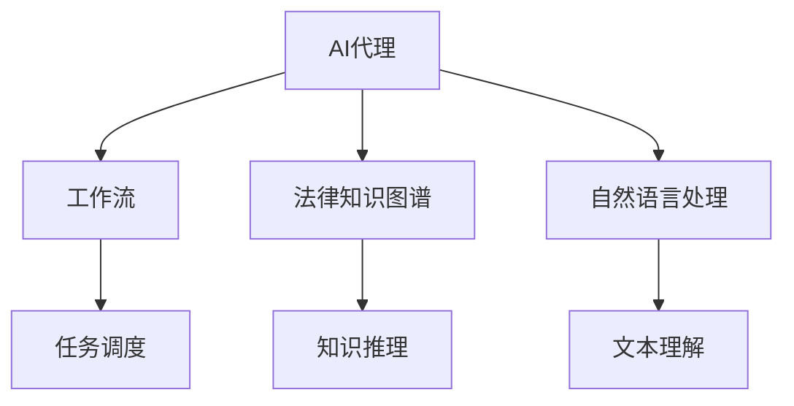

# AI人工智能代理工作流 AI Agent WorkFlow：在法律服务中的应用

关键词：人工智能、AI代理、工作流、法律服务、自然语言处理、知识图谱

## 1. 背景介绍
### 1.1 问题的由来
随着人工智能技术的飞速发展，AI在各行各业中的应用日益广泛。法律服务作为一个专业性很强的领域，对AI技术的需求也越来越迫切。传统的法律服务模式效率低下，律师需要花费大量时间去检索、阅读和分析海量的法律文件和案例，工作量巨大。这就迫切需要引入AI技术，通过智能化的方式提高法律服务的效率和质量。

### 1.2 研究现状
目前，AI在法律领域的应用主要集中在以下几个方面：
1. 法律文档自动分类和检索
2. 案例分析和预测 
3. 合同审核和风险评估
4. 在线法律咨询和服务

但是，将这些AI应用整合到一个统一的工作流中，形成一套完整的解决方案，目前还处于探索阶段。如何设计一个高效、智能、全面的AI代理工作流，使其能够全流程地服务法律行业，还有许多问题需要攻克。

### 1.3 研究意义
本文旨在探讨如何构建一个面向法律服务的AI代理工作流。通过引入先进的人工智能技术，将法律服务的各个环节智能化、自动化，形成一套系统化的解决方案。这对于提升法律服务效率、降低成本、改善服务质量都具有重要意义。同时，本文的研究也可以为其他专业服务领域应用AI提供有益的参考和借鉴。

### 1.4 本文结构
本文将从以下几个方面展开论述：
- 介绍AI代理工作流的核心概念和组成部分
- 详细阐述AI代理工作流的关键算法原理和实现步骤
- 构建AI代理工作流的数学模型，并给出案例分析
- 提供一个基于AI代理工作流的法律服务原型系统的代码实现
- 探讨AI代理工作流在法律领域的实际应用场景
- 推荐一些相关的学习资源和开发工具
- 总结全文并展望AI代理工作流的未来发展方向

## 2. 核心概念与联系

要构建一个面向法律服务的AI代理工作流，首先需要了解几个核心概念：

- **AI代理**：一种智能化的软件系统，能够自主地执行一些任务，如信息搜集、数据分析、决策等。它通过机器学习算法，不断从数据中学习，优化自己的模型和策略。

- **工作流**：一系列有序的、相互关联的活动和任务，用于实现某一特定目标。工作流定义了任务的执行顺序、条件、分支等，协调不同任务之间的数据传递。

- **法律知识图谱**：用于描述法律领域核心概念、实体以及它们之间关系的语义网络。通过将法律知识形式化、结构化地表示出来，方便机器理解和处理。

- **自然语言处理**：赋予机器理解、分析和生成人类语言文本的能力。在法律领域，NLP技术可以用于文本分类、信息抽取、问答系统、文本生成等任务。

下图展示了这几个核心概念之间的关系：



AI代理是整个系统的核心，它通过工作流来调度和执行各项任务，通过法律知识图谱进行知识推理和决策，通过NLP技术来理解文本数据。这些技术与AI代理紧密结合，共同构成了一个智能化的法律服务系统。

## 3. 核心算法原理 & 具体操作步骤
### 3.1 算法原理概述
要实现一个智能的AI代理工作流，需要用到以下几类核心算法：

1. **工作流建模与调度算法**：如何将法律服务流程抽象为一个工作流模型，并设计调度策略来高效执行工作流。常见的建模方法有：有向无环图、Petri网等。调度算法包括：启发式调度、遗传算法等。

2. **知识图谱构建与推理算法**：如何从非结构化的法律文本中抽取出实体、关系，构建法律知识图谱。以及在此基础上进行知识推理和问答。常用的算法有：命名实体识别、关系抽取、知识表示学习、基于图的推理等。

3. **自然语言处理算法**：如何让AI系统理解自然语言文本，执行文本分类、信息抽取、语义分析等任务。主要涉及的NLP技术包括：词法分析、句法分析、语义分析、文本表示学习、序列标注等。

4. **机器学习算法**：机器学习是AI的核心，各类任务都要用到机器学习算法来建模、训练和预测。常用的机器学习算法包括：监督学习如SVM、逻辑回归、决策树等，无监督学习如聚类、主题模型等，以及强化学习。

5. **人机交互算法**：AI代理需要与用户进行自然语言交互，这就需要用到对话系统、问答系统等人机交互技术。常见的算法有：基于规则的对话管理、基于机器学习的对话管理等。

### 3.2 算法步骤详解

下面以知识图谱构建与推理算法为例，详细说明其中的步骤：

**Step1：数据采集与预处理**
- 从法律文档数据库、案例库等渠道采集原始数据
- 对原始数据进行清洗、去重、格式转换等预处理

**Step2：命名实体识别**
- 使用BiLSTM-CRF等序列标注模型，识别出法律文本中的关键实体，如法院、法官、原告、被告、法律条款等
- 实体识别可以采用字典匹配、规则匹配、机器学习等方法

**Step3：关系抽取**
- 在识别出实体的基础上，进一步抽取实体之间的语义关系，如"原告-起诉-被告"、"法院-判决-案件"等
- 关系抽取可以基于模式匹配、监督学习、bootstrapping等方法

**Step4：知识融合与存储**
- 将抽取出的实体和关系进行融合，构建出法律知识图谱
- 使用图数据库如Neo4j等进行知识图谱的存储和管理

**Step5：知识推理与问答**
- 基于知识图谱，可以执行一些推理和查询任务，如：
  - 判断两个案件是否相关
  - 查询一个案件所涉及的所有法律条款
  - 对用户的法律问题进行自动问答
- 知识推理可以采用基于规则的推理、基于图的embedding等方法

### 3.3 算法优缺点

上述算法的优点在于：
- 可以充分利用非结构化的法律文本数据，从中挖掘出结构化的知识
- 构建出的法律知识图谱可以提供语义化、可解释的分析结果
- 知识推理与问答可以辅助法律从业者进行决策，提高工作效率

但同时也存在一些局限性：
- 法律文本语言复杂，歧义性强，对算法的准确性要求很高
- 不同法律体系、司法管辖区的知识融合具有挑战性
- 知识图谱的构建成本高，对计算和存储资源要求大

### 3.4 算法应用领域
法律知识图谱构建与推理算法可以应用于以下几个方面：
- 法律检索：通过知识图谱实现案例、法条等的智能检索
- 案例分析：挖掘案件特征，预测案件走向，辅助法官决策
- 合同审核：从合同文本中抽取关键信息，评估合同风险
- 法律问答：根据法律知识图谱，回答用户的法律咨询问题

## 4. 数学模型和公式 & 详细讲解 & 举例说明
### 4.1 数学模型构建

我们以命名实体识别任务为例，介绍如何构建其数学模型。命名实体识别可以看作一个序列标注问题，常用的模型是BiLSTM-CRF。

假设输入的文本序列为 $X=(x_1,x_2,...,x_n)$，其中 $x_i$ 表示第 $i$ 个字或词。序列标注的目标是给每个 $x_i$ 预测一个标签 $y_i$，标签集合为 $Y$。

BiLSTM-CRF 模型的结构如下：

1. 输入层：将 $x_i$ 映射为一个词向量 $e_i\in \mathbb{R}^d$，$d$ 为词向量维度。

2. BiLSTM层：双向LSTM对输入序列进行编码，得到每个位置的隐藏状态 $h_i$。

$$\overrightarrow{h_i} = LSTM(e_i, \overrightarrow{h_{i-1}}) $$
$$\overleftarrow{h_i} = LSTM(e_i, \overleftarrow{h_{i+1}}) $$
$$h_i=[\overrightarrow{h_i};\overleftarrow{h_i}]$$

3. CRF层：引入CRF来考虑标签之间的转移。定义CRF的特征函数为：

$$
s(X,y) = \sum_{i=1}^n P_i(y_i|h_i) + \sum_{i=1}^{n-1} T(y_i, y_{i+1})
$$

其中，$P_i(y_i|h_i)$ 是在位置 $i$ 的隐藏状态 $h_i$ 下标签 $y_i$ 的发射概率，$T(y_i, y_{i+1})$ 是标签 $y_i$ 转移到 $y_{i+1}$ 的转移概率。

CRF层的作用是求出给定输入序列 $X$ 下的标签序列 $y$ 的条件概率：

$$
P(y|X) = \frac{exp(s(X,y))}{\sum_{y'\in Y}exp(s(X,y'))}
$$

模型的目标是最大化对数似然函数：

$$
L = \sum_{j=1}^N log P(y^j|X^j)
$$

其中 $N$ 是训练样本数量，$X^j,y^j$ 是第 $j$ 个训练样本及其标签序列。

### 4.2 公式推导过程

上面的 CRF 条件概率公式：

$$
P(y|X) = \frac{exp(s(X,y))}{\sum_{y'\in Y}exp(s(X,y'))}
$$

可以这样推导出来：

令 $s(X,y)$ 表示给定输入序列 $X$ 下标签序列 $y$ 的非规范化概率，即 unnormalized probability。它包含两部分：发射概率和转移概率。

$$
s(X,y) = \sum_{i=1}^n P_i(y_i|h_i) + \sum_{i=1}^{n-1} T(y_i, y_{i+1})
$$

由于 $s(X,y)$ 不是一个合法的概率分布，因为它没有被归一化，所以需要除以一个配分函数 $Z(X)$：

$$
P(y|X) = \frac{exp(s(X,y))}{Z(X)}
$$

配分函数 $Z(X)$ 的定义是所有可能的标签序列 $y'$ 的 $exp(s(X,y'))$ 之和：

$$
Z(X) = \sum_{y'\in Y}exp(s(X,y'))
$$

将 $Z(X)$ 代入上面的公式，就得到了条件概率 $P(y|X)$ 的表达式：

$$
P(y|X) = \frac{exp(s(X,y))}{\sum_{y'\in Y}exp(s(X,y'))}
$$

这个公式表明，给定输入序列 $X$，标签序列 $y$ 的条件概率正比于 $exp(s(X,y))$，由配分函数 $Z(X)$ 归一化。

### 4.3 案例分析与讲解

我们用一个简单的例子来说明BiLSTM-CRF模型的命名实体识别过程。

假设输入的法律文本是："原告张三诉被告李四侵权案"，其中"张三"和"李四"是人名实体。

首先，将文本转换成字序列：

```
['原','