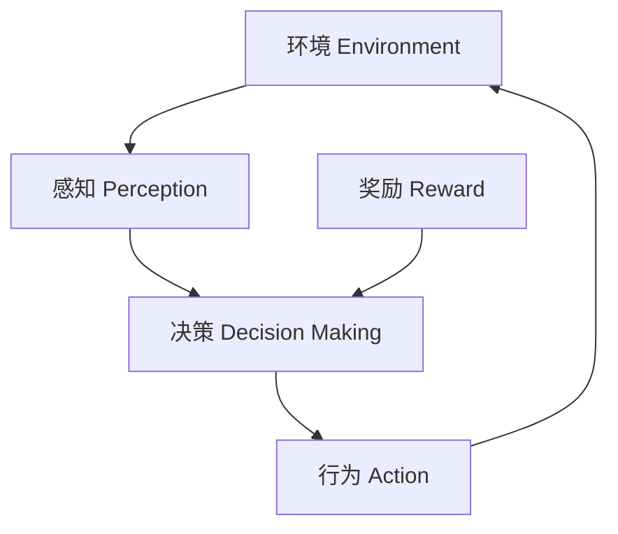

# AI人工智能代理工作流 AI Agent WorkFlow：在游戏设计中的应用

## 1. 背景介绍

### 1.1 问题的由来

在游戏设计领域,创造出富有挑战性、身临其境且高度互动的游戏体验一直是开发者所追求的目标。然而,传统的基于规则的AI系统在处理复杂场景时往往显得力有未逮。随着人工智能技术的不断进步,AI代理工作流(AI Agent Workflow)应运而生,为游戏设计注入了新的活力。

### 1.2 研究现状  

目前,AI代理工作流已被广泛应用于各种类型的游戏中,包括策略游戏、角色扮演游戏、模拟游戏等。它能够模拟智能行为体,如非玩家角色(NPCs)、敌人、队友等,使得游戏世界更加丰富多彩、真实可信。同时,AI代理工作流也为游戏设计带来了新的挑战,例如如何实现高效的决策过程、如何处理不确定性等。

### 1.3 研究意义

AI代理工作流的引入极大地提高了游戏的沉浸感和互动性,为玩家带来了前所未有的游戏体验。同时,它也为游戏设计开辟了新的可能性,使得更复杂、更具挑战性的游戏场景得以实现。因此,深入研究AI代理工作流在游戏设计中的应用具有重要的理论和实践意义。

### 1.4 本文结构

本文将全面介绍AI代理工作流在游戏设计中的应用。首先阐述核心概念及其相互联系,然后详细探讨核心算法原理及数学模型,并通过实际项目实践展示代码实现。接下来,文章将分析AI代理工作流在不同游戏场景中的应用,并推荐相关工具和资源。最后,总结未来发展趋势并指出面临的挑战。

## 2. 核心概念与联系

AI代理工作流(AI Agent Workflow)是一种基于人工智能技术的游戏设计方法,它将智能代理(Intelligent Agents)引入游戏世界,赋予它们自主决策和行为能力。这些智能代理可以模拟玩家、非玩家角色(NPCs)、敌人、队友等,使得游戏场景更加真实、互动性更强。

AI代理工作流涉及多个核心概念,包括:

1. **智能代理(Intelligent Agent)**: 指具有感知、决策和行为能力的自主实体。它能够根据环境状态和目标做出合理决策,并执行相应的行为。

2. **感知(Perception)**: 智能代理通过感知获取环境信息,例如视觉、听觉、位置等数据。

3. **决策(Decision Making)**: 基于感知到的环境信息和内部状态,智能代理需要做出相应的决策,确定下一步的行为。

4. **行为(Action)**: 根据决策结果,智能代理执行相应的行为,影响环境状态。

5. **环境(Environment)**: 智能代理所处的虚拟世界,包括游戏场景、规则、其他智能体等。

6. **奖励(Reward)**: 对智能代理的行为给予正面或负面的反馈,用于指导智能代理朝着期望的目标行为。

这些核心概念相互关联、环环相扣,构成了AI代理工作流的基本框架。智能代理通过感知获取环境信息,基于决策算法做出行为决策,并在环境中执行相应的行为,同时根据奖励机制调整决策策略,不断优化自身行为。

上图展示了AI代理工作流中核心概念之间的关系。智能代理通过感知获取环境信息,并基于决策算法和奖励机制做出行为决策,最终在环境中执行相应的行为,形成一个闭环过程。

## 3. 核心算法原理 & 具体操作步骤

### 3.1 算法原理概述

AI代理工作流中,决策算法扮演着核心角色,它决定了智能代理如何根据感知信息做出行为决策。常见的决策算法包括:

1. **规则基础系统(Rule-Based Systems)**: 基于预定义的一系列规则,根据当前状态匹配相应的规则,执行相应的行为。

2. **有限状态机(Finite State Machines)**: 将智能代理的行为划分为多个状态,根据当前状态和输入条件,按照预定义的状态转移规则切换到下一个状态。

3. **行为树(Behavior Trees)**: 使用树形结构表示智能代理的行为,通过组合不同的行为节点(如序列节点、选择节点等)构建复杂的决策逻辑。

4. **机器学习算法(Machine Learning Algorithms)**: 利用机器学习技术,如深度强化学习(Deep Reinforcement Learning)、监督学习等,训练智能代理从环境中学习最优策略。

不同的算法适用于不同的场景,具有各自的优缺点。选择合适的决策算法对于实现高质量的AI代理工作流至关重要。

### 3.2 算法步骤详解

以深度强化学习(Deep Reinforcement Learning)为例,我们详细介绍其算法步骤:

1. **构建环境(Environment Setup)**: 首先需要构建智能代理所处的虚拟环境,包括游戏场景、规则、奖励机制等。

2. **定义状态空间(State Space Definition)**: 确定描述环境状态的特征向量,如智能代理的位置、生命值、周围物体等。

3. **定义行为空间(Action Space Definition)**: 确定智能代理可执行的一系列行为,如移动、攻击、防御等。

4. **初始化策略网络(Policy Network Initialization)**: 使用深度神经网络作为策略函数,输入为状态,输出为行为的概率分布。初始化策略网络的权重参数。

5. **交互过程(Interaction Process)**: 智能代理在环境中执行行为,观察状态转移和奖励,并将经验存储在经验回放池(Experience Replay Buffer)中。

6. **策略更新(Policy Update)**: 从经验回放池中采样数据批次,使用算法(如Q-Learning、Policy Gradient等)更新策略网络的参数,使得智能代理能够学习到最优策略。

7. **迭代训练(Iterative Training)**: 重复执行交互过程和策略更新,直到策略收敛或达到预期性能。

通过上述步骤,智能代理可以逐步学习到最优的决策策略,实现高质量的行为。

### 3.3 算法优缺点

深度强化学习算法具有以下优点:

1. **高度自主性**: 智能代理能够自主学习最优策略,无需人工设计复杂的规则或状态机。

2. **泛化能力强**: 通过学习环境中的模式,算法具有很强的泛化能力,可以应对未见过的情况。

3. **连续决策**: 算法可以处理连续的状态和行为空间,适用于更加复杂的场景。

但同时也存在一些缺点:

1. **训练成本高**: 需要大量的交互数据和计算资源进行训练,训练过程耗时且昂贵。

2. **不确定性**: 由于算法的随机性,训练结果可能存在一定的不确定性和不稳定性。

3. **样本效率低**: 相比其他算法,强化学习算法通常需要更多的样本数据来达到相同的性能水平。

4. **奖励设计困难**: 设计合理的奖励函数对算法的性能影响很大,但这往往是一个挑战。

### 3.4 算法应用领域

AI代理工作流及其决策算法在游戏设计中有广泛的应用,包括但不限于:

1. **非玩家角色(NPCs)控制**: 使用AI代理模拟NPC的行为,如对话、战斗、巡逻等,提高游戏的真实性和互动性。

2. **敌人行为**: 控制敌人的行为策略,如攻击模式、移动路径、团队协作等,增加游戏的挑战性。

3. **队友AI**: 模拟队友的智能行为,如战术协作、任务分配等,提升游戏的协作体验。

4. **过场动画**: 使用AI代理控制角色在过场动画中的行为,增强动画的生动性和真实感。

5. **游戏测试**: 利用AI代理自动化测试游戏,模拟玩家行为,快速发现Bug和问题。

6. **程序化内容生成**: 使用AI算法自动生成游戏内容,如关卡设计、任务生成等,提高游戏的多样性和可重复性。

总的来说,AI代理工作流为游戏设计带来了无限的可能性,使得游戏世界更加丰富多彩、真实可信。

## 4. 数学模型和公式 & 详细讲解 & 举例说明

### 4.1 数学模型构建

在AI代理工作流中,我们通常将决策问题建模为马尔可夫决策过程(Markov Decision Process, MDP)。MDP是一种数学框架,用于描述一个智能体在不确定环境中做出序列决策的过程。

形式上,一个MDP可以表示为一个五元组 $(S, A, P, R, \gamma)$,其中:

- $S$ 是有限的状态集合
- $A$ 是有限的行为集合
- $P(s'|s,a)$ 是状态转移概率,表示在状态 $s$ 下执行行为 $a$ 后,转移到状态 $s'$ 的概率
- $R(s,a)$ 是奖励函数,表示在状态 $s$ 下执行行为 $a$ 所获得的即时奖励
- $\gamma \in [0,1)$ 是折现因子,用于平衡即时奖励和长期回报

智能代理的目标是找到一个策略 $\pi: S \rightarrow A$,使得在该策略下的期望累积奖励最大化,即:

$$
\max_\pi \mathbb{E}_\pi \left[ \sum_{t=0}^\infty \gamma^t R(s_t, a_t) \right]
$$

其中 $s_t$ 和 $a_t$ 分别表示在时间步 $t$ 的状态和行为。

### 4.2 公式推导过程

在强化学习算法中,我们通常使用值函数(Value Function)或者行为值函数(Action-Value Function)来估计一个状态或状态-行为对的长期回报。

对于任意策略 $\pi$,其状态值函数 $V^\pi(s)$ 定义为:

$$
V^\pi(s) = \mathbb{E}_\pi \left[ \sum_{t=0}^\infty \gamma^t R(s_t, a_t) \Big| s_0 = s \right]
$$

即在策略 $\pi$ 下,从状态 $s$ 开始执行,获得的期望累积奖励。

同理,行为值函数 $Q^\pi(s,a)$ 定义为:

$$
Q^\pi(s,a) = \mathbb{E}_\pi \left[ \sum_{t=0}^\infty \gamma^t R(s_t, a_t) \Big| s_0 = s, a_0 = a \right]
$$

即在策略 $\pi$ 下,从状态 $s$ 开始执行行为 $a$,获得的期望累积奖励。

值函数和行为值函数满足以下递推关系,也被称为贝尔曼方程(Bellman Equations):

$$
\begin{aligned}
V^\pi(s) &= \sum_{a \in A} \pi(a|s) \left( R(s,a) + \gamma \sum_{s' \in S} P(s'|s,a) V^\pi(s') \right) \\
Q^\pi(s,a) &= R(s,a) + \gamma \sum_{s' \in S} P(s'|s,a) \sum_{a' \in A} \pi(a'|s') Q^\pi(s',a')
\end{aligned}
$$

基于贝尔曼方程,我们可以通过动态规划或蒙特卡罗方法来估计值函数和行为值函数,进而优化策略。

### 4.3 案例分析与讲解

让我们以一个简单的网格世界(Gridworld)为例,展示如何应用上述数学模型和公式。

在这个网格世界中,智能代理(Agent)位于一个 $4 \times 4$ 的网格中,目标是从起点到达终点。每一步,智能代理可以选择上下左右四个方向中的一个进行移动。如果移动到了障碍物格子