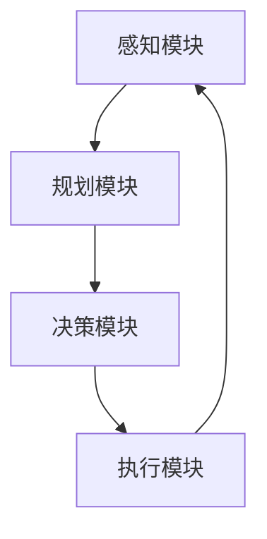

# AI人工智能代理工作流AI Agent WorkFlow：AI代理在防灾减灾系统中的作用

## 1. 背景介绍

### 1.1 问题的由来

近年来，自然灾害事件的发生频率和强度都有所增加，给人类社会带来了巨大的生命和财产损失。有效的防灾减灾措施对于保护人民生命安全、减少经济损失至关重要。传统的防灾减灾系统主要依赖人工监控和决策，存在反应滞后、决策偏差等问题。随着人工智能(AI)技术的不断发展,AI代理(AI Agent)在防灾减灾系统中的应用越来越受到重视。

### 1.2 研究现状

目前,AI代理在防灾减灾系统中的应用主要集中在以下几个方面:

1. **灾害预警系统**: 利用机器学习算法分析历史数据和实时监测数据,提前预测潜在的自然灾害风险。
2. **应急响应优化**: 通过建模和仿真,优化救援资源调配、疏散路线规划等应急响应措施。
3. **决策支持系统**: 融合多源异构数据,为决策者提供实时的情况评估和决策建议。
4. **智能监控与巡检**: 利用计算机视觉、模式识别等技术,实现对关键基础设施的智能监控和巡检。

### 1.3 研究意义

AI代理在防灾减灾系统中的应用,可以显著提高灾害预警的准确性、应急响应的效率和决策的科学性。它有望极大地降低自然灾害带来的人员伤亡和经济损失,提高社会的防灾减灾能力。同时,这一领域的研究也将推动人工智能技术在其他复杂系统中的应用。

### 1.4 本文结构

本文将首先介绍AI代理工作流在防灾减灾系统中的核心概念和技术,包括感知、规划、决策和执行等环节。接下来详细阐述相关的算法原理、数学模型和代码实现。然后分析AI代理在实际应用场景中的作用,并探讨未来的发展趋势和挑战。最后,提供相关的学习资源和工具推荐。

## 2. 核心概念与联系

AI代理工作流在防灾减灾系统中的应用,可以抽象为一个闭环的"感知-规划-决策-执行"过程,如下图所示:



1. **感知模块**: 通过各种传感器和数据源收集相关信息,包括气象数据、遥感影像、视频监控等,形成对环境的感知。
2. **规划模块**: 基于感知获得的信息,进行情况评估、风险预测和方案生成,为决策提供支持。
3. **决策模块**: 根据规划模块提供的多个备选方案,综合考虑各种约束和目标,选择最优决策。
4. **执行模块**: 将决策转化为具体的行动指令,并监控执行过程,实现闭环控制。

这四个模块相互衔接、环环相扣,构成了一个完整的AI代理工作流程。其中,感知和规划模块承担了信息获取和处理的任务,决策模块实现智能化判断,执行模块则将决策转化为现实行动。

## 3. 核心算法原理与具体操作步骤

### 3.1 算法原理概述

AI代理工作流在防灾减灾系统中的应用,涉及多种算法和技术,包括:

1. **机器学习算法**: 用于从历史数据中提取模式,进行灾害预测和风险评估。
2. **优化算法**: 用于资源调度、路径规划等,提高应急响应的效率。
3. **决策算法**: 基于多目标优化、规则推理等,生成科学决策方案。
4. **控制算法**: 用于监控执行过程,实现闭环控制和自适应调整。

这些算法相互配合,共同实现了AI代理在防灾减灾系统中的智能化应用。

### 3.2 算法步骤详解

以灾害预警为例,AI代理工作流的算法步骤如下:

1. **数据采集**: 从气象站、卫星、视频监控等多源获取相关数据,如降水量、温度、影像等。
2. **数据预处理**: 对采集的数据进行清洗、标准化、融合等预处理,为后续分析做准备。
3. **特征提取**: 使用机器学习算法从预处理数据中提取特征,如降水模式、地形特征等。
4. **模型训练**: 基于提取的特征和历史灾害数据,训练预测模型,如决策树、神经网络等。
5. **风险预测**: 将实时数据输入训练好的模型,预测未来一段时间内发生灾害的风险程度。
6. **预警发布**: 根据预测结果,综合其他信息,发布适当级别的预警,并制定应对措施方案。
7. **反馈优化**: 跟踪实际情况,收集反馈,用于持续优化预处理、特征提取和模型训练等环节。

### 3.3 算法优缺点

AI代理工作流在防灾减灾系统中的应用,具有以下优缺点:

**优点**:

1. 提高预警准确性,减少误报和漏报。
2. 加快应急响应速度,提高救援效率。
3. 降低决策偏差,提供科学化建议。
4. 实现自动化监控,减轻人工工作强度。

**缺点**:

1. 对高质量数据的依赖,数据质量差将影响效果。
2. 算法的可解释性有待提高,决策过程"黑箱"化。
3. 系统复杂,各模块集成存在挑战。
4. 存在一定的偏差和不确定性,需要人工把控。

### 3.4 算法应用领域

除了防灾减灾系统,AI代理工作流及其相关算法还可以应用于其他复杂系统,如:

1. **智能交通系统**: 用于路况预测、路径规划、交通诱导等。
2. **智能制造系统**: 用于工艺优化、缺陷检测、质量控制等。
3. **智能医疗系统**: 用于疾病诊断、治疗方案制定、患者管理等。
4. **智能建筑系统**: 用于能耗优化、设备运维、安全监控等。

## 4. 数学模型和公式详细讲解与举例说明

### 4.1 数学模型构建

在AI代理工作流的各个环节中,都需要构建相应的数学模型。以灾害预警为例,一种常用的模型是基于贝叶斯理论的概率图模型。

假设观测到的证据为$\mathbf{e}$,需要预测的事件为$h$,根据贝叶斯公式:

$$P(h|\mathbf{e})=\frac{P(\mathbf{e}|h)P(h)}{P(\mathbf{e})}$$

其中:

- $P(h|\mathbf{e})$为后验概率,即在观测到证据$\mathbf{e}$的条件下,事件$h$发生的概率。
- $P(\mathbf{e}|h)$为似然函数,描述了在事件$h$发生的情况下,观测到证据$\mathbf{e}$的概率。
- $P(h)$为先验概率,描述了事件$h$发生的初始概率,可基于历史数据估计。
- $P(\mathbf{e})$为证据概率,是一个归一化常数。

通过构建概率图模型,并利用观测数据对模型参数进行学习,就可以实现灾害风险的预测。

### 4.2 公式推导过程

在优化算法中,常需要建立目标函数,并对其进行优化求解。以应急资源调配为例,假设有$m$个需求点,$n$个供给点,目标是最小化总的运输成本。

设决策变量$x_{ij}$表示从供给点$i$运送到需求点$j$的数量,运输成本为$c_{ij}$,需求量为$d_j$,供给量为$s_i$,则目标函数可表示为:

$$\min \sum_{i=1}^n\sum_{j=1}^m c_{ij}x_{ij}$$

同时需满足以下约束条件:

$$\begin{aligned}
\sum_{i=1}^n x_{ij} &= d_j &&\forall j\\
\sum_{j=1}^m x_{ij} &\leq s_i &&\forall i\\
x_{ij} &\geq 0 &&\forall i,j
\end{aligned}$$

上述模型可使用线性规划等优化算法求解。通过构建合理的数学模型,并应用适当的优化方法,可以为应急资源调配提供有效的决策支持。

### 4.3 案例分析与讲解

考虑一个简单的洪水预警案例。假设某地区的洪水风险与当地的降水量$R$、河流水位$H$和下游来水量$Q$有关。我们可以构建如下线性模型:

$$\text{Risk} = w_1R + w_2H + w_3Q + b$$

其中$w_1,w_2,w_3,b$为模型参数,需要基于历史数据进行训练得到。

假设训练数据为$\{(R_i,H_i,Q_i,\text{Risk}_i)\}_{i=1}^N$,我们可以使用最小二乘法估计模型参数:

$$\min_{\mathbf{w},b} \sum_{i=1}^N \left(\text{Risk}_i - (w_1R_i + w_2H_i + w_3Q_i + b)\right)^2$$

对上式关于$\mathbf{w},b$求偏导数并令其等于0,可得到模型参数的解析解。

训练完成后,对于新的观测数据$(R^*,H^*,Q^*)$,我们可以计算出相应的洪水风险值$\text{Risk}^*$,并根据风险级别发布预警。

### 4.4 常见问题解答

**Q1: 如何评估预测模型的性能?**

A1: 常用的评估指标包括准确率、精确率、召回率、F1分数等。可以将测试数据分为正负例,计算上述指标值,从而评估模型的预测效果。

**Q2: 如何处理异常值和缺失值?**

A2: 对于异常值,可以使用分位数法、箱线图法等方法进行检测和处理。对于缺失值,可以使用删除法、插值法、模型估计法等方法进行填充。

**Q3: 如何避免过拟合问题?**

A3: 可以采取正则化、交叉验证、早停、数据增强等方法,提高模型的泛化能力,避免过拟合。

**Q4: 如何提高模型的可解释性?**

A4: 可以使用线性模型、决策树等具有较好可解释性的模型,或者对黑箱模型进行可解释性分析,如SHAP值、积分梯度等。

## 5. 项目实践:代码实例和详细解释说明

### 5.1 开发环境搭建

在实现AI代理工作流之前,我们需要搭建开发环境。以Python为例,可以使用Anaconda发行版,创建一个新的虚拟环境:

```bash
conda create -n ai-agent python=3.8
conda activate ai-agent
```

接下来安装所需的Python包,如NumPy、Pandas、Scikit-learn、TensorFlow等:

```bash
pip install numpy pandas scikit-learn tensorflow
```

### 5.2 源代码详细实现

以洪水预警为例,我们可以使用Scikit-learn库中的线性回归模型进行实现。

```python
import numpy as np
from sklearn.linear_model import LinearRegression

# 训练数据
X_train = np.array([[10, 5, 20], [15, 8, 25], [20, 10, 30], ...])
y_train = np.array([2, 4, 6, ...])

# 创建线性回归模型
model = LinearRegression()

# 训练模型
model.fit(X_train, y_train)

# 预测新数据
X_new = np.array([[12, 6, 22]])
y_pred = model.predict(X_new)
print(f"Predicted flood risk: {y_pred[0]}")
```

上述代码首先导入所需的库和模块。然后准备训练数据,其中`X_train`为特征矩阵(降水量、河流水位、下游来水量),`y_train`为目标变量(洪水风险)。

接下来创建线性回归模型实例,并使用`fit()`方法进行训练。